# `ctxloom run` — the launch path

`ctxloom run` resolves *what context, which engine, which isolation boundary,
and which of three mutually-exclusive transports* a top-level session launches
on, then owns the user's terminal (or their stdin/stdout pipes) until the engine
exits. It is the top of the launch architecture: `cmd/ctxloom` → `runCmd.RunE`
→ (`operations.*` for assembly, `internal/lm/isolation` for the boundary,
`internal/agentcoord/coord` for the hosted coordinator, `internal/vpio` for the
process seam) → the engine binary. Its contract is that the engine is spawned
exactly once, with exactly one assembled context, under exactly one resolved
permission posture, and that its exit code reaches the shell.

**Structural note.** The whole pipeline is one anonymous cobra closure:
`runCmd.RunE` at `run.go:367-1300`, ~930 lines, performing ≥20 unrelated phases
in sequence. It has no unit test (nothing in the package invokes it), and
because lizard does not descend into func literals it is invisible to the CI
complexity gate. The named functions in `run.go` are its *helpers*, not its
structure. If you are looking for where a `run` behaviour is decided, it is
almost certainly inside that closure, not in a named function.

## Files

| File | Lines | Role |
|---|---|---|
| `run.go` | 1,776 | The command, the `RunE` closure, and 30 helpers |
| `run_owned.go` | 283 | Phase 2a-B: coordinator-owned container run over Transport 2 |
| `run_structured.go` | ~290 | `runChatSession` (the shared driver `ctxloom acp run`'s session form uses), its `renderChatEvents`/`chatEventToJSON` renderer, and the NDJSON wire DTOs |
| `run_terminal.go` | 60 | Raw-mode acquisition + resize plumbing (see [terminal-and-prompts.md](terminal-and-prompts.md)) |
| `run_resize_unix.go` / `run_resize_windows.go` | 59 / 23 | Build-tagged `watchResize` |
| `run_terminal_ui.go` | ~190 | Prefix-key interceptor, surround bar, diagnostics redirect |

## The launch path

```mermaid
flowchart TD
    START["runCmd.RunE — run.go:367"]

    subgraph validate["1. validate + load"]
        V1["validatePermissionFlag :377"]
        V2["validateResumeFlags :380"]
        CFG["GetConfig() → printConfigWarnings :392"]
        UP["confirmUpgrade / confirmProfileUpgrades<br/>:395 :401 :404 — consent-gated schema rewrites"]
    end

    subgraph prompt["2. prompt sourcing (first match wins)"]
        P1["--prompt flag"] --> P2["--command saved item"] --> P3["positional argv"] --> P4["piped stdin :432-436"]
    end

    subgraph startup["3. startup side effects (skipped under --dry-run)"]
        S1["confirmSyncInstall :454 → SyncOnStartup :456 → writeSyncSummary :463"]
        S2["reportCompanions :475"]
        S3["sweepOrphanedWorktrees :485"]
    end

    subgraph resolve["4. context resolution — three mutually exclusive flows"]
        R1["--agent NAME → operations.ResolveAgent :511<br/>(agent binding supplies profiles + engine + runtime)"]
        R2["default agent :535 → ResolveAgent"]
        R3["-p/-f/-t → operations.AssembleContext :562"]
        LLM["resolveRunLLM :540/:586<br/>precedence: --llm > profile.llm > primary"]
        RES["--session: resumeFullContext :638<br/>folds the harp's transcript into ctxResult.Context"]
    end

    GATE1["failOnFindings(startupMark) :606<br/>→ ExitError{3}"]
    DRY{"--dry-run? :690"}
    DRYOUT["dryRunJSON → emit"]

    subgraph session["5. session identity"]
        AS["operations.AssignSession :762 → harp<br/>runEnv CTXLOOM_SESSION_HARP"]
        RD["--session --distill → resumeDistillEnv :779<br/>CTXLOOM_RESUMED_FROM / _PARTS"]
        BAN["PrintStartSessionBanner :798 (stderr)"]
        TSW["taskStoreWorkDir :832 → project identity"]
    end

    COORD["HostCoordinatorForSession :890<br/>→ coord.Coordinator + runnerSpawnEnv (URL + credential)"]
    SEED["seedTaskIntoSession :911"]

    subgraph managed["6. managed-config assembly"]
        TR["executable trust gate (TR5)"]
        AMC["backends.AssembleManagedConfig(backend, workDir, execGate, ctxResult.Profiles) :972<br/>slash commands · hooks · MCP · statusline, SCOPED to the selected profiles"]
        PERM["resolvePermissionMode :952 / requestedPermission :955<br/>--permissions > agent > label > PROJECT permissions: > backend default;<br/>headless ONESHOT floors to bypass"]
        REQ["pb.RunStart{ManagedConfig: ...} :984"]
    end

    ISO["isolation.Prepare(runAxes, backend, image, workDir, harp) :1060<br/>→ policy, workspace"]
    MWE["mergeWorkspaceEnv :1073 (isolation env layered UNDER runEnv)"]
    GATE2["failOnFindings(postStartupMark) :1083<br/>catches an isolation degrade the first gate could not see"]

    ARM{"transport arm"}
    A2["docker-exec interactive — runTransport :1127<br/>startContainerInteractive :1128"]
    A3["owner-owned run — runTransport (run_owned.go:46)<br/>startContainerOwnedRun (run_owned.go:61)"]
    A4["go-plugin — policy.SpawnClient :1156"]

    subgraph drive["7. drive"]
        D3["runOneshotViaCoord :1182"]
        D4["interactiveTerminal :1213 → redirectDiagnosticsForTUI :1224 → setupTerminalUI :1225 → pumpResize :1265"]
    end

    subgraph out["8. session record + exit"]
        T1["transcript.RecordOneshot :1276-1280 (--one-shot)"]
        T2["convertVendorTranscriptOnExit :1292 (INTERACTIVE)"]
        T3["distillSessionOnExit :852"]
        X["status.Code != 0 → ExitError{status.Code} :1296"]
    end

    START --> validate --> prompt --> startup --> resolve --> GATE1 --> DRY
    DRY -->|yes| DRYOUT
    DRY -->|no| session --> COORD --> SEED --> managed --> ISO --> MWE --> GATE2 --> ARM
    ARM --> A2 & A3 & A4
    A2 & A3 & A4 --> drive --> out
```

## Command surface

`ctxloom run [flags] [prompt...]` — `run.go:329`. Flags registered at `run.go:1608`.

| Flag | Var | Meaning |
|---|---|---|
| `-l, --llm` | `runLLM` | Config label (`claude-code`, `claude-fast`, …); overrides the configured default |
| `--prompt` | `runPrompt` | Prompt text (alternative to positional args) |
| `-r, --command` | `runSavedPrompt` | Run a saved command item by name |
| `--run-prompt` | `runSavedPromptDeprecated` | Deprecated alias for `--command`; reconciled in `RunE` before it is read |
| `-f, --fragment` | `runFragments` | Repeatable fragment include |
| `-t, --tag` | `runTags` | Repeatable tag include |
| `-p, --profile` | `runProfile` | Profile to compose |
| `--agent` | `runAgent` | Named local agent binding (excludes `-p`/`-f`/`-t`, enforced by `MarkFlagsMutuallyExclusive`) |
| `--workspace` | `runWorkspace` | Session workspace axis: `none`\|`worktree` |
| `--permissions` | `runPermissions` | `default`\|`acceptEdits`\|`plan`\|`bypass` |
| `-n, --dry-run` | `runDryRun` | Resolve everything, print the plan, touch nothing stateful |
| `--one-shot` | `runOneShot` | Headless oneshot: print the response and exit |
| `--plain-terminal` | `runPlainTerminal` | Disable ctxloom's terminal layer (prefix-key viewer + surround bar) |
| `-v, --verbose` | `runVerbosity` | Repeatable count |
| `-y, --yes` | `runAssumeYes` | Auto-confirm the install-on-startup prompt |
| `--session` | `runResumeSession` | Resume a harp: folds its full recorded transcript into this run's context |
| `--distill` | `runResumeDistill` | With `--session`, resume via the harp's essence instead (distilling on demand) |
| `--seed-task`, `--seed-status` | `runSeedTask`, `runSeedStatus` | Hidden; used by `ctxloom tasks run` to seed one task into the new session |

Completions are registered for `agent`, `workspace`, `permissions`, `llm`,
`fragment`, `tag`, `profile`, `command`.

## The three transport arms

Selection is one total decision, `runTransport(policyName, mode)`, over the
two inputs `policy.Name()` and `pb.ExecutionMode`. (It used to also take a
`structured bool` — the `--structured` flag threaded straight through as its
third input — but that CLI surface was an orphan: no in-tree consumer, no
tests, and its own doc comment described a transport already retired
elsewhere; removed outright rather than deprecated.)

| Arm | Predicate | Entry | Isolation |
|---|---|---|---|
| docker-exec interactive | `runTransport` `:1127` — container ∧ INTERACTIVE | `startContainerInteractive` `:1128` | Container; RunStart handed over via a file handoff read by `llm turn` |
| Owner-owned run (Phase 2a-B) | `runTransport` (run_owned.go:46) — container ∧ ONESHOT | `startContainerOwnedRun` `run_owned.go:61` | Container; driven over Transport 2 through the coordinator, no go-plugin client |
| go-plugin | otherwise | `policy.SpawnClient` `:1156` | Host or worktree; also the container-oneshot-on-host path |

An external plugin binary launch arm (`llmBinary != ""` → `pb.NewLLMRunner`,
spawned unisolated) existed here through U037-F04; removed as dead code with no
users, no test, and no documented contract (see DECISIONS.md / ADR-0021 note).
`binary_path` now has exactly one meaning across all six backends: the engine
CLI path override applied by `agent.ApplyLocalCLIConfig`.

### Owner-owned run internals (`run_owned.go`)

| Symbol | file:line | Notes |
|---|---|---|
| `ownedRunSession` | `:34` | `{coord, outcome, events, cancel}`. The subscription is opened **before** `StartOwnedRun` so the first turn's deltas are not missed. |
| `startContainerOwnedRun` | `:61` | 13 positional parameters. Subscribes, mints an owner-owned run, spawns the runner. |
| `runOneshotViaCoord` | `:178` | Streams the FINAL answer, records the oneshot transcript. No tests. |
| `renderOwnedRunEvents` | `:226` | CCN 21. Filters FINAL deltas out of the run's `AgentEvent` stream to text/NDJSON. No tests. |

The whole file has zero test coverage (`rg "ViaCoord|ownedRunSession|renderOwnedRunEvents" internal/cli/*_test.go` → nothing), unlike every other non-trivial function in the unit.

### Chat-session internals (`run_structured.go`)

Despite the filename, this file is no longer `run`-specific: `runStructuredREPL`
(the `--structured` flag's thin wrapper) was removed as an orphan CLI surface,
but `runChatSession` and everything below it survive — they are the shared
driver `ctxloom acp run`'s session form (`acp_run_cmd.go`) drives, over the
SAME `pb.Client.Chat` door `ctxloom acp serve` uses.

| Symbol | file:line | Notes |
|---|---|---|
| `runChatSession` | `:45` | Two-goroutine race-free shutdown with an explicit `reportStreamErr` discipline |
| `renderChatEvents` | `:105` | json/text dispatch; **rejects** an unknown format |
| `chatEventToJSON` | `:228` | `ChatEvent` → NDJSON DTO |
| `chatEntryJSON` / `chatCompleteJSON` / `chatMCPJSON` / `chatSessionJSON` / `chatEventJSON` | `:185`–`:221` | The camelCase NDJSON wire contract a GUI frontend consumes |
| `pumpTurns` / `decodeMessageLine` | `:274`, `:293` | One line = one message; `\n`, `\t` and quotes decoded within a line |

## Key helpers in `run.go`

| Function | file:line | What it decides |
|---|---|---|
| `resolvePermissionMode` | `:1492` | Posture precedence + plan collapse + headless bypass floor |
| `requestedPermission` | `:1510` | First parseable of flag > agent > label > project `permissions:`, so a silently-different posture can be warned about |
| `validatePermissionFlag` | `:1525` | Hard-errors an unknown typed `--permissions` |
| `resolveRunLLM` | `:1547` | Label precedence `--llm` > `profile.llm` > primary |
| `validateExplicitLLM` / `usableLLMs` | `:1568`, `:1587` | Validates a label or an installed backend type; error names what *is* usable |
| `mergeWorkspaceEnv` | `:1496` | Layers isolation env **under** an existing map (existing keys win) |
| `stampHostTerminalEnv` | `:1344` | Copies host `TERM`/`COLORTERM` into `req.Options.Env` without clobbering |
| `warnBypassOnLostContainer` | `:1513` | 4-term policy predicate: degraded container + bypass + not claude-code |
| `resumeFullContext` / `resumeDistillEnv` | `:246`, `:270` | The two `--session` modes |
| `distillSessionOnExit` / `shellOutDistill` | `:197`, `:140` | Idempotent, timeout-bounded exit-time distill (shells out to `ctxloom session distill <harp>`) |
| `convertVendorTranscriptOnExit` | `:1313` | Imports the engine's own transcript after an interactive pty exit |
| `seedTaskIntoSession` | `:307` | Sets a seeded task's status attributed to the new session |
| `confirmUpgrade` / `confirmProfileUpgrades` / `commitUpgrade` | `:1674`, `:1731`, `:1743` | The only place ctxloom rewrites config/session-index schema on startup, and only with consent |
| `confirmSyncInstall` | `:1749` | Lists missing deps and asks y/N; auto-yes when non-TTY so CI cannot hang |

## Invariants

- **Every `ctxloom run` opens a FRESH harp** (Decision 11, `run.go:744-748`).
  There is no interactive resume picker and no flag-based session reuse;
  resuming prior context is the in-engine resume skill's job, invoked from
  inside the session that just started. `--session` folds a *past* harp's
  content into a *new* harp's context — it does not reopen it.
- **Two strictness gates, not one.** `failOnFindings(startupMark)` at `:606`
  runs before anything stateful; `failOnFindings(postStartupMark)` at `:1071`
  (and `:1020` on the external-plugin arm) re-checks after `isolation.Prepare`,
  because isolation resolves *after* the first gate. The windows deliberately
  tile.
- **`--dry-run` is stateful-side-effect free.** The dry-run branch (`:690`)
  returns before `AssignSession`, `MarkSessionEnded`, task seeding, and any
  plugin launch, and the three startup side effects are skipped for it.
- **The permission posture is resolved once and is authoritative regardless of
  how isolation degrades** (`run.go:1048` comment): a container that failed to
  launch does not drop a configured bypass — that is the point of the host
  stopgap. Any posture that resolved to something other than what was asked for
  is warned about (`:955` onward).
- **Managed config is scoped to the selected profiles.** `AssembleManagedConfig`
  (`:972`) takes both the executable trust gate and `ctxResult.Profiles`, so
  `run -p X` cannot leak the default profile's MCP servers or every pulled
  bundle's commands into X's session.
- **The session identity rides the same `runEnv` the engine gets**, so isolation
  state mounts and the in-container writers key off one source (`:1048` comment).
- **Exit code passthrough.** `status.Code != 0 → &ExitError{Code: status.Code}`
  (`:1296`), so deferred teardown (workspace cleanup, runner handles, terminal
  restore) all run before the process exits.

## Documented vs real

- `--one-shot` on the go-plugin arm has no zero-byte guard: `transcript.RecordOneshot`
  (`:1276-1280`) is called unconditionally, and that function returns `nil` for an
  empty harp or empty prompt+output. The Transport-2 arm does check
  (`run_owned.go:208-216`) but warns and still returns `nil`.
- Piped-stdin prompt sourcing (`:432-436`) discards the `io.ReadAll` error and
  never checks that the resulting prompt is non-empty, so `… | ctxloom run --one-shot`
  with an empty pipe launches a headless run with nothing to do.
- `run_owned.go:86` subscribes with `c.WatchRuns(nil)` — a nil filter means
  *every* run, on a 256-slot ring that drops on overflow, with no sequence-gap
  detection. `operations.adaptConsumerFeed` (`internal/operations/sessionfeed.go:255-268`)
  does that accounting for the same stream; this renderer does not.
- The container oneshot arm's `renderOwnedRunEvents` emits only `entry` events;
  the `complete` and `session` halves of the documented NDJSON contract are
  produced only by `chatEventToJSON` on the go-plugin/`acp run` arm.
- The distill-timeout message at `:220` says "it will complete on next startup";
  nothing distills on startup — recovery is a manual `ctxloom session distill <harp>`.
- `startContainerOwnedRun` returns a live `RunnerHandle` alongside a non-nil
  error, and the caller (`:1131-1136`) returns before assigning `runnerHandle`
  and before the teardown defer at `:1151` is registered.
- The docker-exec interactive arm silently loses coordinator reach-back when
  `activeHarp == ""` or coordinator hosting failed (`runnerSpawnEnv` stays nil and
  is passed through unchecked); the owned-run arm fails loudly in the same
  condition (`run_owned.go:63`).
