# Sessions, memory, and plan watching

A **session** is one engine run, named by a harp (`swift-amber-falcon`), bound to
a transcript and optionally to a distilled **essence**. `ctxloom session *`
browses, renames, forgets, distills and watches them; the memory MCP tools
(`compact_session`, `list_sessions`, `load_session`, `recover_session`,
`get_previous_session`) are the agent-facing surface over the same store, served
both on the stdio MCP server and relayed from child agents through the
coordinator. The deprecated `ctxloom memory *` tree duplicates
`session list/show/distill`, but cannot simply be deleted: the live MCP path
depends on `resolveSessionSource`, which lives inside it.

## Structure

```mermaid
flowchart TD
    subgraph human["human-facing (cobra)"]
        SL["session list :44"] --> DMS["distillMissingOrStale :435"]
        SL --> ESR["emitSessionRows — session_full.go:86"]
        SQ["session query &lt;word&gt;... :23"] --> SMQ["sessionMatchesQuery :90"] --> REQ["readEssenceForQuery :126"]
        SQ --> ESR
        SS["session show &lt;harp&gt; :108"] --> RSE["readSessionEssence :146"]
        SD["session distill &lt;harp&gt; :340"] --> RSD["runSessionDistill :374"] --> CE["compactEntry :509"]
        SW["session watch &lt;harp&gt; — session_watch.go:22"] --> RSW["runSessionWatch :82"] --> SWE["streamWatchEvents :107"]
        SB["session backfill &lt;harp&gt; — session_backfill.go:22"]
        SR["session rename / forget :201,215"]
        MEM["memory list/show/compact (DEPRECATED) — memory.go:62,69,77"] --> RSS["resolveSessionSource :199"]
        PW["plan watch — plan_watch.go:34"] --> RPW["runPlanWatch :48"]
    end

    subgraph agentfacing["agent-facing (MCP tools)"]
        STDIO["mcp_server.go registerMemoryTools"] --> H
        RELAY["coord_host.go:68-91 relayHost"] --> H
        H["ctxServer handlers — mcp_tools_memory.go<br/>handleCompactSession :164 · handleListSessions :227<br/>handleLoadSession :291 · handleRecoverSession :338<br/>handleGetPreviousSession :415"]
        H --> PICK["pure pick policy:<br/>recoverTargetSessionID :403<br/>previousSessionFromMtime :591"]
        H --> LOD["loadOrDistillSession :622 — the cache-or-distill choke"]
        H --> PBH["previousSessionByHarp :508 — harp-keyed parallel choke"]
        LOD --> LCDS["loadCachedDistilledSession :691"]
        LOD --> DS["distillSession :733 → singleflightDistill :715 → distillSessionOnce :754"]
        PBH --> DS
        H --> RSS
        DS --> COMP[["internal/memory.Compactor"]]
        ET["evaluate_triggers — mcp_tools_triggers.go:54"] --> OPST[["operations.EvaluateTriggers"]]
    end

    CE --> COMP
    RSS --> PBF[["lm/grpc: CanonicalFallbackSource + SessionReader"]]
    ESR --> PAGER["pagerWriter (pager.go:75)"]
    SES["session-bind hook — session_cmd.go:237"] --> BSFP["bindSessionFromPayload :291"]
```

## `ctxloom session` (`session_cmd.go:29`)

| Command | file:line | Notes |
|---|---|---|
| `list` | `:44` | `--full` (adds the essence body), `--all` (every project), `--distill-missing` |
| `show <harp>` | `:108` | Emits `SessionEssence{Harp, Distilled, Essence, EssencePath}` |
| `query <word>...` | `session_query.go:23` | Metadata match first, then essence-body match; AND across lowercase substrings |
| `watch <harp>` | `session_watch.go:22` | `--source` (auto\|…); streaming, own text/json switch |
| `distill <harp>` | `:340` | chdirs to the session's project, loads config, compacts |
| `backfill [harp]` | `session_backfill.go:22` | Imports vendor transcripts for one harp or all sessions |
| `rename <old> <new>` | `:201` | |
| `forget <harp>` | `:215` | |
| `hook session-bind` | `:237` | Registered under `hookCmd`, not `sessionCmd` — see [hooks.md](hooks.md) |

### Row/render types

| Type | file:line | Role |
|---|---|---|
| `SessionRow` | `session_row.go:42` | `{Harp, Summary, Start, End, EssencePath}` with three parallel tag vocabularies (`json:`, `label:`, `col:`) |
| `sessionTime` | `session_row.go:22` | `time.Time` newtype that marshals RFC3339 for JSON and renders compactly for tables — works because `clifmt` dispatches on `fmt.Stringer` (documented at `:12-21`) |
| `SessionFullRow` | `session_full.go:20` | Embeds `SessionRow` + `Essence`, so drift between the two shapes is structurally impossible |
| `emitSessionRows` | `session_full.go:86` | The shared render tail: lean vs full, pager for text. Preserves the pager `cleanup()` error when the render succeeded |
| `StartSessionInfo` / `PrintStartSessionBanner` | `session_cmd.go:566`, `:589` | `run`'s pre-spawn banner — its only caller is `run.go:798` |

### The essence/compaction helper cluster

These live in `session_cmd.go` but are **shared domain helpers**, consumed by
four other files including `mcp_tools_memory.go` and `run.go`:

| Helper | file:line | Consumers |
|---|---|---|
| `readSessionEssence` | `:146` | `session show`, `session_full.go:33` |
| `sessionEssenceInfo` | `:170` | `session_row.go:77`, `mcp_tools_memory.go:255,279` |
| `readHarpEssence` | `:192` | `run.go:780,852` (as an injected func value), `mcp_tools_memory.go:524,558`, `hook_inject_context.go:294` |
| `compactEntry` | `:509` | `session distill`, `distillMissingOrStale`, `mcp_tools_memory.go:285,552` |
| `fileExists` | `:184` | in-file ×2, `mcp_tools_memory.go:363,376` as a func value |

## The memory MCP tools (`mcp_tools_memory.go`)

Five tools, each registered twice: on the stdio server
(`registerMemoryTools:122`) and as a host relay (`coord_host.go:68-91`), so a
child agent's call executes in the session-owning process under the child's
identity.

| Tool | Handler | Policy |
|---|---|---|
| `compact_session` | `:164` | Builds a `memory.Compactor` from cfg+input and runs it |
| `list_sessions` | `:227` | Project or all-projects; `distill_missing` compacts stale essences first (`distillMissingForList:276`) |
| `load_session` | `:291` | Routes harp-name vs session-id; `loadHarpEssence:310` for the former |
| `recover_session` | `:338` | Identity-first pick (`recoverTargetSessionID:403`), then distill |
| `get_previous_session` | `:415` | Index-authoritative, else newest-by-mtime (`previousSessionFromMtime:591`) |

`loadSessionResult` (`:97`) is a hand-rolled union of `{loaded, not-found, empty,
distill-failed}` — `Loaded` is the discriminator and `Message` is the error
channel, because the Go `error` return is deliberately nil on those paths (wire
compatibility with a legacy map-based response, documented at `:93-96`).

`evaluate_triggers` (`mcp_tools_triggers.go:54`) builds a `TaskContext` and calls
`operations.EvaluateTriggers`; its `Omitted` vs `Degraded` split (`:35-41`)
distinguishes "the model dropped tasks" from "a chunk call failed".

## `plan watch` (`plan_watch.go`)

A long-lived debounced JSONL stream of plan-file changes. `planChangeEvent`
(`:21`) is the entire wire contract: `{"event":"changed","kind":"plans"}` — two
constant strings, no path, no harp, no project. The watch root is
`plans.HomeSessionsDir()` (`:49`), i.e. *every* project's sessions, so a GUI
watching one project is woken by every other project's plan writes and must
re-query. That is a deliberate "dumb client re-queries" design. One event is
emitted up front so a subscriber never sits on an empty stream. Debounce is
100 ms with no maximum wait.

## Invariants

- **Cache-or-distill goes through one choke per keying.** `loadOrDistillSession`
  (`:622`) for session-id-keyed lookups, `previousSessionByHarp` (`:508`) for
  harp-keyed. Both route through `singleflightDistill` (`:715`) so concurrent
  identical distills collapse to one LLM call; the group is deliberately shared
  across per-call `ctxServer`s (`coord_host.go:59-63`).
- **The relayed handlers must use `s.self`, not process env.**
  `handleCompactSession` (`:191-194`) and `handleGetPreviousSession` (`:428-431`)
  do this and say why.
- **`distillSession` never writes progress to stderr** (`:729-732`): on the
  host-relay path it runs inside the session-owning process, whose stderr is the
  terminal the harness is drawing its TUI on.
- **Empty transcripts are reported, not distilled.** `loadOrDistillSession`
  returns an explicit "appears to be empty" message for `len(session.Entries) == 0`.
- **Listings serialize as `[]`, not `null`.** `handleListSessions` builds `rows`
  with `make(..., 0, n)`.
- **`session list --all` uses the ordered lister.** `operations.ListAllSessions`
  is the ordered all-projects listing; `ListSessions` (unsorted) exists only for
  the raw `ctxloom://sessions` resource dump (`internal/operations/sessions.go:76-82`).
- **The previous-session reference shown in `run`'s banner comes from the same
  primitive the `get_previous_session` tool reads** (`operations.ResolvePreviousSession`),
  never re-derived (`run.go:790-797`).

## Documented vs real

- `compact_session` with an explicit `session_id` distills someone else's session
  but keys the output under the **caller's** harp (`mcp_tools_memory.go:186-195`
  pairs caller-supplied `SessionID` with `HarpName: s.self.Harp`), writing the
  essence into the caller's harp dir and mutating the caller's session-index
  entry. The sibling path (`loadOrDistillSession:658-671`) resolves the owner via
  `operations.HarpForSession` and does it correctly.
- `evaluate_triggers` derives identity from process env (`CTXLOOM_PROJECT_ID`,
  `CTXLOOM_SESSION_HARP`) and `os.Getwd()` (`mcp_tools_triggers.go:59-63`), so on
  the host-relay path a child agent's call is attributed to the host session —
  against the relay's explicit promise at `coord_host.go:19-21`.
- The `DistillBudget` deadline backstop is installed by only two of the four
  relay paths that spend LLM time; `handleCompactSession` (`:200`) and
  `distillMissingForList` (`:285`) run unbounded after the caller has given up.
- `handleCompactSession` bypasses `singleflightDistill`, so an explicit
  `compact_session` runs a second concurrent distillation alongside an in-flight
  `recover_session` of the same session.
- Three functions on the relay path write warnings to the session owner's stderr
  despite the rule above: `distillMissingForList:286`,
  `handleGetPreviousSession:467`, `resolveSessionSource` (`memory.go:212`).
- `loadHarpEssence:322` flattens any `os.ReadFile` error into "No distilled
  essence yet", so a permission or I/O error reads as "not distilled".
- **Three independent implementations of the same essence lookup** (harp-dir
  first, then legacy `<sessionsDir>/<sessionID>.md`): `readSessionEssence:146`,
  `sessionEssenceInfo:170`, `readEssenceForQuery` (`session_query.go:126`). They
  already differ — the first calls `config.Load()` itself, the other two take
  `appDir` from the caller. `newSessionFullRow` (`session_full.go:31`) resolves
  each row's essence twice by two of those mechanisms.
- `distillMissingOrStale` (`session_cmd.go:454-466`) chdirs per entry only when
  `e.ProjectDir != ""` and never restores between iterations, so an entry with an
  empty `ProjectDir` inherits the previous entry's cwd.
- `session backfill` returns exit 0 even when every entry failed
  (`session_backfill.go:65-68`); `BackfillResult.Failed` is rendered as text but
  never converted to an exit code.
- `writeWatchText` (`session_watch.go:155`) builds an `iox.ErrWriter` and never
  calls `Err()`, so every write error on the text watch path is discarded.
- `session list` and `session query` both discard the `config.Load()` error
  (`session_cmd.go:46`, `session_query.go:52`), yielding `appDir=""` and disabling
  legacy essence lookup for every row.
- The whole `memory` tree (`memory.go:23-370`) is a documented duplicate of
  `session list/show/distill`, but `resolveSessionSource` (`:199`) — the
  canonical/legacy transcript-source policy used by three live MCP handlers —
  lives inside it, so deleting the file as-is breaks the MCP path.
- `plan watch`'s debounce has no maximum wait (`:101` `Reset`s on every event), so
  a plan file written more often than every 100 ms starves the stream; the timer
  is also never `Stop()`ed on the `ctx.Done()` return.
- `sessionSummary.LastActivity` and the `CreatedAt` fields are pre-formatted
  local-time strings (`"2006-01-02 15:04:05"`, `mcp_tools_memory.go:264,334,533,570`)
  with no timezone, on a machine-facing tool result.
