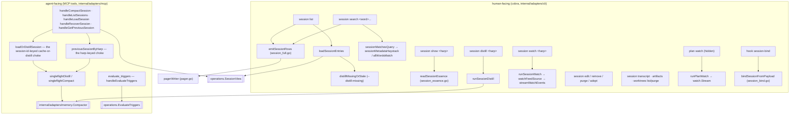

# Sessions, memory, and plan watching

A **session** is one engine run, named by a harp (`swift-amber-falcon`), bound to
a transcript and optionally to a distilled **essence**. `ctxloom session *`
browses, edits, removes, distills, purges, adopts and watches them, and lists
their transcripts, artifacts and worktrees. The memory MCP tools
(`compact_session`, `list_sessions`, `load_session`, `recover_session`,
`get_previous_session`) are the agent-facing surface over the same store; they
live in `internal/adapters/mcp` (`mcp_tools_memory.go`), served both on the
stdio MCP server and relayed from child agents through the coordinator
(`coord_host.go`), and this page only points at them. Both surfaces read the
one read model, `operations.SessionView`.

## Structure

```mermaid
flowchart TD
    subgraph human["human-facing (cobra, internal/adapters/cli)"]
        SL["session list"] --> LSE["loadSessionEntries"] --> DMS["distillMissingOrStale (--distill-missing)"]
        SL --> ESR["emitSessionRows (session_full.go)"]
        SQ["session search &lt;word&gt;..."] --> SMQ["sessionMatchesQuery → sessionMetadataHaystack / allWordsMatch"]
        SQ --> ESR
        SS["session show &lt;harp&gt;"] --> RSE["readSessionEssence (session_essence.go)"]
        SD["session distill &lt;harp&gt;"] --> RSD["runSessionDistill"]
        SW["session watch &lt;harp&gt;"] --> RSW["runSessionWatch → watchFeedSource → streamWatchEvents"]
        SE["session edit / remove / purge / adopt"]
        SX["session transcript · artifacts · worktrees list/purge"]
        PW["plan watch (hidden)"] --> RPW["runPlanWatch → watch.Stream"]
        HB["hook session-bind"] --> BSFP["bindSessionFromPayload (session_bind.go)"]
    end

    subgraph agentfacing["agent-facing (MCP tools, internal/adapters/mcp)"]
        H["handleCompactSession · handleListSessions · handleLoadSession<br/>handleRecoverSession · handleGetPreviousSession"]
        H --> LOD["loadOrDistillSession — the session-id-keyed cache-or-distill choke"]
        H --> PBH["previousSessionByHarp — the harp-keyed choke"]
        LOD --> SF["singleflightDistill / singleflightCompact"]
        PBH --> SF
        SF --> COMP[["internal/adapters/memory.Compactor"]]
        ET["evaluate_triggers — handleEvaluateTriggers"] --> OPST[["operations.EvaluateTriggers"]]
    end

    RSD --> COMP
    ESR --> PAGER["pagerWriter (pager.go)"]
    LSE --> SV[["operations.SessionView"]]
    H --> SV
```

## Row/render types

- `SessionRow` (`session_row.go`) is the lean projection `session list` and
  `session search` render: summary, harp, start/end, the essence *path* but
  never the essence body — that is `session show`'s job, or `--full`'s. It is
  projected from `operations.SessionView`, never from the store's entry.
- `sessionTime` is a `time.Time` newtype so the same field marshals RFC3339
  for structured formats and a compact local timestamp for text/markdown.
  This works because `clifmt`'s reflective renderer treats any `fmt.Stringer`
  field as a scalar; without the wrapper a table cell shows `time.Time`'s
  verbose default form.
- `SessionFullRow` (`session_full.go`) embeds `SessionRow` and adds `Essence`,
  so the two shapes can never drift apart — `clifmt` walks the promoted
  fields. `newSessionFullRow` reads the body from `SessionRow.EssencePath`, so
  the two halves of one row can never describe different files.
- `emitSessionRows` is the shared render tail: lean vs full, and the pager for
  full text output only — structured formats never reach `pagerWriter`.
- `StartSessionInfo` / `PrintStartSessionBanner` (`session_banner.go`) are
  `run`'s pre-spawn banner.

## `plan watch`

A long-lived debounced JSONL stream of plan-file changes, hidden because it is
GUI-facing. `planChangeEvent` is the entire wire contract:
`{"event":"changed","kind":"plans"}` — two constant strings, no path, no harp,
no project. The watch root is `paths.HomeSessionsDir()`, i.e. *every*
project's sessions, so a GUI watching one project is woken by every other
project's plan writes and must re-query. That is a deliberate "dumb client
re-queries" design; the watch plumbing lives in the backend so a frontend never
touches `~/.ctxloom` itself. The debounce (`planWatchDebounce`) coalesces the
burst of filesystem events one plan write produces into one logical change.

## Invariants

- **Cache-or-distill goes through one choke per keying.** `loadOrDistillSession`
  for session-id-keyed lookups, `previousSessionByHarp` for harp-keyed. Both
  route through the singleflight group `HostApp` owns, so concurrent identical
  distills collapse to one LLM call; the group is shared across per-call
  `ctxServer`s deliberately.
- **The relayed handlers must use `s.self`, not process env.** On the
  host-relay path a handler runs inside the session-owning process under the
  *caller's* identity; reading the environment would attribute the call to the
  host session.
- **`distillSession` never writes progress to stderr**: on the host-relay path
  it runs inside the session-owning process, whose stderr is the terminal the
  harness is drawing its TUI on.
- **Listings serialize as `[]`, not `null`.**
- **The previous-session reference shown in `run`'s banner comes from the same
  primitive the `get_previous_session` tool reads** (`operations.ResolvePreviousSession`),
  never re-derived.
- **A purged session is visible as purged in every format.** `SessionRow.Purged`
  is a plain boolean for structured consumers and the same fact rides the
  `Summary` badge, so a purged session never reads, in a table a human is
  looking at, as indistinguishable from one that was never purged.
