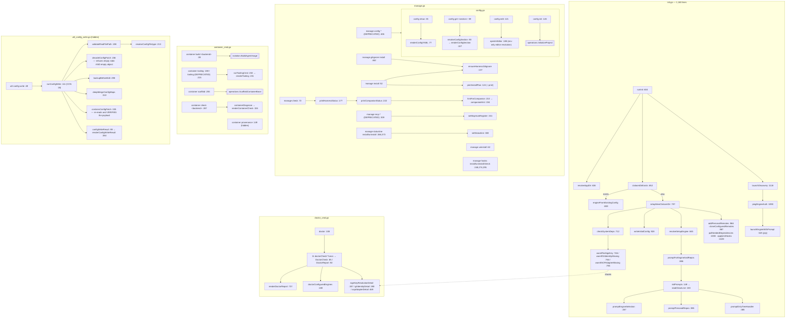

# Setup, configuration, harness management, containers, and diagnostics

Five loosely related command families sit here because they all answer "is this
machine/project wired up correctly, and if not, wire it up". `ctxloom init` is
the first-run bootstrap and interview; `ctxloom config` reads and edits
`config.yaml`; `ctxloom manage` installs and removes ctxloom's footprint in each
engine's harness (hooks, statusline, MCP registration, `.gitignore` entries);
`ctxloom container` builds and probes the per-engine agent images; and
`ctxloom doctor` reports on all of it without changing anything. `ctxloom util
config-write` is a hidden, guarded merge-writer for foreign config files.

## Structure

## `ctxloom init` (`init.go:32`)

Six flags (`bindInitFlags:112`) including `--engine`, `--remote`, `--forge`,
`--home`. Two paths:

- **`.ctxloom` does not exist** → `setupNewCtxloomDir:797`: resolve the engine
  (prompting if needed), write the initial config, check system deps, add
  personal remotes, clone configured remotes, pull seeded dependencies, apply
  hooks — then hand off to the engine's raw TUI for the setup interview
  (`launchDiscovery:1118`).
- **`.ctxloom` exists** → `engineForExistingDir` (an explicit `--engine` wins
  over the recorded one), the `--remote`/`--forge` flags, and straight to
  `launchDiscovery`.

`checkSystemDeps:712` hard-blocks on missing git (with a per-OS install message —
the most actionable error in the file) and warns informationally on the rest.
`pingEngineAuth:1090` runs the smallest possible oneshot to detect an
unauthenticated engine before the interview starts, and wraps the failure with a
per-engine fix (`engineAuthFixHint:1067`).

`ctxloom init prompt` (`init.go:85`) prints the five-phase setup body without
launching anything; `ctxloom agent setup` is its deprecated alias.

## `ctxloom config` (`config.go:23`)

`show`, `get <section>`, `edit`, `init`. `resolveConfigSection:90` is the whole
`config get` surface — a four-arm switch whose default names every valid section.
`openInEditor:188` resolves the editor from the **environment only**, deliberately:
it must not depend on a config load, since it is how you fix a broken config.
`projectConfigPath:174` names the appdir-or-default fallback.

All four also exist as `manage config *` deprecated aliases (`manage.go:406-452`).

## `ctxloom manage` (`manage.go:24`)

| Command | file:line |
|---|---|
| `install` / `uninstall` / `status` | `:52`, `:62`, `:72` |
| `hooks install` / `uninstall` / `status` | `:248`, `:274`, `:295` |
| `mcp install` / `uninstall` / `servers *` (deprecated) | `:314`, `:322`, `:349` |
| `statusline install` / `uninstall` | `:366`, `:373` |
| `config show` / `get` / `edit` / `init` (deprecated) | `:422`–`:446` |
| `gitignore install` | `:462` |

`companionHint` (`:194`) is the "what breaks / how to install" text for a missing
companion binary; its map keys must match `config.BuiltinCompanionBins()`, and a
drift degrades to a generic fallback (documented at `:199-202`).

## `ctxloom container` (`container_cmd.go:22`)

| Command | file:line | Notes |
|---|---|---|
| `build [backend]` | `:39` | Nine flags including `--base-image`, `--base-containerfile`. Flag-over-config merge, then `isolation.BuildAgentImage` |
| `provenance` | `:149` | Hidden; prints `HostProvenanceDigest("")` for the `just` recipes |
| `tooling` | `:188` (+ deprecated top-level `tooling` at `:215`) | Emits `toolingJSON{Instructions, Declarations}`; `renderTooling:231` explains the trust gate explicitly when there are zero declarations |
| `scaffold` | `:255` | Writes a base Containerfile |
| `check [backend]` | `:287` | Diagnoses container capability |

## `ctxloom doctor` (`doctor_cmd.go:108`)

`--deps` selects the 4-check subset; otherwise 11 checks. Each produces a
`DoctorCheck{Marker, Status, Detail}` where `Marker` carries the
`DOCTOR-CHECK-*` vocabulary **shared with the external `ctxloom-doctor` Agent
Skill**, and `Status` is `"ok"` | `"warn"` | `"info"` — a free-form string with
its three legal values in a trailing comment and 20+ literal write sites.

Checks: deps (`:206`), sign key (`:269`), git identity (`:377`), ACP adapter
(`:452`), agents (`:508`), version (`:539`), hooks/trust (`:551`), setup marker
(`:637`), lockfile + a real `AssembleContext` (`:658`), companions (`:694`), auth
ping (`:729`).

Three of the detail helpers — `signKeyResolutionDetail:307`,
`gitIdentityDetail:390`, `acpAdapterDetail:469` — are shared with `init.go`'s
three `warnIf*` probes, so a diagnosis is worded identically in both places.
`signKeyResolutionDetail` in particular is a four-shape `errors.As` ladder where
every failure gets a named cause and a concrete fix.

## `ctxloom util config-write` (`util_config_write.go:49`, hidden)

The guarded merge-writer an agent uses to patch a foreign config file
(`settings.json`, `config.toml`) without clobbering it. Seven ordered steps:
validate the path → parse the patch from stdin → back up → decode the existing
file → deep-merge → write → **re-read and verify the payload survived**. It emits
`configWriteResult{File, Filetype, Created, Backup, Merged, Verified}` so a caller
inspects the report rather than trusting exit 0.

`decodeConfigPatch:236` is the reference anti-silent-no-op guard in this package:
it refuses an empty body *and* an empty JSON object. `containsConfigPatch:335` is
the verification; `normalizeConfigValue:357` coerces int→float64 recursively so a
TOML integer round-trip does not fail verification.

## Invariants

- **`config edit` must not depend on a config load.** `openInEditor:188` reads the
  editor from `$VISUAL`/`$EDITOR` only.
- **`config init` refuses to overwrite.** It stats the path first and errors when
  something is there.
- **`config-write` verifies its own payload.** Nothing else in the package
  re-reads what it wrote to confirm the write landed.
- **Backups precede every foreign-file edit.** `backupBeforeEdit:298` writes
  `<path>.bak.<UTC timestamp>` at 0600 before any modification.
- **`doctor` is diagnostic-only.** It never mutates; a `warn` status is its
  fail-loud signal (stated in its own `Long` text).
- **`container tooling` explains an empty result.** Zero declarations produces a
  two-line explanation naming the trust gate, not silence.
- **`init` is warn-and-continue after the config write.** Only the config write
  and the git check are fatal; remotes, clones, seeded deps and hooks each warn
  and proceed (`setupNewCtxloomDir:797`).
- **`writeInitialConfig:928` invalidates the config memo** (`config.Invalidate()`)
  so the rest of `init` sees what it just wrote.

## Documented vs real

- **`ctxloom init --home` inside a project still applies HOOKS to the project.**
  init's post-scaffold steps read the config `config.WithAppDir(appDir)`-scoped,
  so remotes, seeded deps and the engine choice all follow the `.ctxloom` init
  targets — but `operations.ApplyHooks` resolves its own `workDir` from the cwd
  when the request leaves it empty, and pinning it to the `--home` dir would
  collide with `checkHookTargetScope`'s refusal to write a backend's user-global
  settings.
- `config show`/`get`/`edit`/`init` accept `--format` and always emit YAML (see
  [output-and-format.md](output-and-format.md)). The `manage`/`mcp` installer
  commands and the `fragment`/`command` create/delete/edit/distill set now honour
  it; `fragment show`/`command show` still print their item body regardless of
  format (tracked in `format_coverage_test.go`'s debt ledger).
- `manage gitignore install` prints "Updated `<path>`" and exits 0 even when the
  write failed — `ensureHarnessGitignore:137` has no return value and swallows
  `gitignore.Ensure`'s error into a warning.
- `manage install --engine <x>` on a project that already has a `.ctxloom` is a
  hard error: the engine is recorded only while scaffolding, so the flag could
  never have applied. Change the engine with `ctxloom llm default <name>`.
- `container build --base-image X` hard-fails on any project that sets
  `isolation_base_containerfile`: the config value is copied into
  `opts.BaseContainerfile` without checking whether `--base-image` was given
  (`container_cmd.go:110-113`), and `BuildAgentImage` rejects the pair.
- `container build` silently ignores `isolation_images`: `img.Image` is never
  read, so on a project with a user-provided image the command builds the default
  image name and reports success for an artifact no run will ever launch
  (`container_cmd.go:102-133`). `container check` and the runtime both honour the
  override.
- `container check` with no backend argument and an unloadable config diagnoses
  the **empty** backend: both `GetConfig()` errors are discarded and `backend`
  stays `""` (`:302-318`). It also loads config twice on the happy path.
- `doctorCheckHooksTrust` appends `operations.ListSigners`' error to the detail
  string but never sets `status = "warn"` (`doctor_cmd.go:590-601`), so a broken
  trust store reports `[ok]` — defeating doctor's own documented fail-loud signal.
  Its sibling `HarnessStatus` failure three lines above does set it.
- `doctorCheckDeps` classifies a container runtime as **required**
  (`:228-233`), but a container runtime is required only for `runtime: container`
  agents — `isolation.Resolve` degrades to host when none is reachable.
- Both `container check` and `doctor` document "always exits 0", but both
  `return emit(...)`, which errors (→ exit 1) on an unparseable `--format`;
  `container check` also exits 1 on an unknown backend argument.
- `config edit` and `config init` treat `os.Stat` as a boolean
  (`config.go:129,158`): a permission error or broken symlink falls through to
  launching the editor / initializing over the path. `config init` also passes
  `context.Background()` instead of `cmd.Context()`, so it cannot be cancelled.
- `config.go:167`, `container_cmd.go:132` and `edit_helpers.go:31,38,45-47` print
  success messages to `os.Stdout` via bare `fmt.Print*`.
- `util config-write`'s backup filename has 1-second resolution
  (`util_config_write.go:299`), so two calls within the same second overwrite the
  earlier backup — contradicting the doc's promise at `:292-297` that every prior
  generation stays recoverable. Its verify-failure messages also interpolate an
  empty `result.Backup` when the file was newly created (`:179,183,186`).
- `util config-write` leaves a *second*, ctxloom-branded backup in the user's
  config directory: `agent.AtomicWriteFile` writes `<path>.ctxloom.bak` and
  ignores the result (`internal/shared/agent/settings_io.go:140-143`).
- `containerDiagnose` (`container_cmd.go:137-139`) exists "so the CLI rendering is
  testable with an injected report", but no test ever assigns it — the tests
  inject a `Diagnosis` into `renderContainerCheck` directly.
- `completionCmd`'s switch (`completion.go:58-70`) has no `default`; an unmatched
  arg falls through to `return nil` — exit 0, zero bytes. Unreachable today only
  because `ValidArgs` + `OnlyValidArgs` guard it.
- `bindInitFlags` (`init.go:112`) documents itself as shared with `manage init`,
  which `manage_test.go:43` asserts was deleted. `init.go:497` carries an orphaned
  doc comment for a `generateConfig` function that no longer exists.
- `initPrompts.oldState` (`init.go:151`) is written once and never read.
- `DoctorCheck` and `DoctorReport` are exported from an `internal/` package with
  zero references outside `internal/cli`.
