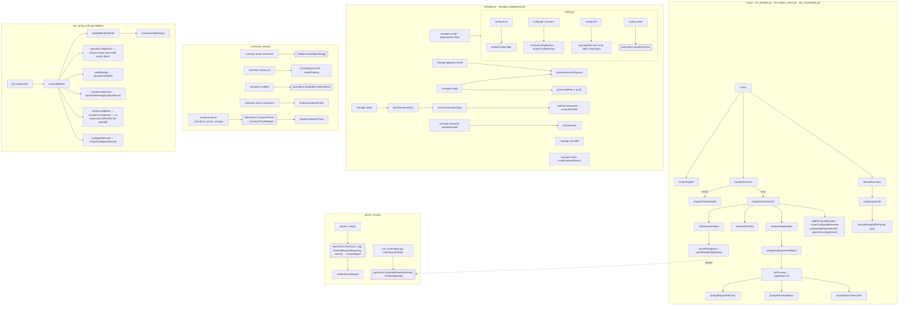

# Setup, configuration, harness management, containers, and diagnostics

Five loosely related command families sit here because they all answer "is this
machine/project wired up correctly, and if not, wire it up". `ctxloom init` is
the first-run bootstrap and interview; `ctxloom config` reads and edits
`config.yaml`; `ctxloom manage` installs and removes ctxloom's footprint in each
engine's harness (hooks, statusline, MCP registration, `.gitignore` entries);
`ctxloom container` builds and probes the per-engine agent images; and
`ctxloom doctor` reports on all of it without changing anything. `ctxloom util
config-write` is a hidden, guarded merge-writer for foreign config files.

## Structure

```mermaid
flowchart TD
    subgraph init["init.go · init_prompts.go · init_engine_select.go · init_systemdeps.go"]
        RI["runInit"] --> RAD["resolveAppDir"]
        RI --> CDE["ctxloomDirExists"]
        CDE -->|exists| EFED["engineForExistingDir"]
        CDE -->|new| SNCD["setupNewCtxloomDir"]
        SNCD --> RSE["resolveSetupEngine"] --> PFER["promptForEngineAndRepos"]
        PFER --> IP["initPrompts → readCleanLine"]
        IP --> PES["promptEngineSelection"] & PPR["promptPersonalRepos"] & PDTH["promptDirtyTreeHandler"]
        SNCD --> WIC["writeInitialConfig"]
        SNCD --> CSD["checkSystemDeps"] --> W1["warnIfNoSignKey / warnIfGitIdentityMissing"]
        SNCD --> POST["addPersonalRemotes · cloneConfiguredRemotes<br/>pullSeededDependencies · operations.ApplyHooks"]
        RI --> LD["launchDiscovery"] --> PEA["pingEngineAuth"] --> LEWP["launchEngineWithPrompt (pty)"]
    end

    subgraph config["config.go"]
        CS["config show"] --> RCY["renderConfigYAML"]
        CG["config get &lt;section&gt;"] --> RCS["resolveConfigSection → renderConfigSection"]
        CE["config edit"] --> OIE["openInEditor (env-only editor resolution)"]
        CI["config create"] --> IPJ[["operations.InitializeProject"]]
    end

    subgraph manage["manage.go · manage_companions.go"]
        MI["manage install"] --> EHG["ensureHarnessGitignore"]
        MI --> PIP["printInstallPlan (--print)"]
        MU["manage uninstall"]
        MS["manage check"] --> PHS["printHarnessStatus"] --> PCS["printCompanionStatus"] --> HFC["hintForCompanion → companionHint"]
        MH["manage hooks install/uninstall/check"]
        MSL["manage statusline install/uninstall"] --> SSL["setStatusline"]
        MC["manage config * (deprecated alias)"] --> config
        MG["manage gitignore install"] --> EHG
    end

    subgraph container["container_cmd.go"]
        CB["container build &lt;backend&gt;"] --> BAI[["isolation.BuildAgentImage"]]
        CT["container tooling list"] --> RTC["runToolingListCmd → renderTooling"]
        CSF["container scaffold"] --> SCB[["operations.ScaffoldContainerBase"]]
        CC["container check &lt;backend&gt;"] --> CD["renderContainerCheck"]
        CPR["container prune (container_prune_cmd.go)"] --> OCP[["operations.ContainerPrune → ContainerPruneReport"]] --> RCP["renderContainerPrune"]
    end

    subgraph doctor["doctor_cmd.go"]
        DC["doctor (--deps)"] --> OD[["operations.Doctor(ctx, app, DoctorRequest{DepsOnly, Home}) → DoctorReport"]]
        OD --> RDR["renderDoctorReport"]
        ISD["init_systemdeps.go: checkSystemDeps"] --> SKRD[["operations.SignKeyResolutionDetail / GitIdentityDetail"]]
    end

    subgraph util["util_config_write.go (hidden)"]
        UCW["util config-write"] --> RCW["runConfigWrite"]
        RCW --> VRP["validateRealFilePath"] --> RCF["resolveConfigFiletype"]
        RCW --> DCP["decodeConfigPatch — refuses empty stdin AND empty object"]
        RCW --> RE["readExisting → decodeConfigFile"]
        RCW --> REC["recordConfigPatch → buildAndWriteApplicationRecord"]
        RCW --> VCW["verifyConfigWrite → containsConfigPatch — re-reads and VERIFIES the payload"]
        RCW --> CWR["configWriteResult → renderConfigWriteResult"]
    end

    W1 -.->|shares| SKRD
```

## `ctxloom init`

Two paths:

- **`.ctxloom` does not exist** → `setupNewCtxloomDir`: resolve the engine
  (prompting if needed), write the initial config, check system deps, add
  personal remotes, clone configured remotes, pull seeded dependencies, apply
  hooks — then hand off to the engine's raw TUI for the setup interview
  (`launchDiscovery`).
- **`.ctxloom` exists** → `engineForExistingDir` (an explicit `--engine` wins
  over the recorded one), the `--remote`/`--forge` flags, and straight to
  `launchDiscovery`.

`checkSystemDeps` hard-blocks on missing git (with a per-OS install message)
and warns informationally on the rest. `pingEngineAuth` runs the smallest
possible oneshot to detect an unauthenticated engine before the interview
starts, and wraps the failure with a per-engine fix (`engineAuthFixHint`).

`ctxloom init prompt` prints the setup body without launching anything.

## `ctxloom config`

`show`, `get <section>`, `edit`, `create`. `resolveConfigSection` is the whole
`config get` surface — a switch whose default names every valid section.
`openInEditor` resolves the editor from the **environment only**, deliberately:
it must not depend on a config load, since it is how you fix a broken config.
`projectConfigPath` names the appdir-or-default fallback.

The same verbs exist as `manage config *` deprecated aliases.

## `ctxloom manage`

`install`/`uninstall`/`check`, `hooks *`, `statusline *`, `gitignore install`,
and the deprecated `mcp *` and `config *` alias trees.

`companionHint` is the "what breaks / how to install" text for a missing
companion binary; `hintForCompanion` keys on companion binary names, and a
name with no entry degrades to a generic fallback. `printCompanionStatus` reads
`companions.AdmitCompanions(..., prompt=false)` and nothing else: a status
command executes no companion — approved or not — and can never raise the
trust-on-first-use question, because the answer to "what is the state of
things" must not itself change that state. The resolved `bundles.Catalog` is
deliberately NOT consulted here; its companion reader is the exec. `ctxloom
doctor` reads the catalog instead (`Catalog.Candidates()` for the companions
that produced nothing), which is where a diagnosis is allowed to cost a
resolution.

## `ctxloom container`

- `build [backend]` — flag-over-config merge, then `isolation.BuildAgentImage`.
- `tooling list` — emits `toolingJSON{Instructions, Declarations}`; `renderTooling`
  explains the trust gate explicitly when there are zero declarations.
- `scaffold` — `operations.ScaffoldContainerBase` writes a base Containerfile.
- `check [backend]` — diagnoses container capability through `renderContainerCheck`.

## `ctxloom doctor`

The checks are `operations.Doctor`'s: `--deps` selects the machine-capability
subset (`DoctorRequest.DepsOnly`), the CLI hands in the home it stands in for
the composition root on (`DoctorRequest.Home`), and `renderDoctorReport` is
the only text the command writes. Each row is an `operations.DoctorCheck{Marker,
Status, Detail}` where `Marker` carries the `DOCTOR-CHECK-*` vocabulary
**shared with the external `ctxloom-doctor` Agent Skill** and `Status` is the
`operations.DoctorStatus` enum (`ok` | `warn` | `info`). The run banner's
startup findings (`run_startup_findings.go`) are `operations.StartupFindings`
rendered through the same renderer.

`operations.SignKeyResolutionDetail` and `operations.GitIdentityDetail` are
shared with `init_systemdeps.go`'s `warnIf*` probes, so a diagnosis is worded
identically in both places. `SignKeyResolutionDetail` in particular is an
`errors.As` ladder where every failure gets a named cause and a concrete fix.

## `ctxloom util config-write` (hidden)

The guarded merge-writer an agent uses to patch a foreign config file
(`settings.json`, `config.toml`) without clobbering it: validate the path →
parse the patch from stdin → decode the existing file → deep-merge → write →
**re-read and verify the payload survived** → write the application record. It
emits `configWriteResult` so a caller inspects the report rather than trusting
exit 0. No backup is taken; the `hew` application record
(`buildAndWriteApplicationRecord`, reported as `configWriteResult.Record`) is
the durable evidence of what changed in a file ctxloom does not own. Its
inverse keeps the previous value of each key it undoes, in plaintext, because
undo needs it; the records directory and each record are therefore owner-only
(`confpatch.EnsureRecordDir`).

`decodeConfigPatch` is the reference anti-silent-no-op guard in this package:
it refuses an empty body *and* an empty JSON object. `containsConfigPatch` is
the verification; `normalizeConfigValue` coerces int→float64 recursively so a
TOML integer round-trip does not fail verification.

## Invariants

- **`config edit` must not depend on a config load.** `openInEditor` reads the
  editor from `$VISUAL`/`$EDITOR` only.
- **`config create` refuses to overwrite.** It stats the path first and errors when
  something is there.
- **`config-write` verifies its own payload.** Nothing else in the package
  re-reads what it wrote to confirm the write landed.
- **`doctor` is diagnostic-only.** It never mutates; a `warn` status is its
  fail-loud signal (stated in its own `Long` text).
- **`container tooling` explains an empty result.** Zero declarations produces a
  two-line explanation naming the trust gate, not silence.
- **`init` is warn-and-continue after the config write.** Only the config write
  and the git check are fatal; remotes, clones, seeded deps and hooks each warn
  and proceed (`setupNewCtxloomDir`).
