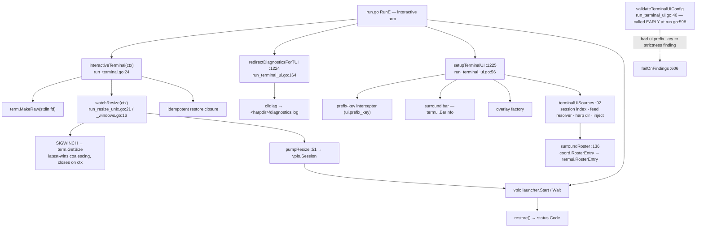
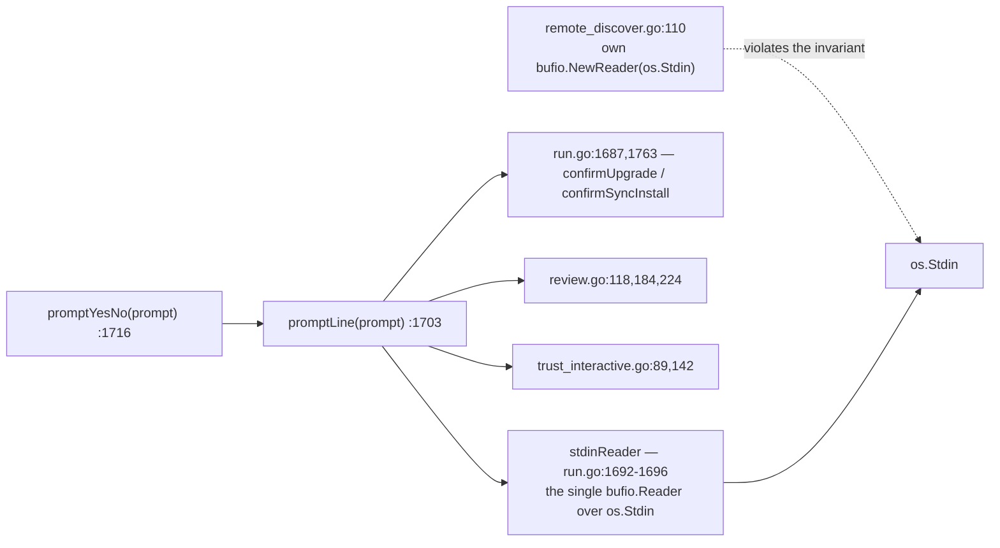

# Terminal ownership, the run UI, and interactive prompts

Two separate concerns share this page because they share one resource: the
process's terminal. The first is `ctxloom run`'s terminal *ownership* — raw
mode, SIGWINCH relaying, the prefix-key interceptor and surround status bar, and
diagnostics redirection so warnings do not scribble over an engine's TUI. The
second is the package-wide *prompting* primitive: one buffered reader over
stdin, shared by every y/N question in the CLI, plus the terminal predicates
that decide whether prompting is legal at all.

## Terminal ownership during a run

| Symbol | file:line | Contract |
|---|---|---|
| `interactiveTerminal` | `run_terminal.go:24` | Puts stdin in raw mode, starts the resize watcher, returns `(stdin, resize, restore)`. The restore closure is idempotent. |
| `pumpResize` | `run_terminal.go:51` | Relays resize events onto a `vpio.Session` — the above-the-seam half of SIGWINCH plumbing. |
| `watchResize` (unix) | `run_resize_unix.go:21` | Emits the initial size, then one per SIGWINCH, latest-wins; closes the channel on ctx cancel. |
| `watchResize` (windows) | `run_resize_windows.go:16` | Emits one size then closes — the build-tagged counterpart of the same contract. |
| `validateTerminalUIConfig` | `run_terminal_ui.go:40` | Parses `ui.prefix_key`; a bad value records a **fatal-class** strictness finding, consumed by the gate at `run.go:606`. Runs early, before anything is spawned. |
| `setupTerminalUI` | `run_terminal_ui.go:56` | Builds the interceptor / surround bar / overlay factory. A bad key here only warns and returns nil — reachable only under `--degraded`, because the gate above already aborted otherwise. |
| `terminalUIIdentity` | `run_terminal_ui.go:29` | `{WorkDir, Harp, Agent, Backend, Model}` — what the surround bar displays. Single write site (`run.go:1225`), single read site. |
| `terminalUISources` | `run_terminal_ui.go:92` | Four closures wiring the overlay's data seams to the session index, the feed resolver, the harp dir, and injection. |
| `surroundRoster` | `run_terminal_ui.go:136` | Adapts `coord.RosterEntry` → `termui.RosterEntry`. Its `error` return is structurally always nil; the signature exists to satisfy `termui.Options.FetchRoster`. |
| `redirectDiagnosticsForTUI` | `run_terminal_ui.go:164` | Diverts `clidiag` warnings to `<harpdir>/diagnostics.log` and returns a restore func. Installed **only** for interactive runs with the observation layer (`run.go:1224`, guarded by `mode == INTERACTIVE && !runPlainTerminal`). |
| `shutdownSignals` | `signals_unix.go:12` / `signals_windows.go:11` | Build-tagged signal set; 10 production references across the package. |

`--plain-terminal` (`run.go:1608` block) disables the whole ctxloom terminal
layer — the prefix-key viewer and the surround bar — for one session.

## The stdin invariant

**I3.** `stdinReader` is the single buffered reader over `os.Stdin`, shared by
every interactive y/N prompt. A fresh `bufio.Reader` per prompt would silently
discard any bytes a previous reader buffered past its line, so all prompts read
through this one reader. The invariant is documented in a comment at
`run.go:1692-1696` and enforced by nothing.

`rg 'bufio.NewReader\(os.Stdin\)'` returns exactly two hits: `run.go:1696` (the
sanctioned one) and `remote_discover.go:110` (`interactiveAdd`, which opens its
own). That is latent rather than live only because no `promptLine` prompt
currently precedes `remote discover` in a single invocation.

`init.go` has a third, structurally different reader: `initPrompts`
(`init.go:149`) wraps an injectable `io.Reader` for the setup interview. Its
constructor `newInitPromptsFrom` (`:160`) additionally force-cooks the
**process-global** terminal (`term.MakeRaw` + `Restore` on `os.Stdin.Fd()`) even
when built over an arbitrary reader, so the "injectable reader" seam does not
fully isolate from a real tty.

## Terminal predicates

Defined in `init.go`, consumed almost entirely from elsewhere.

| Predicate | file:line | Production call sites |
|---|---|---|
| `isInteractiveTerminal` | `init.go:122` | 10 — `run.go`, `review.go`, `mcp.go`, `signer.go`, `bundle_list.go`, `item_helpers.go` |
| `stdinIsPiped` | `init.go:129` | 2 — `run.go:432`, `weave.go:90` (neither in `init.go`) |
| `stderrIsTerminal` | `init.go:136` | 1 — `run.go:816` |
| `stdoutIsTerminal` | `init.go:144` | 1 — `pager.go:66` |

## Invariants

- **One reader over stdin (I3).** See above.
- **Restore is idempotent and always registered.** `interactiveTerminal` returns
  a restore closure the caller defers; the SIGINT goroutine in `init.go:573`
  restores and re-raises rather than exiting, so a Ctrl-C during the setup
  interview does not leave the terminal in raw mode.
- **The prefix key is validated before anything spawns.** `validateTerminalUIConfig`
  runs at `run.go:598`, ahead of the first strictness gate at `:606`, so a
  malformed `ui.prefix_key` aborts the launch rather than silently disabling the
  viewer mid-session.
- **Pointer identity, not file descriptor, decides paging.** `shouldPage`
  (`pager.go:65`) compares `out == os.Stdout`; a redirected writer is never paged
  even if stdout happens to still be a tty.
- **Diagnostics redirection is interactive-only.** `clidiag` warnings go to a
  per-harp log only under `mode == INTERACTIVE && !runPlainTerminal`
  (`run.go:1224`). `--plain-terminal`, `ctxloom acp`, and bare `ctxloom mcp` are
  unprotected — a warning raised by a session-owning process on those paths lands
  on the terminal the engine may be drawing on.

## Documented vs real

- `interactiveTerminal` discards `term.MakeRaw`'s error (`run_terminal.go:29-32`)
  and returns a nil stdin with no diagnostic; the caller then skips the TUI
  (`run.go:1220`) and reaches `launcher.Start` with a nil `Stdin`, which goplugin
  accepts as "no tty" — an interactive session the user cannot type into.
- `watchResize` (unix) silently skips the initial emit if `term.GetSize` fails;
  the windows variant closes the channel having sent nothing, so the pty keeps
  its default size forever.
- `redirectDiagnosticsForTUI` returns the same silent no-op for four distinct
  failures (`paths.HarpDir`, `MkdirAll`, `OpenFile`, empty harp) — the user is
  never told the diagnostics log could not be created.
- `terminalUISources`' `ExportDir` closure returns a non-empty path alongside a
  non-nil error (`run_terminal_ui.go:121`), unlike its sibling three lines above.
- `initPrompts.oldState` (`init.go:151`) is written once and never read; the type
  presents a terminal-restore responsibility it never discharges (no
  `Close`/`Restore` method).
- `readCleanLine` (`init.go:183`) strips every non-ASCII byte, so a UTF-8 repo
  name or path typed at an init prompt is silently mangled rather than rejected.
- The prompt trio (`stdinReader`, `promptLine`, `promptYesNo`) and `plural`
  (`run.go:1771`) are cross-command primitives that live in `run.go`;
  `trust_interactive.go:27` documents the dependency explicitly.
