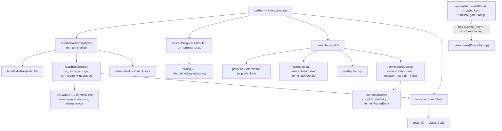
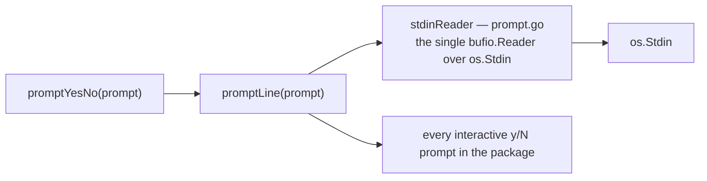

# Terminal ownership, the run UI, and interactive prompts

Two separate concerns share this page because they share one resource: the
process's terminal. The first is `ctxloom run`'s terminal *ownership* — raw
mode, resize relaying, the prefix-key interceptor and surround status bar, and
diagnostics redirection so warnings do not scribble over an engine's TUI. The
second is the package-wide *prompting* primitive: one buffered reader over
stdin, shared by every y/N question in the CLI, plus the terminal predicates
that decide whether prompting is legal at all.

## Terminal ownership during a run

```mermaid
flowchart TD
    RUNE["runRun — interactive arm"]
    RUNE --> IT["interactiveTerminal(ctx)<br/>run_terminal.go"]
    IT --> MR["termMakeRaw(stdin fd)"]
    IT --> WR["watchResize(ctx)<br/>run_resize_unix.go / run_resize_windows.go"]
    IT --> RESTORE["idempotent restore closure"]
    WR --> SIG["SIGWINCH → terminal size<br/>latest-wins coalescing, closes on ctx"]

    RUNE --> RD["redirectDiagnosticsForTUI<br/>run_terminal_ui.go"]
    RD --> LOG["clidiag → &lt;harpdir&gt;/diagnostics.log"]
    RUNE --> STU["setupTerminalUI"]
    STU --> PK["prefix-key interceptor (ui.prefix_key)"]
    STU --> BAR["surround bar — termui.BarInfo over terminalUIIdentity"]
    STU --> OV["overlay factory"]
    STU --> SRC["terminalUISources<br/>session index · feed resolver · harp dir · inject"]
    SRC --> ROSTER["surroundRoster<br/>coord.RosterEntry → termui.RosterEntry"]

    RUNE --> LAUNCH["launcher Start / Wait"]
    WR --> LAUNCH
    LAUNCH --> EXIT["restore() → status.Code"]

    VAL["validateTerminalUIConfig — called from runState.gateStartup"]
    VAL -.->|"bad ui.prefix_key ⇒ strictness finding"| GATE["gates.close(PhaseStartup)"]
```

- `interactiveTerminal` makes the frontend the terminal owner: it puts the
  real terminal in raw mode so keystrokes pass through untouched to the
  runner's pty, returns `os.Stdin` as the keystroke source plus a resize
  channel, and a restore func that undoes raw mode. The restore is
  idempotent, so callers defer it immediately (panic safety) and may also
  call it inline before any normal-path output. When stdin is not a terminal
  it returns `(nil, nil, no-op)` and the run proceeds without a pty owner; a
  raw-mode failure on a real terminal warns that the session will not receive
  keystrokes.
- `watchResize` emits the initial size, then one per SIGWINCH, latest-wins,
  and closes the channel on ctx cancel; the Windows build-tagged counterpart
  emits one size and closes.
- `validateTerminalUIConfig` parses `ui.prefix_key`; a bad value records a
  **fatal-class** strictness finding, consumed when `runState.gateStartup`
  closes the startup phase — before anything is spawned. `setupTerminalUI`
  builds the interceptor / surround bar / overlay factory; a bad key there
  only warns and returns nil, reachable only under `--degraded` because the
  gate already aborted otherwise.
- `terminalUIIdentity` is what the surround bar displays; `terminalUISources`
  wires the overlay's data seams to the session index, the feed resolver, the
  harp dir and injection; `surroundRoster` adapts `coord.RosterEntry` to
  `termui.RosterEntry`.
- `redirectDiagnosticsForTUI` diverts `clidiag` warnings to
  `<harpdir>/diagnostics.log` and returns a restore func. It is installed
  only for interactive runs that own a terminal and did not pass
  `--plain-terminal`.
- `shutdownSignals` (`signals_unix.go` / `signals_windows.go`) is the
  build-tagged signal set every long-lived command's `signal.NotifyContext`
  uses.

`--plain-terminal` disables the whole ctxloom terminal layer — the prefix-key
viewer and the surround bar — for one session.

## The stdin invariant

```mermaid
flowchart LR
    SR["stdinReader — prompt.go<br/>the single bufio.Reader over os.Stdin"]
    PL["promptLine(prompt)"] --> SR
    PYN["promptYesNo(prompt)"] --> PL
    PL --> C["every interactive y/N prompt in the package"]
    SR --> STDIN["os.Stdin"]
```

`stdinReader` is the single buffered reader over `os.Stdin`, shared by every
interactive y/N prompt. A fresh `bufio.Reader` per prompt would silently
discard any bytes a previous reader buffered past its line, so all prompts
read through this one reader. `promptLine`, `promptYesNo` and `plural` live in
`prompt.go` as cross-command primitives.

`init.go`'s setup interview has a structurally different reader: `initPrompts`
wraps an injectable `io.Reader`. Its constructor `newInitPromptsFrom`
additionally puts the **process-global** terminal into raw mode even when
built over an arbitrary reader, so the "injectable reader" seam does not
fully isolate from a real tty.

## Terminal predicates

`terminal.go` defines `isInteractiveTerminal` (stdin *and* stdout are
terminals — the gate every `-i` surface checks), `stdinIsPiped`,
`stderrIsTerminal` and `stdoutIsTerminal`. `isInteractiveTerminal` is a
package variable so tests can substitute it.

## Invariants

- **One reader over stdin.** See above.
- **Restore is idempotent and always registered.** `interactiveTerminal`
  returns a restore closure the caller defers.
- **The prefix key is validated before anything spawns.**
  `validateTerminalUIConfig` runs inside `runState.gateStartup`, ahead of the
  startup gate closing, so a malformed `ui.prefix_key` aborts the launch rather
  than silently disabling the viewer mid-session.
- **Pointer identity, not file descriptor, decides paging.** `shouldPage`
  (`pager.go`) requires `out == os.Stdout` *and* `stdoutIsTerminal()`; a
  redirected writer is never paged even if stdout happens to still be a tty.
- **Diagnostics redirection is interactive-only.** `clidiag` warnings go to a
  per-harp log only when the run owns a terminal and `--plain-terminal` is
  not set.
