# Trust, signing, and review

ctxloom's trust model has three CLI faces. **Signing** (`ctxloom sign`,
`bundle sign`) countersigns bundle content with an ssh-agent or git-configured
key. **Signer management** (`trust signer add|list|show|remove`) records which
publisher principals are trusted, in which namespaces. **Review**
(`ctxloom review`, `bundle trust|reject`, and the interactive `-i` surfaces on
`bundle show` / `fragment show` / `mcp server show`) is the porcelain by which a
human accepts or rejects pulled content before it can execute. The contract that
matters: a trust decision is recorded durably *and* re-applied to the harness on
disk immediately, and a decision that could not be fully recorded says so.

## Structure

```mermaid
flowchart TD
    subgraph sign["sign.go"]
        SC["sign &lt;ref&gt; (deprecated) :55"] --> RSC["runSignCmd :71"]
        BSC["bundle sign &lt;ref&gt; :85"] --> RSC
        RSC --> RS["runSign :119 (CCN 12)"]
        RS --> RST["resolveSignTargets :177 (--all | one ref)"]
        RS --> AK[["agentkey discovery"]]
        RS --> PSR["printSignResult :193"]
        RS --> SCR["signCmdResult / signCmdTarget :96,:104"]
    end

    subgraph signer["signer.go — two parallel trees"]
        SN["signer * (DEPRECATED) :30"] --> RSA
        TSN["trust signer * :360"] --> RSA
        RSA["runSignerAdd :103"] --> CSA["confirmSignerAdd :145"]
        CSA --> SRW["signerRoleWord :159 (PUBLISHER vs REVIEWER)"]
        CSA --> SCT["signerConsequenceText :172"]
        RSL["runSignerListCmd :194"] --> PSL["printSignerListings :217"] --> EA["embeddedAnnotation :250"]
        RSH["runSignerShowCmd :279"]
        RSR["runSignerRemoveCmd :320 — 3-way outcome"]
    end

    subgraph trust["trust.go"]
        TB["trust &lt;ref&gt; (bare alias) :50"] --> RTBA["runTrustBareAlias :64"]
        TA["bundle trust &lt;ref&gt; :81"] --> RIT["runItemTrust :91"]
        RTBA --> RIT
        TR["bundle untrust &lt;ref&gt; :158"] --> RB["runBlacklist :166"]
        BL["blacklist &lt;ref&gt; (DEPRECATED) :134"] --> RB
        RIT & RB --> RMA["refreshManagedArtifacts :219"] --> HA["harnessApplied :236"] --> AH[["operations.ApplyHooks"]]
    end

    subgraph inter["trust_interactive.go"]
        OIT["offerItemTrust :86"] --> PITC["parseItemTrustChoice :45 → itemTrustChoice :33"]
        OBT["offerBundleTrust :105"] --> PBIT["printBundleItemTrust :156"]
        OBT --> OBHT["offerBundleHookTrust :134"] --> PBHT["printBundleHookTrust :167"]
        PITC --> AITC["applyItemTrustChoice :61"] --> RIT & RB
        RLMT["reviewLocalMCPTrust :179 — review only, never mutates"]
        ST["stampedTrust :74"]
    end

    subgraph review["review.go"]
        RV["ctxloom review :36"] --> RR["runReview :81 (CCN 11)"]
        RR --> RRS["resolveReviewSigner :146"]
        RR --> CUR["confirmUnsignedReview :174"]
        RR --> WSK["warnIfSoftwareKey :203"]
        RR --> RL["renderReviewList :233 (non-interactive)"]
        RR --> RW["runReviewWalk :330"] --> PRC["parseReviewChoice :269 → reviewDecision :254"]
        RW --> PRI["printReviewItem :399"] --> URD["unifiedReviewDiff :444"]
        PRI --> PRAF["printReviewAlternateForm :433"]
        RW --> ARD["applyReviewDecision :366"] --> RAF["reviewApplyFuncs :289 ← reviewApplier :299"]
        RW --> RSUM["reviewSummary :315"]
    end

    IH[["item_helpers.go:342"]] --> OIT
    BLST[["bundle_list.go:165"]] --> OBT
    MCPS[["mcp.go:349"]] --> RLMT
    RAF --> OPST[["operations.SetItemTrust / SetBlacklist"]]
```

## Commands

| Command | file:line | Notes |
|---|---|---|
| `ctxloom sign [ref]` | `sign.go:55` | Deprecated top-level alias of `bundle sign` |
| `ctxloom bundle sign [ref]` | `sign.go:85` | `--all`, `--key`. `--all` signs every local bundle |
| `ctxloom signer add\|list\|show\|remove` | `signer.go:30,74,184,268,308` | Deprecated tree |
| `ctxloom signer add\|list\|show\|remove` | `signer.go:360,374,382,388,395` | The real home. `add` takes `--key`, `--namespaces`, `--comment`, `--project`, `--yes` |
| `ctxloom bundle trust <ref>` | `trust.go:50` | Bare alias for `bundle trust`, with a hand-rolled deprecation pointer |
| `ctxloom bundle trust <ref>` | `trust.go:81` | Records acceptance, refreshes artifacts, prints the hash/signer report |
| `ctxloom bundle untrust <ref>` | `trust.go:158` | Ref-level + content-level rejection |
| `ctxloom blacklist <ref>` | `trust.go:134` | Deprecated alias for `bundle untrust` (a leaf, so it correctly uses cobra's `Deprecated`) |
| `ctxloom review` | `review.go:36` | `--list`, plus the signer flag. Interactive walk on a TTY, listing otherwise |

## The review walk

`runReview` (`review.go:81`) enumerates pending items, resolves the
countersigning key, and then either renders a listing or runs the per-bundle,
per-item interactive walk. `parseReviewChoice` (`:269`) maps an answer letter to
a `reviewDecision`; the `A` vs `a` asymmetry (accept-all vs accept-one) is
load-bearing and explicitly tested. `reviewApplyFuncs` (`:289`) is the injected
mutation pair the walk drives, wired in production by `reviewApplier` (`:299`)
over `cfg`, `project` and `signer`.

`printReviewItem` (`:399`) shows a unified diff for an UPDATE and the full
content otherwise; `printReviewAlternateForm` (`:433`) additionally shows the
item's other countersigned form, because both forms get signed.
`indentBlock` (`:460`) renders `"  (empty)\n"` for empty input — the model answer
to the empty-payload question in this package.

## Interactive trust surfaces

`itemTrustChoice` (`trust_interactive.go:33`) is a three-valued enum —
`itemTrustSkip` / `itemTrustGrant` / `itemTrustBlacklist` — deliberately with
`Skip` as the `iota` zero value, so a forgotten branch is a skip rather than a
grant. `parseItemTrustChoice` (`:45`) produces it (anything unrecognized is
skip); `applyItemTrustChoice` (`:61`) consumes it. Splitting the terminal read
from the mutation is what makes the mutation unit-testable without a TTY.

Three call sites: `offerItemTrust` from `item_helpers.go:342` (`fragment/command
show -i`), `offerBundleTrust` from `bundle_list.go:165` (`bundle show -i`), and
`reviewLocalMCPTrust` from `mcp.go:349` (`mcp server show -i` — **review only,
never mutates**, because a configured-local MCP server has no ref to record a
decision against).

## Invariants

- **A signing failure aborts the batch.** `runSign` with `--all` stops at the
  first failure rather than continuing — fail-closed is correct for signing.
- **`review --project` hard-fails when the key cannot be resolved.**
  `resolveReviewSigner` (`:146`) wraps the underlying `agentErr` with `%w` and a
  fix-it for the `--project` case, and degrades (with an explicit
  `confirmUnsignedReview` prompt) otherwise. The ambiguous-key case lists the
  candidates.
- **Prompts fail closed.** `confirmUnsignedReview` (`:174`) returns `false` on a
  read error; `confirmSignerAdd` (`:145`) treats a prompt error as "no". The one
  deliberate exception is `warnIfSoftwareKey` (`:203`), which returns `true` on a
  read error — a warning must never block.
- **A trust decision is re-applied to disk immediately.**
  `refreshManagedArtifacts` (`trust.go:219`) re-runs the harness after every
  accept/reject so the change lands now, gated by `harnessApplied` (`:236`) so it
  is a no-op on a project that never installed hooks. It is warn-only, because the
  durable mutation has already persisted.
- **A partial trust write is announced.** `runBlacklist` (`:174-178`) explicitly
  warns when only the durable half was recorded.
- **The interactive surfaces are suppressed for structured output.** Both
  `bundle show -i` (`bundle_list.go:165`) and `mcp server show -i`
  (`mcp.go:349`) gate on `outputFormatOf(cmd) != formatJSON` plus a TTY check, so
  prompts cannot corrupt a JSON stream.
- **`trustCmd` deliberately does not use cobra's `Deprecated` field**
  (`trust.go:44-48`): it would hide the whole `accept|reject|signer` subtree from
  `--help`. The leaf `blacklistCmd` correctly does use it.

## Documented vs real

- `trust_interactive.go:22-23` claims "All trust UI is written to stderr so it
  never mingles with the content on stdout." That is false for the mutation
  confirmation: `applyItemTrustChoice` → `runItemTrust`/`runBlacklist` →
  `emit(cmd, res, …)` writes the "Approved …" / "Rejected …" block to
  `cmd.OutOrStdout()` (`trust.go:99-110`, `:182-199`). No piped output is
  corrupted today because the whole surface is TTY-gated.
- The interactive trust surface writes to `os.Stderr` directly rather than
  `cmd.ErrOrStderr()` (`trust_interactive.go:88,107,139,188`), even though
  `printBundleItemTrust`/`printBundleHookTrust` take an `io.Writer` seam that all
  four call sites hardcode to `os.Stderr`. `confirmSignerAdd` (`signer.go:150`) —
  the single most consequential confirmation in the product — does the same and
  has no direct test.
- `ctxloom sign --all` over a project whose bundle dirs resolve to an empty or
  absent location prints "no local bundles to sign" and exits **0**;
  `operations.ListLocalBundleNames` (`internal/operations/sign.go:176-179`)
  swallows every per-directory `ReadDir` error, so a misconfigured
  `GetBundleDirs` is indistinguishable from an empty one.
- The zero-target sign path emits `signCmdResult{}` (nil slice → `"signed": null`)
  while the normal path emits an initialised slice (`"signed": []`)
  (`sign.go:141` vs `:147`).
- `unifiedReviewDiff` (`:444`) discards difflib's error and returns `""`, and
  `printReviewItem` treats `diff == ""` as "fall through to full content" — so an
  UPDATE whose diff render failed shows the full body with no indication that a
  comparison was attempted. The explanatory line at `:419-421` fires only when
  `PreviousContent == ""`.
- `ctxloom review --format json` on a TTY ignores `--format` and starts the
  interactive walk: the branch at `:86` tests only
  `reviewListFlag || !isInteractiveTerminal()`.
- `harnessApplied` (`trust.go:236`) swallows the `HarnessStatus` error into
  `false` (documented as a fail-safe), so a trust change on a project whose
  harness status cannot be read is not re-applied.
- Seven package-global flag variables are each bound into **two** cobra commands
  (`sign.go:203-209`, `signer.go:411-435`), so pflag stores one address in both
  flag sets — harmless for a one-shot CLI, a live hazard for the package's 85
  in-process command tests.
- `offerItemTrust:90-92` and `offerBundleHookTrust:143-145` return `nil` on a
  prompt read error, so a genuine terminal failure is indistinguishable from
  Ctrl-D — and in the hook walk it abandons every remaining hook silently.
- The deprecated `signer *` and `sign` alias trees cost ~110 lines across two
  files (5 duplicate `*cobra.Command` values, 5 deprecation constants, 6
  duplicated flag registrations, one duplicated `Long` text) purely as a
  backward-compat shim.
