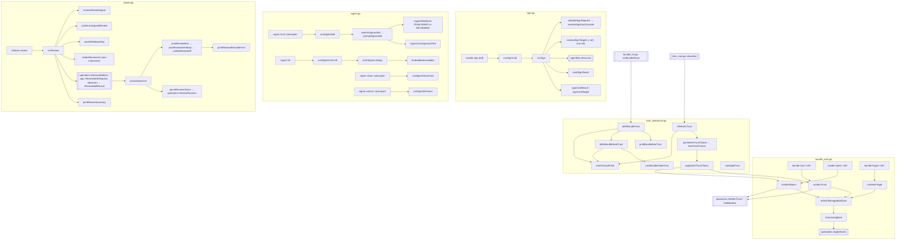
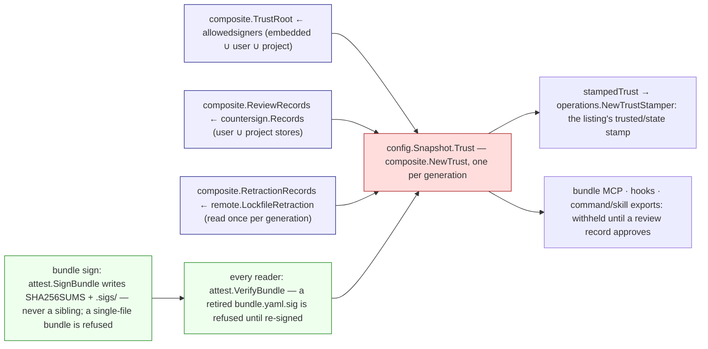

# Trust, signing, and review

ctxloom's trust model has three CLI faces. **Signing** (`bundle sign`)
countersigns bundle content with an ssh-agent or git-configured key. **Signer
management** (`signer trust|list|show|untrust`) records which publisher
principals are trusted, in which namespaces. **Review** (`ctxloom review`,
`bundle trust|reject|forget`, and the interactive `-i` surfaces on `bundle
show` / `fragment show` / `command show`) is the porcelain by which a human
accepts or rejects pulled content before it can execute. The contract that
matters: a trust decision is recorded durably *and* re-applied to the harness on
disk immediately, and a decision that could not be fully recorded says so.

## Structure

```mermaid
flowchart TD
    subgraph sign["sign.go"]
        BSC["bundle sign [ref]"] --> RSC["runSignCmd"] --> RS["runSign"]
        RS --> VSR["validateSignRequest → resolveSignKeyOverride"]
        RS --> RST["resolveSignTargets (--all | one ref)"]
        RS --> AK[["agentkey discovery"]]
        RS --> PSR["printSignResult"]
        RS --> SCR["signCmdResult / signCmdTarget"]
    end

    subgraph signer["signer.go"]
        TSN["signer trust &lt;principal&gt;"] --> RSA["runSignerAdd"] --> CSA["confirmSignerAdd → promptSignerAdd"]
        CSA --> SRW["signerRoleWord (PUBLISHER vs REVIEWER)"]
        CSA --> SCT["signerConsequenceText"]
        SLC["signer list"] --> RSL["runSignerListCmd"] --> PSL["printSignerListings"] --> EA["embeddedAnnotation"]
        SSC["signer show &lt;principal&gt;"] --> RSH["runSignerShowCmd"]
        SUC["signer untrust &lt;principal&gt;"] --> RSR["runSignerRemove"]
    end

    subgraph trust["bundle_trust.go"]
        TA["bundle trust &lt;ref&gt;"] --> RIT["runItemTrust"]
        TR["bundle reject &lt;ref&gt;"] --> RIR["runItemReject"]
        TF["bundle forget &lt;ref&gt;"] --> RIF["runItemForget"]
        RIT & RIR & RIF --> RMA["refreshManagedArtifacts"] --> HA["harnessApplied"] --> AH[["operations.ApplyHooks"]]
    end

    subgraph inter["trust_interactive.go"]
        OIT["offerItemTrust"] --> PITC["parseItemTrustChoice → itemTrustChoice"]
        OBT["offerBundleTrust"] --> PBIT["printBundleItemTrust"]
        OBT --> OBHT["offerBundleHookTrust"] --> PBHT["printBundleHookTrust"]
        PITC --> AITC["applyItemTrustChoice"] --> RIT & RIR
        OIT & OBT & OBHT --> WPF["warnPromptFault"]
        ST["stampedTrust"]
    end

    subgraph review["review.go"]
        RV["ctxloom review"] --> RR["runReview"]
        RR --> RRS["resolveReviewSigner"]
        RR --> CUR["confirmUnsignedReview"]
        RR --> WSK["warnIfSoftwareKey"]
        RR --> RL["renderReviewList (non-interactive)"]
        RR --> RW[["operations.ReviewWalk(ctx, app, ReviewWalkRequest, observer) → ReviewWalkResult"]]
        RW --> OBS["reviewObserver"]
        OBS --> PRI["printReviewItem → printReviewItemBody → unifiedReviewDiff"]
        PRI --> PRAF["printReviewAlternateForm"]
        OBS --> PRC["parseReviewChoice → operations.ReviewDecision"]
        RR --> RSUM["printReviewSummary"]
    end

    IC[["item_crud.go showItem"]] --> OIT
    BLST[["bundle_list.go runBundleShow"]] --> OBT
    RIT & RIR --> OPST[["operations.SetItemTrust / SetBlacklist"]]
```

## The gate every face decides behind

```mermaid
flowchart LR
    SNAP["config.Snapshot.Trust — composite.NewTrust, one per generation"]:::gate
    ROOT["composite.TrustRoot ← allowedsigners (embedded ∪ user ∪ project)"]:::port
    REC["composite.ReviewRecords ← countersign.Records (user ∪ project stores)"]:::port
    RET["composite.RetractionRecords ← remote.LockfileRetraction (read once per generation)"]:::port
    ROOT & REC & RET --> SNAP
    SNAP --> STAMP["stampedTrust → operations.NewTrustStamper: the listing's trusted/state stamp"]
    SNAP --> EXEC["bundle MCP · hooks · command/skill exports: withheld until a review record approves"]
    SIGN["bundle sign: attest.SignBundle writes SHA256SUMS + .sigs/ — never a sibling; a single-file bundle is refused"]:::sign
    SIGN --> READ["every reader: attest.VerifyBundle — a retired bundle.yaml.sig is refused until re-signed"]:::sign
    READ --> SNAP
    classDef gate fill:#fdd,stroke:#a22
    classDef port fill:#eef,stroke:#228
    classDef sign fill:#efe,stroke:#282
```

There is no admit-everything trust anywhere in production: a surface that
forgot its gate holds none, and `bundles.Decide` withholds on the nil
authorizer (`ReasonUngoverned`). The only allow-all authorizer is the
test-only `internal/testsupport/admitall`, which the `archtestsupport`
analyzer keeps out of every shipped binary. The cascade and its rows are stated normatively in
`docs/trust-model.md`; the decision is recorded in ADR 0036.

## The review walk

`runReview` (`review.go`) enumerates pending items, resolves the
countersigning key, and then either renders a listing or hands the per-bundle,
per-item walk to `operations.ReviewWalk`, supplying `reviewObserver` as the
frontend: it prints each bundle and item, reads the answer, and maps it with
`parseReviewChoice` to an `operations.ReviewDecision` (the `T`/`t` and `R`/`r`
asymmetry — rest-of-bundle vs one item — is load-bearing and explicitly
tested). The walk applies decisions through `SetItemTrust`/`SetBlacklist` over
the session's `project` and `signer`, and reports back what it recorded.

`printReviewItem` shows a unified diff for an UPDATE (the approved bytes
differ from the current ones) and the full content otherwise, naming why for a
RE-REVIEW (the approved bytes are the current ones, but that approval no longer
applies); `printReviewAlternateForm` additionally shows the item's other
countersigned form, because both forms get signed.

## Interactive trust surfaces

`itemTrustChoice` (`trust_interactive.go`) is a three-valued enum —
`itemTrustSkip` / `itemTrustGrant` / `itemTrustReject` — deliberately with
`Skip` as the `iota` zero value, so a forgotten branch is a skip rather than a
grant. `parseItemTrustChoice` produces it (only an explicit `t`/`r` mutates;
anything else, including an EOF-truncated read, is a skip, because viewing must
never mutate trust); `applyItemTrustChoice` consumes it. Splitting the terminal
read from the mutation is what makes the mutation unit-testable without a TTY.
The letters are `bundle trust` and `bundle reject`, so every surface that offers
the decision offers it in the vocabulary the reviewer can also type.

Two call sites: `offerItemTrust` from `showItem` (`fragment/command show -i`)
and `offerBundleTrust` from `runBundleShow` (`bundle show -i`). A prompt read
error is reported by `warnPromptFault` — EOF is a plain skip, anything else
says out loud that nothing was trusted or rejected.

## Invariants

- **A signing failure aborts the batch.** `runSign` with `--all` stops at the
  first failure rather than continuing — fail-closed is correct for signing.
- **`review --project` hard-fails when the key cannot be resolved.**
  `resolveReviewSigner` wraps the underlying error with a fix-it for the
  `--project` case, and degrades (with an explicit `confirmUnsignedReview`
  prompt) otherwise. The ambiguous-key case lists the candidates.
- **Prompts fail closed.** `confirmUnsignedReview` returns `false` on a read
  error; `confirmSignerAdd` treats a prompt error as "no". The one deliberate
  exception is `warnIfSoftwareKey`, which returns `true` on a read error — a
  warning must never block.
- **A trust decision is re-applied to disk immediately.**
  `refreshManagedArtifacts` re-runs the harness after every accept/reject/forget
  so the change lands now, gated by `harnessApplied` so it is a no-op on a
  project that never installed hooks. It is warn-only, because the durable
  mutation has already persisted.
- **A partial trust write is announced.** `runItemReject` warns when only the
  durable half was recorded.
- **The interactive surfaces are suppressed for structured output.** `bundle
  show -i` gates on a text render plus a TTY check, so prompts cannot corrupt a
  JSON stream.
