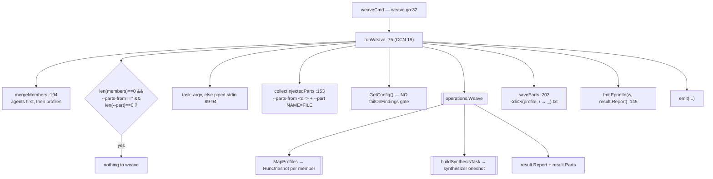

# `ctxloom weave`

`ctxloom weave` is the parallel-profile fan-out plus synthesis primitive: it maps
one task across several agents or profiles (each a real engine oneshot), then
feeds their outputs to a synthesizer that produces a single report. Parts can
also be injected from disk instead of being generated, and every part can be
saved out. It is a single 250-line file, `weave.go`, over
`operations.Weave` (`internal/operations/ensemble.go`).

## Structure

## Command and flags

`ctxloom weave [flags] [task...]` — `weave.go:32`. Eleven flags plus five
completions registered at `weave.go:220`.

| Flag | Meaning |
|---|---|
| `--agents` | Named agent bindings to fan out to |
| `-p, --profile` | Profiles to fan out to (repeatable) |
| `--parts-from <dir>` | Read pre-existing parts from a directory instead of generating them |
| `--part NAME=FILE` | Inject one named part from a file (repeatable) |
| `--save-parts <dir>` | Write each member's output to `<dir>/<name>.txt` |
| `--no-synthesize` / `--map-only` | Skip synthesis and report the parts only |
| `--synth-profile` / `--synth-llm` | Which profile/engine performs the synthesis |

`--map-only` and `--no-synthesize` are registered as two independent `BoolVar`
calls bound to the **same pointer** (`weave.go:232-234`) — an undeclared alias
that appears twice in `--help` and twice in shell completion.

## Functions

| Function | file:line | Notes |
|---|---|---|
| `runWeave` | `:75` | The whole command: validate → read task → collect parts → `operations.Weave` → save parts → warn per failure → emit |
| `collectInjectedParts` | `:153` | Reads `--parts-from` and `--part`; every read error is wrapped with the offending path/spec. Skips subdirectories (`:162-164`) |
| `mergeMembers` | `:194` | Concatenates agents then profiles — the sole definition of the "agents first" ordering rule, pinned by `weave_members_test.go` |
| `saveParts` | `:203` | `<dir>/<strings.ReplaceAll(p.Profile, "/", "_")>.txt` |

## Invariants

- **Ordering is agents-first, then profiles.** `mergeMembers` is the only place
  this is decided, and it has a dedicated test.
- **Part-read failures are always attributed.** `collectInjectedParts` wraps every
  error with the path or `NAME=FILE` spec that produced it — the best error
  handling in the file.
- **Task from argv, else stdin.** `stdinIsPiped` (`init.go:129`) gates the stdin
  read at `weave.go:90`.

## Documented vs real

- **`weave` spawns engines but does not take a `strictness.Mark` or call
  `failOnFindings`** (`weave.go:84-87`), so it launches agents on a config that
  `ctxloom run` and `ctxloom mcp` would refuse to start on. `failOnFindings` is
  called only from `run.go:606,1020,1071`, `mcp_server.go:144` and
  `profile_materialize.go:59`.
- The "nothing to weave" guard (`:77`) tests the **flags**, not the resolved
  parts, so `--parts-from <empty-dir>` (or a directory containing only
  subdirectories) passes the guard and synthesizes zero parts.
- An empty synthesis output prints one blank line and exits 0 (`:145` —
  `fmt.Fprintln(w, result.Report)` with no emptiness check). `operations.Weave`
  sets `result.Report = synth.Output` without checking it either.
- ~~The task is never validated non-empty, and the stdin read error is swallowed,
  so `ctxloom weave` can fan real agents out over an empty task.~~ —
  **RESOLVED `749b1a85`** (U043-F08). `readTask` returns the read error, and an
  empty task is rejected when there are members to fan out. A parts-only run
  legitimately has no task and stays green. This was several billed engine
  launches over nothing, triggered by a broken pipe.
- ~~`saveParts` returns `nil` after writing zero files, and silently overwrites
  when two parts sanitize to the same filename.~~ — **RESOLVED `749b1a85`**
  (U043-F05). Empty is now an error; colliding names get a probed `-N` suffix, so
  a member literally named `a-2` cannot be clobbered by the disambiguation either.
- Also resolved in `749b1a85`: the "nothing to weave" guard tested the **flags**
  rather than the resolved parts (U043-F03) — `--parts-from <empty-dir>` resolved
  to zero parts and went on to "synthesize" them; it now runs after
  `collectInjectedParts`. And an empty synthesis printed one blank line and exited
  0 (U043-F02); it now falls back to the labeled parts exactly as a synthesis
  *error* does, and fails when there is neither report nor parts. The floor is
  checked before emit, so `--format json` fails too.
