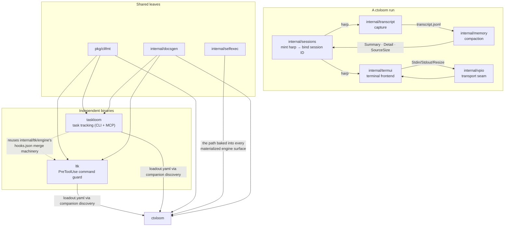

# Architecture — companion and session subsystems

These pages describe the parts of ctxloom that either **ship as their own binaries** (`ltk`,
`taskloom`) or that own the **session lifecycle around a run** (transcript capture, the session
index, memory compaction), plus the small leaf packages the CLIs are built on.

Each page opens with what the subsystem **is** and the **contract it owns**, then gives a
structure diagram, an inventory of the exported types and functions that matter with `file:line`
references, and an explicit **invariants** section split into what holds and what diverges from
its own documentation.

## Pages

| Page | Subsystem | What it owns |
|---|---|---|
| [ltk.md](ltk.md) | `cmd/ltk` + `internal/ltk/{app,engine,frontend,frontend/shell,frontend/pwsh,frontend/cmd,ir,rules,state,scm,shellenv,tools/extract-defaults}` | The command guard: a PreToolUse hook that parses a tool call into a shell-agnostic IR, matches it against a YAML rule file, and emits an allow-or-deny decision in the harness's own wire format |
| [taskloom.md](taskloom.md) | `cmd/taskloom` + `internal/taskloom/{config,engine,workdir}` | Per-project task tracking over an append-only harp-keyed log, exposed as both a CLI and an MCP server, with its own config surface and project-root resolution that do not depend on ctxloom |
| [transcript.md](transcript.md) | `internal/transcript` + `internal/transcript/vendorreader/{,codex,claude,kiro,antigravity}` | ctxloom's own canonical conversation record: the versioned append-only JSONL schema, the writer every capture path shares, the reader, and the four vendor-format readers |
| [sessions.md](sessions.md) | `internal/sessions` | The harp-keyed session index (`~/.ctxloom/sessions/index.yaml`) binding harp → backend session ID → project dir → transcript path → summary, behind a two-adapter storage port |
| [memory.md](memory.md) | `internal/memory` | Map/reduce compaction of a session transcript into a persisted essence document, plus the index projection the resume picker renders, plus plan-file harp stamping |
| [termui.md](termui.md) | `internal/termui` | The raw-ANSI terminal frontend for an interactive run: prefix-key interceptor, reserved status row, output hold gate, and a VT-sequence guard |
| [vpio.md](vpio.md) | `internal/vpio` + `internal/vpio/{goplugin,dockerexec}` | The transport seam for one interactive agent turn, and its two implementations (go-plugin gRPC stream, `docker exec -it` under a host pty) |
| [docsgen.md](docsgen.md) | `internal/docsgen` | Deterministic generation of man pages, per-command markdown, an MCP tool page, and a config page from a product's live cobra tree, live MCP registrations, and tracked JSON Schema |
| [selfexec.md](selfexec.md) | `internal/selfexec` | Resolving the path of the running ctxloom binary, so a materialized engine surface names the binary that materialized it |
| [clifmt.md](clifmt.md) | `pkg/clifmt` | Rendering an arbitrary Go value to json / yaml / toml / text / markdown for first-party CLI commands |

## How these fit together

## Recurring shapes worth knowing before reading any single page

Three patterns show up in more than one of these subsystems, and knowing them makes each page
shorter to read:

1. **The type has nowhere to put the bad news.** `ltk`'s `engine.Response` has no "unanalyzed"
   state, so a parse failure is encoded as an allow. `vendorreader.VendorAdapter.Convert` returns only
   `error` with no count, so "the format drifted and I recognized nothing" is encoded as success.
   `vpio.Session` has no `Close`, so each implementation invents its own teardown. In each case the
   diagnostic exists at the point of failure and is destroyed by the signature it has to pass
   through.

2. **A guard whose precondition is checked at the call site, not in the writer.**
   `sessions.BindSession` accepts an empty session ID and the guard lives in
   `internal/operations`, reachable through a second caller that does not replicate it.
   The sibling instance — `sessions.SetSummary` erasing `Summary`/`Detail`/`SourceSize`
   unconditionally while `internal/memory` held the non-empty guard — is **RESOLVED
   `07abd892`**: the refusal moved into the writer. The pattern is left described here
   because `BindSession` still has it, and because the fix is the pattern's answer:
   move the guard to the writer rather than replicating it at each call site.

3. **Two individually-correct decisions composing into the failure both were written to prevent.**
   The clearest instance is in `transcript`: the `Recorder`'s lazy file open is documented as
   *upholding* the silent-no-op discipline (no events ⇒ no file, so "absent" means "nothing was
   recorded"), and `operations.hasCanonicalTranscript`'s existence check is a reasonable
   idempotency guard — composed, a zero-entry import reports success and is retried forever.

## Scope note

These pages describe **structure and contract**. Defects, severities and remediation are assembled
separately in `FINDINGS.md`; where a page notes that documented and real behaviour diverge, it
records the real behaviour as a one-line factual note and nothing more.
