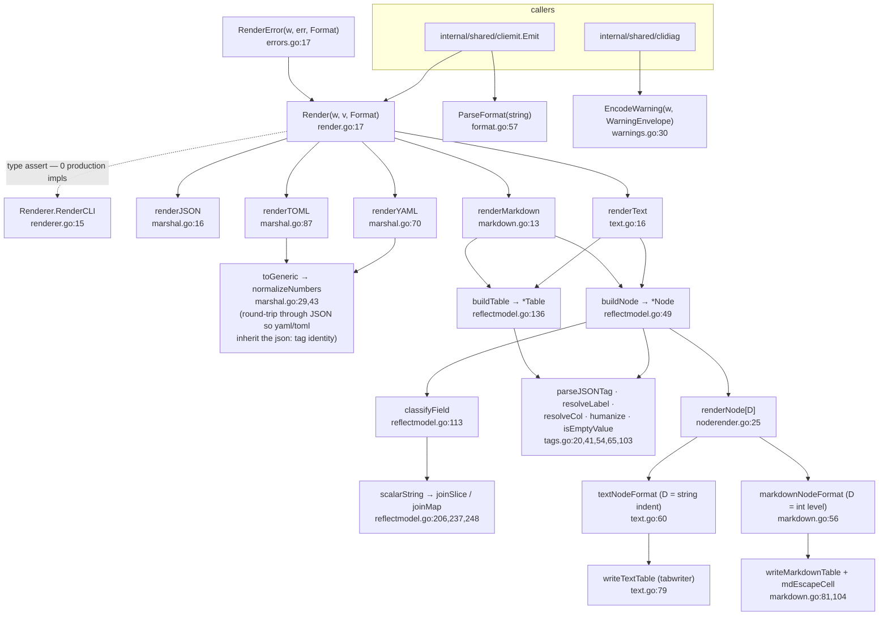

# `pkg/clifmt` — CLI output rendering

**What it is.** A leaf package that renders an arbitrary Go value to one of five encodings —
`json`, `yaml`, `toml`, `text`, `markdown` — so a first-party CLI command can hand over a result
struct and get correct output in every format without writing per-command rendering code.

**The contract it owns.** *Given a value and an already-parsed `Format`, write the rendered bytes.*
It has **no flag plumbing at all** — `internal/shared/cliemit` is the cobra glue that reads
`--format`, calls `ParseFormat`, and dispatches to `Render`. `internal/shared/clidiag` uses only
the warning envelope.

Six internal consumers: `cmd/harp`, `cmd/ltk`, `cmd/taskloom`, `internal/cli`,
`internal/shared/clidiag`, `internal/shared/cliemit`. `pkg/clifmt` is the **only** package under
`pkg/`, and there is no consumer outside the module.

---

## 1. Structure

**The design's best idea:** the generic `nodeFormat[D]` / `renderNode[D]` pair
(`noderender.go:12`, `:25`) is **one traversal with two instantiations** — text carries a string
indent as its depth type, markdown carries an int heading level. The blank-line rule and the
scalars→sections→tables ordering are written once.

**The second load-bearing trick:** `toGeneric` (`marshal.go:29`) round-trips through
`encoding/json` before handing off to yaml/toml, so all three structured formats inherit the same
`json:` tag identity rather than needing three sets of struct tags.

---

## 2. Surface

| Symbol | file:line | Notes |
|---|---|---|
| `Format` | `format.go:9` | String-kinded enum; constants at `:11-17`. Methods `Valid` (`:25`), `String` (`:34`), `Structured` (`:44`) |
| `Format.Structured` | `format.go:44` | json/yaml/toml vs text/markdown — used to gate the diagnostics channel (`internal/cli/root.go:118`, `cmd/taskloom/root.go:47`) |
| `ParseFormat` | `format.go:57` | Case/space-insensitive, with `yml`/`txt`/`md` aliases. Wraps `ErrUnsupportedFormat` and includes the offending input |
| `ErrUnsupportedFormat` | `format.go:22` | |
| `Render` | `render.go:17` | The public entry: `Renderer` hook, then a five-way dispatch. **12 production call sites repo-wide** |
| `RenderError` | `errors.go:17` | Wraps an error in `ErrorEnvelope` and delegates to `Render`. One caller: `internal/cli/root.go:187`, which discards the result |
| `ErrorEnvelope` | `errors.go:9` | `{Error string}` — the `{"error": "..."}` shape |
| `WarningEnvelope` | `warnings.go:14` | `{Prog, Warning}` — a JSON-Lines record. **The only type here with a genuine cross-package contract**: `clidiag` encodes it and `clidiag`'s tests decode it |
| `EncodeWarning` | `warnings.go:30` | One compact JSON object + newline. **Deliberately bypasses the whole `Format` machinery** (rationale at `warnings.go:19-29`) — a warning is a line on a stream, not a rendered document |
| `Renderer` | `renderer.go:14` | Escape-hatch interface (`RenderCLI`) a result type can implement to take over rendering for a subset of formats |
| `Node` / `ScalarField` / `SectionField` / `TableField` | `reflectmodel.go:15`,`:22`,`:28`,`:34` | The intermediate model text and markdown share: a struct's fields bucketed into scalar lines, nested sections, and tables. Written only by `buildNode`, read only by `renderNode` |
| `Table` | `reflectmodel.go:41` | `{Columns []string, Rows [][]string}` |
| `nodeFormat[D]` | `noderender.go:12` | The per-format vtable: `writeScalar`, `writeSectionHeading`, `writeTableHeading`, `writeTable`, `childDepth` |
| `fieldKind` | `reflectmodel.go:100` | The three-valued classification `classifyField` returns |
| `derefValue` / `derefType` | `reflectmodel.go:265`, `:275` | Unwrap pointers/interfaces; nil → an invalid `reflect.Value`, which is the whole nil-safety strategy |
| `implementsStringer` / `typeImplementsStringer` | `reflectmodel.go:284`, `:288` | |

### The tag convention

`json:"name,omitempty"` supplies the wire name and the omitempty rule (`parseJSONTag`,
`tags.go:20`); `label:"..."` overrides the human label, else the json name is humanized
(`resolveLabel`, `tags.go:41` → `humanize`, `:65`, which preserves acronym runs via `isAllUpper`,
`:85`); `col:"..."` overrides a table column header, else the label (`resolveCol`, `tags.go:54`).
`isEmptyValue` (`tags.go:103`) mirrors `encoding/json`'s omitempty semantics.

---

## 3. Invariants

**Hold, and are load-bearing:**

1. **One traversal serves text and markdown.** `renderNode[D]` (`noderender.go:25`) is the
   deduplication that justifies the package.
2. **yaml and toml inherit the `json:` tag identity** via `toGeneric` (`marshal.go:29`), so a
   struct needs one set of tags, not three.
3. **Map output is sorted.** `joinMap` (`reflectmodel.go:248`) sorts its `k=v` pairs — Go map order
   is random, and CLI output must be diffable.
4. **The reflective walker is nil-safe by construction.** `derefValue` maps nil to an invalid
   `reflect.Value` and every reader checks `IsValid`.
5. **`writeTextTable` returns `tw.Flush()`'s error** (`text.go:79`) rather than discarding it, and
   every `Fprintf` in `renderNode`, `writeMarkdownTable` and `renderMarkdown` is checked.
6. **Markdown heading depth is capped at 6** (`nextLevel`, `markdown.go:72`).
7. **Markdown table *cells* are pipe-escaped and newline-collapsed** (`mdEscapeCell`,
   `markdown.go:104`).
8. **`EncodeWarning` deliberately does not go through `Render`** — the JSON-Lines contract is
   independent of the caller's chosen format, which is correct: a warning must be parseable
   whether the command is emitting text or toml.
9. **`Render` wraps a custom-renderer error and wraps the sentinel for an unknown format**
   (`render.go:40`).

**Do not hold, or are narrower than documented:**

- **Four inputs render zero bytes and return nil**, and the set is format-dependent, so no
  exit-code or json-shaped test can see it:

  | Input | Format | Bytes | Error |
  |---|---|---|---|
  | all-`omitempty` struct, zero value | text | **0** | nil |
  | same | markdown | **0** | nil |
  | same | json | 3 (`{}`) | nil |
  | `[]string{}` | text | **0** | nil |
  | `[]struct{…}{}` | text | 5 (header row) | nil |
  | `nil` | toml | **0** | nil |
  | `nil` | json | 5 (`null`) | nil |

  Reachable in production: `cmd/harp/root.go:105` renders
  `names := make([]string, 0, max(opts.count, 0))`, so `harp --count 0` prints nothing and exits 0.
  Note the internal inconsistency — an empty **struct** slice *does* emit a header row, because
  `buildTable` derives columns from the element type (`reflectmodel.go:146`).
- **`RenderError(w, nil, f)` produces a well-formed *failure* report with an empty message**
  (`errors.go:19` leaves `msg == ""`), and `render_test.go:126-134` pins the output as
  `"Error: \n"`.
- **yaml and toml silently corrupt integers outside int64 range; json does not.**
  `normalizeNumbers` (`marshal.go:43-52`) drops `t.Int64()`'s error at `:46` and falls through to a
  lossy `t.Float64()` at `:49`. Measured: `uint64(18446744073709551615)` renders as
  `1.8446744073709552e+19` in yaml and correctly in json.
- **`implementsStringer` and `typeImplementsStringer` disagree.** The first tests value receivers
  only (`reflectmodel.go:284`), the second tests value **or pointer** (`:288`). A struct whose
  `String()` has a pointer receiver is classified as "stringable" for the table decision and then
  as "not stringable" for the actual stringification, so raw Go struct syntax (`{x y}`) leaks into
  user-facing output.
- **Markdown table *headers* are not escaped** (`markdown.go:82` vs `:95`), so a `col:"a|b"` tag
  emits a structurally broken table (3 header columns over a 1-column separator).
- **The five-format vocabulary is enumerated four independent times** — the const block
  (`format.go:11-17`), `Valid`'s switch (`:26`), `ParseFormat`'s switch (`:58`), and `Render`'s
  switch (`render.go:28`) — plus the literal `"(supported: json, yaml, toml, text, markdown)"`
  written out at `format.go:70`, `render.go:40`, **and** `cmd/ltk/check.go:75`. A format present in
  the first three but missing from `Render`'s switch would parse and validate fine and fail only
  at render time.
- **`Renderer` has no production implementation.** `rg 'RenderCLI'` returns five hits, all inside
  `pkg/clifmt`: the interface declaration, the assertion in `Render`, and two test fixtures. It
  costs a type assertion on every `Render` call.
- **`colInfo.omitempty` is populated (`reflectmodel.go:163`) and never read** — `buildTable` has no
  omitempty handling, unlike `buildNode` (`:75`), so the tag convention's omitempty silently does
  not apply to table columns.
- **`buildTable` drops `FieldByIndexErr`'s error with a bare `continue`** (`reflectmodel.go:176`),
  leaving a silently empty cell; its sibling at `buildNode:63-67` swallows the same error *with* a
  justifying comment (a nil embedded pointer along the path).
- **The `pkg/` placement has no consumer.** Every importer is inside module
  `github.com/ctxloom/ctxloom`, and seven exported identifiers — `Node`, `ScalarField`,
  `SectionField`, `TableField`, `Table`, `ErrorEnvelope`, `Renderer` — have **zero references
  outside this package**. No exported function accepts or returns the four `reflectmodel` types,
  so they are not even reachable through the public API.
- **The package doc points at documentation that does not exist** — `render.go:4` says "see the
  package README for the full tag convention and a worked example"; there is no README in
  `pkg/clifmt`.
- **Silently-ignored `--format` flags do not originate here.** `clifmt` receives an already-parsed
  `Format` and always renders; there are only 12 `Render`/`RenderError` call sites repo-wide, far
  fewer than the number of `--format`-bearing commands, so the broken commands simply never call
  it. The gap is at the cobra layer (`internal/shared/cliemit`, `internal/cli`), where
  `internal/cli/format.go:11-19` additionally documents a **fourth** format vocabulary — a
  text/json-only pair used by the streaming commands.
