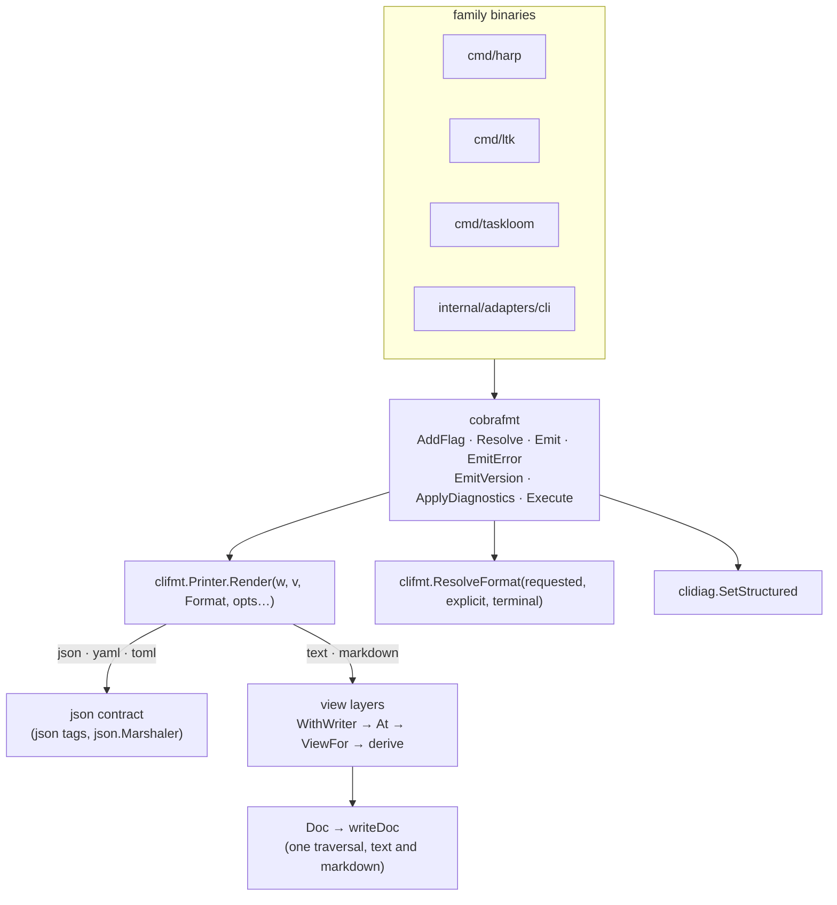

# `pkg/clifmt` — CLI output library

**What it is.** A library that renders a command's result for a CLI in one of five formats —
`json`, `yaml`, `toml`, `text`, `markdown` — from one data contract, so a command hands over a
value and gets correct output in every format without writing per-command rendering code.

It is three packages, importable from inside the ctxloom module and importing nothing of ctxloom:

| Package | Imports | Owns |
|---|---|---|
| `pkg/clifmt` | stdlib, yaml.v3, go-toml/v2 | rendering, the `Doc` view model and its options, the hint tag, `Map`, format resolution, exit status, error and warning envelopes |
| `pkg/clifmt/clidiag` | `pkg/clifmt` | the process-wide stderr warning channel (`<prog>: warning: <msg>`, or JSON Lines) |
| `pkg/clifmt/cobrafmt` | cobra, x/term, the two above | the cobra adapter: one `--format` flag on a tree, `Emit`, the process tail |

Status: **v0, unstable**, until the semantic-role work (taskloom `lively-revision`) lands. It
stays in the ctxloom module for now and moves to its own repository when an outside consumer
appears (owner ruling, 2026-10-07).

---

## 1. Structure


```mermaid
flowchart TD
    subgraph binaries[family binaries]
        H[cmd/harp]
        L[cmd/ltk]
        T[cmd/taskloom]
        C[internal/adapters/cli]
    end
    binaries --> CF["cobrafmt<br/>AddFlag · Resolve · Emit · EmitError<br/>EmitVersion · ApplyDiagnostics · Execute"]
    CF --> P["clifmt.Printer.Render(w, v, Format, opts…)"]
    CF --> RF["clifmt.ResolveFormat(requested, explicit, terminal)"]
    CF --> D["clidiag.SetStructured"]
    P -->|json · yaml · toml| M["json contract<br/>(json tags, json.Marshaler)"]
    P -->|text · markdown| V["view layers<br/>WithWriter → At → ViewFor → derive"]
    V --> DOC["Doc → writeDoc<br/>(one traversal, text and markdown)"]
```

**The design's best idea:** the human views are derived from the same contract that sets the
machine shape. `json` tags decide the field names for all three structured formats, and text and
markdown are built from those fields too, tuned by one hint tag. A command that needs something
else passes an option; it never forks the contract.

---

## 2. The input model

### 2.1 The contract

A result is a Go value, normally a struct or a slice of structs.

- **`json` tags set the machine shape** — names, `-`, `omitempty`, embedding — for json, yaml and
  toml alike (yaml and toml are produced by round-tripping through `encoding/json`).
- **A type customises its machine shape with stdlib `json.Marshaler`.** clifmt adds no machine-side
  override of its own.
- **Lists are `[]`, never `null`.** A nil slice anywhere in the value renders as an empty list, so
  a `jq` pipeline does not break on the empty case. There is no option to turn this off.

### 2.2 The hint tag

Display hints live in one namespaced tag. Bare `label:`/`col:` tags are not read, and a test-arch
gate fails on any left in production code.

```go
type SessionRow struct {
    Harp  string `json:"harp"  clifmt:"label=Harp,col=HARP,role=id"`
    Debug string `json:"debug" clifmt:"-"` // structured output only
}
```

| Key | Meaning |
|---|---|
| `label=` | heading or line label (default: the humanized json name) |
| `col=` | table column header (default: the label) |
| `role=id\|primary\|status\|detail` | semantic role. The grammar is reserved; no view acts on a role yet |
| `-` | hide the field from text and markdown; json, yaml and toml keep it |

A value may not contain `,` or `=`. **A malformed tag is a `Render` error** naming the type and
field, never ignored.

### 2.3 Dynamic data

Plain Go maps and slices are first-class. The one extra type is **`clifmt.Map`**, a string-keyed
map that keeps insertion order (`NewMap`, `Set`, `Get`, `Keys`, `Len`; it marshals as a JSON
object in insertion order). Use it where the order of dynamic keys means something.

How a value renders in text and markdown:

| Value | Renders as |
|---|---|
| struct | `Label: value` lines, then sections, then tables |
| map or `*Map` (field or top level) | a section, entries in key order: sorted for a Go map, insertion order for `*Map`. Keys render verbatim, never humanized |
| `[]struct` | a table |
| `[]map` / `[]*Map` whose elements share one key set of scalar values | a table |
| any other `[]map` | sections titled `[1]`, `[2]`, … |
| `[]scalar` | comma-joined on a field; one line per item at top level |
| a nested value inside a table cell | compact inline `k=v, k=v`, never Go syntax |
| a view that comes out empty (an all-omitempty struct, an empty map or scalar list, a view that hid everything) | `(none)` |

Block order within a node is always scalars, then sections, then tables.

### 2.4 Key order in structured output

json and **yaml** follow the contract's order: struct field order, and insertion order for `*Map`.
Plain Go maps are sorted. **toml is key-sorted** throughout — go-toml/v2 has no ordered generic
form — so toml cannot follow the contract's order.

---

## 3. Custom views

### 3.1 The `Doc` view model

Every human view is a `Doc`: an ordered list of sealed blocks.

```go
type Doc []Block
type Field   struct{ Label, Value string }                   // "Label: value" / "**Label:** value"
type Section struct{ Title string; Body Doc }                // heading + nested body
type Table   struct{ Title string; Columns []string; Rows [][]string }
type List    struct{ Title string; Items []string }
type Para    string                                          // verbatim line(s)
```

Derivation produces a `Doc`, and so does every custom view, so one function covers text **and**
markdown, can nest inside a derived parent, and can decorate the derived view.

### 3.2 Options

```go
func Render(w io.Writer, v any, f Format, opts ...Option) error
func New(opts ...Option) (*Printer, error)                       // options for every call
func (p *Printer) Render(w io.Writer, v any, f Format, opts ...Option) error

func WithWriter(f Format, fn func(w io.Writer) error) Option     // raw bytes for one format, per call
func At(path string, fn func(c *ViewCtx, v any) (Doc, error)) Option
func ViewFor[T any](fn func(c *ViewCtx, v T) (Doc, error)) Option
```

- **`WithWriter(f, fn)`** pre-empts everything for format `f` and has no derived view to decorate.
  It may target json, yaml or toml, per call only.
- **`At(path, fn)`** replaces or decorates one node. Paths are dotted json names, `[]` for any
  element, a map key as a segment, `""` for the root. **Paths are checked against the static type**
  before rendering, so a path naming no field is an error rather than a silently orphaned override.
- **`ViewFor[T](fn)`** applies wherever type `T` appears. Pointers and values match; interfaces do
  not.

Precedence, most specific first: `WithWriter` for the call's format, call-scope `At`, call-scope
`ViewFor`, `Printer`-scope `ViewFor`, then derivation. Inside a view, `c.Derived()` returns the next
lower layer's view of the node, so decorators chain and a replacement stops the chain. Returning
`nil` hides the node. Two registrations at the same layer for the same path or type are an
error, from `New` or `Render`.

**Views never touch structured output.** `At` and `ViewFor` apply to text and markdown only, so a
human-view override cannot drift the json contract.

---

## 4. Formats, exit status and errors (core, no cobra)

| Symbol | Contract |
|---|---|
| `ParseFormat(s)` | case- and space-insensitive, with `yml`/`txt`/`md` aliases; wraps `ErrUnsupportedFormat` |
| `SupportedFormats()` | the five formats, in help order |
| `ResolveFormat(requested, explicit, terminal)` | not explicit: text on a terminal, json otherwise. Explicit `""`: text. Else `ParseFormat` |
| `FormatUsage()` | the one `--format` help string, derived from `SupportedFormats` |
| `ExitCoder`, `ExitCodeOf(err)` | nil → 0; the first `ExitCode()` in the `%w` chain (joined errors included); else 1 |
| `ExitStatus{Code}` | an error meaning "exit with Code and report nothing" — a wrapped process's own status |
| `RenderError(w, err, f)` | `ErrorEnvelope` (`{"error": …, "remedy": …}`) in a structured format; `Error: <msg>` plus a `fix:` line in text |
| `Remedier`, `RemedyOf`, `FixLine` | read a fix off an error chain and print it as `fix: …` |
| `EncodeWarning(w, WarningEnvelope)` | one compact JSON object per line, whatever the command's format |

The core takes the terminal answer as a bool, so `golang.org/x/term` stays out of it. A test-arch
gate (`TestArch_ClifmtCoreDoesNotLinkCobra`) runs `go list -deps` on `pkg/clifmt` and
`pkg/clifmt/clidiag` and fails if cobra, pflag or x/term appears; while clifmt shares ctxloom's
`go.mod`, an outside importer still gets ctxloom's module graph.

---

## 5. The cobra adapter: `pkg/clifmt/cobrafmt`

| Function | Contract |
|---|---|
| `AddFlag(root)` | the persistent `--format`: empty default, usage `FormatUsage()`, completion from `SupportedFormats` |
| `Resolve(cmd)` | flag lookup (a set `--json` counts as `--format json`) → `ResolveFormat` against whether stdout is a terminal. A command with no `--format` reads as text; a `--format` of the wrong flag type is an error |
| `Explicit(cmd)` | whether the user actually asked for a format, as opposed to one derived from a pipe |
| `Emit(cmd, data, opts…)` | render `data` to `cmd.OutOrStdout()` in the resolved format, through the tree's `Printer` |
| `EmitError(w, cmd, err)` | `RenderError` in the resolved format, but **only when the format is explicit**; a derived format never restructures stderr |
| `EmitVersion(cmd, name, version)` | the `{name, version}` payload (`VersionInfo`); text prints the bare version |
| `ApplyDiagnostics(cmd)` | `clidiag.SetStructured` on for json/yaml/toml, off otherwise. Call from the root's `PersistentPreRun` |
| `Execute(root, prog, stderr) int` | run the tree and **return** the exit status (never `os.Exit`, so the caller can flush first). Reports nothing for nil or an `ExitStatus`; an envelope under an explicit structured format; otherwise `<prog>: <msg>` plus the fix line |
| `WithPrinter(root, p)` | the `Printer` `Emit` uses for this tree, carried on the root's context (install it after anything that replaces that context) |
| `OverrideTerminal(bool)` | test seam for the terminal check |

`clidiag`'s structured switch is process-wide state. `ApplyDiagnostics` is the one call that sets
it, so making it a per-tree value later changes only the adapter.

### Who uses what

- **harp, ltk, taskloom** use `AddFlag`, `ApplyDiagnostics` and `Execute`. Each runs
  `internal/testsupport/formatparity.Check` against its own root, so the flag help, completion,
  derived default, human error line and structured envelope cannot drift between them.
- **ctxloom** (`internal/adapters/cli`) uses `Resolve`, `Emit` (through its own `emit`, which turns
  a text closure into `WithWriter`) and `EmitError`, but still registers its own `--format`, sets
  diagnostics in its own `PersistentPreRun`, and runs its own process tail (`Error: <msg>`, with
  `ExitError`/`errorExitCode` choosing the status). Moving it onto `AddFlag`/`Execute` is pending:
  its tail runs a post-execution check (`dispatch`) that `Execute` cannot host.

`internal/shared/archlint`'s json-tags rule treats `cobrafmt.Emit`, `clifmt.Render` and
`(*clifmt.Printer).Render` as structured-output sinks: every struct reachable from their payload
must json-tag each exported field.

---

## 6. Invariants

1. **One traversal serves text and markdown.** Both formats derive the same `Doc` and write it with
   one generic walker.
2. **json, yaml and toml share the json contract**, so a struct needs one set of tags.
3. **Human views never alter structured output.**
4. **An empty result never writes zero bytes** in text, markdown or toml: an empty view renders
   `(none)` (`# (none)` in toml), so "nothing to show" is distinguishable from "nothing was
   written".
5. **yaml is two-space indented**, nested maps and sequences alike; yaml.v3 defaults to four.
6. **Markdown heading depth caps at 6**, and table cells are pipe-escaped and newline-collapsed.
7. **A malformed hint tag, an unknown `At` path and a duplicate registration are errors**, never
   silently ignored.
8. **`EncodeWarning` does not go through `Render`**: a warning must be parseable whatever format the
   command is emitting.
