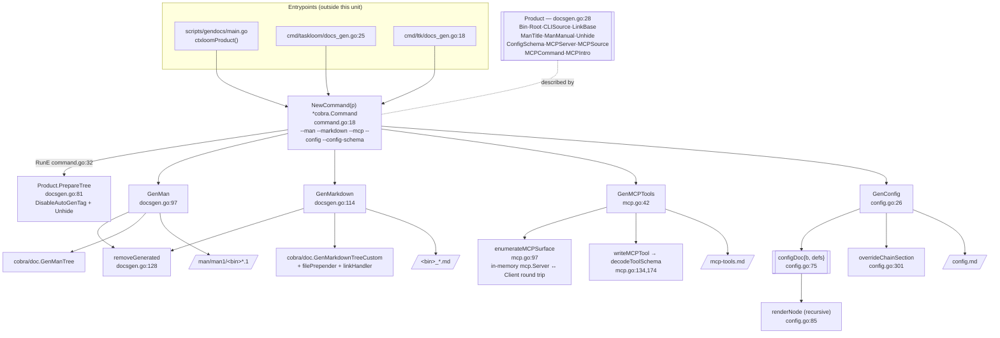

# `internal/docsgen` — reference-documentation generator

**What it is.** A leaf package (zero internal dependencies) that renders a product's reference
documentation — man pages, per-command Starlight markdown, an MCP tool/resource page, and a
configuration page — **deterministically from that product's own sources of truth**: its live
cobra tree, its live MCP registrations, and its tracked JSON Schema.

**The contract it owns.** *One `Product` struct in, four artifact families out, byte-identical on
every run.* Determinism is load-bearing: CI gates the output with `just gen-docs-check`
(regenerate + `git diff --exit-code` + untracked-file check, `.github/workflows/ci.yml:181`).

Three binaries share it. `scripts/gendocs` builds ctxloom's `Product` (its cobra tree is
importable); `cmd/taskloom` and `cmd/ltk` mount `NewCommand` as a **hidden `gendocs` subcommand
compiled only under `-tags docsgen`**, so cobra/doc never ships in the release binaries. All
output lands under `website/src/content/docs` and `man/man1`.

---

## 1. Structure

**Why the MCP page needs a round trip.** `enumerateMCPSurface` (`mcp.go:97`) stands up an
**in-memory server↔client pair** over the product's real `*mcp.Server` and calls `ListTools`,
`ListResources`, `ListResourceTemplates`, then sorts each. So the page documents the tools the
product actually registers, not a hand-maintained list.

---

## 2. Types

| Symbol | file:line | Notes |
|---|---|---|
| `Product` | `docsgen.go:28` | The whole public input contract. `Bin` is the shared spine (read by `envPrefix`, both sweeps, `GenConfig`'s `dotDir`, `mcpFrontmatter`, and every success line); `{Root, Unhide}` serve `PrepareTree`; `{CLISource, LinkBase}` serve the two cobra handlers; `{MCPSource, MCPCommand}` serve `mcpFrontmatter`; `ConfigSchema` is read only by `NewCommand`, as the `--config-schema` **default** — `GenConfig` takes the path as a parameter |
| `configDoc` | `config.go:75` | `{b strings.Builder, defs map[string]any}` — the accumulator threaded through the `renderNode` recursion. `defs` is read only in `GenConfig`'s own body (`config.go:58-68`); `renderNode` never dereferences it |
| `mcpToolProperty` | `mcp.go:19` | `{Type any, Description string, Items *mcpToolProperty, Enum []any}`. `Type` is deliberately `any` — the SDK reflector emits nullable arrays like `["null","array"]`, normalized by `schemaTypeName` (`mcp.go:205`) |
| `mcpToolSchema` | `mcp.go:31` | `{Properties map[string]mcpToolProperty, Required []string}` |

---

## 3. Functions

| Symbol | file:line | Notes |
|---|---|---|
| `NewCommand` | `command.go:18` | Builds the shared hidden `gendocs` command. Its RunE requires **at least one destination flag** (`:33`) and rejects `--config` without `--config-schema` (`:59`) |
| `Product.PrepareTree` | `docsgen.go:81` | Recursively sets `DisableAutoGenTag` and unhides top-level commands named in `Unhide`. **Determinism depends on this** — cobra's auto-gen tag embeds a date |
| `GenMan` / `GenMarkdown` | `docsgen.go:97`, `:114` | MkdirAll → sweep stale pages → generate |
| `removeGenerated` | `docsgen.go:128` | Globs `dir/pattern` and removes each hit — the only defence against stale pages for renamed or deleted commands |
| `Product.filePrepender` | `docsgen.go:146` | Starlight frontmatter + generated-file banner; recovers the page title from the filename by undoing cobra's space→`_` substitution |
| `Product.linkHandler` | `docsgen.go:163` | `LinkBase + trimExt(name) + "/"` |
| `Product.envPrefix` | `docsgen.go:73` | `strings.ToUpper(p.Bin) + "_CONFIG_"` |
| `GenConfig` | `config.go:26` | Reads + parses the JSON Schema, writes `<dir>/config.md`: frontmatter, title, config-path prose, override-chain section, top-level fields, then each `$def` |
| `configDoc.renderNode` | `config.go:85` | Renders one schema node: heading, description, then anyOf/oneOf branches **or** a Field/Type/Description table, recursing into expandable properties |
| `typeOf` | `config.go:137` | Renders a node's type as a human string: `$ref`, const, anyOf, `elem[]`, `map → X`, scalar |
| `describe` | `config.go:197` | Concatenates description + const + enum + examples + default into one table cell |
| `expandableChild` | `config.go:220` | Decides whether a property gets its own recursive section |
| `objectBranches` / `branchTitle` | `config.go:255`, `:279` | anyOf/oneOf branches carrying a `properties` block; `title` → `type` → `option N`. The positional fallback is what keeps headings unique and deterministic |
| `overrideChainSection` / `pickScalarExampleField` | `config.go:301`, `:331` | The fixed cross-cutting prose on override precedence and env/`--config-set` naming, plus one schema-derived concrete example (alphabetically first top-level scalar) |
| `refName` / `clampLevel` / `joinPath` / `objectMap` / `toSlice` / `stringSet` / `backticked` | `config.go:371`,`:375`,`:382`,`:390`,`:395`,`:401`,`:412` | Schema-walking helpers. `objectMap`/`toSlice` discard the comma-ok deliberately — a non-object yields nil, which every caller handles, and that is what makes the whole walker nil-safe |
| `GenMCPTools` | `mcp.go:42` | Requires a non-nil `MCPServer` (`:43`), enumerates, writes Tools + optional Resources/Templates sections |
| `enumerateMCPSurface` | `mcp.go:97` | The in-memory round trip |
| `writeMCPTool` / `decodeToolSchema` | `mcp.go:134`, `:174` | One tool → heading, description, parameter table. `decodeToolSchema` re-marshals the `any` InputSchema through JSON |
| `propertyType` / `schemaTypeName` / `propertyDescription` | `mcp.go:189`,`:205`,`:221` | |
| `Product.mcpFrontmatter` / `configFrontmatter` | `mcp.go:240`, `config.go:358` | Starlight frontmatter + a banner naming the exact source the page was generated from |
| `mdCell` | `mcp.go:255` | Escapes `\|` and collapses `\n` so a string is safe in a markdown table cell. Defined in `mcp.go`, also called from `config.go:122` |

---

## 4. Invariants

**Hold, and are load-bearing:**

1. **Output is deterministic.** `PrepareTree` strips cobra's date-stamped auto-gen tag; all three
   MCP listings are sorted; `branchTitle`'s `option N` fallback makes anyOf headings stable.
   Without this the CI diff gate could not exist.
2. **Every generated page carries a banner naming its source** — `filePrepender` names
   `CLISource`, `configFrontmatter` names the exact schema path, `mcpFrontmatter` names
   `MCPSource` + `MCPCommand`.
3. **The MCP page is generated from the *live* server**, not a list — `cmd/taskloom/docs_gen.go`
   feeds it the same `newMCPServer()` the runtime serves.
4. **The generator is not in the shipped binaries.** The `docsgen`/`!docsgen` build-tag pair
   (`cmd/taskloom/docs_gen.go` + `docs_off.go`; `cmd/ltk/docs_gen.go` + `docs_off.go`) is why
   `newRootCmd` is a factory rather than a package var.
5. **`GenMCPTools` fails loud on a nil `MCPServer`** (`mcp.go:43`) — and `cmd/ltk` correctly
   supplies none, so ltk takes that path deliberately.
6. **`GenConfig` fails loud on a missing, unreadable, or unparseable schema**
   (`config.go:33`, `:37`), both errors wrapped with context.
7. **Sweep-then-generate keeps the docs tree free of pages for deleted commands**
   (`removeGenerated`, `docsgen.go:128`).
8. **The whole schema walker is nil-safe by construction** — `objectMap`/`toSlice` coerce-or-nil,
   and every caller handles nil.

**Do not hold, or are narrower than documented:**

- **A valid-but-empty schema yields a fieldless page with a nil error.** `renderNode` emits the
  `## Top-Level Fields` heading at `config.go:86` and then returns at `:103-105` when
  `len(props) == 0`; `GenConfig` returns `os.WriteFile`'s nil and `NewCommand` prints
  `"<bin> config reference generated in <dir>"`. `json.Unmarshal` also accepts a bare `null`,
  leaving `root == nil` — every subsequent map read on a nil map is legal Go, so nothing panics.
- **A server with zero registered tools yields an empty `## Tools` section.** `mcp.go:63-66`
  writes the heading unconditionally then ranges over a possibly-empty slice — contrast `:68` and
  `:79`, where Resources and Templates *are* guarded by `len(...) > 0`.
- **`decodeToolSchema` swallows both JSON errors** — marshal failure returns a zero value
  (`mcp.go:180-182`), unmarshal failure is discarded with `_ =` (`:183`). `writeMCPTool` then
  prints `_No parameters._` (`:141`), so a tool with ten required parameters can be published as
  taking none.
- **Sweep runs before generate, with no post-condition on what was written.** A generator error
  after `removeGenerated` leaves the docs tree emptied; a tree that regressed to all-hidden sweeps
  N pages and regenerates 1, reporting success. The `gen-docs-check` diff catches this in CI for
  already-committed pages.
- **`envPrefix` and `dotDir` *reconstruct* values the products already declare.**
  `docsgen.go:74` derives `TASKLOOM_CONFIG_`/`CTXLOOM_CONFIG_` from `Bin`, although
  `internal/taskloom/config.EnvPrefix` (`config.go:64`) and `internal/config`'s literal
  (`config.go:506`) exist; `config.go:46` re-derives the config dir name the same way. The
  entrypoints already thread `ConfigSchema: taskloomconfig.SchemaPath`, so field-threading is the
  established pattern here.
- **`GenConfig`'s comment claims the root schema's own description is suppressed**
  (`config.go:53-54`) — `renderNode:88` renders it unconditionally, and it appears in the
  published page. *(Documented behaviour is not implemented; the description is shown.)*
- **`enumerateMCPSurface` reads exactly one page of each listing** and ignores `NextCursor`
  (`mcp.go:109-120`). Latent: the SDK default page size is 1000 against ~13 registered tools. The
  SDK's paginating iterators (`cs.Tools`/`Resources`/`ResourceTemplates`) exist and are unused.
- **No `Product` validation exists** beyond the nil-`MCPServer` check, so an unset `MCPSource`,
  `MCPCommand` or `CLISource` interpolates as an empty string into the banner, and a schema with
  no top-level scalar makes `overrideChainSection`'s worked example vanish silently.
- **The man sweep pattern is a prefix glob.** `removeGenerated(dir, p.Bin+"*.1")`
  (`docsgen.go:101`) against a shared `man/man1` would sweep another product's pages if one `Bin`
  were a prefix of another; the markdown sweep uses the safer `p.Bin+"_*.md"` (`:118`). Today's
  three bins do not collide.
- **`describe` formats `const` and `default` with `%v`**, so a non-scalar default renders in Go
  syntax (`map[a:1]`, `[x y]`) rather than the YAML/JSON a reader would type.
- **`mdCell` collapses `\n` but not `\r`**, and is not applied to table *headers* in the config
  page path.
