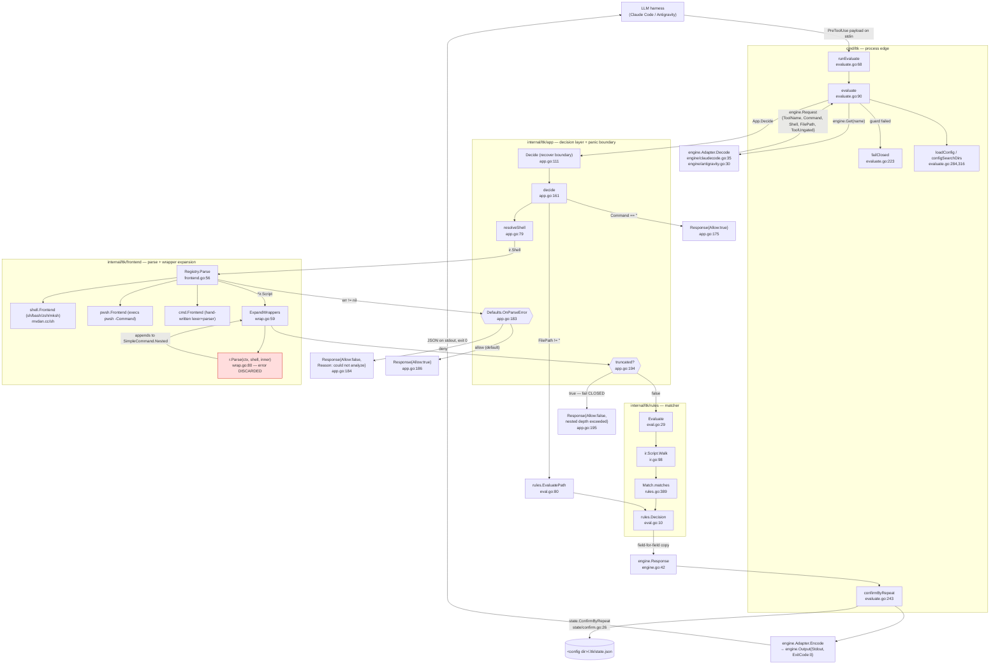
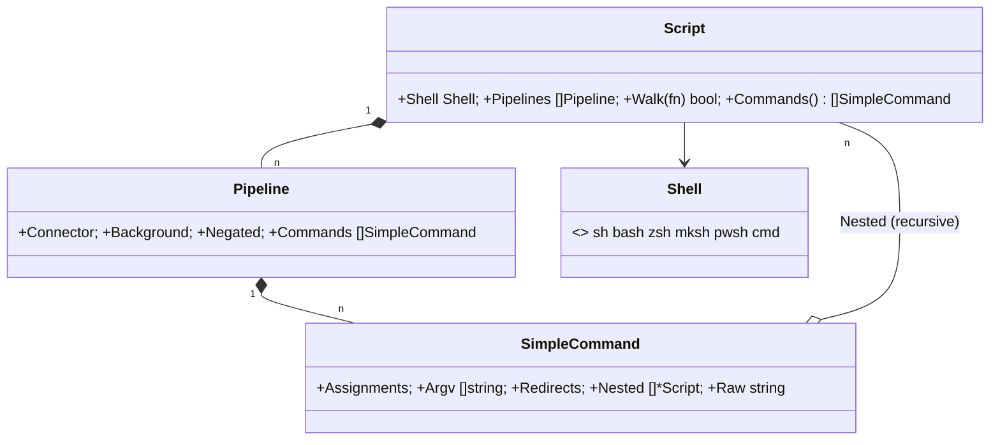

# `ltk` — the command guard

**What it is.** `ltk` is a standalone binary (`cmd/ltk`) that an LLM harness runs as a
**PreToolUse hook**: the harness hands it a tool-call payload on stdin, `ltk` parses the
command into a shell-agnostic IR, matches it against a YAML rule file, and writes back an
allow-or-deny decision in the harness's own wire format.

**The contract it owns.** *Given a tool-call payload and a rules config, emit a decision
document the host understands, and never exit non-zero on the hook path.* It is a
**cooperative redirect, not a sandbox** — the harness is free to ignore the decision, and
`ltk` never blocks a syscall. The failure that matters is therefore not "escaped the jail"
but **"a deny rule the operator wrote did not fire"**.

`ltk` builds and ships independently of ctxloom (it has its own `loadout.yaml` bundle that
ctxloom's companion discovery execs via `ltk loadout --format json`), and `cmd/taskloom`
reuses its `internal/ltk/engine` install machinery.

---

## 1. The decision pipeline



**Read the diagram this way:** every path terminates in an `engine.Response`, and the only
things that reach the host are `Output.Stdout` bytes and exit code 0. An *allow* is encoded
as **zero bytes** (`claudecode.go:78-80`, `antigravity.go:59-61`), so allow-because-clean and
allow-because-unanalyzed are byte-identical on the wire.

---

## 2. Package inventory

| Package | Role | Key entry points |
|---|---|---|
| `cmd/ltk` | Cobra frontend; owns config **discovery** policy and the "a broken ltk must not exit non-zero" policy | `evaluate`, `check`, `manage install\|uninstall`, `version`, `loadout` |
| `internal/ltk/app` | Composition root + decision layer + **panic recover boundary**; the only applier of `on_parse_error` | `New` (`app.go:59`), `Decide` (`app.go:111`) |
| `internal/ltk/engine` | Engine-neutral `Request`/`Response`/`Output` vocabulary; the two hook-host adapters and their settings-file managers | `Get` (`engine.go:136`), `Detect` (`engine.go:151`) |
| `internal/ltk/frontend` | `Frontend` interface, shell→frontend `Registry`, and the wrapper-expansion pass | `Registry.Parse` (`frontend.go:56`), `ExpandWrappers` (`wrap.go:59`) |
| `internal/ltk/frontend/shell` | POSIX family (sh/bash/zsh/mksh) via `mvdan.cc/sh/v3`; expands words against a best-effort env | `New` (`shell.go:41`), `Parse` (`shell.go:75`) |
| `internal/ltk/frontend/pwsh` | PowerShell, by **shelling out to PowerShell's own parser** (parse-only, never execute) | `New` (`pwsh.go:64`), `Parse` (`pwsh.go:72`) |
| `internal/ltk/frontend/cmd` | `cmd.exe`, hand-written lexer + recursive-descent parser (no third-party cmd AST exists) | `New` (`cmd.go:29`), `Parse` (`cmd.go:35`) |
| `internal/ltk/ir` | The Command-Graph IR every frontend lowers into, plus the `Shell` dialect enum | `Script.Walk` (`ir.go:98`), `Shell.Valid` (`ir.go:32`) |
| `internal/ltk/rules` | The rule *language*: YAML schema, loader/validator, and the pure matcher | `Load` (`rules.go:588`), `Evaluate` (`eval.go:29`), `EvaluatePath` (`eval.go:80`) |
| `internal/ltk/state` | Confirm-by-repeat token store (`state.json`) + the policy that drives it | `ConfirmByRepeat` (`confirm.go:26`) |
| `internal/ltk/scm` | Reads `.gitmodules` so `path: ["@submodules"]` can be expanded | `SubmodulePaths` (`submodules.go:23`) |
| `internal/ltk/shellenv` | Maps a shell executable **basename** → `ir.Shell` dialect | `ShellFromPath` (`shellenv.go:15`), `FromEnv` (`shellenv.go:38`) |
| `internal/ltk/tools/extract-defaults` | Build-time generator: `docs/ltk/DEFAULTS.md` fenced blocks → `cmd/ltk/sample.ltk.yaml` | `assemble` (`main.go:35`) |

Dependency direction is strictly inward: `cmd/ltk` → `app` → {`frontend`, `rules`, `engine`}
→ `ir`. `ir` is a leaf (zero internal imports, 9 internal importers). Nothing in `internal/ltk`
imports `cmd/ltk`.

---

## 3. THE DECISION MODEL — read this before changing anything

This is the subtlest contract in the subsystem and it has been misread twice during review.
There are **three** places where "ltk could not analyze this" can arise, and they are handled
three different ways.

### 3.1 Top-level parse failure — policy applies

`app.decide` calls `Registry.Parse` once at `app.go:179`. If that returns a non-nil error,
`app.go:180-187` applies `Defaults.OnParseError`:

```go
script, err := a.Registry.Parse(ctx, shell, command)   // app.go:179
if err != nil {
    if a.Config.Defaults.OnParseError == rules.ActionDeny {   // app.go:183
        return engine.Response{Allow: false, Reason: "could not analyze command (" + err.Error() + ")"}  // :184
    }
    return engine.Response{Allow: true}                        // :186
}
```

The **default is allow**, set during config normalization:
`internal/ltk/rules/rules.go:597-598` — `if c.Defaults.OnParseError == "" { c.Defaults.OnParseError = ActionAllow }`.
So on a default config a top-level parse failure is *silently allowed*: `Response{Allow:true, Reason:""}`,
which `Encode` turns into zero bytes.

**`app.decide` is the only place in ltk that reads `Defaults.OnParseError`** (plus
`denyOnUnanalyzable`, `app.go:150`, for the panic path). No other layer applies the policy.

### 3.2 Depth truncation — fails CLOSED, unconditionally

`ExpandWrappers` reports depth-cap truncation through a dedicated return value, and
`app.decide` denies on it *regardless of `on_parse_error`*:

```go
if truncated := a.Registry.ExpandWrappers(ctx, script); truncated {   // app.go:194
    return engine.Response{Allow: false, Reason: "nested command-wrapper depth exceeded (possible evasion)"}  // :195
}
```

`maxWrapDepth = 8` (`wrap.go:21`); the truncation is raised at `wrap.go:67-69`. Note the
counter descends into *every* `SimpleCommand.Nested` entry, which per `ir.go:63` includes
`$(...)`, backticks, `<(...)` and `( … )` subshells — not only wrapper bodies. So a benign
8-deep command substitution is denied with the reason "possible evasion".

### 3.3 Nested parse failure — NO policy applies, and none can

**This is the asymmetry.** `ExpandWrappers` is declared

```go
func (r *Registry) ExpandWrappers(ctx context.Context, s *ir.Script) (truncated bool)  // wrap.go:59
```

— a **single-channel `bool` for a two-failure-mode operation**. It has a way to say "I stopped
looking" (depth) and **no way to say "I could not parse what I found"**. The inner re-parse at
`wrap.go:80` discards its error outright:

```go
if nested, _ := r.Parse(ctx, shell, inner); nested != nil {   // wrap.go:80
    sc.Nested = append(sc.Nested, nested)
}
```

The consequence is mechanical, and it is the single most important thing to understand about
this subsystem:

1. On a parse error every frontend returns a **non-nil but wholly empty** `*ir.Script` —
   `shell/shell.go:78,85`, `pwsh/pwsh.go:75` (`cmd/cmd.go:35` never errors at all). No shipped
   frontend has ever salvaged a partial script, so `frontend.go:24-26`'s stated rationale
   ("callers can still match the commands it did recover") describes behaviour that does not exist.
2. `nested != nil` is therefore true; an empty `Script` is appended to `Nested`.
3. `rules.Evaluate`'s `script.Walk` (`ir.go:98`) visits zero commands inside it; `denied` stays
   false; `eval.go` returns `Decision{Allowed: true}`.
4. `app.decide` sees no error, no `truncated`, and a clean allow.

So: **a nested/wrapped command whose inner text fails to parse is never evaluated, and no
policy applies to it.** `on_parse_error: deny` does not reach it. `bash -c '<syntax error>'`
is indistinguishable from `bash -c 'true'`, and `bash -c 'go test; if'` is allowed while both
`go test; if` and `bash -c 'go test'` are denied.

Two further shapes of the same hole:

- **`cmd.Frontend.Parse` never returns an error at all** (`cmd.go:35-39`, single `return …, nil`),
  so `on_parse_error` is structurally unreachable for `ir.ShellCmd` even at the *top* level.
- **A missing frontend degrades to allow.** `Registry.Parse` returns `ErrUnsupportedShell`
  (`frontend.go:56-60`), which `app.go:183-186` routes through `on_parse_error` (default allow);
  in the nested path `nested` is nil, nothing is appended, and no error surfaces anywhere.
  `Registry.Supports` (`frontend.go:49`) exists and could assert coverage — it has **zero call
  sites repo-wide**; `cmd/ltk/evaluate.go:106` guards the same failure with `ir.Shell.Valid()`,
  an enum-membership test that passes for any `KnownShells` entry with no registered frontend.

### 3.4 Panic — routes through the same knob, warns to a channel nobody reads

`App.Decide` (`app.go:111`) is the recover boundary. `onAnalysisPanic` (`app.go:132`) formats a
warning to `App.Warn` and returns allow-or-deny per `denyOnUnanalyzable()` (`app.go:150`), i.e.
`on_parse_error` again. `App.Warn` is set only by `New` to `os.Stderr` (`app.go:64`); on a hook
exit 0 — which is *every* outcome `cmd/ltk/evaluate.go` produces — that stderr reaches only the
harness debug log. The field's own 20-line comment (`app.go:41-54`) states the conclusion.

### 3.5 Why the type system cannot express it

`engine.Response` (`engine.go:42-53`) is `{Allow, Reason, Suggest, Confirmable,
ConfirmWindowSeconds, ConfirmDelaySeconds}` — **no third state**. `rules.Decision`
(`eval.go:10-23`) likewise. `ir.Script` (`ir.go:45-48`) is `{Shell, Pipelines}` — no
`Partial`/`Unanalyzed` flag. So `app.decide` *must* collapse four distinct outcomes onto
`Allow: true`: no rule matched (`app.go:199-206`), nothing to check (`:175`), could not parse
under an allow policy (`:186`), and ltk panicked (`:147`).

Half the missing wire already exists: **`engine.Output.Stderr` is read at
`cmd/ltk/evaluate.go:78` and written by no production code anywhere** (all nine `Output{…}`
literals in the repo set only `Stdout`/`ExitCode:0`). `engine.Response` appears nowhere outside
the ltk subtree, so it can be widened freely.

---

## 4. The IR and the matcher



**What the matcher actually reads.** `Match.matches` (`rules.go:389`) and `matchCommand`
(`rules.go:428`) read `c.Argv` and `c.Args()` **and nothing else**. Of `SimpleCommand`'s five
fields, only `Argv` and `Nested` are load-bearing in production: `Assignments` is read once at
`shell.go:297` inside the frontend that wrote it, `Redirects` is read only by tests, and `Raw`
has **zero readers anywhere** including tests (written at `shell.go:179,293`; `cmd` and `pwsh`
never set it). `Pipeline.{Connector, Background, Negated}` likewise have no production reader.

**Rule shape.** `Config{Version, Defaults, Rules}` (`rules.go:32`); `Rule{ID, Match, Action,
Message, Suggest, Mode, WindowSeconds, DelaySeconds}` (`rules.go:78`). `Match` (`rules.go:170`)
carries **two disjoint condition languages**: `{Command, ArgsAny, ArgsAll, Unless, Shells}` for
command rules and `{Path}` for file-edit rules. `mixesCommandAndPath` (`rules.go:302`) exists
solely to reject a rule carrying both, and both evaluators re-guard it (`eval.go:42`, `:86`).

**Operator semantics** (`matchCommand`, `rules.go:428-449`): program matches by exact string or
`path.Base`; option-set tokens are matched as a set; operand tokens use **ordered subsequence**
for a deny rule (`isSubsequence`, `rules.go:479`) and **position-anchored prefix** for an allow
rule (`isPrefix`, `rules.go:499`). `expandShortClusters` (`rules.go:540`) expands POSIX bundled
short options so `-rf` also matches `-r`/`-f`.

**Rule ordering.** `Evaluate` (`eval.go:29`) loops *commands* outer, *rules* inner, returning on
the first deny — so an earlier command matching a later rule beats a later command matching an
earlier rule. The doc comment at `eval.go:25-28` says "the first matching deny rule wins", which
describes rule order; the implemented contract is "the first (command, rule) pair in walk order
wins". *(Documented behaviour differs from real behaviour; the real behaviour is as stated here.)*

---

## 5. The engine boundary

```mermaid
classDiagram
    class Adapter { <<interface>> +Name() string; +Decode([]byte) (Request, error); +Encode(Response) (Output, error) }
    class Engine { <<interface>> Adapter + Detect(dir) int; +SettingsPath(dir, global); +HookCommand(bin, cfg); +Install(...); +Uninstall(...) }
    class Request { +ToolName; +Command; +Shell ir.Shell; +FilePath; +ToolUngated bool }
    class Response { +Allow bool; +Reason; +Suggest; +Confirmable; +ConfirmWindowSeconds; +ConfirmDelaySeconds; +Message() string }
    class Output { +Stdout []byte; +Stderr []byte «never written»; +ExitCode int «always 0» }
    Engine --|> Adapter
    Adapter ..> Request
    Adapter ..> Response
    Adapter ..> Output
    class ClaudeCode { «struct{}» }
    class Antigravity { «struct{}» }
    ClaudeCode ..|> Engine
    Antigravity ..|> Engine
```

| Symbol | file:line | Notes |
|---|---|---|
| `Request` | `engine/engine.go:17` | `Command` **xor** `FilePath` (documented `:18-19`, unenforced). `ToolUngated` marks a tool the adapter matched but cannot read — the one deliberate fail-closed exception (`cmd/ltk/evaluate.go:146`) |
| `Response` | `engine/engine.go:42` | `{Allow, Reason, Suggest}` is the wire decision; `{Confirmable, ConfirmWindowSeconds, ConfirmDelaySeconds}` is a policy triple that **no `Encode` reads** — it is consumed by `cmd/ltk/evaluate.go:158-167` before encoding |
| `Response.Message()` | `engine/engine.go:56` | Three-way join of `Reason`+`Suggest`; returns `""` when both are empty, and `EncodeDeny("")` still emits a well-formed deny |
| `Output` | `engine/engine.go:75` | Protocol is "deny → JSON on Stdout, ExitCode 0; allow → empty". `Stderr` is read but never written; `ExitCode` is only ever literal 0 |
| `Get` / `Detect` | `engine/engine.go:136`, `:151` | `Get` resolves aliases (`engineAliases`, `:126`) and refuses prefix matching — a typo must error. `Detect` scores each engine and takes the highest with strict `>`, so a tie goes to whoever is first in `engines()` (`:121`), which is `ClaudeCode` |
| `ClaudeCode` | `engine/claudecode.go:26` | `.claude/` dir → score 2. `Decode` falls back `file_path`→`notebook_path` (`:40-46`). `HookCommand` = `bin + " evaluate"` (+`--config <quoted>`), `:157` |
| `Antigravity` | `engine/antigravity.go:24` | `.agents/hooks.json` file → 2, bare `.agents/` dir → 1. `SettingsPath(global)` **refuses** (`errAntigravityNoGlobal`, `:114`). `HookCommand` rebases a relative config to `../` because agy runs hooks with cwd `.agents` (`:125`) |

The shared hooks.json machinery (`mergePreToolUseHook` `claudecode.go:218`,
`removePreToolUseHook` `:258`, `decodeSettings` `:331`, `childMap` `:341`, `childSlice` `:354`,
`quotePathIfNeeded` `:173`) lives in `claudecode.go` but is called from `antigravity.go` and from
`cmd/taskloom/manage.go`.

---

## 6. `cmd/ltk` — the process edge

| Symbol | file:line | Notes |
|---|---|---|
| `newRootCmd` | `main.go:31` | Builds the tree; registers a **persistent** `--format` |
| `main` | `main.go:60` | On error prints `ltk: <err>` and `os.Exit(1)` |
| `runEvaluate` | `evaluate.go:68` | Reads stdin → `evaluate` → writes streams → `os.Exit(out.ExitCode)`. Uses `os.Exit` rather than `return` deliberately, so a decision is never reinterpreted as a cobra error |
| `evaluate` | `evaluate.go:90` | The whole decision path: engine → shell → config → submodules → payload → ungated-tool check → `app.Decide` → confirm-by-repeat → encode. Six deliberate fail-closed branches, each commented with why |
| `failClosed` | `evaluate.go:223` | Encodes `reason` as a well-formed deny with **exit 0**. Its doc asserts "a broken ltk installation must never surface as an error exit on the hook path" |
| `loadConfig` | `evaluate.go:284` | Explicit `--config` path, else the nearest of the five names in `configSearch` (`evaluate.go:27`) walking cwd + ancestors, else a built-in allow-all config |
| `configSearchDirs` | `evaluate.go:316` | cwd + ancestors, stopping at a `.git` **directory** (a gitfile does not stop the walk — worktrees keep searching upward) |
| `statePath` | `evaluate.go:264` | Anchors `state.json` to a `.ltk/` beside the **resolved** config |
| `confirmByRepeat` | `evaluate.go:243` | Injects `time.Now()` + `afero.NewOsFs()` into `state.ConfirmByRepeat` |
| `checkResult` | `check.go:26` | `{decision, message, suggestion}` — discrete fields, so a GUI never re-splits `Response.Message()` |
| `runCheck` | `check.go:73` | Fails **loud** (exit 1) by design, unlike the hook path |
| `manageFlags` | `manage.go:25` | Shared flag bundle for install/uninstall; `resolve` (`:48`) picks engine + settings path |
| `scaffoldConfig` / `writeFile` | `manage.go:167`, `:219` | `--force` backs up to `.bak` first; `writeFile` is `MkdirAll` + `iox.WriteFileAtomic` |
| `newLoadoutCmd` | `loadout.go:39` | `companionloadout.NewCommand` over the embedded `loadout.yaml` + `.sig` — this is ctxloom's companion-discovery entry point |
| `registerDocsCmd` | `docs_gen.go:18` / `docs_off.go:10` | Build-tag pair; `internal/docsgen` is mounted only under `-tags docsgen` |

**`--format` has two vocabularies on one tree.** Root registers a persistent
`--format {json,yaml,toml,text,markdown}` default `text` (`main.go:53`); `companionloadout`
registers a **local** `--format {yaml,json}` default `yaml`. pflag's `AddFlagSet` skips names
already present and cobra merges the parent set second, so the local flag wins:
`ltk --format markdown loadout` errors. `evaluate` and `manage` accept `--format` and ignore it.

---

## 7. Frontends

| Frontend | Strategy | Parse-error return |
|---|---|---|
| `shell` (`shell.go:75`) | Walks `mvdan.cc/sh/v3`'s AST, expands words against an env snapshotted at `New` time (`shell.go:41`), flattens control flow so every program a line could run is visible. Captures `$(…)`/`<(…)` into `Nested`. A `recover` (`shell.go:76-81`) converts any panic in the third-party expander into a parse error | `(&ir.Script{Shell: shell}, err)` — non-nil, **zero pipelines** |
| `pwsh` (`pwsh.go:72`) | Execs `pwsh`/`powershell` (memoized `resolveBin`, `pwsh.go:134`) running an embedded `parseScript` (`pwsh.go:38`) that calls `Parser::ParseInput` and emits JSON. Source rides in via `LTK_SRC` env, 5s timeout. `lower` (`pwsh.go:105`) returns salvaged commands **plus** an error on `hasErrors` | `(&ir.Script{Shell: shell}, err)` on run failure; `ErrUnavailable` (`pwsh.go:30`) when no PowerShell is on PATH |
| `cmd` (`cmd.go:35`) | Hand-written lexer (`lexer`, `cmd.go:66`) + recursive-descent parser (`parser`, `cmd.go:215`). Handles `^` escapes, `"…"`, `%VAR%` (preserved literally, never resolved), `&&`/`\|\|`/`\|`/`&`, redirects, `( … )` groups | **`(script, nil)` — never errors.** An unmatched `)` terminates `parseSequence` and the remaining tokens are discarded; `Parse` never checks `p.pos == len(p.toks)` |

`app.New` (`app.go:59`) registers all three and sets `DefaultShell: ir.ShellBash`.

### Wrapper expansion

`wrap.go` distinguishes two wrapper families, in **deliberately disjoint** program-name sets
(`wrap.go:314-316`):

- **Interpreter wrappers** (`wrapperRules`, `wrap.go:36`): the inner command arrives as a
  single *string* to re-parse — `sh/bash/zsh/dash/ksh/mksh -c`, `eval`, `cmd /c|/k`,
  `pwsh/powershell -Command`. `posixCommandOperand` (`wrap.go:169`) locates the true `-c`
  operand, honouring `--` and stepping over `-o name` — this is what closes
  `bash -c -- 'rm -rf /'` and `bash -oc errexit '…'`.
- **argv-prepending wrappers** (`prefixWrapperRules`, `wrap.go:317`): the inner command is
  already argv and only needs its prefix stripped — `env`, `command`, `setsid`, `nohup`,
  `timeout`, `nice`, `stdbuf`, `time`, `xargs`. Nine hand-rolled `skip*` getopt functions
  (`wrap.go:366-591`); four of them (`skipEnv`, `skipTimeout`, `skipTime`, `skipXargs`) carry an
  `isPosixOption` catch-all fallback and five do not.

`innerShell` (`wrap.go:262`) derives the nested dialect via `shellenv.ShellFromPath` and
`Registry.Parse` stamps it onto the nested `*ir.Script` (`frontend.go:62`). That dialect is then
**discarded downstream**: `ir.Script.Walk`'s callback is `func(SimpleCommand) bool` (`ir.go:98`),
so `rules/eval.go:48` matches every nested command against the *enclosing* script's `Shell`.

---

## 8. Confirm-by-repeat

`internal/ltk/state` persists short-lived "run it again to proceed" tokens. Reached only when
`!resp.Allow && resp.Confirmable && resp.ConfirmWindowSeconds > 0` (`cmd/ltk/evaluate.go:158`).

| Symbol | file:line | Notes |
|---|---|---|
| `pending` | `state.go:28` | `{NotBefore, Expiry}` — a band in **unix seconds** |
| `Store` | `state.go:38` | `{fs, path, Pending map[string]pending}`. `Pending` is exported solely so `encoding/json` can see it; `Save` marshals the whole `Store` |
| `Open` | `state.go:47` | Best-effort load — an unreadable or corrupt file yields an empty map with no error (documented `state.go:44-46`) |
| `Armed`/`Ready`/`RemainingDelay` | `state.go:64`,`:71`,`:78` | Band predicates |
| `Arm`/`Clear`/`Save` | `state.go:86`,`:94`,`:99` | `Save` prunes expired entries, then `MkdirAll` + `iox.WriteFileAtomicFs` |
| `ConfirmByRepeat` | `confirm.go:26` | The policy: arm on first denial, allow on a ready repeat, rebuke an early one. `armReason`/`tooEarlyReason` (`confirm.go:54`,`:64`) are ~350 characters of behavioural instruction *to the model*, colocated with the persistence layer |

The package is explicit that this is "an escape hatch, not a security control"
(`state.go:5-7`, `confirm.go:24-25`). `ConfirmByRepeat` calls `st.Save(now)` at three sites
(`confirm.go:34`, `:39`, `:46`) and discards the error at all three, so a persistence failure
leaves the model holding a promise ("run the same command again within Ns") that can never be
redeemed. `Store`'s race note (`state.go:33-37`) analyses a lost *Arm* (safe: re-deny, re-arm)
but not a lost *Clear*, which can resurrect a consumed one-time override.

---

## 9. Rule-file loading and generation

```mermaid
flowchart LR
  MD["docs/ltk/DEFAULTS.md<br/>(source of truth)"] -->|"just defaults<br/>go run ./internal/ltk/tools/extract-defaults"| ASM["assemble<br/>main.go:35"]
  ASM -->|"every fenced yaml block, in order"| GATE["rules.Parse<br/>(syntax + schema gate)"]
  GATE --> SAMPLE["cmd/ltk/sample.ltk.yaml"]
  SAMPLE -->|"//go:embed"| BIN["ltk binary (defaults.go)"]
  BIN -->|"ltk manage install"| PROJ["&lt;project&gt;/.ltk/config.yaml"]
  PROJ -->|"loadConfig ancestor walk"| LOAD["rules.Load → Config"]
  GITM[".gitmodules"] -->|"scm.SubmodulePaths"| EXP["Config.ExpandSubmodules<br/>rules.go:360"]
  LOAD --> EXP --> APP["app.New(cfg)"]
```



- `rules.Parse` (`rules.go:574`) decodes with `KnownFields(true)` and tolerates `io.EOF`, so an
  **empty document is a valid zero-rule config**. `cmd/ltk` ships an `empty.ltk.yaml`, so zero
  rules is a legitimate user state.
- `normalizeAndValidate` (`rules.go:596`) defaults `on_parse_error` to allow, then validates
  each rule via `validateRule` (`rules.go:644`): id present + unique, valid action/mode,
  non-empty match, no command/path mixing, valid path globs, known shells. It does **not**
  require `message` or `suggest`, so a valid config can produce a deny with an empty reason.
- `Config.ExpandSubmodules` (`rules.go:360`) rewrites the `@submodules` sentinel into one
  directory-subtree pattern per submodule — **after** `Parse` validated the patterns. It is
  called from `cmd/ltk/evaluate.go:126` and `check.go:85`, both guarded by
  `if wd, err := os.Getwd(); err == nil` with no else branch.
- `scm.SubmodulePaths` (`submodules.go:23`) walks up from `startDir` reading `.gitmodules`,
  stopping at the first `.git` (the **repo boundary rule**, `submodules.go:19-22` — a parent
  repo's `.gitmodules` describes paths relative to the parent and would mis-target inside a
  nested repo). It returns `nil` for absent, unreadable, and unparseable alike.
- `extract-defaults` gates on fenced-block count and `rules.Parse` success — neither of which
  can detect a **zero-rule** result. Its `-check` flag (`main.go:54`) has no invoker: `justfile:191`
  runs the no-arg form and `lefthook.yml` contains no extract-defaults entry, although
  `main.go:4-5` and `justfile:187-189` both state a pre-commit hook runs it.
  *(Documented mechanism does not exist; `TestEmbeddedSampleMatchesDoc` enforces the same
  invariant under `go test`.)*

---

## 10. Invariants

**Hold, and are load-bearing:**

1. **The hook path never exits non-zero.** Every decision `evaluate` produces routes through
   `failClosed` or a normal encode, all with `ExitCode: 0`. Antigravity fails *open* on a
   crashing hook (`antigravity.go:22-23`), so a denial must be a well-formed document, never an
   exit code. Residual: `evaluate.go:74-76` and `:170-173` return plain errors on a write/encode
   failure, which reach `main.go:61-64` and exit 1.
2. **Depth truncation fails closed** (`app.go:194-195`), independent of `on_parse_error`.
3. **An ungated tool fails closed.** A tool the adapter matched but whose payload it cannot read
   is denied with an explanatory reason (`evaluate.go:146`, `ungatedToolDenyReason` `:207`).
4. **Allow is encoded as silence**, not as approval — `claudecode.go:76-77` and
   `antigravity.go:21` are explicit that an empty `Output` means "let the normal permission flow
   proceed".
5. **`deny` is the default action** for a rule with no `action:` (`Rule.action`, `rules.go:104`);
   `enable` is the default mode (`rules.go:112`).
6. **An entirely empty `Match` matches nothing** (`hasConstraint`, `rules.go:307`), to avoid an
   accidental catch-all denial. Note `hasConstraint` is satisfied by any single field, including
   `shells:`-only or `unless:`-only.
7. **A rule is either a command rule or a path rule, never both** (`rules.go:274`), enforced at
   load by `mixesCommandAndPath` (`rules.go:302`) and re-guarded at both evaluators.
8. **`config-search[0]` must stay `defaultConfigPath`** (`paths.go:21`) or `manage install`
   writes a file `evaluate` deprioritises. Stated in a comment; nothing enforces it.
9. **`wrapperRules` and `prefixWrapperRules` program sets are disjoint** (`wrap.go:314-316`).
   Verified to hold; nothing keeps it holding.
10. **`Nested` must form a tree.** `Script.Walk` (`ir.go:98`) recurses with no cycle guard and no
    depth cap; the only bound is the *producer*-side `maxWrapDepth`.
11. **`ExpandWrappers` mutates its argument in place** and must be called after `Parse` and
    before `Evaluate`.

**Do not hold, or are narrower than documented:**

- **`on_parse_error` applies at every depth** — it applies only to the *top-level* `Parse` error
  (§3.3). Not expressible: `ExpandWrappers` returns `bool`.
- **"Callers can still match the commands a failed parse did recover"** (`frontend.go:24-26`) —
  no shipped frontend salvages anything; the returned script is always wholly empty.
- **"The first matching deny rule wins"** (`eval.go:25-28`) — command order dominates rule order
  (§4).
- **`ir.SimpleCommand.Raw` is "for human-facing messages"** (`ir.go:64`) — nothing reads it, and
  only the `shell` frontend writes it.
- **`Config.Version`** (`rules.go:33`) is decoded and read by nothing; `version: 99` parses and
  evaluates normally.
- **`Registry.Supports`** (`frontend.go:49`) — zero call sites; the registry/enum coverage
  invariant it could assert is unenforced.
- **`Shell` is both an internal parse-tree detail and a published config contract** — it is
  YAML-decoded at `rules.go:43` (`defaults.shell`) and `rules.go:272` (`match.shells`), so the six
  constant *string values* are connascent with every ltk config on disk.
- **`ShellFromPath` returns `""` for both "unset" and "unrecognized"** (`shellenv.go:31-32`), so
  a fish/nu/tcsh login shell silently resolves to `DefaultShell` (bash) via `app.go:88-90`.
- **`ltk manage install --global`** bakes the *relative* `--config .ltk/config.yaml`
  (`manage.go:40-41`, independent of `--global`) into user-level settings; a missing explicit
  config fail-closes (`evaluate.go:119-122`).

---

## 11. Shell resolution precedence

`App.resolveShell` (`app.go:79`) is a five-way switch, in order:

1. `App.ForceShell` — `--shell` flag; set externally at `cmd/ltk/evaluate.go:151`, `check.go:89`
2. the per-request `hint` — `Request.Shell`, set by the adapter's `Decode`
   (`ccShellForTool` `claudecode.go:65` substring-matches "powershell"/"pwsh";
   `agShellForTool` `antigravity.go:48` maps run/execute_command → bash)
3. `Config.Defaults.Shell`
4. `App.HostShell` — `shellenv.FromEnv(os.Getenv("SHELL"))`, set at `evaluate.go:152`, `check.go:90`
5. `App.DefaultShell` — `ir.ShellBash`, set by `New` (`app.go:64`)

`ForceShell` and `HostShell` **cannot be set by `New`**; both call sites assign them on the two
lines after construction. A third caller that forgets gets a silently different dialect.
