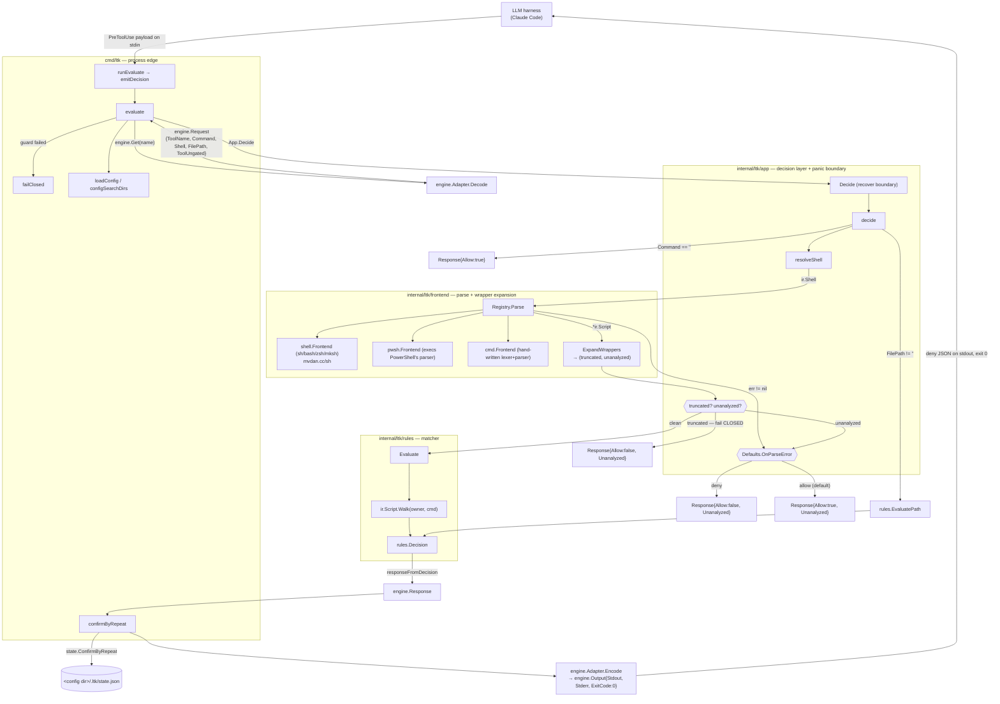
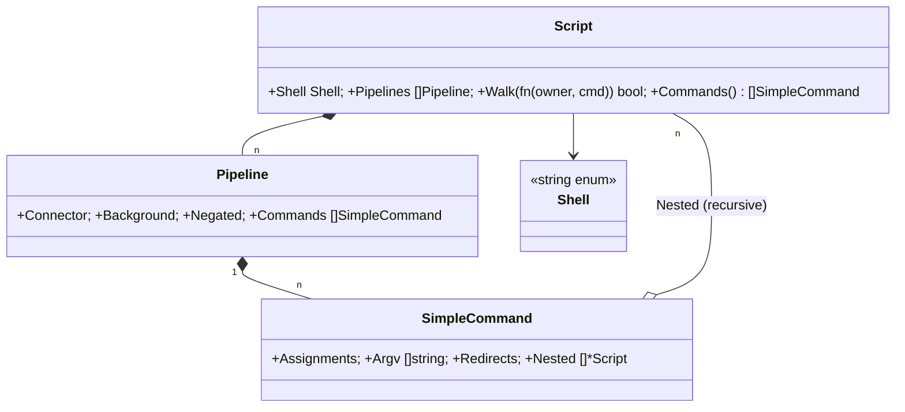

# `ltk` — the command guard

**What it is.** `ltk` is a standalone binary (`cmd/ltk`) that an LLM harness runs as a
**PreToolUse hook**: the harness hands it a tool-call payload on stdin, `ltk` parses the
command into a shell-agnostic IR, matches it against a YAML rule file, and writes back an
allow-or-deny decision in the harness's own wire format.

**The contract it owns.** *Given a tool-call payload and a rules config, emit a decision
document the host understands, and never exit non-zero on the hook path.* It is a
**cooperative redirect, not a sandbox** — the harness is free to ignore the decision, and
`ltk` never blocks a syscall. The failure that matters is therefore not "escaped the jail"
but **"a deny rule the operator wrote did not fire"**.

`ltk` builds and ships independently of ctxloom (it has its own `loadout.yaml` that ctxloom
execs via `ltk loadout --format yaml` once `ltk` is registered with `ctxloom companion add`),
and `cmd/taskloom` reuses its
`internal/ltk/engine` install machinery.

---

## 1. The decision pipeline

```mermaid
flowchart TD
    HOST["LLM harness<br/>(Claude Code)"] -->|"PreToolUse payload on stdin"| RE

    subgraph edge["cmd/ltk — process edge"]
      RE["runEvaluate → emitDecision"]
      EV["evaluate"]
      FC["failClosed"]
      LC["loadConfig / configSearchDirs"]
      CB["confirmByRepeat"]
    end

    RE --> EV
    EV -->|"engine.Get(name)"| ADPT["engine.Adapter.Decode"]
    ADPT -->|"engine.Request<br/>{ToolName, Command, Shell, FilePath, ToolUngated}"| EV
    EV --> LC
    EV -->|"guard failed"| FC

    EV -->|"App.Decide"| DEC

    subgraph app["internal/ltk/app — decision layer + panic boundary"]
      DEC["Decide (recover boundary)"]
      D2["decide"]
      RS["resolveShell"]
      OPE{{"Defaults.OnParseError"}}
      FLAGS{{"truncated? unanalyzed?"}}
    end

    DEC --> D2
    D2 -->|"FilePath != ''"| EPATH["rules.EvaluatePath"]
    D2 -->|"Command == ''"| ALLOW0["Response{Allow:true}"]
    D2 --> RS

    RS -->|"ir.Shell"| PARSE

    subgraph fe["internal/ltk/frontend — parse + wrapper expansion"]
      PARSE["Registry.Parse"]
      SH["shell.Frontend (sh/bash/zsh/mksh)<br/>mvdan.cc/sh"]
      PW["pwsh.Frontend (execs PowerShell's parser)"]
      CM["cmd.Frontend (hand-written lexer+parser)"]
      EW["ExpandWrappers<br/>→ (truncated, unanalyzed)"]
    end

    PARSE --> SH & PW & CM
    PARSE -->|"err != nil"| OPE
    OPE -->|"deny"| DENYP["Response{Allow:false, Unanalyzed}"]
    OPE -->|"allow (default)"| ALLOWP["Response{Allow:true, Unanalyzed}"]

    PARSE -->|"*ir.Script"| EW --> FLAGS
    FLAGS -->|"truncated — fail CLOSED"| DENYT["Response{Allow:false, Unanalyzed}"]
    FLAGS -->|"unanalyzed"| OPE
    FLAGS -->|"clean"| EVAL

    subgraph rules["internal/ltk/rules — matcher"]
      EVAL["Evaluate"]
      WALK["ir.Script.Walk(owner, cmd)"]
      DECI["rules.Decision"]
    end

    EVAL --> WALK --> DECI
    EPATH --> DECI
    DECI -->|"responseFromDecision"| RESP["engine.Response"]

    RESP --> CB
    CB -->|"state.ConfirmByRepeat"| ST[("&lt;config dir&gt;/.ltk/state.json")]
    CB --> ENC["engine.Adapter.Encode<br/>→ engine.Output{Stdout, Stderr, ExitCode:0}"]
    ENC -->|"deny JSON on stdout, exit 0"| HOST
```

**Read the diagram this way:** every path terminates in an `engine.Response`, and what reaches the
host is `Output.Stdout`, `Output.Stderr` and exit code 0. `encodeDecision` is the one place the
wire rules live: a deny is a JSON document on stdout; a clean allow is **zero bytes**; an allow
that could not be fully analyzed is zero bytes on stdout plus a diagnostic on stderr
(`unanalyzedNote`), so the two allows are no longer indistinguishable.

---

## 2. Package inventory

| Package | Role | Key entry points |
|---|---|---|
| `cmd/ltk` | Cobra frontend; owns config **discovery** policy and the "a broken ltk must not exit non-zero" policy | `evaluate`, `check`, `manage`, `version`, `loadout` |
| `internal/ltk/app` | Composition root + decision layer + **panic recover boundary**; the only applier of `on_parse_error` | `New`, `Decide` |
| `internal/ltk/engine` | Engine-neutral `Request`/`Response`/`Output` vocabulary; the hook-host adapters and their settings-file managers | `Get`, `Detect`, `All` |
| `internal/ltk/frontend` | `Frontend` interface, shell→frontend `Registry`, and the wrapper-expansion pass | `Registry.Parse`, `Registry.ExpandWrappers` |
| `internal/ltk/frontend/shell` | POSIX family (sh/bash/zsh/mksh) via `mvdan.cc/sh/v3`; expands words against a best-effort env | `New`, `Parse` |
| `internal/ltk/frontend/pwsh` | PowerShell, by **shelling out to PowerShell's own parser** (parse-only, never execute) | `New`, `Parse` |
| `internal/ltk/frontend/cmd` | `cmd.exe`, hand-written lexer + recursive-descent parser (no third-party cmd AST exists) | `New`, `Parse` |
| `internal/ltk/ir` | The Command-Graph IR every frontend lowers into, plus the `Shell` dialect enum | `Script.Walk`, `KnownShells`, `Shell.Valid` |
| `internal/ltk/rules` | The rule *language*: YAML schema, loader/validator, and the pure matcher | `Parse`, `Load`, `Evaluate`, `EvaluatePath` |
| `internal/ltk/state` | Confirm-by-repeat token store (`state.json`) + the policy that drives it | `ConfirmByRepeat` |
| `internal/ltk/scm` | Reads `.gitmodules` so `path: ["@submodules"]` can be expanded | `SubmodulePaths` |
| `internal/ltk/shellenv` | Maps a shell executable **basename** → `ir.Shell` dialect | `ShellFromPath` |
| `internal/ltk/tools/extract-defaults` | Build-time generator: `docs/ltk/DEFAULTS.md` fenced blocks → `cmd/ltk/sample.ltk.yaml` | `assemble` |

Dependency direction is strictly inward: `cmd/ltk` → `app` → {`frontend`, `rules`, `engine`}
→ `ir`. `ir` is a leaf. Nothing in `internal/ltk` imports `cmd/ltk`.

---

## 3. THE DECISION MODEL — read this before changing anything

This is the subtlest contract in the subsystem. There are **four** ways "ltk could not analyze
this" can arise, and every one of them marks the `engine.Response` `Unanalyzed` (with a
`ParseError` where there is one), so the encoder can say so even on an allow.

### 3.1 Top-level parse failure — policy applies

`app.decide` calls `Registry.Parse` once. A non-nil error (a syntax error, or
`ErrUnsupportedShell` for a dialect with no registered frontend) applies `Defaults.OnParseError`:
`deny` returns a deny reading "could not analyze command (…)", `allow` returns an allow. Both are
`Unanalyzed`.

The **default is allow**, set in `rules.Config.normalizeAndValidate`. So on a default config a
top-level parse failure is allowed — but no longer silently: the allow carries the stderr note.

`app.decide` and `App.denyOnUnanalyzable` (used by the panic path) are the only readers of
`Defaults.OnParseError`.

### 3.2 Wrapper truncation — fails CLOSED, unconditionally

`ExpandWrappers` re-parses wrapper bodies (`bash -c '…'`, `eval`, `cmd /c`, `env …`) up to
`maxWrapDepth`. A **wrapper** found at or past the cap is left unexpanded and reported as
`truncated`; `app.decide` denies on it *regardless of `on_parse_error`*, with the reason "nested
command-wrapper depth exceeded (possible evasion)".

The cap gates re-parsing only. Command substitutions and subshells the frontend already parsed
are walked past the cap and never cause truncation on their own, because `ir.Script.Walk` — what
`rules.Evaluate` matches against — sees them at any depth.

### 3.3 Nested parse failure — policy applies, and salvage is still matched

`ExpandWrappers` returns `(truncated, unanalyzed bool)`. A wrapper whose inner command string
cannot be parsed — a syntax error, or an inner dialect with no frontend — sets `unanalyzed`.
`app.decide` then applies the same `on_parse_error` policy as a top-level failure. Under `allow`
it still runs `rules.Evaluate` over whatever the frontend salvaged (a deny there wins), and an
allow comes back `Unanalyzed`.

What a frontend salvages differs by dialect: `shell` returns an empty script on a parse error,
while `cmd` and `pwsh` return the commands they did recover alongside the error.

### 3.4 Panic — routes through the same knob

`App.Decide` is the recover boundary. `onAnalysisPanic` writes a warning to `App.Warn` (stderr,
set by `New`) and returns allow-or-deny per `denyOnUnanalyzable`, i.e. `on_parse_error` again,
marked `Unanalyzed` with the panic as `ParseError`.

### 3.5 Where the state lives in the types

`engine.Response` carries the decision (`Allow`, `Reason`, `Suggest`), the confirm-by-repeat
policy triple (`Confirmable`, `ConfirmWindowSeconds`, `ConfirmDelaySeconds`), and the
analysis state (`Unanalyzed`, `ParseError`). `rules.Decision` and `ir.Script` have no
analysis-state field: incompleteness is a property of the *decision*, recorded by `app`, not of
the parse tree or the match.

---

## 4. The IR and the matcher

```mermaid
classDiagram
    class Script { +Shell Shell; +Pipelines []Pipeline; +Walk(fn(owner, cmd)) bool; +Commands() []SimpleCommand }
    class Pipeline { +Connector; +Background; +Negated; +Commands []SimpleCommand }
    class SimpleCommand { +Assignments; +Argv []string; +Redirects; +Nested []*Script }
    class Shell { <<string enum>> }
    Script "1" *-- "n" Pipeline
    Pipeline "1" *-- "n" SimpleCommand
    SimpleCommand "1" o-- "n" Script : Nested (recursive)
    Script --> Shell
```

`Script.Walk` passes each command's **owning** script to the visitor, so a nested command is
matched against its own dialect rather than the enclosing script's — a `shells: [cmd]` rule fires
on a `cmd.exe /c …` nested inside `bash -c`.

**Rule shape.** `rules.Config` holds two lists of two types: `Rules []CommandRule` (YAML
`rules:`) and `PathRules []PathRule` (YAML `path_rules:`), sharing an inline `RuleBase` (id,
action, message, suggest, mode, window, delay). `CommandMatch` carries the command language
(`Command`, `Align`, `ArgsAny`, `ArgsAll`, `Unless`, `Backgrounded`, `Shells`); `PathMatch`
carries `Path` globs. `Evaluate` reads only `Rules` and `EvaluatePath` only `PathRules`, so a
mixed rule is unrepresentable after load; `checkRemovedForms` refuses the mixed YAML shape before
the strict decode, naming the fix.

**Operator semantics** (`matchCommand`): every command-field element is a `rules.Pattern`, an RE2
expression anchored as `^(?:p)$` and compiled by `Parse`. The program pattern matches `argv[0]`
or its basename (`programNames`, lowercased and `.exe`-stripped under cmd/pwsh); the remaining
patterns match operands only, aligned per `CommandMatch.Align` — **ordered subsequence** for a
deny rule (`alignSubsequence`), **position-anchored prefix** or **exact** for an allow rule
(`alignPrefix`). Options are matched only by `args_*`/`unless` over the arguments plus the
POSIX bundled-short-option expansion (`expandShortClusters`). Validation failures are sentinels
wrapped in `*rules.RuleError` naming the rule and field.

**Rule ordering.** `Evaluate` loops *commands* outer, *rules* inner, and the first deny ends the
walk — so an earlier command matching a later rule beats a later command matching an earlier
rule. Rule order decides only within one command, which is where an allow carve-out placed
above a broad deny does its work. `Evaluate`'s doc states this.

---

## 5. The engine boundary

```mermaid
classDiagram
    class Adapter { <<interface>> +Name() string; +Decode([]byte) (Request, error); +Encode(Response) (Output, error) }
    class Engine { <<interface>> Adapter + Detect(dir) int; +SettingsPath(dir, global); +HookCommand(bin, cfg); +Install(...); +Uninstall(...) }
    class Request { +ToolName; +Command; +Shell ir.Shell; +FilePath; +ToolUngated bool }
    class Response { +Allow; +Reason; +Suggest; +Confirmable; +ConfirmWindowSeconds; +ConfirmDelaySeconds; +Unanalyzed; +ParseError; +Message() string }
    class Output { +Stdout []byte; +Stderr []byte; +ExitCode int }
    Engine --|> Adapter
    Adapter ..> Request
    Adapter ..> Response
    Adapter ..> Output
    class ClaudeCode { «struct{}» }
    ClaudeCode ..|> Engine
```

| Symbol | Notes |
|---|---|
| `Request` | `Command` **xor** `FilePath`. `ToolUngated` marks a tool the adapter matched but cannot read — denied by `evaluate` with `ungatedToolDenyReason` |
| `Response` | The wire decision, the confirm-by-repeat policy triple (consumed by `cmd/ltk`'s `confirmByRepeat` before encoding, never by `Encode`), and the analysis state |
| `Response.Message()` | Joins `Reason`+`Suggest`; never empty, so a deny always tells the agent something |
| `encodeDecision` | The shared encode rules every adapter's `Encode` goes through: deny → JSON on stdout, exit 0; clean allow → empty; unanalyzed allow → stderr note only. Never a non-zero exit, because both hook hosts fail open on one |
| `Get` / `Detect` / `All` | `Get` matches the engine name exactly — a typo must error. `Detect` scores each engine and takes the highest with strict `>`, so a tie goes to whoever is first in `engines()` |
| `ClaudeCode` | `.claude/` present → detected. `Decode` falls back from `file_path` to `notebook_path`; `ccShellForTool` maps the PowerShell tool to `ir.ShellPwsh`. `HookCommand` is `bin + " evaluate"` (+ a quoted `--config`) |

The hooks.json machinery (`mergePreToolUseHook`, `removePreToolUseHook`, `decodeSettings`,
`childMap`, `childSlice`, `quotePathIfNeeded`) lives beside `ClaudeCode`; it is the contract any
further hooks.json-shaped engine would share.

---

## 6. `cmd/ltk` — the process edge

| Symbol | Notes |
|---|---|
| `newRootCmd` | Builds the tree; registers a **persistent** `--format` |
| `main` / `reportExecuteError` | On error renders it (through `cliemit.EmitError`, so an explicit structured `--format` gets an envelope) and exits 1 |
| `runEvaluate` / `emitDecision` | Reads stdin → `evaluate` → writes the two streams. A failed stdout write is an error (the host never saw the decision); a failed stderr write is ignored, because promoting it would turn a lost diagnostic into a non-zero exit the host reads as allow |
| `evaluate` | The whole decision path: engine → shell → config → submodules → payload → ungated-tool check → `app.Decide` → confirm-by-repeat → encode. Its fail-closed branches each say why |
| `failClosed` | Encodes a reason as a well-formed deny with **exit 0** — a broken ltk installation never surfaces as an error exit on the hook path |
| `loadConfig` / `configSearch` / `configSearchDirs` | Explicit `--config`, else the nearest `configSearch` name walking cwd + ancestors, else a built-in allow-all config. The walk stops at a `.git` **directory**, so a gitfile (worktree, submodule) keeps searching upward. `configSearch` begins with `defaultConfigPath`, the file `manage install` writes. Under `--write-upgrades` a migrated file is persisted to the resolved path with `schemaver.WriteBack` |
| `newDecider` / `expandSubmodules` | The shared `evaluate`/`check` wiring; submodule expansion reports every failure, and the callers deny (`evaluate`) or error (`check`) rather than let an `@submodules` rule guard nothing |
| `statePath` / `confirmByRepeat` | Anchors `state.json` beside the **resolved** config, and drives `state.ConfirmByRepeat` |
| `checkResult` / `runCheck` | Discrete `{decision, message, suggestion}` fields, so a GUI never re-splits `Response.Message()`; `check` fails **loud**, unlike the hook path |
| `manageFlags` / `scaffoldConfig` / `writeFile` | Install/uninstall flags; `--force` backs up to `.bak` first. A `--global` install omits the project-relative `--config` and says so, leaving each project's rules to the search |
| `newLoadoutCmd` | `loadout.NewCommand` over the embedded `loadout.yaml` + `.sig` — ctxloom's companion-discovery entry point |
| `registerDocsCmd` | Build-tag pair; `internal/shared/docsgen` is mounted only under `-tags docsgen` |

**`--format` has two vocabularies on one tree.** The root's persistent `--format` and the
`loadout` command's local `--format {yaml,json}` (default `yaml`), which shadows it there.
`evaluate` writes the host's wire format whatever `--format` says.

---

## 7. Frontends

| Frontend | Strategy | Parse-error return |
|---|---|---|
| `shell` | Walks `mvdan.cc/sh/v3`'s AST, expands words against an env snapshotted at `New`, flattens control flow so every program a line could run is visible. Captures `$(…)`/`<(…)` into `Nested`. A `recover` converts any panic in the third-party expander into a parse error | An empty `*ir.Script` plus the error |
| `pwsh` | Execs `pwsh`/`powershell` (memoized `resolveBin`) running the embedded `parseScript`, which calls `Parser::ParseInput` and emits JSON. Source rides in via `LTK_SRC`, bounded by `parseTimeout`. `lower` returns salvaged commands **plus** an error when the parse reported errors | Salvage plus error; `errUnavailable` when no PowerShell is on PATH |
| `cmd` | Hand-written lexer (`lexer`) + recursive-descent parser (`parser`). Handles `^` escapes, `"…"`, `%VAR%` (preserved literally, never resolved), `&&`/`\|\|`/`\|`/`&`, redirects, `( … )` groups | The parsed script plus an error when tokens remain at top level (an unmatched `)` or similar) |

`app.New` registers all three and sets `DefaultShell: ir.ShellBash`.

### Wrapper expansion

`wrap.go` distinguishes two wrapper families, in **deliberately disjoint** program-name sets:

- **Interpreter wrappers** (`wrapperRules`, `wrappedCommand`): the inner command arrives as a
  single *string* to re-parse — the POSIX shells' `-c`, `eval`, `cmd /c|/k`,
  `pwsh/powershell -Command`. `posixCommandOperand` locates the true `-c` operand, honouring `--`
  and stepping over `-o name` — this is what closes `bash -c -- 'rm -rf /'` and
  `bash -oc errexit '…'`. `innerShell` derives the nested dialect.
- **argv-prepending wrappers** (`prefixWrapperRules`, `prefixWrapped`): the inner command is
  already argv and only needs its prefix stripped (`env`, `timeout`, `xargs` and the like), each
  with its own getopt-style skipper.

---

## 8. Confirm-by-repeat

`internal/ltk/state` persists short-lived "run it again to proceed" tokens. Reached only for a
denial that is `Confirmable` with a positive window.

| Symbol | Notes |
|---|---|
| `pending` | `{NotBefore, Expiry}` — a band in **unix seconds** |
| `Store` / `Open` / `LoadError` | The token map behind a JSON document. `Open` is best-effort — an unreadable or corrupt file yields an empty store — but keeps the failure in `LoadError` |
| `Armed` / `Ready` / `RemainingDelay` | Band predicates |
| `Arm` / `Clear` / `Save` | `Save` prunes expired entries before writing |
| `ConfirmByRepeat` | The policy: arm on first denial, allow on a ready repeat, rebuke an early one (`armReason`, `tooEarlyReason`, which are instructions *to the model*). Returns the store's load/save error alongside the decision so a caller can see broken persistence; the error never changes the decision |

The package is explicit that this is "an escape hatch, not a security control". `Store`'s
concurrency note records that a lost *Arm* fails safe (re-deny, re-arm) while a lost *Clear*
fails open — a consumed override can be resurrected, or one confirmation can admit several runs
(`race_test.go` pins both). That gap is accepted only because the window is capped: `rules.Parse`
refuses any config whose effective confirm window exceeds `rules.MaxConfirmWindowSeconds`
(`ErrConfirmWindowTooLong`), so a resurrected override still expires within that bound. Raising
the cap means closing the race first.

---

## 9. Rule-file loading and generation

```mermaid
flowchart LR
  MD["docs/ltk/DEFAULTS.md<br/>(source of truth)"] -->|"just defaults<br/>go run ./internal/ltk/tools/extract-defaults"| ASM["assemble"]
  ASM -->|"every fenced yaml block, in order"| GATE["rules.Parse<br/>(syntax + schema gate)"]
  GATE --> SAMPLE["cmd/ltk/sample.ltk.yaml"]
  SAMPLE -->|"//go:embed"| BIN["ltk binary"]
  BIN -->|"ltk manage install"| PROJ["&lt;project&gt;/.ltk/config.yaml"]
  PROJ -->|"loadConfig ancestor walk"| LOAD["rules.Load → Config"]
  GITM[".gitmodules"] -->|"scm.SubmodulePaths"| EXP["Config.ExpandSubmodules"]
  LOAD --> EXP --> APP["app.New(cfg, shells)"]
```

- `rules.Parse` first runs the rules file's `schemaver.Kind` (`configKind`) over the raw bytes:
  a file declaring no `schema_version` (an empty one included) or one newer than the binary is
  refused before anything else reads it. Then `checkRemovedForms`, then a strict decode
  (`yamlx.DecodeStrict`) through a wrapper that accepts `schema_version` — `Config` itself
  carries no version — then `normalizeAndValidate`. A document declaring only its generation is
  a valid zero-rule config, and `cmd/ltk` ships `empty.ltk.yaml`.
- `normalizeAndValidate` defaults `on_parse_error` to allow, then validates each rule's shared
  fields in `validateRuleBase`: id present and unique, valid action and mode, a coherent confirm
  setting, and an explanation on every deny (`validateDenyIsExplained`).
- `Config.ExpandSubmodules` rewrites the `@submodules` sentinel into one directory-subtree pattern
  per submodule, after `Parse` validated the patterns.
- `scm.SubmodulePaths` walks up from the start directory reading `.gitmodules`, stopping at the
  first `.git` git would accept (a directory or a gitfile) — stricter than the config search,
  because rules are inherited downward but submodule paths must not be. It distinguishes "no
  submodules" (`nil, nil`) from "could not find out" (an error).
- `extract-defaults`' `assemble` refuses an assembled rule set below `minDefaultRules`. Its
  `-check` flag (fail on doc/binary drift) runs inside `just gen-docs-check`; `just defaults`
  runs the generating form. `TestEmbeddedSampleMatchesDoc` enforces the same invariant wherever
  the test suite runs.

---

## 10. Invariants

**Hold, and are load-bearing:**

1. **The hook path never exits non-zero for a decision.** Every decision `evaluate` produces
   routes through `failClosed` or a normal encode, with `ExitCode: 0`, because a host that fails
   open on a crashing hook would turn a non-zero exit into an allow. Residual: an error `evaluate`
   returns, or a stdout write `emitDecision` cannot complete, reaches `main` and exits 1.
2. **Wrapper truncation fails closed**, independent of `on_parse_error`.
3. **Every analysis failure is visible.** Top-level and nested parse failures and panics all
   mark the response `Unanalyzed`; an allow so marked carries a stderr note.
4. **An ungated tool fails closed**, with `ungatedToolDenyReason` explaining why.
5. **A clean allow is encoded as silence**, not as approval — an empty `Output` means "let the
   normal permission flow proceed".
6. **`deny` is the default action** for a rule with no `action:` (`RuleBase.action`); `enable`
   is the default mode (`RuleBase.mode`).
7. **An entirely empty match matches nothing** (`CommandMatch.hasConstraint`), to avoid an
   accidental catch-all denial. Any single field satisfies it, including `shells:`-only or
   `unless:`-only.
8. **A rule is either a command rule or a path rule, never both** — separate types after load,
   and the mixed YAML shape is refused by `checkRemovedForms`.
9. **`manage install` writes the file `evaluate` prefers**: `configSearch` begins with
   `defaultConfigPath`.
10. **`wrapperRules` and `prefixWrapperRules` program sets are disjoint**, by explicit name and by
    shell dialect — `TestWrapperTablesAreDisjoint`.
11. **`Nested` must form a tree.** `Script.Walk` recurses with no cycle guard and no depth cap;
    the only bound is the producer-side `maxWrapDepth`.
12. **`ExpandWrappers` mutates its argument in place** and must be called after `Parse` and
    before `Evaluate`.

**Narrower than they look:**

- **`rules.Config.Version`** is decoded and read by nothing; any value parses and evaluates
  normally.
- **`Shell` is both an internal parse-tree detail and a published config contract** — it is
  YAML-decoded for `defaults.shell` and `match.shells`, so the `ir.Shell` constant *string
  values* are connascent with every ltk config on disk.
- **`ShellFromPath` returns `""` for both "unset" and "unrecognized"**, so an unrecognized login
  shell (fish, nu, tcsh) resolves to `DefaultShell` (bash).

---

## 11. Shell resolution precedence

`App.resolveShell` is a five-way switch, in order:

1. `Shells.Force` — the `--shell` flag
2. the per-request hint — `Request.Shell`, set by the adapter's `Decode` (`ccShellForTool`)
3. `Config.Defaults.Shell`
4. `Shells.Host` — `shellenv.ShellFromPath($SHELL)`, wired in `newDecider`
5. `App.DefaultShell` — `ir.ShellBash`, set by `New`

`Force` and `Host` are both passed to `New` through `app.Shells`, so no caller can construct an
`App` and forget them.
