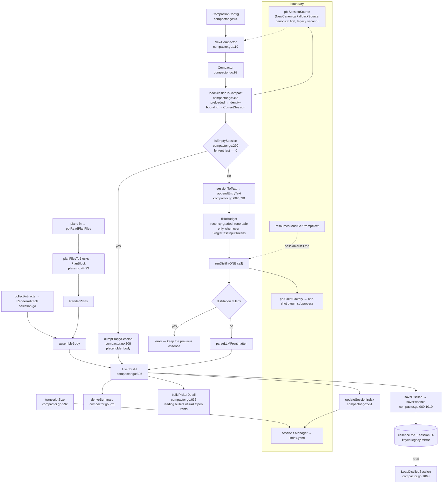

# `internal/memory` — session compaction

**What it is.** The single-pass distillation pipeline that turns a session transcript into a
persisted **essence** document (`~/.ctxloom/sessions/<harp>/essence.md`), plus verbatim
re-attachment of the session's `.plan.md` files, plus a separate hook utility that stamps harp
names into project plan-file frontmatter.

**The contract it owns.** *Read a session through `pb.SessionSource`, distill it in ONE LLM call,
and write one essence document plus the index projection (`Summary`, `Detail`, `SourceSize`) that
the session listing renders.*

Distillation is deliberately NOT hierarchical. An oversized transcript is reduced deterministically
by `fitToBudget` — oldest content compressed hardest, the tail left intact — rather than split into
chunks whose separate summaries are merged by a pass that never sees the source.

`internal/cli` is the only internal consumer: `cli/memory.go` (`ctxloom memory
compact|show|list`), `cli/session_cmd.go` (`compactEntry`, the `session distill` / resume-picker
path), `mcp/mcp_tools_memory.go` (`compact_session`, `load_session`, `get_previous_session`), and
`cli/hook_stamp_plan.go` (the PostToolUse plan-stamping hook).

**The package does not have one responsibility.** `compactor.go` carries five separable concerns
(transcript rendering, budget fitting, LLM invocation, essence persistence, session-index mutation), and
`stamp.go` shares nothing with it but the word "plan".

---

## 1. The compaction pipeline

---

## 2. Types

| Symbol | file:line | Notes |
|---|---|---|
| `CompactionConfig` | `compactor.go:44` | Three field groups: **source selection** (`Backend`, `SessionID`, `WorkDir`, `BackendOverride`, `PreloadedSession`), **LLM invocation** (`LLM`, `Model`, `ChunkSize`, `ClientFactory`), **output** (`OutputDir`, `HarpName`, `Progress`), plus `IncludeThinking` |
| `CompactionResult` | `compactor.go:82` | `{SessionID, ChunksCreated, TotalTokensIn, TotalTokensOut, DistilledPath, Duration, Error}`. `Error` is never assigned anywhere |
| `Compactor` | `compactor.go:93` | `{config, source, plans, clientFactory}`. `clientFactory` duplicates `config.ClientFactory` (set at `:130`, copied at `:187`). The type has **no field for the session index it mutates** — `sessions.Open("")` is called ad hoc in three separate methods plus `NewCompactor`, i.e. up to four independent index parses per `Compact` |
| `memoryHistorySource` | `compactor.go:103` | Three-line adapter from `agent.SessionHistory` to `pb.SessionSource` for the `BackendOverride` test seam |
| `distilledMeta` | `compactor.go:868` | The YAML frontmatter written at the top of every essence: `{SessionID, HarpName, DistilledAt, SourcePath, SourceMtime, SourceSize, EntryCount, TokensIn, TokensOut, PlanBlocks, Summary}`. `SourcePath` and `SourceMtime` are declared, parsed, and **never assigned by any writer** |
| `DistilledSession` | `compactor.go:1049` | The parsed form; mirrors `distilledMeta` plus `Body`. External readers touch only `Body`, `TokensOut`, `DistilledAt`, `SessionID`, `SourceSize` |
| `PlanKind` / `PlanBlock` | `plans.go:13`, `:23` | `PlanKind` has one value and `PlanBlock.Kind` is read by nobody; `PlanBlock.Timestamp` is read by `RenderPlans` and set by nobody, so the `!block.Timestamp.IsZero()` branch (`plans.go:67`) is unreachable in production |

---

## 3. Functions

| Symbol | file:line | Notes |
|---|---|---|
| `NewCompactor` | `compactor.go:119` | Defaults the config, resolves canonical-vs-legacy `SessionSource`, wires `plans` |
| `Compact` | `compactor.go` | The whole pipeline. **Order is load-bearing and unenforced**: `transcriptSize` must run *before* the distillation call, `updateSessionIndex` *after* `saveDistilled` |
| `loadSessionToCompact` | `compactor.go:365` | Preloaded → identity-bound id → `CurrentSession`. Explicit-id failures hard-error; index-derived failures fall through with a documented rationale |
| `isEmptySession` | `compactor.go:290` | `len(entries) == 0` |
| `dumpEmptySession` | `compactor.go:308` | Short-circuits to a placeholder essence |
| `fitToBudget` | `compactor.go` | Deterministic recency-graded reduction to `SinglePassInputTokens`; each entry may claim at most half of what remains, so the budget is never exceeded and the head decays geometrically |
| `splitEntryBlocks` | `compactor.go` | Splits rendered text back into the `## `-headed per-entry blocks `appendEntryText` wrote |
| `runDistill` | `compactor.go:825` | One-shot plugin subprocess; returns trimmed stdout. **Non-zero exit → error with stderr; exit 0 with empty stdout → `("", nil)`** |
| `sessionToText` / `appendEntryText` | `compactor.go:667`, `:698` | Renders entries to markdown. `appendEntryText` has **no `default` case**, so a thinking-only or unrecognized-type entry contributes zero bytes |
| `parseLLMFrontmatter` | `compactor.go:896` | Peels the LLM's leading YAML block; returns the original on any parse failure — a correct non-destructive degrade |
| `deriveSummary` / `buildPickerDetail` | `compactor.go:921`, `:633` | Frontmatter summary else first non-heading prose line; ≤4 bullets, ≤80 bytes, from `### Open Items` |
| `assembleBody` | `compactor.go` | Body + rendered artifacts + rendered plans, owning the spacing invariant |
| `collectArtifacts` / `RenderArtifacts` | `selection.go` | Deterministic touched-file index, capped at `maxArtifacts` and reporting what the cap dropped |
| `distillPrompt` | `compactor.go` | The prompt plus the injected essence budget; loads from `PromptDir` when set, failing rather than falling back |
| `saveDistilled` / `saveEssence` | `compactor.go:960`, `:1010` | Builds the frontmatter doc, writes the harp essence + the sessionID-keyed legacy mirror. `saveEssence` warns before every degrade |
| `resolveHarpName` / `identityBoundSessionID` / `updateSessionIndex` / `transcriptSize` | `compactor.go:523`, `:538`, `:561`, `:592` | The index-mutating group |
| `LoadDistilledSession` / `parseDistilledMarkdown` / `ListDistilledSessions` | `compactor.go:1063`, `:1073`, `:1104` | The read side |
| `RenderPlans` / `planFilesToBlocks` / `IsPlanFile` | `plans.go:59`, `:44`, `:38` | |
| `StampPlanFile` / `prependFrontmatter` / `updateFrontmatter` / `addHarpToSessionsNode` | `stamp.go:27`, `:45`, `:57`, `:108` | Ensures a plan file's `sessions:` frontmatter contains the harp |

---

## 4. Invariants

**Hold:**

1. **A failed distillation aborts and keeps the previous essence.** Overwriting a good essence
   with a failure marker is data loss, not graceful degradation.
2. **The essence body is refused above `MaxEssenceChars`.** A model that ignores its character
   budget produces a transcript passthrough, which the caller must see as an honest failure.
3. **`parseLLMFrontmatter` never destroys content** — any parse failure returns the original body.
4. **Plan blocks are re-attached verbatim, after the LLM pass.** `RenderPlans` emits
   `### Plan #N — <label>` headings that the model never sees, so a plan's contents cannot be
   paraphrased or summarized away.
5. **Progress and warning output go to a caller-owned sink** (`progressf`/`warnf`,
   `compactor.go:433`, `:447`), each formatted into a single `Write` so lines cannot interleave.
6. **`saveEssence` warns before every degrade** (`compactor.go:1010`) — the good example in this
   file.
7. **`StampPlanFile` errors on an empty harp and on an unreadable file** (`stamp.go:27`).
8. **The essence is written through `iox.WriteFileAtomic`**, so a reader never sees a partial
   document.

**Do not hold, or are narrower than documented:**

- ~~**An LLM plugin that exits 0 with empty stdout is not a failure anywhere in the chain.**~~ —
  **RESOLVED `cb00291e`** (U078-F01). `runDistill` now returns an error for "exited 0 but
  produced no output", so `distillChunks` marks the chunk failed and the all-chunks-failed
  abort *can* fire and keep the previous essence. The old chain is the reason the abort
  existed and never ran: `failed` was incremented only on `err != nil`, so an empty result
  counted as success, `assembleBody` returned `""`, and `saveDistilled` atomically replaced
  a good `essence.md` with it while the reader reported `Loaded: true, Content: ""`.
- ~~**`dumpEmptySession` overwrites a previously good essence with a 54-byte placeholder**~~ —
  **RESOLVED `9979ce25`** (U078-F02). `dumpEmptySession` (`compactor.go:323`) now checks
  `existingEssence` first and **keeps** what is there, warning rather than erroring: an
  empty session is still not a failure, there is simply nothing better to write. This
  fired on real, populated sessions — a session reads as empty for reasons that have
  nothing to do with its essence (`CanonicalHistory.GetSession` returning `(session, nil)`
  for an existing-but-empty `transcript.jsonl`; the `CurrentSession` fallback when a bound
  id's transcript is gone; `MainThreadEntries` filtering an all-sidechain session to zero)
  — and re-distills fire automatically off the staleness path.
- **The `summary != ""` guard covers only `Summary`** — `buildPickerDetail` returns nil
  whenever the body has no `### Open Items` heading, which the distill prompt explicitly
  permits, so a normal re-distill of a session that finished its open items erases the
  stored `Detail`. **Partly closed by `07abd892`**: `sessions.SetSummary` now refuses an
  *empty summary* outright, but it still assigns `Detail` and `SourceSize` from whatever
  it is handed, so a non-empty summary with a nil `Detail` still clears the detail lines.
  **UNVERIFIED whether that residue is reachable today** — not re-traced in this pass.
- **`transcriptSize` returns 0 on five distinct failure paths** (`compactor.go:593,597,602,614,618`)
  and — unlike every other degradation in this file — emits **no warning at all**, so a transient
  failure silently zeroes the staleness fingerprint and disables the "out of date" badge for that
  harp.
- ~~**`isEmptySession` tests the entry count, not the rendered text**, so an entry set that renders
  to nothing (thinking-only with `IncludeThinking` false, or an unrecognized `Type`) still spawned
  a plugin on an empty `<session_log>`.~~ **RESOLVED.** `rendersToNothing` gates the same
  short-circuit on the rendered text.
- ~~**`saveDistilled`'s default `OutputDir` is the *relative* `".ctxloom/sessions"`**, resolved
  against the process cwd, so distilling a harp belonging to project B while the server sits in
  project A wrote into `A/.ctxloom/sessions/`.~~ **RESOLVED.** There is no cwd-derived default and
  no project-rooted essence store at all: an essence is filed under its own harp
  (`Compactor.rotationEssencePath` → `paths.ResolveHarpSegmentEssencePath`), and a distillation
  with no harp REFUSES rather than resolving a location out of the working directory. Where the
  process happens to be standing can no longer decide where a session's record lands.
- **`StampPlanFile` returns `nil` in four cases where it wrote nothing** — unterminated
  frontmatter (`stamp.go:71`), malformed YAML (`:81`), already-present (`:84`), and root-not-a-
  mapping (`addHarpToSessionsNode:123`). The doc at `stamp.go:21-22` says "malformed YAML
  frontmatter → no-op (caller logs)"; the caller (`cli/hook_stamp_plan.go:47-49`) logs only on a
  non-nil error, so it cannot.
- **`IsPlanFile`'s doc misdescribes its own regex.** `planFileRegex`
  (`(?i)(^|/)(current_)?plan[^/]*\.md$|^docs/[^/]+-plan\.md$`) anchors `plan` at the start of the
  basename, so `myproject-plan.md` outside `docs/` does not match, and neither does this project's
  own session-plan convention `*.plan.md`. The comment advertises `*plan*.md`. The session-dir
  exclusion is deliberate (`plans_test.go:15`); the comment is still wrong.
- **A `sessions.Open` failure in `NewCompactor` is swallowed into a nil `source`**
  (`compactor.go:173-181`), which later surfaces as `backend %q does not support session history`
  — the wrong diagnosis for a corrupt or unwritable `index.yaml`.
- **`updateSessionIndex` calls `sessions.Manager.BindSession` directly** (`compactor.go:570`),
  re-implementing part of `operations.BindSession`'s precondition set and omitting the
  `sessionID == ""` check. The net effect is a redundant index rewrite, not data loss; the cost is
  two places to fix a future guard.
- **`StampPlanFile` resets a plan file's mode to 0644** — `iox.WriteFileAtomic` chmods a fresh
  temp file to the requested perm and renames, so the original mode is lost and any hardlink is
  broken.
- **`runDistill` and `parseLLMFrontmatter` have acknowledged copies elsewhere** —
  `internal/operations/task_triggers.go` ("This mirrors internal/memory/compactor.go's
  runDistill"), its bounded fan-out, and `internal/shared/tasks/triggers/parse.go`
  (the frontmatter peel).
