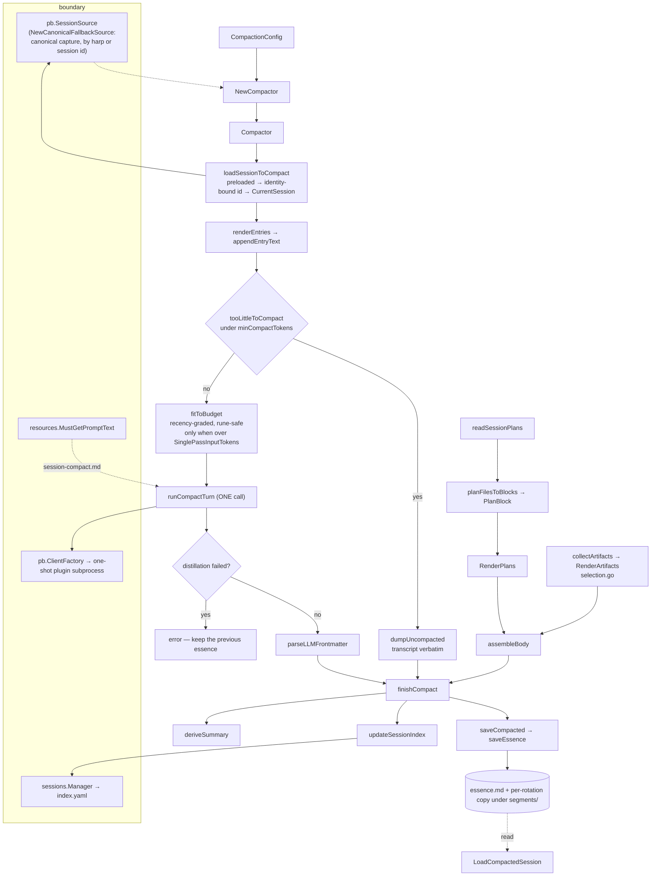

# `internal/adapters/memory` — session compaction

**What it is.** The single-pass distillation pipeline that turns a session transcript into a
persisted **essence** document (`essence.md` in the session's output dir, `sessions.Entry.OutputDir`), plus verbatim
re-attachment of the session's `.plan.md` files, plus a separate hook utility that stamps harp
names into project plan-file frontmatter.

**The contract it owns.** *Read a session through `pb.SessionSource`, distill it in ONE LLM call,
and write one essence document, recording only a staleness fingerprint (`SourceEntries`) on the
session index.* Listings read the summary and Open Items from `essence.md` itself.

Distillation is deliberately NOT hierarchical. An oversized transcript is reduced deterministically
by `fitToBudget` — oldest content compressed hardest, the tail left intact — rather than split into
chunks whose separate summaries are merged by a pass that never sees the source.

Its consumers are the CLI (including `cli/hook_stamp_plan.go`, the plan-stamping hook), the MCP
memory tools (`compact_session`, `load_session`, `get_previous_session`) and `operations`; list
them by searching for the package's import path.

**The package does not have one responsibility.** `compactor.go` carries separable concerns
(transcript rendering, budget fitting, LLM invocation, essence persistence, session-index mutation), and
`stamp.go` shares nothing with it but the word "plan".

---

## 1. The compaction pipeline

```mermaid
flowchart TD
  subgraph ext["boundary"]
    SRC["pb.SessionSource<br/>(NewCanonicalFallbackSource:<br/>canonical capture, by harp or session id)"]
    LLM["pb.ClientFactory → one-shot plugin subprocess"]
    IDX["sessions.Manager → index.yaml"]
    RES["resources.MustGetPromptText"]
  end

  CFG["CompactionConfig"] --> NC["NewCompactor"]
  SRC -.-> NC
  NC --> C["Compactor"]

  C --> LS["loadSessionToCompact<br/>preloaded → identity-bound id → CurrentSession"]
  LS --> SRC
  LS --> S2T["renderEntries → appendEntryText"]
  S2T --> ES{"tooLittleToCompact<br/>under minCompactTokens"}

  ES -->|yes| DUMP["dumpUncompacted<br/>transcript verbatim"]
  ES -->|no| FB["fitToBudget<br/>recency-graded, rune-safe<br/>only when over SinglePassInputTokens"]
  FB --> RD["runCompactTurn (ONE call)"]
  RD --> LLM
  RES -.->|"session-compact.md"| RD
  RD --> ABORT{"distillation failed?"}
  ABORT -->|yes| ERR["error — keep the previous essence"]
  ABORT -->|no| PFM["parseLLMFrontmatter"]

  PLANS["readSessionPlans"] --> PB["planFilesToBlocks → PlanBlock"]
  PB --> RP["RenderPlans"] --> AB["assembleBody"]
  ART["collectArtifacts → RenderArtifacts<br/>selection.go"] --> AB

  PFM --> FIN["finishCompact"]
  DUMP --> FIN
  AB --> FIN
  FIN --> DS["deriveSummary"]
  FIN --> SD["saveCompacted → saveEssence"]
  FIN --> USI["updateSessionIndex"] --> IDX

  SD --> OUT[("essence.md + per-rotation copy under segments/")]
  OUT -.read.-> LOAD["LoadCompactedSession"]
```

---

## 2. Types

| Symbol | File | Notes |
|---|---|---|
| `CompactionConfig` | `compactor.go` | Source selection, LLM invocation and output settings for one compaction |
| `CompactionResult` | `compactor.go` | What one `Compact` reports back to its caller |
| `Compactor` | `compactor.go` | The configured pipeline. It holds **no field for the session index it mutates** — each method that needs the index calls `sessions.Open` itself, so one `Compact` parses the index more than once |
| `compactedMeta` | `compactor.go` | The YAML frontmatter written at the top of every essence |
| `CompactedSession` | `compactor.go` | The parsed form of an essence: `compactedMeta` plus `Body` |
| `PlanBlock` | `plans.go` | One plan file's label and verbatim content, as `RenderPlans` re-attaches it |

---

## 3. Functions

| Symbol | File | Notes |
|---|---|---|
| `NewCompactor` | `compactor.go` | Defaults and clamps the config, and resolves the `SessionSource` (`resolveSource`) |
| `Compact` | `compactor.go` | The whole pipeline. `finishCompact` saves the essence before it updates the session index, so a fingerprint is never recorded for an essence that was not written |
| `loadSessionToCompact` | `compactor.go` | Preloaded → identity-bound id → `CurrentSession`. Explicit-id failures hard-error; index-derived failures fall through with a documented rationale |
| `tooLittleToCompact` | `compactor.go` | The rendered transcript is under `minCompactTokens`: too small for distillation to compress, and small enough that the model answers with a refusal rather than a summary |
| `dumpUncompacted` | `compactor.go` | Short-circuits to the transcript itself as the essence (a placeholder when it rendered to nothing); never replaces an existing essence |
| `fitToBudget` | `compactor.go` | Deterministic recency-graded reduction to `SinglePassInputTokens`; each entry may claim at most half of what remains, so the budget is never exceeded and the head decays geometrically |
| `splitEntryBlocks` | `compactor.go` | Splits rendered text back into the `## `-headed per-entry blocks `appendEntryText` wrote |
| `runCompactTurn` | `compactor.go` | The one compaction call, through the package's `RunPrompt`: a run that fails, or exits 0 with no output, is an error rather than an empty essence |
| `sessionToText` / `renderEntries` / `appendEntryText` | `compactor.go` | Renders entries to markdown. `appendEntryText` has **no `default` case**, so a thinking-only or unrecognized-type entry contributes zero bytes |
| `parseLLMFrontmatter` | `compactor.go` | Peels the LLM's leading YAML block; returns the original on any parse failure — a correct non-destructive degrade |
| `deriveSummary` | `compactor.go` | Frontmatter summary, else the first non-heading prose line |
| `assembleBody` | `compactor.go` | Body + rendered artifacts + rendered plans, owning the spacing invariant |
| `collectArtifacts` / `RenderArtifacts` | `selection.go` | Deterministic touched-file index, capped at `maxArtifacts` and reporting what the cap dropped |
| `compactPrompt` | `compactor.go` | The prompt plus the injected essence budget; loads from `PromptDir` when set, failing rather than falling back |
| `saveCompacted` / `saveEssence` | `compactor.go` | Builds the frontmatter doc and writes it twice under the harp: `essence.md` (the current distillation) and this rotation's `segments/<sessionID>.md`. Refuses an empty body. `saveEssence` warns before every degrade |
| `resolveHarpName` / `identityBoundSessionID` / `updateSessionIndex` | `compactor.go` | The index-mutating group |
| `LoadCompactedSession` / `parseCompactedMarkdown` | `compactor.go` | The read side |
| `RenderPlans` / `planFilesToBlocks` / `IsPlanFile` | `plans.go` | |
| `StampPlanFile` / `prependFrontmatter` / `updateFrontmatter` / `addHarpToSessionsNode` | `stamp.go` | Ensures a plan file's `sessions:` frontmatter contains the harp |

---

## 4. Invariants

**Hold:**

1. **A failed distillation aborts and keeps the previous essence.** Overwriting a good essence
   with a failure marker is data loss, not graceful degradation.
2. **The essence body is refused above `MaxEssenceChars`.** A model that ignores its character
   budget produces a transcript passthrough, which the caller must see as an honest failure.
3. **`parseLLMFrontmatter` never destroys content** — any parse failure returns the original body.
4. **Plan blocks are re-attached verbatim, after the LLM pass.** `RenderPlans` emits
   `### Plan #N — <label>` headings that the model never sees, so a plan's contents cannot be
   paraphrased or summarized away.
5. **Progress and warning output go to a caller-owned sink** (`progressf`/`warnf`), each formatted into a single `Write` so lines cannot interleave.
6. **`saveEssence` warns before every degrade** — the good example in this file.
7. **`StampPlanFile` errors on an empty harp, an unreadable file, and frontmatter it cannot
   parse**, leaving the file untouched; a harp already present is the one silent no-op.
8. **The essence is written through `safefs.WriteFile`**, so a reader never sees a partial
   document.
