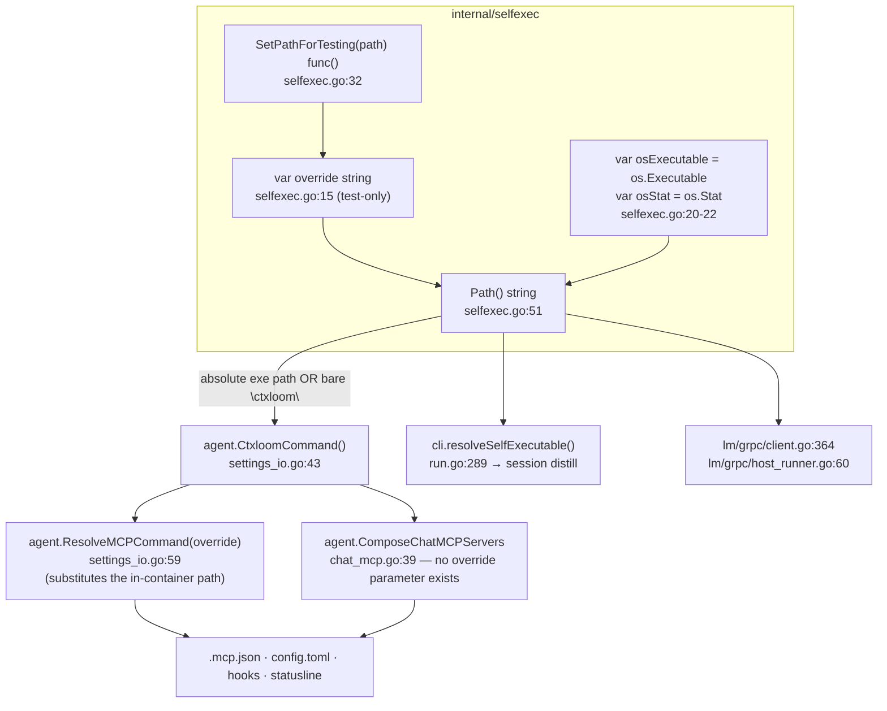

# `internal/selfexec` — self-path resolution

**What it is.** A 68-line, zero-dependency leaf package with one job: resolve the filesystem path
this process should use when **re-invoking the running ctxloom binary**, surviving an in-place
upgrade that unlinked the executing inode.

**The contract it owns.** *Return a path that names the binary that is running right now.* Its
most consequential consumer is `agent.CtxloomCommand()`
(`internal/shared/agent/settings_io.go:44`), the funnel through which **every** materialized
engine surface — `.mcp.json`, `config.toml`, hook commands, statusline, context-injection
commands — gets the ctxloom command string it bakes into a file on disk. `CtxloomCommand`'s doc
declares the invariant: *"a surface names the absolute path of the binary that materialized it, so
a staged and an installed binary can never diverge within one session"* — and `Path()` is the sole
implementation of that invariant.

---

## 1. Structure

**The decision tree inside `Path()`** (`selfexec.go:51-67`):

1. `override != ""` → return it (test short-circuit).
2. `osExecutable()` errors → return the bare string `"ctxloom"`.
3. Strip a trailing `" (deleted)"` — the Linux affordance for an unlinked inode, i.e. the
   in-place-upgrade case this package exists for.
4. `osStat(exe)` errors (the stripped path does not exist) → return `"ctxloom"`.
5. Return the resolved path.

---

## 2. Surface

| Symbol | file:line | Notes |
|---|---|---|
| `Path` | `selfexec.go:51` | The whole package. 4 production call sites: `internal/shared/agent/settings_io.go:44`, `internal/cli/run.go:290`, `internal/lm/grpc/client.go:364`, `internal/lm/grpc/host_runner.go:60` |
| `SetPathForTesting` | `selfexec.go:32` | Sets `override`, returns a closure restoring the *previous* value, so it nests correctly. **Zero production call sites**; 4 external test packages use it (`internal/operations`, `internal/claude`, `internal/lm/backends`, `internal/cli`) |
| `override` / `osExecutable` / `osStat` | `selfexec.go:15`, `:20`, `:22` | Package-level state. `{osExecutable, osStat}` are the in-package seams over the two syscalls; `override` is the cross-package short-circuit that bypasses both — it exists *because* the syscall seams are unexported and therefore unreachable from the four packages that need a stable answer |

---

## 3. Invariants

**Hold:**

1. **`Path` never returns the empty string.** Every branch returns either a resolved absolute path
   or the bare fallback name.
2. **The `" (deleted)"` strip plus the existence re-check** is the whole point: an in-place
   upgrade leaves `os.Executable()` reporting `/usr/local/bin/ctxloom (deleted)`, which is not a
   usable path; stripping it recovers the *installed* path, and the stat confirms the new binary is
   there.
3. **`SetPathForTesting` nests** — the returned restore closure captures the previous value, not
   the empty string.

**Do not hold, or are narrower than documented:**

- **`Path` has inverted error polarity: two resolution failures are converted into a
  plausible-looking success value.** `selfexec.go:57-58` and `:64-66` both return `"ctxloom"`, and
  the function has no error channel — so **no caller can tell "I know where I am" from "I am
  guessing"**. `agent.CtxloomCommand`'s doc names the fallback as the exception to its own
  invariant ("falls back to the bare name `ctxloom` only if self-lookup fails"), and nothing
  reports when that happened. `settings_io.go:19-20` separately *forbids* callers from using the
  bare name to materialize a command into a surface — which is exactly what `Path` hands them
  under failure.
- **`override` is exported test-only mutable global state in a production package**, unsynchronized
  and read from child-spawn paths (`lm/grpc/host_runner.go:60`, `client.go:364`) at a time when
  the project runs `agent_run` children concurrently. No writer package currently uses
  `t.Parallel()`, so the exposure is future rather than demonstrated.
- **The seam's contract is a *host* path, and that is wrong for a `runtime:container` child.**
  `settings_io.go:47-58` documents the correction — `agent.ResolveMCPCommand(override)` substitutes
  the known in-container path — and every file-writing surface routes through it
  (`mcpfile.go:87`, `codex/settings.go:444`, `claude/claude.go:697`). But
  `agent.ComposeChatMCPServers` calls `CtxloomCommand()` **directly** (`chat_mcp.go:39`) and its
  signature has nowhere to pass an override, so the chat path hands a container child a host path
  it cannot exec.
- **There are three different answers to "where is the running binary" in this repo**, with three
  different semantics and nothing reconciling them:

  | Function | Symlinks | Error return | `" (deleted)"` | Caching |
  |---|---|---|---|---|
  | `selfexec.Path` (`selfexec.go:51`) | not resolved | none — falls back to a bare name | **stripped** | none |
  | `agent.GetExecutablePath` (`shared/agent/symlink.go:25`) | `EvalSymlinks` | yes | not stripped | **process-lifetime cache** |
  | `isolation.selfLinuxExe` (`lm/isolation/imagebuild.go:1044`) | `EvalSymlinks` | yes | not stripped | none; errors unconditionally when `GOOS != "linux"` |

  So after an in-place upgrade, `WarnOnCtxloomPathSkew` compares a `" (deleted)"`-suffixed running
  path against a PATH lookup and reports skew that `Path` deliberately hides.
- **A second `…ForTesting` mutator is reachable from a production entry point.**
  `internal/operations/hooks.go:64-65` calls `agent.SetExecutablePathForTesting(req.ExecPath)`
  inside the exported `ApplyHooks` whenever `ApplyHooksRequest.ExecPath` is non-empty; that setter
  assigns the process-lifetime `cachedExecPath` with no lock and **no restore**. Latent today —
  every assignment to `ExecPath` is in a test — but a production request struct carrying a field
  whose only job is to mutate a global is a live hazard, and poisoning that cache makes the
  skew warning lie for the rest of the process.
- **`internal/cli.resolveSelfExecutable` (`run.go:289`) is a one-line pass-through** to
  `selfexec.Path()` with a single caller, whose 6-line doc comment duplicates `Path`'s own.
