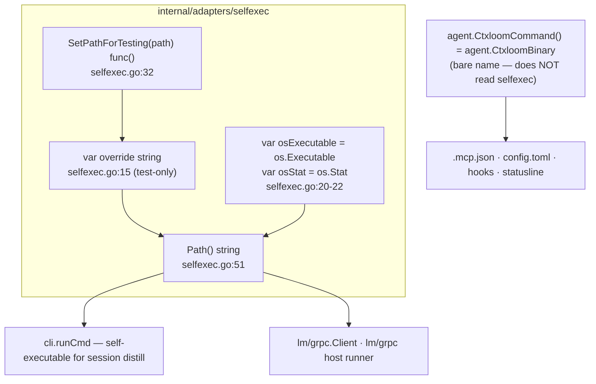

# `internal/adapters/selfexec` — self-path resolution

**What it is.** A 68-line, zero-dependency leaf package with one job: resolve the filesystem path
this process should use when **re-invoking the running ctxloom binary**, surviving an in-place
upgrade that unlinked the executing inode.

**The contract it owns.** *Return a path that names the binary that is running right now.* Its
consumers all **re-invoke ctxloom as a child process** within this session — `cli.runCmd`'s
self-executable resolution, `lm/grpc`'s plugin client and host runner. For those, "the binary
running right now" is exactly the right answer.

**It is NOT the source for a materialized surface.** `agent.CtxloomCommand()` — the funnel through
which every engine surface (`.mcp.json`, `config.toml`, hook commands, statusline,
context-injection commands) gets the command it bakes into a file on disk — returns the BARE name
`ctxloom` and does not call this package. A surface outlives the process that wrote it and is read
on other machines (`.claude/settings.json` is tracked) and inside containers, so a path naming
*this* process is precisely the wrong durable answer there.

---

## 1. Structure

```mermaid
flowchart TD
  subgraph unit["internal/adapters/selfexec"]
    OVR["var override string<br/>selfexec.go:15 (test-only)"]
    SEAM["var osExecutable = os.Executable<br/>var osStat = os.Stat<br/>selfexec.go:20-22"]
    PATH["Path() string<br/>selfexec.go:51"]
    SET["SetPathForTesting(path) func()<br/>selfexec.go:32"]
    SET --> OVR --> PATH
    SEAM --> PATH
  end

  PATH --> RUN["cli.runCmd — self-executable for session distill"]
  PATH --> GRPC["lm/grpc.Client · lm/grpc host runner"]

  CC["agent.CtxloomCommand() = agent.CtxloomBinary<br/>(bare name — does NOT read selfexec)"]
  CC --> SURF[".mcp.json · config.toml · hooks · statusline"]
```

**The decision tree inside `Path()`** (`selfexec.go:51-67`):

1. `override != ""` → return it (test short-circuit).
2. `osExecutable()` errors → return the bare string `"ctxloom"`.
3. Strip a trailing `" (deleted)"` — the Linux affordance for an unlinked inode, i.e. the
   in-place-upgrade case this package exists for.
4. `osStat(exe)` errors (the stripped path does not exist) → return `"ctxloom"`.
5. Return the resolved path.

---

## 2. Surface

| Symbol | file:line | Notes |
|---|---|---|
| `Path` | `selfexec.go:51` | The whole package. 4 production call sites: `internal/core/agent/settings_io.go:44`, `internal/adapters/cli/run.go:290`, `internal/lm/grpc/client.go:364`, `internal/lm/grpc/host_runner.go:60` |
| `SetPathForTesting` | `selfexec.go:32` | Sets `override`, returns a closure restoring the *previous* value, so it nests correctly. **Zero production call sites**; 4 external test packages use it (`internal/adapters/operations`, `internal/engines/claude`, `internal/lm/backends`, `internal/adapters/cli`) |
| `override` / `osExecutable` / `osStat` | `selfexec.go:15`, `:20`, `:22` | Package-level state. `{osExecutable, osStat}` are the in-package seams over the two syscalls; `override` is the cross-package short-circuit that bypasses both — it exists *because* the syscall seams are unexported and therefore unreachable from the four packages that need a stable answer |

---

## 3. Invariants

**Hold:**

1. **`Path` never returns the empty string.** Every branch returns either a resolved absolute path
   or the bare fallback name.
2. **The `" (deleted)"` strip plus the existence re-check** is the whole point: an in-place
   upgrade leaves `os.Executable()` reporting `/usr/local/bin/ctxloom (deleted)`, which is not a
   usable path; stripping it recovers the *installed* path, and the stat confirms the new binary is
   there.
3. **`SetPathForTesting` nests** — the returned restore closure captures the previous value, not
   the empty string.

**Do not hold, or are narrower than documented:**

- **`Path` has inverted error polarity: two resolution failures are converted into a
  plausible-looking success value.** `selfexec.go:57-58` and `:64-66` both return `"ctxloom"`, and
  the function has no error channel — so **no caller can tell "I know where I am" from "I am
  guessing"**. Every remaining caller spawns a child process with the result, so a silent
  fallback to `"ctxloom"` re-resolves against `PATH` and may spawn a different build than the one
  running, with nothing reported.
- **`override` is exported test-only mutable global state in a production package**, unsynchronized
  and read from child-spawn paths (`lm/grpc/host_runner.go:60`, `client.go:364`) at a time when
  the project runs `agent_run` children concurrently. No writer package currently uses
  `t.Parallel()`, so the exposure is future rather than demonstrated.
- **There are three different answers to "where is the running binary" in this repo**, with three
  different semantics and nothing reconciling them:

  | Function | Symlinks | Error return | `" (deleted)"` | Caching |
  |---|---|---|---|---|
  | `selfexec.Path` (`selfexec.go:51`) | not resolved | none — falls back to a bare name | **stripped** | none |
  | `agent.GetExecutablePath` (`shared/agent/symlink.go:25`) | `EvalSymlinks` | yes | not stripped | **process-lifetime cache** |
  | `isolation.selfLinuxExe` (`lm/isolation/imagebuild.go:1044`) | `EvalSymlinks` | yes | not stripped | none; errors unconditionally when `GOOS != "linux"` |

  So after an in-place upgrade, `WarnOnCtxloomPathSkew` compares a `" (deleted)"`-suffixed running
  path against a PATH lookup and reports skew that `Path` deliberately hides.
- **A second `…ForTesting` mutator is reachable from a production entry point.**
  `internal/adapters/operations/hooks.go:64-65` calls `agent.SetExecutablePathForTesting(req.ExecPath)`
  inside the exported `ApplyHooks` whenever `ApplyHooksRequest.ExecPath` is non-empty; that setter
  assigns the process-lifetime `cachedExecPath` with no lock and **no restore**. Latent today —
  every assignment to `ExecPath` is in a test — but a production request struct carrying a field
  whose only job is to mutate a global is a live hazard, and poisoning that cache makes the
  skew warning lie for the rest of the process.
- **`internal/adapters/cli.resolveSelfExecutable` (`run.go:289`) is a one-line pass-through** to
  `selfexec.Path()` with a single caller, whose 6-line doc comment duplicates `Path`'s own.
