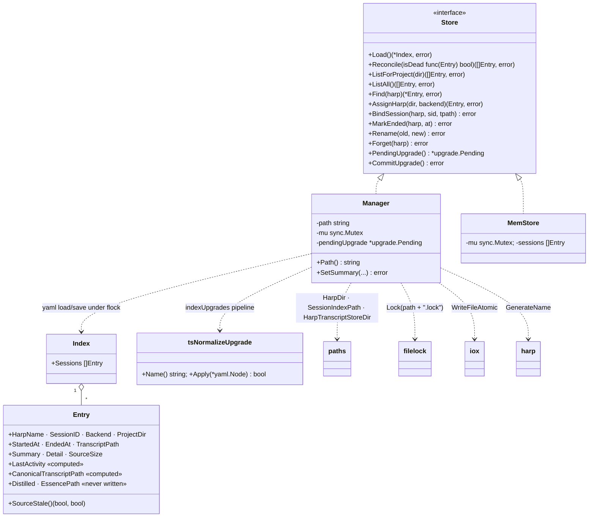
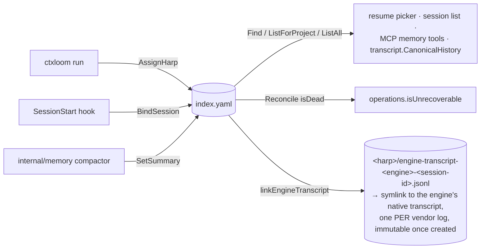

# `internal/sessions` — the harp-keyed session index

**What it is.** A single YAML file, `~/.ctxloom/sessions/index.yaml`, binding a generated harp
name to a backend session ID, a project dir, a transcript path, and a distilled summary — plus
the storage port (`Store`) that abstracts it and two adapters (a flock-protected filesystem
`Manager` and an in-memory `MemStore`).

**The contract it owns.** *A harp is minted before launch and is the stable identity everything
else keys on.* `ctxloom run` mints one pre-launch (`AssignHarp`); the spawned engine's
SessionStart hook binds the backend session ID (`BindSession`); the compactor stamps a summary
and a staleness fingerprint (`SetSummary`); the resume picker, `session list`, and the MCP memory
tools read through `Find` / `ListForProject` / `ListAll` / `Reconcile`.

Dependency direction is clean: this package depends on `internal/paths`, `internal/shared/{harp,
filelock,iox,upgrade,clidiag}` and nothing above it.

---

## 1. Structure

---

## 2. Types

| Symbol | file:line | Notes |
|---|---|---|
| `Entry` | `index.go:38` | Three field groups: the **binding** (`HarpName`, `SessionID`, `Backend`, `ProjectDir`, `StartedAt`, `EndedAt`, `TranscriptPath`), the **picker cache** (`Summary`, `Detail`, `SourceSize`), and **read-time enrichment** (`LastActivity`, `CanonicalTranscriptPath`, both `yaml:"-"`) |
| `Entry.SourceStale` | `index.go:588` | Picks canonical-over-legacy path, delegates to `TranscriptStale` |
| `Index` | `index.go:95` | `{Sessions []Entry}` — a one-field wrapper so the YAML has a named `sessions:` key. Marshalled directly as the `ctxloom://sessions/all` MCP resource (`internal/mcp/mcp_resources.go`, `ctxServer.handleResourceSessionsAll`) |
| `Store` | `store.go:19` | The storage port; twelve methods, deliberately narrower than `*Manager` (`Path` and `SetSummary` stay off it). Compile-time assertions at `store.go:35-38` |
| `Manager` | `index.go:102` | The filesystem adapter: `{path, mu, pendingUpgrade}` |
| `MemStore` | `memstore.go:18` | The in-memory adapter (ADR 0026). 22 external test call sites of `NewMemStore`; `internal/transcript/history_test.go` and `internal/lm/grpc/canonical_source_test.go` both build against it |
| `tsNormalizeUpgrade` | `index_upgrade.go:25` | The one registered index upgrade: rewrites `started_at`/`ended_at` scalars to canonical RFC3339Nano so Go's RFC3339-only decoder stops rejecting externally-written timestamps |

---

## 3. Functions

| Symbol | file:line | Notes |
|---|---|---|
| `Open` | `index.go:115` | Resolves the index path (override or `paths.SessionIndexPath`), MkdirAll's the parent. **Mints a fresh `Manager` per call** — six production sites — so `mu` serializes nothing across instances; the flock is the real serializer |
| `Load` / `loadLocked` | `index.go:135`, `:141` | ENOENT and zero-length are both treated as an empty index; the upgrade pipeline runs **in memory** on every load and stages `pendingUpgrade` |
| `PendingUpgrade` / `CommitUpgrade` | `index.go:171`, `:187` | `CommitUpgrade` **re-stages from the file's current bytes** under the flock before writing, so it cannot clobber a concurrent `BindSession` |
| `AssignHarp` | `index.go:228` | flock → load → build the used-set → mint a unique harp → append a pending entry → save |
| `BindSession` | `index.go:268` | **First-bind-wins** fill of `SessionID`/`TranscriptPath`, then the harp-dir symlink |
| `linkEngineTranscript` | `index.go` | MkdirAll `<harp>/`, skip if the transcript already lives inside it (a `filepath.Rel` containment check), else create `<harp>/engine-transcript-<engine>-<sessionID>.jsonl` (`paths.HarpEngineTranscriptLinkPath`) as a symlink — one per vendor log, never repointed except on a session-id-reuse anomaly (then via `atomicSymlink`, with a warning). The retired single mutable `<harp>/transcript.jsonl` name is never created or repointed by current code; pre-existing links under that name are left alone (fs-consolidation plan C12). Best-effort — every failure `clidiag.Warn`s |
| `LocateTranscript` | `index.go:350` | Walks `<harp>/persist/transcripts` for the newest `.jsonl` (else newest `.json`), skipping `subagents/` subtrees. **No external callers** — the only outside hits are two doc comments |
| `fillTranscriptByLocation` / `fillCanonicalTranscript` | `index.go:405`, `:428` | Read-time enrichment, on an entry **copy** |
| `Find` | `index.go:455` | Load, linear search, return an enriched copy or `(nil, nil)` for absent — the documented contract, not a swallowed error |
| `ActivityTime` | `index.go:483` | Canonical-transcript mtime → legacy-transcript mtime → `StartedAt` |
| `ListForProject` / `ListAll` | `index.go:509`, `:527` | Load, filter, `enrichAndSortByActivity` |
| `enrichAndSortByActivity` | `index.go:540` | Fills both computed paths + `LastActivity` **once per entry, outside the comparator** (documented at `:481`), then sorts desc by activity with a `StartedAt` tiebreak |
| `TranscriptStale` | `index.go:567` | Size-compare against the stamped fingerprint; `(false, false)` when undeterminable — the tri-state return *is* the error channel |
| `MarkEnded` / `Rename` / `Forget` | `index.go:597`, `:625`, `:661` | flock → load → mutate → save; unknown harp errors actionably |
| `Reconcile` | `index.go:691` | flock → load → filter by the caller's `isDead` predicate → **save only if something was dropped** → fill located transcripts on the survivors |
| `SetSummary` | `index.go:732` | Overwrites `Summary`, `Detail`, `SourceSize`. One production call site: `internal/memory/compactor.go:579` |
| `saveLocked` | `index.go:758` | Marshal + `iox.WriteFileAtomic` + clear `pendingUpgrade` |
| `generateUniqueHarp` | `index.go:775` | 100 tries against a used-set, then one unredeemed fallback — a verbatim reimplementation of the shared `harp.UniqueFrom` (`internal/shared/harp/harp.go:185-193`) |
| `normalizeTimestampNode` / `parseTimestamp` | `index_upgrade.go:66`, `:91` | |

---

## 4. Invariants

**Hold, and are load-bearing:**

1. **Every mutation is one atomic load+save under a cooperative flock** on `<index path>.lock`
   (eight sites: `index.go:194,232,272,601,632,665,695,736`), written via `iox.WriteFileAtomic`.
2. **First bind wins.** `BindSession` fills `SessionID`/`TranscriptPath` only when currently
   empty (`index.go:291`) — the TOCTOU guard for a concurrent second bind.
3. **`Reconcile` performs no write when nothing was dropped** (`index.go:691-723`).
4. **`Find` returns `(nil, nil)` for an absent harp** — absence is not an error.
5. **The upgrade pipeline is staged, never auto-applied.** `loadLocked` runs upgrades in memory
   and records them; only an explicit `CommitUpgrade` writes, and it re-reads first.
6. **Sort keys are computed once per entry, not inside the comparator** (`index.go:540-554`) —
   otherwise the `os.Stat` calls in `ActivityTime` would run O(n log n) times.
7. **The harp-dir symlink is skipped when the transcript already lives inside the harp dir**
   (`index.go:325-331`), so ctxloom never symlinks a file to itself.
8. **`Distilled` / `EssencePath` are documented as computed at list/show time** — the real
   computation lives in `internal/cli`'s `sessionEssenceInfo` → `SessionRow`.

**Do not hold, or are narrower than documented:**

- **No harp identifier is ever validated before it becomes a filesystem path.** `Rename`
  (`index.go:625`, `memstore.go:165`) checks only `newName != ""`. A harp of `../../x` reaches
  `paths.HarpDir` and then `os.MkdirAll`/`os.Symlink` in `linkEngineTranscript`. [Pre-existing
  doc drift, not touched by fs-consolidation C12: `paths.HarpDir` now runs `harp.Validate`
  before joining — worth re-checking whether this whole invariant still holds.] The reachable
  path is
  `ctxloom session rename <old> <arbitrary-string>` → `internal/cli/session_cmd.go:201-209` →
  `operations/sessions.go:181` → `mgr.Rename`.
- **`BindSession(harp, "", "")` succeeds having changed nothing** — it finds the entry, assigns
  `SessionID = ""`, performs a full index rewrite, and returns nil. The only empty-id guard lives
  one layer out at `operations/sessions.go:255`; `internal/memory/compactor.go:570` calls
  `mgr.BindSession` **directly on the Manager**, bypassing it. `MemStore.BindSession`
  (`memstore.go:137-144`) has the identical hole.
- ~~**`SetSummary(harp, "", nil, 0)` succeeds and *erases* a good summary, its detail lines, and its
  staleness fingerprint**; the guard is at the call site, not in the writer.~~ —
  **RESOLVED `07abd892`** (U099-F20). `SetSummary` (`index.go:742-744`) now refuses an
  empty summary outright, naming exactly what the write would have erased. The guard
  moved into the **writer**, which is the point: the call-site guard in
  `internal/memory` was correct and a second caller reaching the writer directly would
  not have replicated it.
- **`Reconcile` is the only entry-returning method that never fills
  `CanonicalTranscriptPath`**, so its `isDead` predicate always sees `""`. A session whose legacy
  engine transcript was deleted but whose ctxloom-captured canonical transcript is present is
  silently forgotten; `operations.isUnrecoverable` has no canonical branch because the field is
  never populated on that path.
- **`Reconcile` invokes the caller's predicate while holding both `mu` and the blocking flock**
  (`index.go:707`); `internal/shared/filelock` documents the lock as blocking with no timeout, and
  `Open("")` mints a fresh `Manager` per call so re-entry is not self-detectable.
- **`pendingUpgrade` is cleared as a side effect of every *read*.** `Find`/`ListForProject`/
  `ListAll` all funnel through `Load` → `loadLocked:142`, which unconditionally nils it. Benign
  only because `CommitUpgrade:208` re-stages from fresh bytes, so a lost staging degrades to "no
  prompt offered".
- **An unparseable timestamp degrades to `time.Now()`** (`index_upgrade.go:71-78`). Because the
  upgrade runs in memory on **every load** and persists only on `CommitUpgrade`, such an entry
  gets a different value each invocation: its picker sort position drifts and `pendingUpgrade` is
  permanently non-nil.
- **`Entry.Distilled` and `Entry.EssencePath` are written by nothing, anywhere.** `Distilled` also
  carries `json:"distilled"` with no `omitempty`, so it is a constant `false` on any JSON marshal.
- **`Entry`'s doc claims the json tags are a shared snake_case contract for
  `session list --format json` and the VSCode companion** — no code path marshals `sessions.Entry`
  to JSON. `internal/cli/session_row.go:36-40` says the opposite explicitly, and
  `ctxloom://sessions/all` marshals as **YAML**, where all four computed fields are dropped.
- **`MemStore`'s doc claims it mirrors `*Manager` "without touching disk"** — `ListForProject`,
  `ListAll` and `Find` all call `fillCanonicalTranscript` → `paths.ResolveHarpCanonicalTranscriptPath`
  → up to two `os.Stat`s under the real `$HOME`, and `ActivityTime` stats again. The two adapters
  also genuinely diverge: `MemStore`'s list methods never call `fillTranscriptByLocation`, which
  `Manager`'s do.
- **`saveLocked(nil)` would marshal to the literal `null`** and atomically overwrite the index with
  it; `loadLocked` would then read that as "you have no sessions" with no error at any point. No
  caller passes nil today.
- **RESOLVED by fs-consolidation C12 (Q2 ruled 2026-08-13):** the harp-root symlink used to be a
  single mutable `<harp>/transcript.jsonl`, whose leaf name collided with
  `paths.CanonicalTranscriptFileName` — the SAME string naming a DIFFERENT file (ctxloom's own
  capture at `<harp>/persist/transcript.jsonl`). It is now one immutable symlink PER vendor log,
  named `<harp>/engine-transcript-<engine>-<sessionID>.jsonl` (`paths.HarpEngineTranscriptLinkPath`),
  which cannot collide with the canonical leaf name. Pre-existing `transcript.jsonl` symlinks from
  before this change are left on disk, untouched (no migration; standing no-backward-compat-shims
  policy) — nothing reads them, and nothing writes that name anymore.
- **`(*Manager).Path` has exactly one call site in the repo, and it is a test in this package.**
  `LocateTranscript` is exported with zero external callers.
