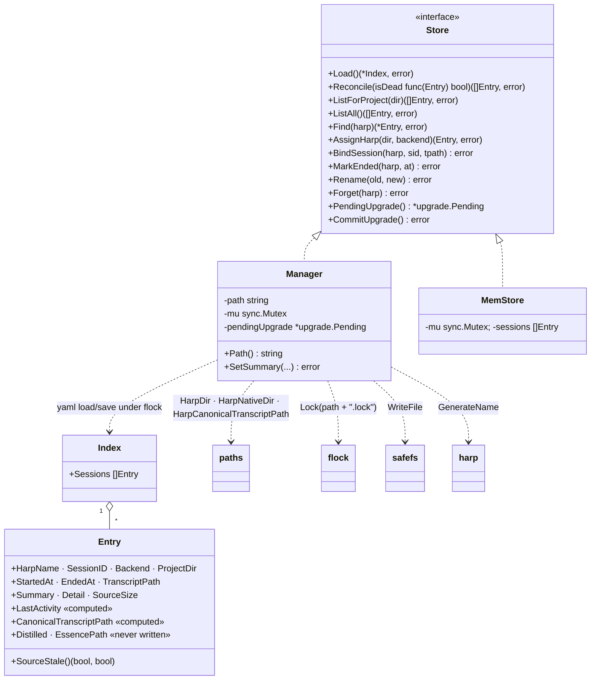
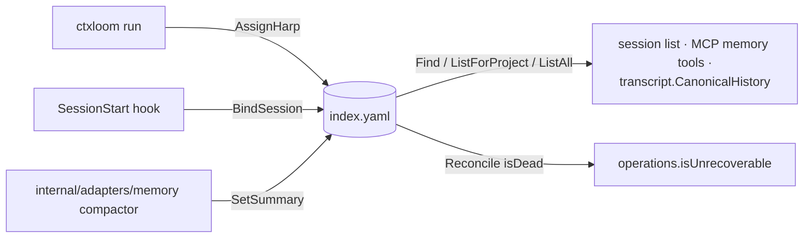

# `internal/core/sessions` — the harp-keyed session index

**What it is.** A single YAML file, `~/.ctxloom/sessions/index.yaml`, binding a generated harp
name to a backend session ID, a project dir, a transcript path, and a distilled summary — plus
the storage port (`Store`) that abstracts it and two adapters (a flock-protected filesystem
`Manager` and an in-memory `MemStore`).

**The contract it owns.** *A harp is minted before launch and is the stable identity everything
else keys on.* `ctxloom run` mints one pre-launch (`AssignHarp`); the spawned engine's
SessionStart hook binds the backend session ID (`BindSession`); the compactor stamps a summary
and a staleness fingerprint (`SetSummary`); `session list` and the MCP memory
tools read through `Find` / `ListForProject` / `ListAll` / `Reconcile`.

Dependency direction is clean: this package depends on `internal/core/paths`, `internal/shared/{harp,
safefs,upgrade,clidiag}`, and `github.com/gofrs/flock` (a third-party module, not an internal/shared
package), and nothing above it.

---

## 1. Structure

```mermaid
classDiagram
    class Store {
        <<interface>>
        +Load() (*Index, error)
        +Reconcile(isDead func(Entry) bool) ([]Entry, error)
        +ListForProject(dir) ([]Entry, error)
        +ListAll() ([]Entry, error)
        +Find(harp) (*Entry, error)
        +AssignHarp(dir, backend) (Entry, error)
        +BindSession(harp, sid, tpath) error
        +MarkEnded(harp, at) error
        +Rename(old, new) error
        +Forget(harp) error
        +PendingUpgrade() *upgrade.Pending
        +CommitUpgrade() error
    }
    class Manager {
        -path string
        -mu sync.Mutex
        -pendingUpgrade *upgrade.Pending
        +Path() string
        +SetSummary(...) error
    }
    class MemStore { -mu sync.Mutex; -sessions []Entry }
    class Index { +Sessions []Entry }
    class Entry {
        +HarpName · SessionID · Backend · ProjectDir
        +StartedAt · EndedAt · TranscriptPath
        +Summary · Detail · SourceSize
        +LastActivity  «computed»
        +CanonicalTranscriptPath  «computed»
        +Distilled · EssencePath  «never written»
        +SourceStale() (bool, bool)
    }

    Store <|.. Manager
    Store <|.. MemStore
    Manager ..> Index : yaml load/save under flock
    Index "1" o-- "*" Entry
    Manager ..> paths : HarpDir · HarpNativeDir · HarpCanonicalTranscriptPath
    Manager ..> flock : Lock(path + ".lock")
    Manager ..> safefs : WriteFile
    Manager ..> harp : GenerateName
```

```mermaid
flowchart LR
  RUN["ctxloom run"] -->|AssignHarp| IDX[("index.yaml")]
  HOOK["SessionStart hook"] -->|BindSession| IDX
  COMP["internal/adapters/memory compactor"] -->|SetSummary| IDX
  IDX -->|Find / ListForProject / ListAll| READ["session list · MCP memory tools ·<br/>transcript.CanonicalHistory"]
  IDX -->|Reconcile isDead| REAP["operations.isUnrecoverable"]
```

---

## 2. Types

| Symbol | file:line | Notes |
|---|---|---|
| `Entry` | `index.go:38` | Three field groups: the **binding** (`HarpName`, `SessionID`, `Backend`, `ProjectDir`, `StartedAt`, `EndedAt`, `TranscriptPath`), the **summary cache** (`Summary`, `Detail`, `SourceSize`), and **read-time enrichment** (`LastActivity`, `CanonicalTranscriptPath`, both `yaml:"-"`) |
| `Entry.SourceStale` | `index.go:588` | Picks canonical-over-legacy path, delegates to `TranscriptStale` |
| `Index` | `index.go:95` | `{Sessions []Entry}` — a one-field wrapper so the YAML has a named `sessions:` key. Marshalled directly as the `ctxloom://sessions/all` MCP resource (`internal/adapters/mcp/mcp_resources.go`, `ctxServer.handleResourceSessionsAll`) |
| `Store` | `store.go:19` | The storage port; twelve methods, deliberately narrower than `*Manager` (`Path` and `SetSummary` stay off it). Compile-time assertions at `store.go:35-38` |
| `Manager` | `index.go:102` | The filesystem adapter: `{path, mu, pendingUpgrade}` |
| `MemStore` | `memstore.go:18` | The in-memory adapter (ADR 0026). 22 external test call sites of `NewMemStore`; `internal/adapters/transcript/history_test.go` builds against it |

---

## 3. Functions

| Symbol | file:line | Notes |
|---|---|---|
| `Open` | `manager.go` | Returns a `Manager` over `paths.HomeSessionsDir`, MkdirAll'ing it; the session directories and their `session.yaml` sidecars are the only source of sessions (a retired `index.yaml` is not read) |
| `Load` / `loadLocked` | `index.go:135`, `:141` | ENOENT and zero-length are both treated as an empty index; the upgrade pipeline runs **in memory** on every load and stages `pendingUpgrade` |
| `PendingUpgrade` / `CommitUpgrade` | `index.go:171`, `:187` | `CommitUpgrade` **re-stages from the file's current bytes** under the flock before writing, so it cannot clobber a concurrent `BindSession` |
| `AssignHarp` | `index.go:228` | flock → load → build the used-set → mint a unique harp → append a pending entry → save |
| `BindSession` | `index.go:268` | **First-bind-wins** fill of `SessionID`/`TranscriptPath`; the path is recorded with symlinks resolved (`boundTranscriptPath`), so a binding made through the disposable engine home names the file under `native/` and survives the home's deletion |
| `LocateTranscript` | `transcript.go` | Walks `<harp>/native` (`paths.HarpNativeDir`) for the newest `.jsonl` (else newest `.json`), skipping `subagents/` subtrees — where every engine's native history lands through its session home's link, on the host and in a container alike |
| `fillTranscriptByLocation` / `fillCanonicalTranscript` | `index.go:405`, `:428` | Read-time enrichment, on an entry **copy** |
| `Find` | `index.go:455` | Load, linear search, return an enriched copy or `(nil, nil)` for absent — the documented contract, not a swallowed error |
| `ActivityTime` | `index.go:483` | Canonical-transcript mtime → legacy-transcript mtime → `StartedAt` |
| `ListForProject` / `ListAll` | `index.go:509`, `:527` | Load, filter, `enrichAndSortByActivity` |
| `enrichAndSortByActivity` | `index.go:540` | Fills both computed paths + `LastActivity` **once per entry, outside the comparator** (documented at `:481`), then sorts desc by activity with a `StartedAt` tiebreak |
| `TranscriptStale` | `index.go:567` | Size-compare against the stamped fingerprint; `(false, false)` when undeterminable — the tri-state return *is* the error channel |
| `MarkEnded` / `Rename` / `Forget` | `index.go:597`, `:625`, `:661` | flock → load → mutate → save; unknown harp errors actionably |
| `Reconcile` | `index.go:691` | flock → load → filter by the caller's `isDead` predicate → **save only if something was dropped** → fill located transcripts on the survivors |
| `SetSummary` | `index.go:732` | Overwrites `Summary`, `Detail`, `SourceSize`. One production call site: `internal/adapters/memory/compactor.go:579` |
| `saveLocked` | `index.go:758` | Marshal + `safefs.WriteFile` + clear `pendingUpgrade` |
| `generateUniqueHarp` | `index.go:775` | 100 tries against a used-set, then one unredeemed fallback — a verbatim reimplementation of the shared `harp.UniqueFrom` (`internal/shared/harp/harp.go:185-193`) |

---

## 4. Invariants

**Hold, and are load-bearing:**

1. **Every mutation is one atomic load+save under a cooperative flock** on `<index path>.lock`
   (eight sites: `index.go:194,232,272,601,632,665,695,736`), written via `safefs.WriteFile`.
2. **First bind wins.** `BindSession` fills `SessionID`/`TranscriptPath` only when currently
   empty (`index.go:291`) — the TOCTOU guard for a concurrent second bind.
3. **`Reconcile` performs no write when nothing was dropped** (`index.go:691-723`).
4. **`Find` returns `(nil, nil)` for an absent harp** — absence is not an error.
5. **The upgrade pipeline is staged, never auto-applied.** `loadLocked` runs upgrades in memory
   and records them; only an explicit `CommitUpgrade` writes, and it re-reads first.
6. **Sort keys are computed once per entry, not inside the comparator** (`index.go:540-554`) —
   otherwise the `os.Stat` calls in `ActivityTime` would run O(n log n) times.
7. **The harp-dir symlink is skipped when the transcript already lives inside the harp dir**
   (`index.go:325-331`), so ctxloom never symlinks a file to itself.
8. **`Distilled` / `EssencePath` are documented as computed at list/show time** — the real
   computation lives in `internal/adapters/cli`'s `sessionEssenceInfo` → `SessionRow`.

**Do not hold, or are narrower than documented:**

- **`BindSession(harp, "", "")` succeeds having changed nothing** — it finds the entry, assigns
  `SessionID = ""`, performs a full index rewrite, and returns nil. The only empty-id guard lives
  one layer out at `operations/sessions.go:255`; `internal/adapters/memory/compactor.go:570` calls
  `mgr.BindSession` **directly on the Manager**, bypassing it. `MemStore.BindSession`
  (`memstore.go:137-144`) has the identical hole.
- ~~**`SetSummary(harp, "", nil, 0)` succeeds and *erases* a good summary, its detail lines, and its
  staleness fingerprint**; the guard is at the call site, not in the writer.~~ —
  **RESOLVED `07abd892`** (U099-F20). `SetSummary` (`index.go:742-744`) now refuses an
  empty summary outright, naming exactly what the write would have erased. The guard
  moved into the **writer**, which is the point: the call-site guard in
  `internal/adapters/memory` was correct and a second caller reaching the writer directly would
  not have replicated it.
- **`Reconcile` is the only entry-returning method that never fills
  `CanonicalTranscriptPath`**, so its `isDead` predicate always sees `""`. A session whose legacy
  engine transcript was deleted but whose ctxloom-captured canonical transcript is present is
  silently forgotten; `operations.isUnrecoverable` has no canonical branch because the field is
  never populated on that path.
- **`Reconcile` invokes the caller's predicate while holding both `mu` and the blocking flock**
  (`index.go:707`); `github.com/gofrs/flock`'s `Lock` is blocking with no timeout, and
  `Open("")` mints a fresh `Manager` per call so re-entry is not self-detectable.
- **`pendingUpgrade` is cleared as a side effect of every *read*.** `Find`/`ListForProject`/
  `ListAll` all funnel through `Load` → `loadLocked:142`, which unconditionally nils it. Benign
  only because `CommitUpgrade:208` re-stages from fresh bytes, so a lost staging degrades to "no
  prompt offered".
- **`Entry.Distilled` and `Entry.EssencePath` are written by nothing, anywhere.** `Distilled` also
  carries `json:"distilled"` with no `omitempty`, so it is a constant `false` on any JSON marshal.
- **`Entry`'s doc claims the json tags are a shared snake_case contract for
  `session list --format json` and the VSCode companion** — no code path marshals `sessions.Entry`
  to JSON. `internal/adapters/cli/session_row.go:36-40` says the opposite explicitly, and
  `ctxloom://sessions/all` marshals as **YAML**, where all four computed fields are dropped.
- **`MemStore`'s doc claims it mirrors `*Manager` "without touching disk"** — `ListForProject`,
  `ListAll` and `Find` all call `fillCanonicalTranscript`, which stats
  `paths.HarpCanonicalTranscriptPath` under the real `$HOME`, and `ActivityTime` stats again. The two adapters
  also genuinely diverge: `MemStore`'s list methods never call `fillTranscriptByLocation`, which
  `Manager`'s do.
- **`saveLocked(nil)` would marshal to the literal `null`** and atomically overwrite the index with
  it; `loadLocked` would then read that as "you have no sessions" with no error at any point. No
  caller passes nil today.
- **`(*Manager).Path` has exactly one call site in the repo, and it is a test in this package.**

