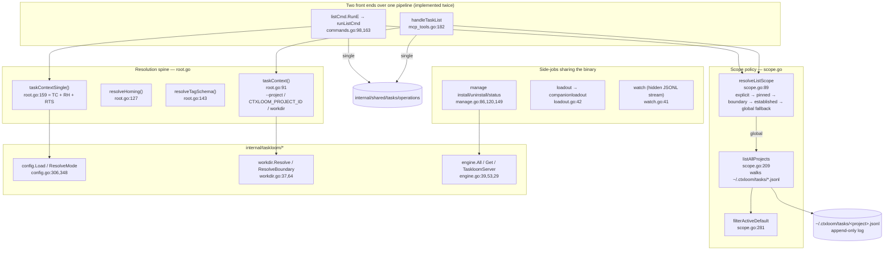

# `taskloom` — per-project task tracking

**What it is.** `taskloom` is a second standalone binary (`cmd/taskloom`) over an append-only,
harp-keyed task log. It exposes one store **twice** — as a cobra CLI
(`list`/`add`/`status`/`edit`/`tag`/`tags`/`summary`/`statuses`/`lint`/`plan`/`run`/`show`/
`watch`/`manage`/`loadout`) and as an MCP stdio server (`taskloom mcp`: five `task_*` tools plus
two `taskloom://` resources).

**The contract it owns.** *Resolve "which project's task log am I acting on", then present that
store consistently through both front ends.* All real task semantics live below it in
`internal/shared/tasks/operations`; `cmd/taskloom` owns **resolution**
(`taskContext` → `resolveHoming` → `resolveTagSchema`), **scope policy** (single-project vs
`--global`), and **presentation**.

`internal/taskloom/*` holds the three pieces that must exist **without ctxloom**: taskloom's own
layered config, its own agent-MCP registrar registry, and its own project-root resolution.

---

## 1. Structure

---

## 2. `internal/taskloom/config` — taskloom's own config surface

**What it owns.** Two settings and their defaulting policy: `homing` (where the task log lives —
`paths.ModeHome` or `paths.ModeRepo`) and `tag_schema` (the tag-facet declaration list). Layered
through `internal/shared/confload` as home < project < `TASKLOOM_CONFIG_*` env < `--config-set`,
then validated against an embedded JSON Schema.

| Symbol | file:line | Notes |
|---|---|---|
| `Config` | `config.go:182` | `{Homing string, TagSchema []string}`. Both methods are on the **value** receiver — the type is immutable after `Load` |
| `ResolvedTagSchema` | `config.go:202` | `c.TagSchema`, or `DefaultTagSchema` when empty. This three-line method *is* the "a fresh project gets the full standard with no opt-in" policy |
| `ParsedTagSchema` | `config.go:215` | `tagschema.Parse(c.ResolvedTagSchema())` — fails loud on a bad declaration |
| `DefaultTagSchema` | `config.go:169-179` | Two ~300-character priority/decay formula strings that hard-code identifiers owned by `priority` (`age_days`, `age_factor`, the `{{ns:key=*}}` composite syntax) and by `tagschema`. A rename there fails at **run time**, on every invocation; `config_test.go:326-352` compiles the default and asserts `diag.NoPriorityFn` is false, which is the only guard |
| `Load` | `config.go:306` | `loadRaw` → remarshal to YAML → unmarshal into `Config` → validate the **merged** bytes (which is the right layer: it catches an unknown key introduced by an env override) |
| `ResolveMode` | `config.go:348` | Precedence: `cfg.Homing` → `flagValue` (wins) → `ModeHome`. The default sits **below** the whole chain, not inside it. "Absent is fine, wrong is not": an invalid value errors naming both the bad value and the valid set (`:363-366`) |
| `NewValidator` | `config.go:238` | Compiles the embedded schema. Called at `:276` (for `confload`'s `KnownPath`) and again at `:322` (for `ValidateBytes`) |
| `HomeConfigPath` / `ProjectConfigPath` | `config.go:247`, `:257` | `~/.taskloom/config.yaml`, `<workDir>/.taskloom/config.yaml` |
| `SchemaPath` / `SchemaResourceName` / `DirName` / `FileName` / `EnvPrefix` | `config.go:57-87` | `SchemaPath` is consumed externally by `cmd/taskloom/docs_gen.go:36` |

**Invariants**

- **Unset `homing` resolves silently to `ModeHome`, and that is deliberate.** The 34-line package
  doc (`config.go:13-34`) argues it: `ModeHome` is the pre-homing status quo, and the only
  surprising default would be `ModeRepo`, which would silently relocate someone's tasks.
- **A schema-compile failure skips validation entirely.** `Load` binds `verr` at `config.go:322`
  and never uses it on any path — no `else` — so `Load` returns `(cfg, nil)` having validated
  against nothing. The doc immediately above (`:297-305`) promises the opposite ("an unknown key
  … is a returned error naming the offending content"). The same discard at `:276` is benign,
  because `schema.ConfigValidator.KnownPath` is nil-receiver-safe.
- **A `os.UserHomeDir` failure silently drops the whole home-config layer** (`config.go:285-287`:
  `if hp, herr := HomeConfigPath(); herr == nil`), while the far less consequential
  `--config-set` parse failure two lines below *does* `clidiag.Warn` (`:280-282`).
- **`Load` is called twice and the schema compiled four times per command.** `taskContextSingle`
  (`cmd/taskloom/root.go:158-169`) calls `resolveHoming` → `ResolveMode` → `Load`, **and**
  `resolveTagSchema` → `Load`; each `Load` compiles the validator at `:276` and `:322`. Nothing
  caches.
- **An explicit `tag_schema: []` is indistinguishable from the key being unset** (`config.go:203`
  tests `len(...) > 0`), so it silently gets the full default back. The JSON Schema permits the
  empty list with no `minItems`.
- **The published schema description contradicts the code.** `homing`'s description in
  `resources/schema/input/taskloom-config-schema.json` states the key "must set it before any
  command that touches a single project's store will run"; `ResolveMode:357-359` returns
  `paths.ModeHome` for an unset value. That description is rendered into published docs via
  `cmd/taskloom/docs_gen.go:36`. *(Documented behaviour is the opposite of real behaviour; the
  real behaviour is the silent `home` default.)*

---

## 3. `internal/taskloom/engine` — MCP registrar registry

**What it owns.** The list of agent MCP registrars `taskloom manage` can install into, and the
server command line to register — **without depending on ctxloom**. 64 LOC; all engine-specific
detail (config paths, on-disk format, merge semantics) lives in each agent module's own
`MCPRegistrar` (`internal/claude`, `internal/antigravity`, `internal/codex`, `internal/kiro`).

| Symbol | file:line | Notes |
|---|---|---|
| `Engine` | `engine.go:22` | `= agent.MCPRegistrar` — a type **alias**, not a definition |
| `TaskloomName` | `engine.go:25` | `"taskloom"`, the registration key |
| `TaskloomServer` | `engine.go:29` | `wire.MCPServer{Command: "taskloom", Args: ["mcp"]}` — the one place the command line is named |
| `engines` / `All` | `engine.go:34`, `:39` | The registry: claude, antigravity, codex, kiro |
| `Get` | `engine.go:53` | Lowercase → `engineAliases` (`:44`) → linear scan on `Name()`. **No prefix matching** — a typo must error |

**Invariants**

- **`Command` is a bare PATH name**, resolved against *the agent's* environment at some future
  invocation, not verified at registration. `manage check` reports it
  (`cmd/taskloom/manage.go:150-153` runs `exec.LookPath`); `manage install` does not.
- **opencode is absent** from the registry and cannot appear — `rg 'MCPRegistrar' internal/opencode/`
  returns nothing. The user-visible error at `cmd/taskloom/manage.go:91` enumerates only the four.
- **A second engine registry exists** at `internal/ltk/engine` with a near-identical `Get`, its own
  `engineAliases`, and an overlapping name vocabulary. The two have already drifted:
  `antigravity-cli` resolves under ltk and errors under taskloom. They hold genuinely different
  interfaces (MCP registrars vs hook adapters), so the duplication is in the **vocabulary**, not
  the registry shape.

---

## 4. `internal/taskloom/workdir` — project-root resolution

**What it owns.** Resolve the project work root the way `ctxloom run` does —
`CTXLOOM_ROOT` (valid) → git root → cwd → `"."` — then redirect through
`projectroot.TaskStoreRoot` so a **linked git worktree with no `.ctxloom` of its own** lands on
its primary checkout's task store rather than one that dies with the worktree.

| Symbol | file:line | Notes |
|---|---|---|
| `EnvVar` | `workdir.go:32` | `"CTXLOOM_ROOT"` |
| `Resolve` | `workdir.go:37` | `ResolveBoundary()` discarding `found`. Consumer: `cmd/taskloom/root.go:96` (`taskContext`) — i.e. **every mutation** |
| `ResolveBoundary` | `workdir.go:64` | `(root, found, err)`. The unit's real contribution: composing "where is the project" with "which checkout owns the task store", preserving that the redirect changes *which store*, not *whether a boundary was found*. Consumer: `cmd/taskloom/scope.go:96` (`resolveListScope`) — i.e. reads |
| `resolveBase` | `workdir.go:76` | The chain; `found` is true only for the env and git-root branches |
| `fromEnv` / `gitRoot` | `workdir.go:93`, `:113` | |

**Invariants**

- **`found == false` sends a *read* to global aggregation** rather than minting an identity for an
  arbitrary directory (`cmd/taskloom/scope.go:96-110`). Reads never mint identity —
  `isEstablishedProject` (`scope.go:117`) checks for a registry entry or an in-tree marker
  *without creating one*.
- **`Resolve` discards `found`**, so the mutation path has no such protection.
- **A stale worktree pointer is a hard error** — the package doc states "this package never falls
  back to minting a task store nobody will find again". `resolveBase:83-86` does exactly that on
  an `os.Getwd()` failure: it returns the bare relative string `"."`, with no error, which flows
  through `TaskStoreRoot` → `TaskContext.WorkDir` → `projectid.Mint(".")` and can register a
  permanent registry entry keyed on `"."`. *(Documented commitment and real behaviour diverge;
  the real behaviour is the silent `"."` fallback.)* The identical `return "."` exists at
  `projectroot.go:88`.
- **`fromEnv` collapses "unset" and "set but unusable" into `("", false)`** (`:94-96` vs
  `:105-108`), and `warnOnce` (`:34`) means the second and later commands in a process get
  silence. `projectroot.resolve` keeps the distinction as a third return value and then discards
  it too.
- **The resolution chain is a third copy.** `resolveBase` duplicates `projectroot.WorkDir`
  (`projectroot.go:78-89`) branch for branch, `fromEnv` duplicates `projectroot.resolve`+`FromEnv`
  including the warning string verbatim, `EnvVar` is declared in both, and each has its own
  `sync.Once`. `projectroot.RootFromFallback` is a fourth partial copy that re-derives the boolean
  `resolveBase` already computes.

---

## 5. `cmd/taskloom` — the front ends

### 5.1 Resolution spine

| Symbol | file:line | Notes |
|---|---|---|
| `taskContext` | `root.go:91` | Project id + workdir + session harp. A workdir error is demoted to a warning when a project id is pinned |
| `resolveHoming` | `root.go:127` | Layers homing-mode resolution onto `tc` |
| `resolveTagSchema` | `root.go:143` | Layers tag-schema resolution onto `tc`; fails loud on a malformed schema |
| `taskContextSingle` | `root.go:159` | The three-step combo every single-project command needs — 12 call sites |
| `noteTaskProject` / `formatProjectLabel` | `root.go:182`, `:191` | Post-mutation stderr attribution. **Note the argument order is opposite between the two**: `noteTaskProject(projectID, projectDir)` delegates to `formatProjectLabel(dir, id)` |
| `warnTask` | `root.go:204` | Emits a non-empty operations warning via `clidiag` |
| `renderTaskTable` | `root.go:216` | The human `list` view, through an `iox.ErrWriter` |

### 5.2 Scope policy

| Symbol | file:line | Notes |
|---|---|---|
| `listScope` | `scope.go:66` | `{Global bool, Notice string}` — `Notice != ""` means "fallback, not explicit opt-in" |
| `resolveListScope` | `scope.go:89` | explicit `--global` → pinned project → boundary found → established project → global fallback |
| `isEstablishedProject` | `scope.go:117` | Registry entry or in-tree marker, **without minting one** |
| `globalScopeLimitationNote` | `scope.go:155` | Sharpened when cwd is repo-homed |
| `listAllProjects` | `scope.go:209` | Walks `~/.ctxloom/tasks/*.jsonl`, filters, optionally prices priority, sorts. Every store error is wrapped with the project id; a missing dir yields empty rather than an error |
| `filterActiveDefault` | `scope.go:281` | Re-implements `operations`' active-only rule for the global path, because `operations` resolves exactly one project. Documented and justified, but it is a connascence-of-algorithm pair |
| `taskRow` / `compactTaskRow` | `scope.go:34`, `:45` | A task tagged with the project it came from, so consumers never branch on global-vs-single. `listAllProjects` never populates `ProjectDir` (`scope.go:256`) while the single-project path does (`mcp_tools.go:266`) |
| `globalListResult` | `scope.go:172` | Deliberately **not** `operations.TaskListResult` — so it carries no `OmittedByLimit` and no `Path` |

### 5.3 The MCP surface

| Symbol | file:line | Notes |
|---|---|---|
| `newMCPServer` | `mcp.go:44` | The single source both `taskloom mcp` and the docs generator use |
| `registerTaskTools` | `mcp_tools.go:138` | Five `mcp.AddTool` literals — the descriptions **are** the product surface |
| `taskListInput` / `taskListResult` | `mcp_tools.go:18`, `:30` | Input mirrors `listOptions` field-for-field except `Format`; the result carries as structured fields everything the CLI writes to stderr (`Notice`, `Hidden*`, `OmittedByLimit`, `PriorityWarning`) |
| `handleTaskList` | `mcp_tools.go:182` | The list pipeline again, MCP-shaped |
| `taskAdd/SetStatus/Edit/TagResult` | `mcp_tools.go:96,107,117,128` | All four are exactly `{Path string, Task tasks.Task}` — they drop `res.Warning` and the project attribution, which the CLI does print. `tagVocabularyDoc` (`mcp_resources.go:161`) *does* carry `Warning`, so this is an inconsistency rather than a policy |
| `registerTaskResources` | `mcp_resources.go:33` | `taskloom://tag-schema` and `taskloom://tag-vocabulary` |
| `handleTagSchemaResource` | `mcp_resources.go:82` | Resolves the schema **at read time** — no startup snapshot |
| `buildTagSchemaDoc` | `mcp_resources.go:107` | Unions five schema facets into sorted per-target entries. Deliberately omits `tagma.hide` (`:104-106`) — a read-vs-write vocabulary split |

### 5.4 Leaf commands

| Symbol | file:line | Notes |
|---|---|---|
| `showCmd.RunE` | `show.go:27` | Lists **all** tasks including Done, linear-scans via `findTask` (`run.go:84`), emits `renderTaskDetail`. The not-found message names the bad input *and* the command that lists valid ones |
| `renderTaskDetail` | `show.go:58` | Six writes through one `iox.ErrWriter` with a single terminal `w.Err()` check — the sticky-error pattern done right |
| `versionCmd.RunE` | `version.go:19` | Text form prints the bare version; the structured form is `cliversion.Info{Name:"taskloom", Version:version}`. **`{name, version}` is a wire contract** — ctxloom's boot probe parses it. Stamping verified end to end: `main.version` matches `cmd/taskloom/justfile:11` and `.goreleaser.yml:196` |
| `watchCmd.RunE` | `watch.go:41` | Hidden, long-lived JSONL change stream for GUI subscribers. Emits once immediately so a subscriber renders current state without an initial-query race, then one debounced event per change burst (`watchDebounce` = 100ms) |
| `watchEvent` | `watch.go:18` | `{event:"changed", kind:"tasks", project}` — a wire contract with **zero test coverage** |
| `runCmd.RunE` / `launchTaskAgent` / `pickTask` | `run.go:39`, `:98`, `:127` | Picks or matches a task, then execs `ctxloom run`. The missing-binary path has an excellent message; the child's exit code collapses into taskloom's `os.Exit(1)` |
| `manageInstall` / `manageUninstall` / `manageStatus` | `manage.go:86`, `:120`, `:149` | Merge + atomically write each backend config |

---

## 6. Invariants

**Hold:**

1. **Reads never mint a project identity** (`isEstablishedProject`, `scope.go:117`).
2. **`manage install` fails loud on zero detected engines** with an actionable message naming the
   four (`manage.go:91`) — the correct handling for this codebase's characteristic bug.
3. **Empty task text is rejected by the store**, not by the CLI (`taskloom add ""` → `add task:
   text required`).
4. **`tagCmd` rejects an empty add+remove** (`commands.go:519`) — "nothing to do" is an error.
5. **Every renderer has an explicit empty state**: `(no tasks)`, `(no plans)`,
   `(no open tasks; …)`, `(no tags in use — apply one with …)`, `no triage-standard violations
   found`.
6. **`config.ResolvedTagSchema` cannot yield an empty schema** for an unset key — the default is
   substituted, so a fresh project always runs with the full triage standard.
7. **`ResolveMode` cannot return an empty mode without an error.**
8. **`Get` refuses prefix matching** — a typo must error rather than silently pick an engine.
9. **`watch` emits once before any change** so a subscriber has no initial-query race
   (`watch.go:71-72`).
10. **Structured `--format` flips `clidiag.SetStructured`** at `root.go:45-46`, so diagnostics do
    not corrupt machine-readable output.

**Do not hold, or are narrower than documented:**

- **`--limit` / `limit` is ignored whenever the listing is global** — explicit `--global` *or* the
  automatic no-project fallback. `listAllProjects` (`scope.go:209`) has no limit parameter and
  `globalListResult` has no `OmittedByLimit`, so the response reports `omitted_by_limit: 0`.
  Measured: `taskloom list --global --limit 2 --compact --format json` returned 468 rows.
- **`manage uninstall` with no backend detected prints nothing and exits 0**, where `manage
  install` in the identical situation errors (`manage.go:120-147` has no `len(engines) == 0`
  guard). It also reports `"removed MCP server from <engine>"` and rewrites the config even when
  the taskloom entry was never present.
- **`manage check` silently skips any config it cannot stat or read**
  (`if err != nil || raw == nil { continue }`, `manage.go:165`) — in the one command whose job is
  telling you the truth about your configs.
- **The list pipeline exists twice** (`runListCmd` `commands.go:163` and `handleTaskList`
  `mcp_tools.go:182`, ~75 lines each, line-for-line correspondent) and has already drifted: the
  MCP path does not apply `wrapTagQueryError` (`commands.go:315`), so an agent that writes a
  malformed `tag_query` gets tagma's bare "stack underflow" while a CLI user gets the
  postfix-grammar hint.
- **`--format` means two things on one tree** — root's persistent
  `{json,yaml,toml,text,markdown}` default `text`, and `loadout`'s local `{yaml,json}` default
  `yaml`, which shadows it. `taskloom loadout --format text` errors. `watch` accepts `--format`
  and always emits JSONL regardless (its twin, `internal/cli/plan_watch.go:65-68`, validates and
  rejects).
- **`--json` is registered on 5 commands and absent from 7** — `taskloom list --json` works,
  `taskloom summary --json` is "unknown flag".
- **The MCP handlers read CLI global state** — `rootCmd.PersistentFlags()` (`mcp_tools.go:203`)
  and the package vars `tasksProject`/`tasksHoming` (`root.go:92`, `:128`). So
  `taskloom --homing repo mcp` pins homing for the process while the project resolves per call,
  contrary to `mcpCmd.Long`'s "resolved per call".
- **`taskloom repair` and `taskloom remove` do not exist.** The fatal harp-collision error tells
  the user to run `Store.Repair()`, which no CLI command or MCP tool exposes; `Store.Remove`, an
  `opRemove` fold branch, and a tombstone rule are all implemented and unreachable.
- **The `watch` loop is a line-for-line copy** of `internal/cli/plan_watch.go:87-112`, in a repo
  whose `internal/shared/watch` package doc says the logic lives there "rather than being
  reimplemented … per consumer". A closed events channel is treated as a clean shutdown
  (`watch.go:83-86` returns nil), although `internal/shared/watch`'s `pump` also closes it when the
  underlying fsnotify watcher dies.
- **The loadout ships `pre_tool_fallback: true`** on `ctxloom hook session-bind` with a comment
  promising the bind lands on PreToolUse for Antigravity, but `message Hook`
  (`internal/lm/grpc/llm.proto:447-455`) has no such field and `hookFromProto`
  (`internal/lm/grpc/managed.go:103-115`) reconstructs `wire.Hook` without it, so the flag is
  dropped on every gRPC hop.
