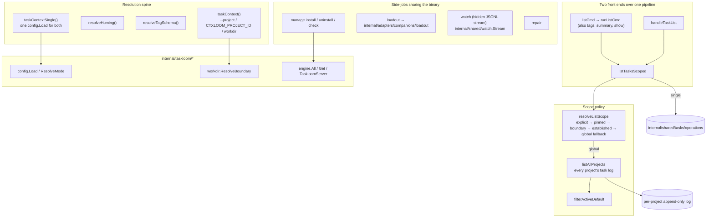

# `taskloom` — per-project task tracking

**What it is.** `taskloom` is a second standalone binary (`cmd/taskloom`) over an append-only,
harp-keyed task log. It exposes one store **twice** — as a cobra CLI and as an MCP stdio server
(`taskloom mcp`: the `task_*` tools and the `taskloom://` resources). `taskloom --help` and the
generated CLI reference list the current commands.

**The contract it owns.** *Resolve "which project's task log am I acting on", then present that
store consistently through both front ends.* All real task semantics live below it in
`internal/shared/tasks/operations`; `cmd/taskloom` owns **resolution**
(`taskContext` → `resolveHoming` → `resolveTagSchema`), **scope policy** (single-project vs
`--global`), and **presentation**.

`internal/taskloom/*` holds the pieces that must exist **without ctxloom**: taskloom's own
layered config, its own agent-MCP registrar registry, and its own project-root resolution.

---

## 1. Structure

```mermaid
flowchart TD
    subgraph front["Two front ends over one pipeline"]
      CLI["listCmd → runListCmd<br/>(also tags, summary, show)"]
      MCPT["handleTaskList"]
      LTS["listTasksScoped"]
      CLI --> LTS
      MCPT --> LTS
    end

    subgraph resolve["Resolution spine"]
      TC["taskContext()<br/>--project / CTXLOOM_PROJECT_ID / workdir"]
      RH["resolveHoming()"]
      RTS["resolveTagSchema()"]
      TCS["taskContextSingle()<br/>one config.Load for both"]
    end

    subgraph scope["Scope policy"]
      RLS["resolveListScope<br/>explicit → pinned → boundary → established → global fallback"]
      LAP["listAllProjects<br/>every project's task log"]
      FAD["filterActiveDefault"]
    end

    subgraph cfg["internal/taskloom/*"]
      CONF["config.Load / ResolveMode"]
      WD["workdir.ResolveBoundary"]
      ENG["engine.All / Get / TaskloomServer"]
    end

    LTS --> RLS
    TCS --> CONF
    TC --> WD
    RLS -->|global| LAP --> FAD
    LTS -->|single| OPS[("internal/shared/tasks/operations")]
    LAP --> STORE[("per-project append-only log")]

    subgraph side["Side-jobs sharing the binary"]
      MGR["manage install / uninstall / check"]
      LD["loadout → internal/adapters/companions/loadout"]
      WATCH["watch (hidden JSONL stream)<br/>internal/shared/watch.Stream"]
      REP["repair"]
    end
    MGR --> ENG
```

---

## 2. `internal/taskloom/config` — taskloom's own config surface

**What it owns.** Two settings and their defaulting policy: `homing` (where the task log lives —
`paths.ModeHome` or `paths.ModeRepo`) and `tag_schema` (the tag-facet declaration list). Layered
through `internal/shared/confload` as home < project < `TASKLOOM_CONFIG_*` env < `--config-set`,
then validated against an embedded JSON Schema.

| Symbol | Notes |
|---|---|
| `Config` | `{Homing string, TagSchema []string}`. Methods are on the **value** receiver — the type is immutable after `Load` |
| `ResolvedTagSchema` | `DefaultTagSchema` followed by `c.TagSchema`: a project extends the baseline, and `tagschema.Parse`'s last-wins lets it override one entry. This method *is* the "a fresh project gets the full standard with no opt-in" policy, and the reason adding one rule cannot drop the rest |
| `ParsedTagSchema` | `tagschema.Parse(c.ResolvedTagSchema())` — fails loud on a bad declaration |
| `DefaultTagSchema` | The baseline priority/decay declarations. They hard-code identifiers owned by `priority` and `tagschema`; `TestDefaultTagSchema_UsesOnlyOwnedIdentifiers` and `TestParsedTagSchemaIsNeverInert` are the guards |
| `Load` | `loadRaw` → remarshal to YAML → unmarshal into `Config` → validate the **merged** bytes (the right layer: it catches an unknown key introduced by an env override). A schema that will not compile is an error, and a validation failure returns a zero `Config` |
| `newValidator` | Compiles the embedded schema once per process (`sync.OnceValues`) |
| `ResolveMode` (func and method) | Precedence: `cfg.Homing` → `flagValue` (wins) → `ModeHome`. The default sits **below** the whole chain, not inside it. "Absent is fine, wrong is not": an invalid value errors naming both the bad value and the valid set. The method form resolves from an already-loaded `Config`, so a caller needing mode and tag schema loads once |
| `SchemaPath` / `SchemaResourceName` / `DirName` / `FileName` / `HomingConfigKey` | `SchemaPath` is consumed by taskloom's docs generator |

**Invariants**

- **Unset `homing` resolves silently to `ModeHome`, and that is deliberate.** The package doc
  argues it: `ModeHome` is the pre-homing status quo, and the only surprising default would be
  `ModeRepo`, which would silently relocate someone's tasks. The published schema description
  states the same default.
- **Losing the home layer is announced, not silent.** An unresolvable home directory warns and
  degrades to project-only config; a malformed `--config-set` entry warns likewise. One bad input
  never blocks startup.
- **An explicit `tag_schema: []` behaves exactly like the key being unset** — both resolve to the
  full default, because the project list only ever extends it.

---

## 3. `internal/taskloom/engine` — MCP registrar registry

**What it owns.** The list of agent MCP registrars `taskloom manage` can install into, and the
server command line to register — **without depending on ctxloom**. All engine-specific detail
(config paths, on-disk format, merge semantics) lives in each agent module's own `MCPRegistrar`.

| Symbol | Notes |
|---|---|
| `Engine` | The registrar interface, defined here because it is `confpatch`-shaped and `confpatch` depends on `shared/agent`; `Register` with a nil server is the uninstall |
| `TaskloomName` | `"taskloom"`, the registration key |
| `TaskloomCommand` / `TaskloomServer` | The bare command name and the `wire.MCPServer` that serves `taskloom mcp` — the one place the command line is named |
| `VerifyCommandResolvable` | Whether `TaskloomCommand` resolves on the current process's `PATH` — the strongest evidence available at registration time that the entry names something reachable |
| `All` / `Names` | The registry, and its names derived from it for help text |
| `Get` | Exact match on `Name()`. **No alias, case or prefix matching** — a typo must error, naming the valid set |

**Invariants**

- **`Command` is a bare PATH name**, resolved against *the agent's* environment when it later
  starts the server, not captured at registration. Registration cannot prove the server will start;
  `VerifyCommandResolvable` is how a caller says so out loud.
- **A second engine registry exists** at `internal/ltk/engine`, holding a different interface (hook
  adapters rather than MCP registrars) over an overlapping name vocabulary.
  `TestEngineNameVocabularyParity` is what keeps the two vocabularies in agreement.

---

## 4. `internal/taskloom/workdir` — project-root resolution

**What it owns.** Resolve the project work root the way `ctxloom run` does, through
`projectroot.WorkDirWithBoundary`, then redirect through `projectroot.TaskStoreRoot` so a **linked
git worktree with no `.ctxloom` of its own** lands on its primary checkout's task store rather than
one that dies with the worktree.

| Symbol | Notes |
|---|---|
| `ResolveBoundary` | `(root, found, err)`. Composes "where is the project" with "which checkout owns the task store", preserving that the redirect changes *which store*, not *whether a boundary was found*. A failing working-directory lookup and a stale worktree pointer are both hard errors |

**Invariants**

- **`found == false` sends a *read* to global aggregation** rather than minting an identity for an
  arbitrary directory (`resolveListScope`). Reads never mint identity — `isEstablishedProject`
  checks for a registry entry or an in-tree marker *without creating one*.
- **The resolution chain lives in `projectroot`**, not here: this package adds only the task-store
  redirect.

---

## 5. `cmd/taskloom` — the front ends

### 5.1 Resolution spine

| Symbol | Notes |
|---|---|
| `taskContext` | Project id + workdir + session harp. A work-root failure fails the call even when a project id is pinned, because the work dir also anchors the project config layer |
| `resolveHoming` | Layers homing-mode resolution onto `tc` |
| `resolveTagSchema` | Layers tag-schema resolution onto `tc`; fails loud on a malformed schema |
| `taskContextSingle` | The combination every single-project command needs, resolving homing and tag schema from one `config.Load` |
| `noteTaskProject` / `formatProjectLabel` | Post-mutation stderr attribution, rendered as `dir (id)`, `dir`, or `id` |
| `warnTask` | Emits a non-empty operations warning via `clidiag` |
| `renderTaskTable` | The human `list` view |

### 5.2 Scope policy

| Symbol | Notes |
|---|---|
| `listTasksScoped` | The one list pipeline behind `list`, `tags`, `summary`, `show` and the MCP `task_list` — scope resolution, then the single-project or global path |
| `listScope` | `{Global bool, Notice string}` — `Notice != ""` means "fallback, not explicit opt-in" |
| `resolveListScope` | explicit `--global` → pinned project → boundary found → established project → global fallback |
| `isEstablishedProject` | Registry entry or in-tree marker, **without minting one** |
| `globalScopeLimitationNote` | Discloses what a global listing cannot see; sharpened when cwd is repo-homed |
| `listAllProjects` | Walks every project's task log, filters, optionally prices priority, sorts, and caps at the limit. Every store error is wrapped with the project id; a missing dir yields empty rather than an error |
| `filterActiveDefault` | Re-implements `operations`' active-only rule for the global path, because `operations` resolves exactly one project — a connascence-of-algorithm pair |
| `taskRow` / `compactTaskRow` | A task tagged with the project it came from, so consumers never branch on global-vs-single |
| `globalListResult` | Deliberately **not** `operations.TaskListResult`; carries its own `OmittedByLimit` |

### 5.3 The MCP surface

| Symbol | Notes |
|---|---|
| `newMCPServer` | The single source both `taskloom mcp` and the docs generator use |
| `registerTaskTools` | The `mcp.AddTool` literals — the descriptions **are** the product surface |
| `taskListInput` / `taskListResult` | Input mirrors `listOptions` except `Format`; the result carries as structured fields everything the CLI writes to stderr |
| `handleTaskList` | Drives `listTasksScoped`, MCP-shaped |
| `taskAddResult` and siblings | `{Path, Task}` plus the project-resolution `Warning` the CLI prints |
| `registerTaskResources` | The `taskloom://` resources |
| `handleTagSchemaResource` | Resolves the schema **at read time** — no startup snapshot |
| `buildTagSchemaDoc` | Unions the schema facets into sorted per-target entries. Deliberately omits `tagma.hide` — a read-vs-write vocabulary split |

### 5.4 Leaf commands

| Symbol | Notes |
|---|---|
| `showCmd` / `renderTaskDetail` | Shows one or more tasks in full, including Done, in argument order. Every id must resolve: any unknown id fails the call, naming all of them, and nothing is printed |
| `versionCmd` | Text prints the bare version; the structured form is `cliversion.Info` via `cliemit.EmitVersion`. **`{name, version}` is a wire contract** — ctxloom's companion probe parses it |
| `watchCmd` / `watchEvent` | Hidden, long-lived JSONL change stream for GUI subscribers over `internal/shared/watch.Stream`, debounced by `watchDebounce`. Emits once immediately so a subscriber renders current state without an initial-query race. `checkWatchFormat` refuses a `--format` it cannot produce |
| `runCmd` / `launchTaskAgent` / `pickTask` | Picks or matches a task, then execs `ctxloom run` |
| `repairCmd` | Re-introduces any task displaced by an unresolved harp-id collision under a fresh harp, without rewriting history |
| `manageInstall` / `manageUninstall` / `manageCheckCmd` | Merge + atomically write each backend config; `check` reports an unreadable config rather than skipping it |

---

## 6. Invariants

1. **Reads never mint a project identity** (`isEstablishedProject`).
2. **`manage install` fails loud on zero detected engines**, naming the valid set (`engine.Names`);
   `manage uninstall` in the same situation says there is nothing to remove.
3. **Empty task text is rejected by the store**, not by the CLI.
4. **`tagCmd` rejects an empty add+remove** — "nothing to do" is an error.
5. **Every renderer has an explicit empty state.**
6. **`config.ResolvedTagSchema` cannot yield an empty schema** — the default is always its base,
   so a project always runs with the full triage standard plus its own declarations.
7. **`ResolveMode` cannot return an empty mode without an error.**
8. **`engine.Get` refuses prefix matching** — a typo must error rather than silently pick an engine.
9. **`watch` emits once before any change** so a subscriber has no initial-query race.
10. **A structured `--format` flips `clidiag.SetStructured`** in `rootPersistentPreRun`, so
    diagnostics do not corrupt machine-readable output.
11. **One list pipeline.** The CLI and MCP list paths both go through `listTasksScoped`, so tag-query
    error wrapping (`wrapTagQueryError`) and limits apply identically.

**Gap:** `tasks.Store.Remove` and the log's `opRemove` fold branch have no front end — neither the
CLI nor the MCP server exposes removal.
