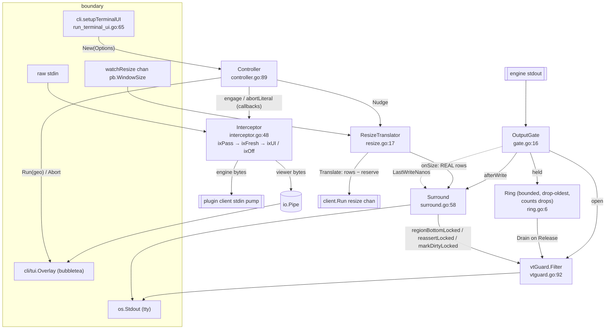

# `internal/termui` — raw-ANSI terminal frontend

**What it is.** The terminal layer for an interactive `ctxloom run`. It wraps the three seams the
plugin client already owns — stdin reader, stdout writer, resize channel — with four things: a
**prefix-key interceptor**, a **reserved bottom-row status bar**, a **hold gate** that buffers
engine output while the observation overlay is open, and a **VT-sequence guard** that keeps the
child engine from clobbering the reserved row.

**The contract it owns.** *One terminal, one lock (`ttyMu`), and a bottom row the child engine can
never scroll into or erase without the bar being repainted.* `internal/cli/run_terminal_ui.go`
constructs a `Controller` and swaps its `Stdin()`/`Stdout()`/`Resize()` into the plugin client at
`run.go:1232`; `internal/cli/tui` supplies the bubbletea `Overlay` implementation, so this package
never links bubbletea.

---

## 1. Structure

**The key idea.** The bar occupies one physical row that the child must never learn about. The
resize translator therefore reports **rows − reserve** to the engine while telling the surround
the real size, and the VT guard clamps any `DECSTBM` the child emits so its scroll region cannot
include the bar row.

---

## 2. Types

| Symbol | file:line | Notes |
|---|---|---|
| `Overlay` (interface) | `controller.go:18` | `Run(io.Reader, io.Writer, OverlayGeometry) error` + `Abort()`. The framework firewall — implemented by `internal/cli/tui` |
| `OverlayFactory` | `controller.go:29` | `func() Overlay` — one fresh overlay per engagement |
| `OverlayGeometry` | `controller.go:40` | `{Cols, Rows, PanelRows}`. **`Rows` means real rows minus the reserve**, and the panel occupies `Rows-PanelRows+1 .. Rows`. That arithmetic is computed independently in `panelClearSeq` (`controller.go:297`) and in `internal/cli/tui` |
| `Options` | `controller.go:64` | 11 knobs: `{Stdin, TTY, Resize}` wiring, `{Prefix, Surround, Bar, NewOverlay}` behaviour, `{FetchRoster, RosterInterval}` poller, `Warn`, `HoldCapacity` |
| `Controller` | `controller.go:89` | Owns `ttyMu` and the four sub-components. Two nearly-disjoint method groups: seam wiring/teardown (`Stdin`/`Stdout`/`Resize`/`Close`) and the engagement state machine (`engage`/`buildOverlay`/`runOverlay`/`release`/`abortLiteral`/`degrade`), plus an independent roster poller |
| `OutputGate` | `gate.go:16` | Engine-output writer that can be diverted into a ring and replayed. Shares `*sync.Mutex` with `Surround` **by pointer** |
| `Ring` | `ring.go:6` | Bounded drop-oldest byte buffer **with a drop counter that is surfaced to the user** (`gate.go:98-100`) |
| `Interceptor` | `interceptor.go:48` | Prefix-key state machine over raw stdin, allocation-free on the hot path |
| `ixState` / `ixActions` / `InterceptorCallbacks` | `interceptor.go:13`, `:88`, `:32` | The enum, the deferred-effect record (so effects fire outside the lock), and the hook set |
| `ResizeTranslator` | `resize.go:17` | Subtracts the reserved rows from every size event, mirrors the real size to the surround, and forces post-overlay repaints |
| `Surround` | `surround.go:58` | Owns the reserved bottom row: scroll region, bar paint, restore |
| `BarInfo` | `surround.go:32` | `{Harp, Agent, Engine, Model, PrefixHint}` — the static identity segment |
| `RosterEntry` | `surround.go:45` | `{Harp, Agent, State, LastActivityUnix}` — a deliberate local mirror of `coord.RosterEntry` (`agentcoord/coord/folds.go:312`) so this package stays dependency-light. `Agent` is copied by the adapter and never read here |
| `vtGuard` / `vtState` | `vtguard.go:32`, `:60` | In-stream VT parser: clamps DECSTBM, re-asserts the region after unrewritable resets, marks the bar damaged after full-screen erases, and holds back partial sequences and partial UTF-8 runes so bar paints land on safe boundaries |

---

## 3. Functions

| Symbol | file:line | Notes |
|---|---|---|
| `New` | `controller.go:111` | Builds and wires all four sub-components, clears the screen, starts the roster poller |
| `Controller.Stdin` / `Stdout` / `Resize` | `controller.go:147`, `:150`, `:153` | The three public seams handed to `client.Run` |
| `Controller.Close` | `controller.go:159` | Idempotent teardown: abort overlay → release gate → restore surround |
| `Controller.engage` | `controller.go:197` | Holds output, suspends the bar, saves the cursor, spawns the overlay goroutine |
| `Controller.buildOverlay` / `runOverlay` | `controller.go:240`, `:252` | Both **recover from a panicking factory/overlay** and convert it to a `degrade` |
| `Controller.degrade` | `controller.go:186` | Permanently disables the UI layer and warns — the documented non-fatal failure mode |
| `Controller.release` | `controller.go:280` | Builds the atomic restore preamble (panel clear + region re-assert + bar repaint + DECRC) and hands it to `gate.Release`, then nudges |
| `Controller.pollRoster` | `controller.go:320` | 2s roster poll feeding the bar |
| `panelRows` / `panelClearSeq` | `controller.go:49`, `:297` | Quick-panel height policy (bottom third, min 8, cap rows−1) and its clear sequence |
| `OutputGate.Write` | `gate.go:44` | held → ring, open → guard → tty, then `afterWrite`. **The one write path here that propagates `dst.Write`'s error** |
| `OutputGate.Hold` / `Release` / `LastWriteNanos` | `gate.go:68`, `:77`, `:106` | |
| `Ring.Write` / `Drain` | `ring.go:22`, `:47` | |
| `Interceptor.Read` / `scan` / `dispatch` | `interceptor.go:71`, `:99`, `:158` | `scan` decides under the lock, `dispatch` acts outside it |
| `Interceptor.Disengage` / `Off` | `interceptor.go:191`, `:203` | |
| `ParsePrefixKey` / `CaretHint` | `prefixkey.go:13`, `:50` | Config key name → control byte, and its caret notation |
| `NewResizeTranslator` | `resize.go:42` | Constructor **plus a synchronous drain of the buffered initial size** — a documented ordering fix |
| `ResizeTranslator.Translate` / `Current` / `Nudge` / `send` | `resize.go:94`, `:103`, `:134`, `:176` | `Nudge` is a one-row wiggle to force a child SIGWINCH; `send` is latest-wins non-blocking |
| `reserveActive` | `surround.go:24` | **The single reservation predicate**, shared by `Surround` and `ResizeTranslator` so the two can never disagree about whether a row is reserved |
| `Surround.SetSize` | `surround.go:155` | Records size, establishes/releases the scroll region, clears the stale bar row, paints |
| `Surround.Suspend` / `ResumeSequence` / `Restore` | `surround.go:245`, `:259`, `:276` | `ResumeSequence` **returns the resume bytes rather than writing them**, so the caller can splice them into one atomic write |
| `Surround.RequestPaint` / `FlushLocked` / `paintLocked` | `surround.go:224`, `:238`, `:297` | Paint now if the engine is idle, else mark dirty and let the next write flush it |
| `Surround.regionBottomLocked` / `reassertLocked` / `markDirtyLocked` | `surround.go:116`, `:127`, `:142` | The three callbacks handed to `newVTGuard` — all required to be invoked under the shared mutex |
| `appendBarContent` / `fitWidth` / `RosterDigest` | `surround.go:338`, `:370`, `:389` | Renders ` harp · agent · engine/model │ digest │ hint `; `RosterDigest` renders `"no agents"` rather than `""` for an empty roster |
| `vtGuard.Filter` / `SafeForPaint` | `vtguard.go:92`, `:85` | |
| `vtGuard.stepEsc` / `stepCSI` / `stepString` / `stepStringEsc` / `stepGarbage` | `vtguard.go:124`,`:182`,`:212`,`:227`,`:244` | `stepCSI` has a `vtCSIMax` escape valve into `vtGarbage` |
| `vtGuard.finishCSI` | `vtguard.go:267` | The four rewrite/re-assert/damage policies: DECSTBM clamp, DECSTR, alt-screen, ED |
| `vtGuard.rewriteDECSTBM` / `insertReassert` / `holdRuneTail` | `vtguard.go:339`, `:358`, `:367` | `holdRuneTail` holds back a trailing partial UTF-8 rune (verified correct for complete and truncated 2/3/4-byte sequences) |

---

## 4. Invariants

**Hold, and are load-bearing:**

1. **One mutex owns the tty.** `OutputGate` and `Surround` share the *same* `*sync.Mutex` by
   pointer, so a bar paint can never interleave with an engine write.
2. **`reserveActive` (`surround.go:24`) is the single reservation predicate**, consulted by both
   `Surround.SetSize` (`:164`) and `ResizeTranslator.Translate` (`resize.go:96`) — the one place
   two components must agree, deliberately written once.
3. **The engine is never told the real row count** while the bar is active; `Translate` subtracts
   the reserve.
4. **`Resize` must not block the caller** (`vpio`-style contract stated at `controller.go`'s
   Overlay doc and honoured by both the interceptor and the translator).
5. **Ring overflow is counted and surfaced**, never silently dropped (`ring.go:22` +
   `gate.go:98-100`) — the correct answer to this codebase's characteristic bug, in this package.
6. **`RosterDigest` distinguishes never-polled from polled-empty** via `hasRoster`
   (`surround.go:329`), so a blank digest is not mistaken for "no agents".
7. **The overlay is fully firewalled.** This package never imports bubbletea; the `Overlay`
   interface is declared here and implemented outward, which is the correct dependency direction.
8. **Both the overlay factory and the overlay run are panic-recovered** (`controller.go:240`,
   `:252`) into `degrade` — a crashing viewer downgrades the UI rather than killing the session.
9. **`ResumeSequence` returns bytes instead of writing**, so restore is one atomic write.
10. **`vtGuard` holds back partial sequences and partial runes**, so a bar paint can never be
    spliced into the middle of an escape sequence or a multi-byte character.

**Do not hold, or are narrower than documented:**

- **`OutputGate.Release` discards all three `dst.Write` errors** (`gate.go:87`, `:96`, `:99`), and
  the ring has already been drained — so a failing tty loses the *entire* replay of held engine
  output with no notice. `OutputGate.Write` (`gate.go:63-64`) does propagate its error.
- **`Release` never calls `afterWrite`**, so a bar marked dirty *by the replayed data itself*
  (e.g. an `ED 2` the engine emitted while the viewer was open) is never flushed — the bar stays
  erased until the engine's next write, which for an engine now waiting on input may be never.
- **The ED damage arm fires only for `ED 2/3`** (`vtguard.go:320`, `csiFirstParam(body, 0) >= 2`).
  `ED 0` — the default `\x1b[J` — erases from the cursor to the end of the display, which includes
  the bar row, and is not marked dirty.
- **`childSaved` tracks only `ESC 7`/`ESC 8`.** The ANSI.SYS spellings `CSI s`/`CSI u`, which
  xterm honours into the same single saved-cursor slot, have no `finishCSI` arm — so the bar's own
  `appendBar` (`surround.go:312`, `\x1b7 … \x1b8`) can overwrite the child's saved cell.
- **`stepEsc` appends escape intermediates with no length bound** (`vtguard.go:167-168`), unlike
  `stepCSI`, which has `vtCSIMax` — so a stray `ESC` followed by a long run of spaces buffers
  unboundedly and withholds those bytes from the tty.
- **Bytes held inside the guard (`g.seq`, `g.tail`) have no flush path at teardown.** `Close`
  calls `gate.Release(nil)`, which returns immediately when `!held` and never asks the guard to
  flush, so output ending mid-sequence or mid-rune is dropped at session end.
- **`Close` can hang.** It snapshots `c.overlay` (`controller.go:165`) then blocks on `sessionMu`
  (`:172`); `engage` takes `sessionMu` at `:202` but does not publish `c.overlay` until `:221-223`
  and never re-checks `c.closed` after acquiring the lock.
- **`ParsePrefixKey` rejects NUL, TAB, LF/CR and ESC** on the ground that "the engine needs them
  verbatim" — but permits `ctrl-c` (3), `ctrl-d` (4), `ctrl-z` (26) and `ctrl-s`/`ctrl-q` (19/17).
- **`Controller.release` builds the restore preamble without holding `ttyMu`.**
  `ResumeSequence` takes and releases the lock, setting `suspended = false`, and only then does
  `gate.Release(pre)` re-acquire it — a window in which the roster poller can paint.
- **`release` uses the geometry captured at *engage* time**, so a SIGWINCH during the engagement
  makes `panelClearSeq`'s row arithmetic stale.
- **`pollRoster` discards every `FetchRoster` error forever** (`controller.go:324`) with no
  counter — a permanently broken coordinator connection is indistinguishable from a stable roster.
  Keeping the last good snapshot is right; the silence is the gap.
- **Viewer input rides an *unbuffered* `io.Pipe`** (`controller.go:233`). If the overlay stops
  reading, `sink.Write(ui)` (`interceptor.go:184`) blocks the stdin pump, and because that pump is
  the only reader of stdin the double-press-literal escape hatch cannot fire either.
- **`fitWidth` returns an empty bar when `width <= 0`** (`surround.go:371`), producing a
  structurally valid but entirely blank reserved row with no warning.
- **`Nudge`'s `eff.Rows <= 1` branch sends the *current* size** (`resize.go:142-145`), which raises
  no SIGWINCH — the exact failure `Nudge` exists to fix.
- **Roughly two-thirds of the exported surface has no consumer outside this package.**
  `Ring`/`NewRing`, `OutputGate`/`NewOutputGate`, `Surround`/`NewSurround`,
  `Interceptor`/`NewInterceptor`, `ResizeTranslator`/`NewResizeTranslator` and `RosterDigest` have
  zero external references. The genuine external contract is `Controller`, `Options`, `BarInfo`,
  `RosterEntry`, `OverlayGeometry`, `Overlay`, `OverlayFactory`, `ParsePrefixKey`, `CaretHint`.
- **`RosterEntry.State` is connascent of meaning with `internal/agentcoord/coord`** — the string
  values (`"executing"`, `"ended"`, everything-else) are produced there and consumed by
  `RosterDigest` here, with no shared constant linking them.
