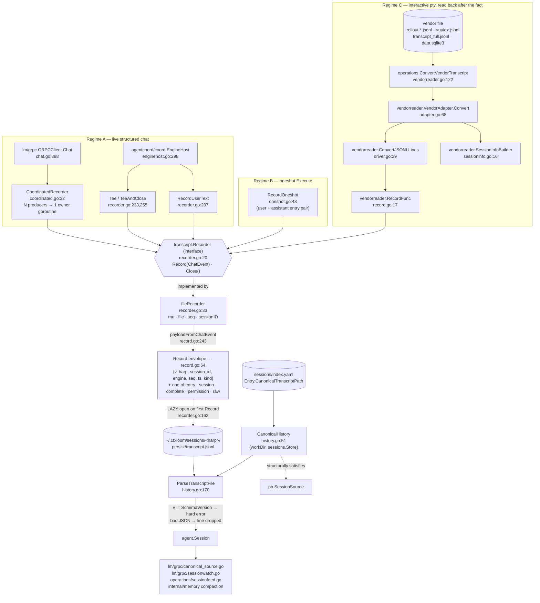
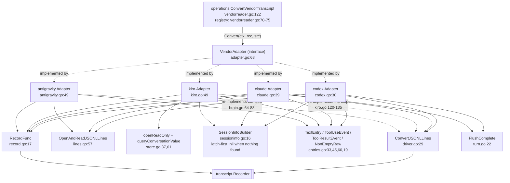

# `internal/transcript` — canonical conversation capture

**What it is.** `internal/transcript` owns ctxloom's **own** record of a conversation: a
versioned, append-only JSONL envelope schema, the writer that stamps it, and the reader that
turns the file back into an `agent.Session`. `internal/transcript/vendorreader` and its four
per-engine adapters (`codex`, `claude`, `kiro`, `antigravity`) convert a **vendor-native**
transcript into the same canonical stream through the same writer.

**The contract it owns.** *One harp, one engine, one append-only file at
`~/.ctxloom/sessions/<harp>/persist/transcript.jsonl`, whose every line is a schema-versioned
`Record` with a monotonic `seq`.* It is the replacement for four deleted per-engine scrapers, so
it is the **only** remaining memory source for codex / kiro / claude-code / antigravity.

Two capture regimes exist because two things can drive an engine: a **live structured stream**
(the host tees `agent.ChatEvent`s through a `Recorder`) and an **interactive pty** (a human
driving the vendor's own TUI produces no event stream at all, so the vendor's file is read back
after the fact).

---

## 1. The capture path

**The two things to hold in mind:**

1. **The file is opened lazily, on the first successful `Record`** (`recorder.go:162`). A
   conversion or chat that produces zero events therefore leaves **no file at all** — this is
   deliberate, so that "file absent" means "nothing was ever recorded" rather than "a zero-byte
   file exists". `NewRecorder` (`recorder.go:79`) only validates and resolves the path.
2. **`operations.hasCanonicalTranscript` gates re-import on file *existence*** (`vendorreader.go:158`).
   Composed with (1), a zero-entry import is retried forever; composed with a *partial* write, the
   harp becomes permanently un-importable.

---

## 2. The envelope

| Symbol | file:line | Notes |
|---|---|---|
| `SchemaVersion` | `record.go` (const) | Stamped into every line's `v`; `ParseTranscriptFile` **hard-errors** the whole file on a mismatch (`history.go:185-187`) |
| `Kind` | `record.go:35` | `entry \| session \| complete \| permission \| raw` — the discriminator selecting which of `Record`'s five payload slots is populated. Mirrored exactly in `docs/transcript.schema.json`'s `kind` enum |
| `Record` | `record.go:64` | `{V, Harp, SessionID, Engine, Seq, TS, Kind}` + `Entry`/`Session`/`Complete`/`Permission`/`Raw`. One instance == one JSONL line |
| `EntryPayload` | `record.go:121` | On-disk mirror of `agent.SessionEntry` (15 fields) |
| `ToolLocation` / `ContentBlock` / `ToolContentBlock` / `PlanEntry` | `record.go:147`,`:153`,`:160`,`:171` | Leaf mirrors |
| `SessionPayload` | `record.go:179` | Mirror of `agent.ChatSessionInfo` — carries Model / PermissionMode / ContextWindow. **Does not carry `Resumable`** (`agent/chat.go:477`), which `coord/enginehost.go:387` reads for the resume gate |
| `MCPStatus` | `record.go:188` | |
| `CompletePayload` | `record.go:197` | Mirror of `agent.TurnMeta`, all 11 fields |
| `PermissionPayload` | `record.go:213` | Mirror of `agent.PermissionRequest`. **Does not carry `ToolCallID`** (`agent/chat.go:371`), so a recorded permission request cannot be re-paired with its tool call |
| `PermissionOption` | `record.go:228` | |
| `RawPolicy` | `record.go:269` | `off \| lossy-only \| all`, applied by `fileRecorder.rawToPersist` (`recorder.go:105`) |

**Why the mirrors exist.** `agent.SessionEntry` & co. carry **no json tags**
(`internal/shared/agent/backend.go`, `chat.go`), so marshalling the in-memory types directly
would make the on-disk format hostage to Go field renames. That is a legitimate schema boundary.
The cost is **four hand-edited sites per field** (agent type → payload struct → to-payload
converter at `record.go:308-414` → from-payload converter at `history.go:239-285`) with nothing
enforcing parity. `record.go:9-12` claims the payloads mirror `agent.ChatEvent` "field-for-field";
`Resumable` and `ToolCallID` are the two places that is currently false.

---

## 3. Writers

| Symbol | file:line | Notes |
|---|---|---|
| `Recorder` (interface) | `recorder.go:20` | `Record(agent.ChatEvent) error` + `Close() error`. The seam every capture path shares; `vendorreader.VendorAdapter` takes it as a parameter |
| `NewRecorder` | `recorder.go:79` | Validates harp + engine non-empty, resolves the path via `paths.HarpCanonicalTranscriptPath`, applies options. **Does not open the file** |
| `RecorderOption` / `WithRawPolicy` | `recorder.go:50`, `:56` | The only option. Reachable only through `agent.ChatRequest.TranscriptRawPolicy`, which nothing in the codebase ever sets — so in production the policy is always `DefaultRawPolicy` |
| `fileRecorder.Record` | `recorder.go:116` | Classifies via `payloadFromChatEvent`, stamps the envelope, lazily creates dir + file, appends one line, bumps `seq`. Refuses a fully-zero `ChatEvent` |
| `fileRecorder.Close` | `recorder.go:181` | Idempotent (nil-guarded) |
| `RecordUserText` | `recorder.go:207` | The **only** path that captures user turns; called from `coord/enginehost.go:306,326` |
| `Tee` / `TeeAndClose` | `recorder.go:233`, `:255` | Passthrough goroutine: `Record` then forward. `TeeAndClose` closes the recorder when the source drains — without it the fd leaks for process lifetime |
| `RecordOneshot` | `oneshot.go:43` | Writes a two-entry (user + assistant) transcript for a oneshot `Backend.Execute` run, which emits no `ChatEvent` stream. Called from `cli/run.go:1277`, `cli/run_owned.go:205`, `operations/oneshot.go:471` |
| `CoordinatedRecorder` | `coordinated.go:32` | Funnels N producers into one owner goroutine so `seq` order is a function of `Submit` arrival, not lock scheduling. Fixes a measured 79/80-record drop (`lm/grpc/chat.go:441-461`) |
| `NewCoordinatedRecorder` / `ProducerDone` / `Submit` / `Done` | `coordinated.go:67`,`:92`,`:100`,`:115` | `recordRequest` (`coordinated.go:50`) carries an ack channel so `Submit` returns only after `Record` has *returned*, not after the channel handoff |

**Error handling on the live path.** Every `Record`/`Close` error is discarded with `_ =` —
`recorder.go:211` (`RecordUserText`), `:238` (`Tee`), `:260` (`TeeAndClose`), `coordinated.go:80`
and `:82` (the owner goroutine) — with no counter, warning, or metric. `recorder.go:229` defers
the decision to "S2, which owns the actual host wiring"; neither live seam passes a logger
(`lm/grpc/chat.go:437` `coord.Submit` returns nothing; `coord/enginehost.go:316`
`transcript.TeeAndClose(rec, out)` takes no logger). The package already imports `clidiag`
(`history.go:38`).

---

## 4. Readers

| Symbol | file:line | Notes |
|---|---|---|
| `CanonicalHistory` | `history.go:51` | `{workDir string, store sessions.Store}`; harp-keyed, project-scoped read view. **Structurally satisfies `pb.SessionSource`** (asserted in `history_interface_test.go:18`) |
| `NewCanonicalHistory` | `history.go:59` | Called from `lm/grpc/canonical_source.go:84` |
| `GetSession` | `history.go:71` | Validates harp, resolves + stats the path, delegates to `ParseTranscriptFile`. Touches **neither** of the type's fields — it is a free function wearing a method's clothes, which exists to satisfy `pb.SessionSource` |
| `ListSessions` | `history.go:103` | Enumerates project harps from the index, parses each, builds `SessionMeta`; a per-harp parse failure warns via `clidiag` and continues |
| `CurrentSession` | `history.go:134` | Returns the newest canonical-backed session. Returns the **first** candidate's `GetSession` error rather than skipping to the next — unlike `ListSessions` |
| `ParseTranscriptFile` | `history.go:170` | Streams the JSONL, version-checks each line, folds entries, computes the ts span. **Split contract:** a bad-JSON line is dropped silently (`history.go:183`); a `v` mismatch is a hard **file** error (`:185-187`) |
| `entriesFromRecord` | `history.go:215` | One `Record` → 0 or 1 `agent.SessionEntry` |

**Two path-resolution routes.** `GetSession` calls `paths.ResolveHarpCanonicalTranscriptPath`;
`ListSessions` trusts `Entry.CanonicalTranscriptPath` from the session index. They agree today only
because `sessions.fillCanonicalTranscript` (`index.go:429`) happens to call the same resolver.

**The version-mismatch contract has no teeth end to end.** Three of four consumers swallow the
hard error: `lm/grpc/canonical_source.go:135,150` falls through to legacy on *any* canonical error;
`operations/sessionfeed.go:443` warns and returns nil; `lm/grpc/sessionwatch.go:210` warns on
**every poll tick, forever**, since a version error is permanent. `sessionwatch` also re-parses
the whole file on each tick — `ParseTranscriptFile` offers no incremental/tail API.

**Empty-file behaviour.** A zero-byte file, or one whose every line fails to parse, yields
`(Session{Entries: []}, nil)`. `canonical_source.go:135` then takes the `err == nil` branch and
returns the empty session, suppressing the legacy fallback that would have recovered it.
`GetSession`'s own doc (`history.go:66-70`) states it never returns an empty Session in that
situation; that holds only for an **absent** file.

---

## 5. The vendor-reader layer

### 5.1 The shared contract and primitives

| Symbol | file:line | Notes |
|---|---|---|
| `VendorAdapter` | `adapter.go:68` | `Convert(ctx, rec transcript.Recorder, src string) error`. `src` is engine-specific: a file path for codex/claude/antigravity, a `"<db>#<conversation-id>"` composite for kiro |
| `ConvertJSONLLines` | `driver.go:29` | The scan/stream/flush driver: record the up-front `Session` event if `info != nil`, then per line — ctx check, `dispatch(line)` — then `flush()` |
| `ReadJSONLLines` / `OpenAndReadJSONLLines` | `lines.go:31`, `:57` | Unbounded `bufio.Reader` (deliberately not a capped `Scanner` — vendor lines run to tens of KB). Keeps a final line with no trailing newline. Wraps failures with the vendor prefix |
| `SessionInfoBuilder` | `sessioninfo.go:16` | Latches each `ChatSessionInfo` field on its **first non-zero value** and tracks `found`, so "no metadata anywhere" yields `nil` rather than an all-zero struct. Setters at `:23`,`:31`,`:40`,`:49`; `Build` at `:57` |
| `RecordFunc` | `record.go:17` | Returns a closure wrapping `rec.Record` failures as `"<vendor>: record: %w"` |
| `TextEntry` | `entries.go:33` | Non-empty text → a one-element `[]ChatEvent`; **nil for empty text**, so a blank turn contributes nothing rather than a zero-length entry |
| `ToolUseEvent` / `ToolResultEvent` | `entries.go:45`, `:60` | The canonical tool_use / tool_result shapes, named once |
| `NonEmptyRaw` | `entries.go:19` | Normalizes an empty `json.RawMessage` to nil |
| `JoinNonEmpty` / `JoinNonEmptyFunc` | `text.go:15`, `:30` | Blank-line joins, filtering empties |
| `FlushComplete` | `turn.go:22` | Records a still-open turn boundary at EOF — "a boundary at end of file is real data, not something to drop" (`turn.go:19-21`). Clears `*pending` **before** `record` returns |

**The contract's central limitation.** `Convert` returns **only `error`** — no count of records
written, lines seen, or lines skipped. So no caller can distinguish "the vendor format drifted and
I recognized nothing" from "the session was genuinely empty".
`operations/vendorreader.go:99-106` documents that loss as intentional: `converted` reports
whether an import was *attempted*, "not whether it produced any canonical lines". Downstream,
`BackfillResult` has three buckets (`Converted`, `Skipped`, `Failed`) and a zero-entry conversion
lands in `Converted` beside a 5,000-line import; `cli/session_backfill.go:77` prints
`converted: <harp>`. On the interactive-pty path `cli/run.go:1333` discards even the `converted`
bool.

### 5.2 Per-engine adapters

| Adapter | Source shape | Discrimination | Notable decisions |
|---|---|---|---|
| **codex** (`codex.go`, `rollout.go`) | `rollout-*.jsonl`, an envelope format `{timestamp, type, payload}` | `rolloutLine.Type` (`rollout.go:22`) → `response_item` / `event_msg` / `session_meta` / `turn_context`; `responseItemPayload.Type` (`:66`) → message / reasoning / function_call / function_call_output | The **reference adapter** the other three copy (`codex.go:1-16`). Reads `info.last_token_usage`, *not* the cumulative `total_token_usage` (`rollout.go:84-92`, with arithmetic evidence). `argumentsToRaw` (`:383`) unwraps codex's JSON-**encoded-string** `arguments` into valid raw JSON — the second half of the bug that got the live scraper deleted. `developer`-role messages are deliberately excluded (`messageEvents`, `:303`). Two-pass: `scanSessionInfo` (`:148`) then `convertLines` (`:117`) |
| **claude** (`claude.go`, `session.go`) | `~/.claude/projects/<slug>/<uuid>.jsonl`, flat records with a top-level `type` | `line.Type` (`session.go:23`) → `user` / `assistant`, 15 enumerated administrative types dropped; `contentBlock.Type` (`:86`) → text / thinking / tool_use / tool_result | `decodeContentBlocks` (`:124`) normalizes the dual-shaped `content` field (bare string \| array). Turn boundaries detected on `message.id` change (`handleAssistant`, `:249`). `isSidechain` is stamped onto every entry (`recordAll`, `:279`). `message.Role` is decoded and never read — the role comes from `line.Type` |
| **kiro** (`kiro.go`, `mapping.go`, `schema.go`, `store.go`, `enumerate.go`) | One row of `conversations_v2` in kiro-cli's `data.sqlite3` | `userContent` / `assistantContent` (`schema.go:114`,`:175`) — externally-tagged Rust enums, so the JSON keys are `"Prompt"`, `"ToolUseResults"`, `"CancelledToolUses"`, `"ToolUse"`, `"Response"` | The only adapter whose `src` is a composite locator (`Locator`/`parseLocator`, `kiro.go:70`,`:76`, split on the **last** `#`). `EnumerateConversations` (`enumerate.go:37`) discovers a conversation id when the spawn hook bound none. `openReadOnly` (`store.go:37`) opens `file:<path>?mode=ro` with an eager `Ping`. `requestMetadata`'s token counters are `*int` so `nz` (`mapping.go:156`) reports unknown as 0 rather than fabricating one; `durationMs` (`:169`) guards three ways against a fabricated duration |
| **antigravity** (`antigravity.go`, `brain.go`) | `brain/<uuid>/transcript_full.jsonl`, a step log | `step.Status == "DONE"` gate (`brain.go:38`,`:74`) **then** `step.Type` → `USER_INPUT` / `PLANNER_RESPONSE` | Smallest adapter (203 LOC). `extractUserRequest` (`brain.go:111`) pulls text between `<USER_REQUEST>` tags and **falls back to the full trimmed content** — the one fallback in the family that degrades toward preserving data. `ERROR_MESSAGE` and `SYSTEM_MESSAGE` steps hit the empty `default` at `:100` and are dropped, though `agent.EntryTypeSystem` exists |

### 5.3 The class-wide silent-empty shape

Every adapter can return `nil` having recorded zero conversational entries, and the routes are
structurally the same in all four:

1. **empty / all-blank source** — the line reader returns `(nil, nil)`, the loop runs zero times;
2. **every line malformed** — each `dispatch` returns `nil` per the documented skip-don't-abort
   contract (`claude/session.go:161`, `codex/rollout.go:123`, `antigravity/brain.go:72`,
   `kiro/mapping.go:31`);
3. **discriminator drift** — a renamed `type`/`status`/variant key matches no case and every line
   falls through (`claude/session.go:174`, `codex/rollout.go:137`, `antigravity/brain.go:100`,
   `kiro/mapping.go:73,126`);
4. **shape drift** — a renamed container field decodes to a zero value with no error, because
   `encoding/json` is used without `DisallowUnknownFields` and with no presence assertion on any
   required field.

Three variants worth naming individually:

- **Worse than empty (claude, kiro):** `scanSessionInfo` still latches the session id, so the
  output is **one Session record and zero conversation**. It looks captured.
- **Structurally unrecoverable (kiro):** `parseLocator` guarantees a non-empty conversation id, so
  `sessionInfo` (`mapping.go:182`) can never return nil — the locator fallback at `:190-193`
  defeats `SessionInfoBuilder`'s nil-when-nothing-found contract. A one-line session-header file is
  written, and `hasCanonicalTranscript` then makes that harp a permanent no-op.
- **Poison pill (codex):** `functionCallEvents` / `functionCallOutputEvents`
  (`rollout.go:372`,`:409`) emit an entry unconditionally even when every field decoded empty,
  unlike the `TextEntry`-fed paths. Measured: a `function_call` with drifted field names writes a
  134-byte content-free transcript, which then blocks re-import.

**Partial-import stickiness.** A conversion that fails partway leaves a partial canonical file,
and the presence-only guard treats it as complete permanently. `ConvertJSONLLines` widens the
window by recording the `Session` event at `driver.go:31` *before* the first `ctx.Err()` check at
`:37`, so even an already-cancelled context can leave a one-line stub.
`operations/vendorreader.go:139`'s defer only `Close`s; nothing removes the partial file.

---

## 6. Invariants

**Hold:**

1. **One `Recorder` instance == one harp + one engine.** `NewRecorder` rejects an empty harp or
   engine (`recorder.go:79`).
2. **`seq` is monotonic within a file** and is the truncation-detection signal readers are told to
   trust (`record.go:87-90`). `Record` advances `seq` only after a successful write
   (`recorder.go:176`), so a short write leaves the next record reusing the seq.
3. **A zero-value `ChatEvent` is refused** — `payloadFromChatEvent` (`record.go:243`) errors and
   names every nil field, so no empty line is ever written.
4. **No events ⇒ no file.** Lazy open (`recorder.go:162`) means "file absent" is distinguishable
   from "captured empty".
5. **A schema-version mismatch is a whole-file error**, not a per-line skip (`history.go:185-187`).
6. **The caller owns `Recorder` construction and `Close`** — every `VendorAdapter` doc states it
   and no adapter closes the recorder it was handed.
7. **A malformed vendor line is skipped, never fatal**; only a structural failure (open/read, ctx
   cancel, `rec.Record` failure) aborts a conversion (`adapter.go` contract).
8. **`SessionInfoBuilder` latches first-wins and returns nil when nothing was observed**
   (`sessioninfo.go:57`), so an all-zero `ChatSessionInfo` is never emitted as if meaningful.
   *(kiro's locator fallback makes this unreachable for that adapter.)*
9. **`CoordinatedRecorder` requires `producers` to equal the number of `ProducerDone` calls, and
   no `Submit` after the last one.** Neither is enforced; violating the latter panics on a closed
   channel inside the live chat's goroutine.

**Do not hold, or are narrower than documented:**

- **"The payloads mirror `agent.ChatEvent` field-for-field"** (`record.go:9-12`) —
  `SessionPayload` drops `Resumable`, `PermissionPayload` drops `ToolCallID`.
- **`Record.Engine` is written unvalidated from the registered backend name**, which for claude is
  `"claude-code"` — a value `docs/transcript.schema.json`'s `engine` enum
  (`["codex","kiro","claude","opencode","acp","antigravity"]`) rejects. Every real claude
  transcript on disk violates the shipped schema. Nothing validates at runtime, and the one schema
  test constructs its recorder with `"claude"` (`claude_test.go:127`), a string production never
  emits. `internal/lm/backends/mock.go:43` additionally registers `"mock"`.
- **`GetSession` "returns an error, not an empty Session"** (`history.go:66-70`) — true for an
  absent file, not for a zero-byte or all-corrupt one.
- **`Tee` "never blocks"** (`recorder.go:231`) — the goroutine blocks unboundedly on `out <- ev`
  with no context; an abandoned consumer leaks the goroutine and, via `TeeAndClose`, the open fd.
- **`NonEmptyRaw`'s stated rationale** (`entries.go:9-18`) — an empty non-nil `json.RawMessage`
  does not round-trip to a literal `null`. With `omitempty` (which `record.go:127` has) it is
  omitted; without it, `json.Marshal` **errors**. The function is still correct normalization; the
  reason given for it is not.
- **`driver.go:18-19` names antigravity as a user of `ConvertJSONLLines`** — antigravity and kiro
  both re-implement the loop; only codex and claude delegate.
- **`kiro/store.go:32-34` calls `mode=ro` "a load-bearing guarantee"** — the URI is built by string
  concatenation with no escaping, so a db path containing `#` or `?` silently drops the query and
  opens **writable**. Verified by probe against `modernc.org/sqlite v1.54.0`.
- **`vendorreader/adapter.go:9` still names the on-disk file `transcript.acp.jsonl`**, the pre-rename
  leaf; the fixtures under `internal/transcript/testdata/fixtures/` carry the same stale suffix.
- **`RawPolicy` is unreachable in production** — nothing sets `agent.ChatRequest.TranscriptRawPolicy`,
  so `RawOff`/`RawAll` are test-only constants and the default `RawLossyOnly` always applies.

---

## 7. Where this subsystem meets others

- **`internal/sessions`** supplies the harp→project index `CanonicalHistory` enumerates, and
  `Entry.CanonicalTranscriptPath` is filled by `sessions.fillCanonicalTranscript` using the same
  resolver `GetSession` calls independently.
- **`internal/operations/vendorreader*.go`** owns adapter registration, locator discovery, the
  `hasCanonicalTranscript` idempotency guard, and the `BackfillResult` bucketing — every
  consequence of "the vendor reader cannot report a count" surfaces there, not here.
- **`internal/memory`** reads through `pb.SessionSource`, which `CanonicalHistory` satisfies via
  `pb.NewCanonicalFallbackSource` (canonical first, legacy second).
- **`internal/lm/grpc`** owns both live producers (`chat.go`'s `CoordinatedRecorder` wiring) and
  the reader adapters (`canonical_source.go`, `sessionwatch.go`).
