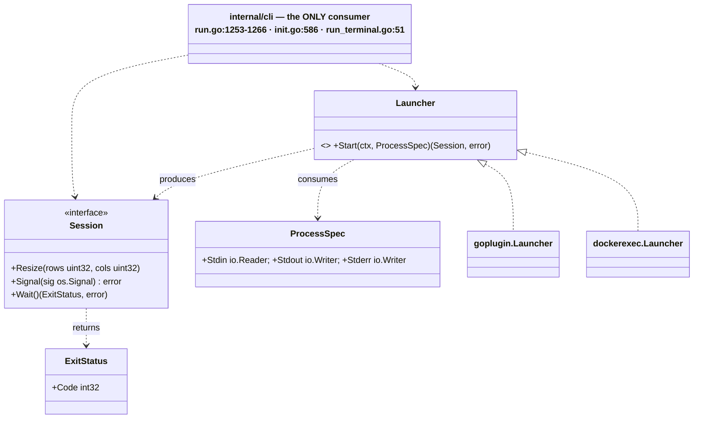
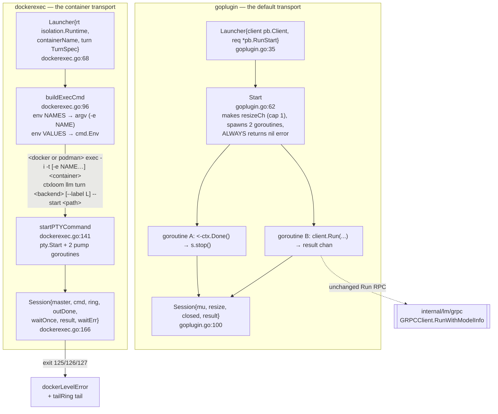

# `internal/vpio` — the virtualized-process-IO seam

**What it is.** Four declarations — `ProcessSpec`, `ExitStatus`, `Session`, `Launcher` — that let
above-the-seam code drive **one interactive agent turn** without naming a transport. The package
itself contains **zero executable statements**: 87 lines of documentation and four type
declarations.

**The contract it owns.** *Bind everything turn-invariant (backend identity, container name,
`RunStart`) into a `Launcher` at construction; pass only the three stdio streams per turn.* Two
implementations ship — `internal/vpio/goplugin` (the default) and `internal/vpio/dockerexec` (the
container-interactive transport) — and one package consumes the seam: `internal/cli`, at
`run.go:1257` (`launcher.Start`), `run.go:1266` (`session.Wait`), `init.go:586`, and
`run_terminal.go:51` (`pumpResize`).

The swap is visible at `run.go:1253-1256`:
`launcher := interactiveLauncher; if launcher == nil { launcher = goplugin.NewLauncher(client, req) }`
— where `interactiveLauncher` is the dockerexec one, set at `run.go:1418`.

---

## 1. Structure

---

## 2. The seam

| Symbol | file:line | Notes |
|---|---|---|
| `ProcessSpec` | `vpio.go:44` | `{Stdin io.Reader, Stdout io.Writer, Stderr io.Writer}`. The per-turn contract; everything else is bound into the `Launcher` at construction (`vpio.go:39-43`) |
| `ExitStatus` | `vpio.go:55` | `{Code int32}` — a struct rather than a bare `int32` so a future field (`Signaled`, `Runtime`) is a source-compatible addition on an exported interface return |
| `Session` | `vpio.go:62` | `Resize(rows, cols uint32)` (`:67`), `Signal(os.Signal) error` (`:77`), `Wait() (ExitStatus, error)` (`:80`) |
| `Launcher` | `vpio.go:85` | `Start(ctx, ProcessSpec) (Session, error)` |

### Contract notes that are stated, and the ones that are not

- **`Stdin` may be nil** for a non-interactive (oneshot) turn — "the Launcher must not block trying
  to read it" (`vpio.go:45-47`). Both implementations honour it (`dockerexec.go:148`
  `if spec.Stdin != nil`; goplugin via `client.go`'s own nil guard).
- **`Stdout`/`Stderr` nil is unspecified**, and the two implementations diverge: `dockerexec`
  substitutes `io.Discard` (`dockerexec.go:154-157`) and the entire session's output goes nowhere
  while `Wait` returns `ExitStatus{Code: 0}, nil`; `goplugin` passes the writer straight through to
  `client.Run`, which does `_, _ = stdout.Write(...)` with no nil guard and panics on the first
  output frame. Both production callers pass non-nil (`run.go:1258`, `init.go:589`).
- **`Stderr` "receives the session's diagnostic output"** (`vpio.go:50-51`) — `dockerexec` never
  reads the field at all. A pty has one stream, so it merges stderr into stdout
  (`dockerexec.go:252-254`); the interface text does not say so.
- **`Resize` must not block the caller** (`vpio.go:65-66`) — both implementations honour it
  (goplugin's non-blocking latest-wins select, dockerexec's single ioctl).
- **`Wait` idempotence is unspecified**, and the two answer differently: `dockerexec.Wait`
  (`dockerexec.go:204`) wraps its body in `waitOnce.Do` and returns a cached result — its own test
  cleanup relies on that; `goplugin.Wait` (`goplugin.go:148`) is `r := <-s.result` on a cap-1
  channel that receives exactly one value and is never closed, so a second call blocks forever.
  A caller writing the natural `defer session.Wait()` alongside an explicit `Wait` hangs on one
  transport and not the other.
- **There is no `Close`/`Release`.** `Wait` is the only terminal method, so each implementation
  invents its own lifecycle: goplugin ties cleanup to the caller's ctx via an internal
  `go func(){ <-ctx.Done(); s.stop() }()` (`goplugin.go:86-89`), dockerexec relies on
  `exec.CommandContext`'s kill-on-cancel.
- **`Signal` has zero callers anywhere in the repo** — production or test-as-caller. Both
  implementations exist solely to return "not supported" (`goplugin.go:143`,
  `dockerexec.go:192`), and the only `vpio.Session.Signal` calls are three test lines asserting the
  error. The doc's rationale ("so a future transport that CAN honor it has somewhere to plug in")
  has been tested by events: the docker-exec transport landed and could not honour it either.

---

## 3. `internal/vpio/goplugin` — the default transport

**What it does.** Adapts the existing hashicorp/go-plugin-backed bidirectional `Run` RPC to the
seam: it turns one blocking `client.Run(...)` call into a `Start`/`Wait` pair, and turns the resize
*channel* that call expects into the `Session.Resize` *method* the seam specifies. It does **not**
modify the Run RPC, its client implementation, or the wire protocol (`goplugin.go:13-17`, verified).

| Symbol | file:line | Notes |
|---|---|---|
| `Launcher` | `goplugin.go:35` | `{client pb.Client, req *pb.RunStart}`. It does **not** spawn a process or container — that already happened upstream (`goplugin.go:30-34`) |
| `NewLauncher` | `goplugin.go:44` | 2 production call sites: `run.go:1255`, `init.go:586` |
| `runResult` | `goplugin.go:49` | `{code int32, err error}` — bundled because a channel carries one value |
| `Session` | `goplugin.go:100` | `{mu, resize chan *pb.WindowSize, closed bool, result chan runResult}` |
| `Start` | `goplugin.go:62` | Creates the cap-1 resize channel, spawns the ctx-done watcher and the `client.Run` goroutine, returns immediately |
| `Session.Resize` | `goplugin.go:116` | Latest-wins relay: try send → if full, evict the stale pending value → re-send → drop if still full. **No-ops after close**, checked under `mu` before any send (`:117-121`), which is what makes send-on-closed impossible |
| `Session.Wait` | `goplugin.go:148` | `r := <-s.result` |
| `Session.stop` | `goplugin.go:155` | Marks closed and closes the resize channel, exactly once, under `mu`. Its only caller is the ctx-done watcher |

**Invariants.** The stdio pass-through is byte-for-byte and pointer-identical (asserted at
`goplugin_test.go:83-91`). `Start` never blocks. `Resize` never panics on a closed channel.

**Divergences.** `Wait` is not idempotent (above), and does not call `stop()` — so a completed
session's resize channel stays open and the ctx-done watcher stays parked until the caller's
context is cancelled, which for `run.go`'s whole-command context means the whole run. The
package's own comment states the requirement it then fails to meet on the completion path: "the
resize channel must eventually close so `client.Run`'s internal resize-pump goroutine doesn't park
forever" (`goplugin.go:66-70`).

**A known, unfixed defect is recorded as a source comment.** `goplugin.go:72-85` ("DEFECT T2,
deliberately NOT fixed here") documents that a caller with no real tty passes a nil
`ProcessSpec.Stdin`, `pumpResize` is then a no-op, nothing ever calls `Session.Resize`, and the
resize channel sits live and unfed until `ctx.Done()` — forcing the pty runner's pre-Start wait to
always run its full `initialResizeWait`. The comment names the fix (an explicit "no resize" signal
on `ProcessSpec`) and records that an attempt was made and reverted. The corresponding
optimisation already exists one layer down: `internal/lm/grpc/client.go:89-93` closes the send
side when `stdin == nil && resize == nil`.

Two comment passages are stale: `goplugin.go:6-11` and `:58-61` both present docker-exec as
unbuilt and its synchronous-`Start`-failure as hypothetical. Both shipped —
`dockerexec.go:143-145` returns a wrapped `pty.Start` error. `vpio.go:16-17`, `:23-28` and `:84`
carry the same drift ("the current (only) implementation is internal/vpio/goplugin").

---

## 4. `internal/vpio/dockerexec` — the container transport

**What it does.** Renders and runs
`docker|podman exec -i -t [-e NAME…] <container> ctxloom llm turn <backend> [--label L] --start <path>`
as a **host subprocess under a host-side pty pair**. Rather than publishing a port or running an
in-container listener, it rides the daemon's own control socket and runs the Run-RPC body directly
on the exec TTY (`dockerexec.go:13-21`). Its one production caller is
`internal/cli/run.go:1418` (`startContainerInteractive`), which has already started a keepalive
container via `policy.StartRunner`.

| Symbol | file:line | Notes |
|---|---|---|
| `TurnSpec` | `dockerexec.go:56` | `{Backend, Label, StartPath, Env}`. `StartPath` names the 0600 `RunStart` handoff file — "RunStart NEVER rides argv/env" (`:53-55`) |
| `Launcher` | `dockerexec.go:68` | `{rt isolation.Runtime, containerName string, turn TurnSpec}` |
| `NewLauncher` | `dockerexec.go:77` | |
| `buildExecCmd` | `dockerexec.go:96` | Renders the argv with env **names** only (via `isolation.Runtime.ExecArgs`, which emits `-e <name>`) and carries the **values** on `cmd.Env` (`:120-124`). Sorts names for a deterministic, diffable argv. Force-overrides `TERM=dumb` (`:81-90`) so ctxloom's own termenv init inside the container does not issue an OSC 11 query and eat the user's first keystrokes off the shared stdin |
| `Start` | `dockerexec.go:132` | `startPTYCommand(ctx, l.buildExecCmd(ctx), spec)` — the split is a documented test seam (`:139-140`) letting the pty plumbing be tested with `sh`/`cat` and no daemon |
| `startPTYCommand` | `dockerexec.go:141` | `pty.Start(cmd)`, builds the Session, spawns the stdin→master and master→(stdout, ring) pumps |
| `Session` | `dockerexec.go:166` | `{master *os.File, cmd *exec.Cmd, ring *tailRing, outDone chan struct{}, waitOnce, result, waitErr}` |
| `Session.Resize` | `dockerexec.go:184` | `pty.Setsize` — a single ioctl |
| `Session.Wait` | `dockerexec.go:203` | Reaps the exec CLI, drains the output pump (2s `outputDrainGrace`, then force-closes master), and **discriminates docker-level from engine-level exit codes**: 125/126/127 → a loud runtime error with the captured output tail; anything else → a plain `ExitStatus`. Idempotent via `waitOnce` |
| `dockerLevelError` / `dockerLevelErrorWrap` | `dockerexec.go:237`, `:244` | |
| `tailRing` | `dockerexec.go:255` | Bounded last-8192-bytes buffer for the failure diagnostic. A field-for-field re-derivation of `internal/shared/stderrtail.Ring`, whose package doc says it exists to stop exactly that; `newTailRing` also drops `stderrtail.New`'s `max <= 0` guard |

**Invariants.**

1. **Secrets never ride the argv.** `buildExecCmd` puts env *names* on the command line and values
   on `cmd.Env`, so the daemon forwards the value from the CLI's own environment. (This is the
   opposite of what the container `run` path does in `internal/lm/isolation/runtime.go:548-556`.)
2. **`RunStart` rides a 0600 file, never argv or env.**
3. **The exec argv is deterministic** — `sort.Strings(names)` at `:116`.
4. **A docker-level failure is never misreported as an engine failure** (`Wait`'s 125/126/127
   discrimination) — the best-designed part of the unit.
5. **`Wait` is idempotent.**

**Divergences.**

- **Nil `spec.Stdout` silently discards the entire session** (`dockerexec.go:154-157`) while `Wait`
  returns success.
- **`exec.CommandContext` is used with neither `cmd.Cancel` nor `cmd.WaitDelay`**
  (`dockerexec.go:119`), so on context cancellation the `docker exec` CLI is SIGKILLed with zero
  grace. The repo's own pattern exists twice elsewhere: `internal/lm/grpc/host_runner.go:74`
  (`WaitDelay = 10s`) and `internal/lm/isolation/sharedfs.go:37` (`5s`). `outputDrainGrace`
  mitigates host-side buffered bytes but not what the in-container turn had not yet flushed.
- **The pty master fd is never closed on the normal exit path.** `s.master.Close()` appears only in
  `Wait`'s timeout arm (`dockerexec.go:212`); when the drain completes normally the first select
  case wins and nothing closes it. There is no `Close` on `Session` and none on `vpio.Session`, so
  no caller can close it either.
- **The stdin-copy goroutine is never cancelled and never observed** (`dockerexec.go:148-150`).
  Nothing closes `spec.Stdin`, nothing selects on a done channel, and `Wait` waits only on the
  *output* pump. With a real terminal it parks in `Read` forever, outliving the session.
- **`Resize` discards `pty.Setsize`'s error** — partly forced, since `vpio.Session.Resize` returns
  nothing.
- **Nothing is validated.** An empty `Backend`, `StartPath` or `containerName` renders a
  well-formed but meaningless command whose failure surfaces from inside the container.
- **`125`/`126`/`127` are bare literals** (`dockerexec.go:219`); their meanings live only in the
  method's prose comment.

---

## 5. What the seam buys, and what it costs

**It pays for itself.** `run.go:1253-1266` selects between two genuinely different transports — a
live go-plugin gRPC stream and a `docker exec -it` subprocess under a host pty — with one nil
check, and the ~90 lines of terminal/resize/exit plumbing above it are written once.

**The `Launcher.error` return was speculative and is now load-bearing.** `goplugin.Start` never
returns non-nil (`goplugin.go:96`); `dockerexec.startPTYCommand` genuinely fails
(`dockerexec.go:143-145`) and `run.go:1261` handles it.

**The costs are all under-specification, not over-abstraction.** Four contracts the interface does
not state — nil `Stdout`/`Stderr`, `Stderr` separability, `Wait` idempotence, and resource release
— are each answered differently by the two implementations, and every resource leak in
`dockerexec` and `goplugin` traces back to the missing `Close`.
