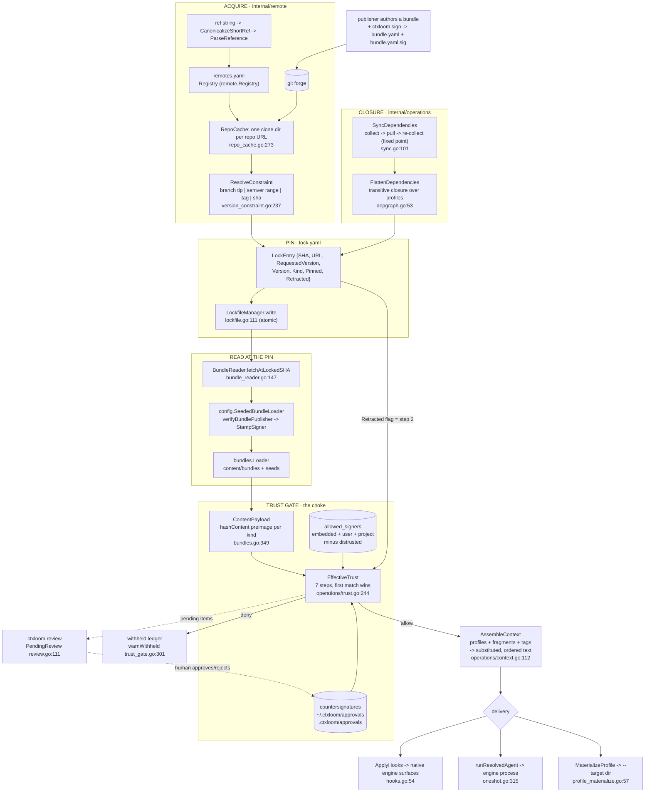

# Architecture — content, trust and operations core

These pages document the layer that carries ctxloom's defensible claim: **signed,
provenance-tracked context**. Everything here answers one question — how do bytes authored
by someone else become bytes an engine sees, and what stands between the two.

They are written for a future session that must reason about this code by grepping docs
rather than re-reading source: every claim that has a location carries a `file:line`, every
page names its invariants explicitly, and each page ends with a factual note wherever
documented behavior and real behavior diverge. Defect analysis lives in `FINDINGS.md`, not
here.

## Pages

| Page | Package | What it owns |
|---|---|---|
| [remote.md](./remote.md) | `internal/remote` | The reference grammar, the remotes registry, the git clone cache, selector→SHA resolution, and `lock.yaml`. |
| [bundles.md](./bundles.md) | `internal/bundles` | The bundle document, the loader, item kinds, the **content-hash preimage**, skill packages, and the content trust choke. |
| [config.md](./config.md) | `internal/config` | `config.yaml` discovery, layering, migration and persistence; inline profiles; bundle seeding; the trust root union. |
| [profiles.md](./profiles.md) | `internal/profiles` | Directory profiles, the schema-upgrade pipeline, and parent-graph resolution into a `ResolvedProfile`. |
| [operations.md](./operations.md) | `internal/operations` | The frontend-neutral orchestration layer: bootstrap, sync, lock, assemble, apply, review, launch. |
| [trust.md](./trust.md) | `internal/trust` + the gate | The trust vocabulary and addressing, the seven-step decision cascade, the state machine, and the exposure chokes. |
| [signing.md](./signing.md) | `internal/signing` | The signature envelope, the countersignature preimage, and the publisher state machine. |
| [paths.md](./paths.md) | `internal/paths` | The on-disk layout vocabulary and the three tiers — `content/`, `cache/`, `state/` (user-facing account: [docs/layout.md](../../layout.md)). |
| [projectroot.md](./projectroot.md) | `internal/projectroot` | Which directory is the project, worktree classification, and the task-store exception. |
| [schema.md](./schema.md) | `internal/schema`, `internal/schemagen` | JSON Schema validation and the path oracle; reflected schema publication. |

## The content pipeline, end to end

## Cross-cutting invariants

These hold across every page; each is restated with its citations on the page that owns it.

1. **`.ctxloom/content/` is committed and authored. `.ctxloom/cache/` is derived and
   gitignored.** Authored bundles are read only from `content/bundles`
   (`paths.LocalBundlesPath`, `internal/paths/paths.go:463`); pulled remote copies, git
   clones, trust snapshots and the context cache live under `cache/`
   (`internal/paths/paths.go:447,483,492`). `cache/bundles` is never a bundle *search* dir —
   authored YAML found there raises a fatal migration finding
   (`internal/config/config.go:1659`). Deleting `cache/` must lose nothing that
   `ctxloom deps pull` cannot rebuild.

2. **`lock.yaml` is authoritative for the pin, never for the content.** It records
   `{SHA, URL, RequestedVersion, Version, Kind, FetchedAt, Pinned, Retracted, RetractedReason}`
   per bundle (`internal/remote/types.go:148`) and only for bundles
   (`internal/remote/types.go:202`). Bytes are re-fetched from the clone cache at `entry.SHA`
   on every read. `Retracted` is the one *trust-relevant* field it carries — step 2 of the
   cascade reads it and never dials the network.

3. **Sole writers.**

   | File | Only writers |
   |---|---|
   | `.ctxloom/config.yaml` | `Config.saveLocked` (`internal/config/config_save.go:118`, via `Manager.Update` / `Config.Save`), `commitPendingUpgrade` (`config_save.go:56`), and the initial creation by `operations.InitializeProject` (`internal/operations/init.go:76`) |
   | `.ctxloom/remotes.yaml` | `Registry.save` (`internal/remote/registry.go:105`) and the initial creation by `operations.InitializeProject` (`internal/operations/init.go:84`) |
   | `.ctxloom/lock.yaml` | `LockfileManager.write` (`internal/remote/lockfile.go`) — reached from `Save` (`:152`) and from the load-time self-heal in `Load` (`:66`). Callers: `Puller.updateLockfile`/`RecordRetraction` inside `internal/remote`, and `internal/operations/lockfile.go:147` through the `LockfileStore` port. **`Save` refuses destructive writes** since `fd0d87d6`: empty-over-populated (`ErrLockfileWouldErase`, opt out with `remote.AllowEmpty()`) and any write over a corrupt file (`ErrLockfileUnreadable`, no override) |
   | `.ctxloom/profiles/*.yaml` | `profiles.Loader.Save` / `.Delete` / `.CommitUpgrade` (`internal/profiles/profiles.go:612,679,400`) |
   | `content/bundles/**` | `bundles.fsStore.Save` / `.Delete` (`internal/bundles/store.go:57,119`) |
   | countersignatures | `countersign.Store.write`, reached only from `operations.SetItemTrust` / `SetBlacklist` (`internal/operations/trust.go:554,667`) |

4. **The trust gate keys on `Ref.CanonicalURL() + "|" + Ref.Key()`** — built by
   `countersignRef` (`internal/operations/countersign_records.go:184`), where
   `Key() = <bundle>#<kindDir>/<name>`. A **rejection is bound to that address only**; an
   **approval is bound to the address plus the form plus the exact payload bytes**. That
   asymmetry is why editing an item clears its approval and never clears its rejection.

5. **The content hash is computed over a per-kind preimage, never over the YAML file.**
   `hashContent` (`internal/bundles/bundles.go:349`) is the only hash site; the field order of
   the preimage structs is part of the `ctxloom-exec/1` contract. The identity digest in
   `lock.yaml` is a *git commit SHA*, a different thing — `internal/remote` computes no content
   digest at all.

6. **`Deny` is the default and the decision is recomputed at every exposure.** Nothing caches
   a trust verdict to disk, so there is no stale state to desynchronize; the cost control is
   `TrustStamper` (`internal/operations/trust.go:970`), not a cache.

7. **Exposure and management use different loaders.** Every path that hands bytes to an engine
   goes through the gated `exposureLoader` (`internal/operations/trust_gate.go:223`); authoring
   and listing paths use the ungated `bundleLoader` (`internal/operations/fragments.go:41`) on
   purpose, because a reviewer must be able to see pending content.

## Reading order

- Tracing where a byte came from: [remote.md](./remote.md) → [bundles.md](./bundles.md) → [config.md](./config.md).
- Tracing why a byte was or was not delivered: [trust.md](./trust.md) → [signing.md](./signing.md) → the assembly section of [operations.md](./operations.md).
- Tracing what a command does: [operations.md](./operations.md), which names the file and line for every entry point.
