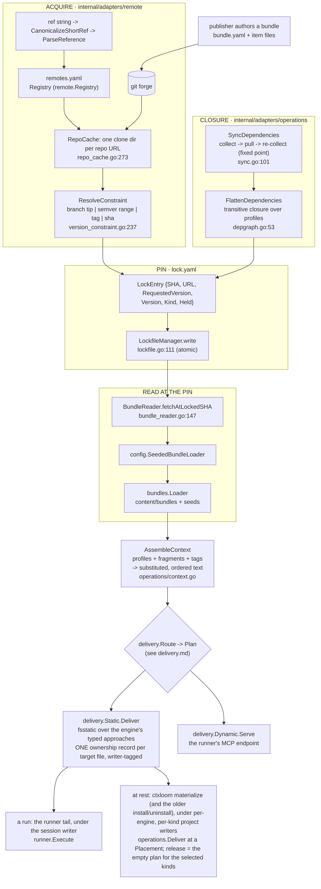

# Architecture — content and operations core

These pages document the layer that carries ctxloom's defensible claim: **pinned context
from repositories you chose**. Everything here answers one question — how do bytes authored
by someone else become bytes an engine sees. What is trusted, and why, is
[trust-model.md](../../trust-model.md).

They are written for a future session that must reason about this code by grepping docs
rather than re-reading source: every claim that has a location carries a `file:line`, every
page names its invariants explicitly, and each page ends with a factual note wherever
documented behavior and real behavior diverge. Defect analysis lives in `FINDINGS.md`, not
here.

## Pages

| Page | Package | What it owns |
|---|---|---|
| [remote.md](./remote.md) | `internal/adapters/remote` | The reference grammar, the remotes registry, the git clone cache, selector→SHA resolution, and `lock.yaml`. |
| [bundles.md](./bundles.md) | `internal/core/bundles` | The bundle document, the loader, item kinds, content hashing, and skill packages. |
| [config.md](./config.md) | `internal/core/config` | `config.yaml` discovery, layering, migration and persistence; inline profiles; bundle seeding. |
| [profiles.md](./profiles.md) | `internal/core/profiles` | Directory profiles, the schema-upgrade pipeline, and parent-graph resolution into a `ResolvedProfile`. |
| [operations.md](./operations.md) | `internal/adapters/operations` | The frontend-neutral orchestration layer: bootstrap, sync, lock, upgrade, assemble, apply, launch. |
| [launch.md](./launch.md) | `internal/core/launch` | The resolved launch: one Source, one Resolve, one Launch; the floor, the cell, the plan, the endpoint; the internal one-shots. |
| [composite.md](./composite.md) | `internal/core/composite` | The one composer: `Select`, `Assemble` (the one `Package`), the opaque per-engine export blocks, `EngineItems`, `IndexOf`. |
| [premise-selection.md](./premise-selection.md) | `internal/adapters/operations` | Conditional fragments: withholding, the premise index an agent selects from, and what the mechanism measurably costs and saves. |
| [paths.md](./paths.md) | `internal/core/paths` | The on-disk layout vocabulary and the three tiers — `content/`, `cache/`, `state/` (user-facing account: [docs/layout.md](../../layout.md)). |
| [session-layout.md](./session-layout.md) | `internal/core/paths`, `internal/core/sessions`, `internal/adapters/isolation` | The machine session dir and the human output dir, the container mount set, the deletion matrix, and container secrets. |
| [projectroot.md](./projectroot.md) | `internal/adapters/projectroot` | Which directory is the project, worktree classification, and the task-store exception. |
| [schema.md](./schema.md) | `internal/shared/schema`, `internal/shared/schemagen` | JSON Schema validation and the path oracle; reflected schema publication. |

## The content pipeline, end to end

```mermaid
flowchart TD
    AUTHOR["publisher authors a bundle<br/>bundle.yaml + item files"]
    AUTHOR --> FORGE[("git forge")]

    subgraph acquire["ACQUIRE · internal/adapters/remote"]
        REG["remotes.yaml<br/>Registry (remote.Registry)"]
        REF["ref string -> CanonicalizeShortRef -> ParseReference"]
        CACHE["RepoCache: one clone dir per repo URL<br/>repo_cache.go:273"]
        RESOLVE["ResolveConstraint<br/>branch tip | semver range | tag | sha<br/>version_constraint.go:237"]
        REF --> REG --> CACHE
        FORGE --> CACHE
        CACHE --> RESOLVE
    end

    subgraph pin["PIN · lock.yaml"]
        LOCK["LockEntry {SHA, URL, RequestedVersion,<br/>Version, Kind, Held}"]
        WRITE["LockfileManager.write<br/>lockfile.go:111 (atomic)"]
        RESOLVE --> LOCK --> WRITE
    end

    subgraph closure["CLOSURE · internal/adapters/operations"]
        SYNC["SyncDependencies<br/>collect -> pull -> re-collect (fixed point)<br/>sync.go:101"]
        FLAT["FlattenDependencies<br/>transitive closure over profiles<br/>depgraph.go:53"]
        SYNC --> FLAT --> LOCK
    end

    subgraph read["READ AT THE PIN"]
        BR["BundleReader.fetchAtLockedSHA<br/>bundle_reader.go:147"]
        SEED["config.SeededBundleLoader"]
        LOADER["bundles.Loader<br/>content/bundles + seeds"]
        WRITE --> BR --> SEED --> LOADER
    end

    LOADER --> ASM["AssembleContext<br/>profiles + fragments + tags<br/>-> substituted, ordered text<br/>operations/context.go"]

    ASM --> DELIVER{"delivery.Route -> Plan<br/>(see delivery.md)"}
    DELIVER --> STATIC["delivery.Static.Deliver<br/>fsstatic over the engine's typed approaches<br/>ONE ownership record per target file, writer-tagged"]
    STATIC --> RUN["a run: the runner tail, under the session writer<br/>runner.Execute"]
    STATIC --> MAT["at rest: ctxloom materialize (and the older install/uninstall), under per-engine, per-kind project writers<br/>operations.Deliver at a Placement; release = the empty plan for the selected kinds"]
    DELIVER --> DYN["delivery.Dynamic.Serve<br/>the runner's MCP endpoint"]

```

## Cross-cutting invariants

These hold across every page; each is restated with its citations on the page that owns it.

1. **`.ctxloom/content/` is committed and authored. `.ctxloom/cache/` is derived and
   gitignored.** Authored bundles are read only from `content/bundles`
   (`paths.LocalBundlesPath`, `internal/core/paths/paths.go:463`); pulled remote copies, git
   clones and the context cache live under `cache/`
   (`internal/core/paths/paths.go:447,483,492`). `cache/bundles` is never a bundle *search* dir —
   authored YAML found there raises a fatal migration finding
   (`internal/core/config/config.go:1659`). Deleting `cache/` must lose nothing that
   `ctxloom deps pull` cannot rebuild.

2. **`lock.yaml` is authoritative for the pin, never for the content.** It records
   one `remote.LockEntry` per bundle, and only for bundles (`remote.Lockfile`). It
   records no time, so a pull at unchanged pins rewrites it byte for byte. Bytes are
   re-fetched from the clone cache at `entry.SHA` on every read.

3. **Sole writers.**

   | File | Only writers |
   |---|---|
   | `.ctxloom/config.yaml` | `Config.saveLocked` (`internal/core/config/config_save.go:118`, via `Manager.Update` / `Config.Save`), `schemaver.WriteBack` under `--write-upgrades` (`configload`'s `persistUpgrade`), and the initial creation by `operations.InitializeProject` (`internal/adapters/operations/init.go:76`) |
   | `.ctxloom/remotes.yaml` | `Registry.save` (`internal/adapters/remote/registry.go:105`) and the initial creation by `operations.InitializeProject` (`internal/adapters/operations/init.go:84`) |
   | `.ctxloom/lock.yaml` | `LockfileManager.write` (`internal/adapters/remote/lockfile.go`) — reached only from `Save`; `Load` never writes except through `schemaver.WriteBack` under `--write-upgrades`. Callers: `Puller.updateLockfile` inside `internal/adapters/remote`, and `internal/adapters/operations/lockfile.go:147` through the `LockfileStore` port. **`Save` refuses destructive writes** since `fd0d87d6`: empty-over-populated (`ErrLockfileWouldErase`, opt out with `remote.AllowEmpty()`) and any write over a corrupt file (`ErrLockfileUnreadable`, no override) |
   | `content/bundles/**/profiles/*.yaml` (a local bundle's profile items) | `profiles.Loader.Save` / `.Delete`, `operations.SetProfileContent` (`profile edit`), `operations.scaffoldSeedProfile` (init), and `bundles.migrateProfileItems` when an envelope's migration is persisted (`--write-upgrades`) |
   | `content/bundles/**` (everything else) | `bundles.fsStore.Save` / `.Delete` (`internal/core/bundles/store.go:57,119`) |

4. **Only `deps upgrade --yes` moves an existing pin.** `operations.UpgradeDependencies`
   computes before it writes: without `Apply` it is a preview that writes nothing and moves
   no worktree, and every pin it would move is disclosed as an `operations.PinChange`.
   Sync, init and startup create first pins and keep the rest.

5. **Content resolves only through a registered remote.** Every fetch and every read of
   installed content refuses an unregistered repository with `remote.NotRegisteredError`.

## Reading order

- Tracing where a byte came from: [remote.md](./remote.md) → [bundles.md](./bundles.md) → [config.md](./config.md).
- Tracing why a byte was or was not delivered: [remote.md](./remote.md) (registration and the pin) → the assembly section of [operations.md](./operations.md).
- Tracing what a command does: [operations.md](./operations.md), which names the file and line for every entry point.
