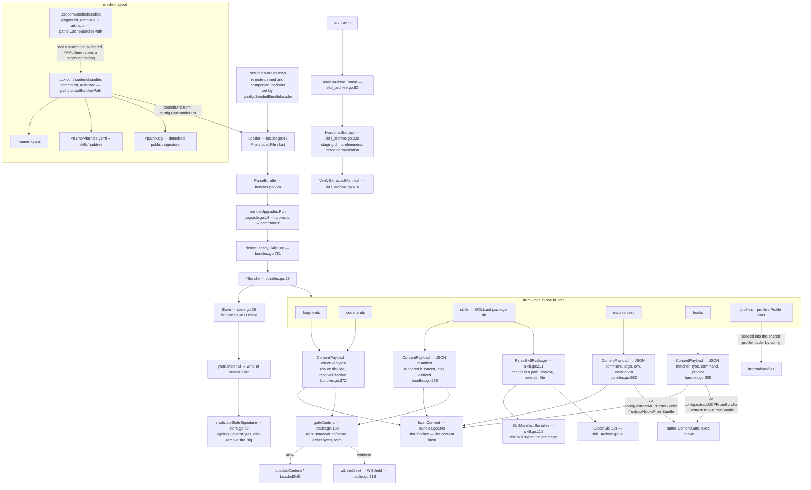

# internal/bundles

`internal/bundles` is the bundle data model, the on-disk resolver for bundle items, and the definition of "the bytes of this item". A bundle is one YAML document (`<name>.yaml` or `<name>/bundle.yaml`) carrying named fragments, commands, skills, MCP servers, hooks and profiles; the `Loader` finds bundles across search dirs or an in-memory seed, parses them through a schema-upgrade pipeline, and runs every resolved item's exact exposed bytes through an injected per-item trust gate before returning it. The `ContentPayload` family here is the single canonical preimage that trust grants and publisher countersignatures bind to (`internal/signing/payload.go:16` names these functions as the authority).

The contract it owns: an item's content hash is `sha256` over a preimage this package builds, and no fragment, command or skill leaves this package without passing the gate on exactly those bytes.

## Responsibilities

- The bundle schema and its parse path, including the load-time schema upgrade pipeline (`ParseBundle`, `bundleUpgrades`).
- Bundle discovery and listing across search dirs plus a seeded in-memory map (`Loader.Find`, `LoadFile`, `List`).
- Resolution of fragments, commands and skills to gated, ready-to-assemble values (`LoadedContent`, `LoadedSkill`).
- The content preimages and the one hash chokepoint (`ContentPayload` per item kind, `hashContent`/`HashPayload`).
- The per-item trust choke: calling the injected `ContentGate` with the exposed bytes, and tallying withheld refs (`gateContent`, `Withheld`).
- Version-addressed resolution — `bundle@<commit>` — through an injected `BundleVersionResolver` plus a per-version cache.
- The bundle's verified publisher identity (`Bundle.signer`, `StampSigner`, `Signer`).
- Agent Skill packages: SKILL.md parse, frontmatter validation, per-file manifest, deterministic zip export, and hardened archive extraction (`skill.go`, `skill_archive.go`).
- The persistence port and its filesystem adapter, including the content/signature pair invariant on write (`Store`, `fsStore`, `invalidateStaleSignature`).
- Bundle name validation as the path-traversal chokepoint (`ValidateBundleName`).
- Once-per-key warning dedup for unresolved and ambiguous refs (`warn.go`).

## Non-responsibilities

- Deciding trust. The `ContentGate` is supplied by `internal/operations` (`ExecutableTrustGate`) and the grant records live in `internal/trust` — see `./trust.md` and `./operations.md`. A nil gate allows everything.
- Signature verification and the trust root — `internal/signing` plus `internal/config`'s `TrustRoot()`; see `./trust.md` and `./config.md`. This package only records the resulting signer and verifies skill-manifest signatures through an injected verifier.
- Building loaders, choosing search dirs, seeding remote and companion bundles — `internal/config` (`SeededBundleLoader`, `GetBundleDirs`); see `./config.md`.
- Fetching, pinning and caching remote bundles — `internal/remote`; see `./remote.md`. Version materialization is an injected function.
- Profile resolution and inheritance — `internal/profiles`; see `./profiles.md`. `BundleProfile` is a type alias for `profiles.Profile` and bundle-shipped profile definitions are never gated here.
- Turning bundle MCP entries and hooks into wire types for a launched engine — `internal/config/config_bundles.go` does that, calling back into `BundleMCP.ContentPayload`/`BundleHook.ContentPayload` for the preimage.
- Agents. There is no `agents:` key in a bundle; agent definitions come from the `agents:` config key alone — see `./config.md`.
- Assembling context and writing per-engine command/skill files — `internal/operations` and `internal/lm/backends`.

## Data flow

## Key types

| Type | file:line | What it carries |
|---|---|---|
| `Bundle` | `internal/bundles/bundles.go:28` | Metadata (`Version`, `Tags`, `Author`, `Description`, `Notes`, `Installation`); the content maps `Fragments`, `Commands`, `MCP`, `Skills`, `Profiles`; `Hooks BundleHooks`; runtime-only `Name` and `Path` (`yaml:"-"`); unexported `sourceRef` (canonical remote ref when seeded) and `signer` (verified publisher identity) |
| `BundleFragment` / `BundleCommand` | `bundles.go:268` / `:280` | The two distillable text items: `Content`, `ContentHash`, `Distilled`, `DistilledBy`, `NoDistill`, `Tags`, `Notes`, `Installation`; `BundleCommand` adds `Description` and `LLM LLMExports` |
| `BundleSkill` / `SkillFileMeta` | `bundles.go:309` / `:321` | A reference to an on-disk Agent Skill package: `Path`, `Tags`, `Notes`, `Files map[string]SkillFileMeta` (sha256 + mode per file), `LLM SkillLLMExports` |
| `BundleMCP` | `bundles.go:258` | `Command`, `Args`, `Env`, `Installation` (all signed), `Notes` (excluded from the preimage), `ContentHash` (recorded, never read by the gate) |
| `BundleHook` / `BundleHooks` / `HookEntry` | `bundles.go:138` / `:154` / `:212` | One hook (`Matcher`, `Command`, `Type`, `Prompt`, `Timeout`, `Async`, `PreToolFallback`); the six event lists; and the `(event, index)` addressable identity whose `ID()` is `<event>/<index>` |
| `BundleProfile` (alias of `profiles.Profile`) | `bundles.go:334` | Bundle-shipped profile definitions, addressed `<bundle>#profiles/<name>` |
| `ContentForm` | `bundles.go:340` | `raw` or `distilled`, carried beside every preimage so a raw grant cannot validate a distilled exposure |
| `ContentGate` (func) | `loader.go:44` | `func(ref, kind, name string, payload []byte, form, signer string) bool` — the injected per-item trust decision, taking bytes rather than a recorded hash. `nil` means allow everything |
| `BundleVersionResolver` (func) | `loader.go:82` | The injected seam that materializes a bundle at an explicit commit |
| `Loader` | `loader.go:48` | Six near-disjoint partitions: `{searchDirs, fs, mu, cache}`, `{seeded}`, `{gate, withheldMu, withheld}`, `{versionResolver, versionMu, versionCache}`, `{preferDistilled}`, `{warnOut}` (used only by `fsStore`) |
| `BundleInfo` | `loader.go:464` | Listing metadata without content: name, path, counts, tags, description, `Deleted` (set only by `operations/bundle_list_remote.go:55`) |
| `LoadedContent` | `loader_content.go:16` | A resolved fragment or command: name, content, source bundle, `IsDistilled`, `Installation` |
| `ContentInfo` / `SkillInfo` / `ExpandedRef` | `loader_content.go:131` / `loader_skills.go:146` / `loader_content.go:519` | Listing and ref-expansion DTOs; `ContentInfo.FileName` is synthesised as `<name>.yaml` for items that have no file |
| `LoadedSkill` / `LoadedSkillFile` | `loader_skills.go:33` / `:46` | A gated skill package with its materialized files (relative path, bytes, mode) |
| `LLMExports`, `ClaudeCodeConfig`, `AntigravityConfig`, `CodexConfig`, `KiroConfig`, `OpencodeConfig` | `loader_content.go:58-128` | Per-engine slash-command export settings; each has an identical `IsEnabled` where nil means enabled |
| `SkillPackage` / `SkillFrontmatter` | `skill.go:134` / `:74` | A parsed skill directory (name, frontmatter, body, manifest); frontmatter carries `Name` and `Description` (validated) plus `License`, `Compatibility`, `Metadata`, `AllowedTools` (passthrough, never interpreted) |
| `SkillManifest` / `SkillManifestEntry` | `skill.go:98` / `:87` | The canonical per-file list (`Path`, `SHA256`, `Mode` as an octal string) and its `sorted`/`Serialize`/`Hash` methods; `Serialize()` is the skill signature preimage |
| `SkillLLMExports` / `SkillEngineExport` | `skill.go:29` / `:38` | Per-engine skill enablement, `Enabled *bool` with nil meaning enabled |
| `ArchiveFormat` / `ExtractOptions` / `entryKind` | `skill_archive.go:36` / `:150` / `:172` | zip vs tar.gz vs unknown; the bomb-defense caps `MaxTotalBytes`/`MaxEntries` (zero means default, applied by `normalized`); and the per-entry file/dir/symlink/other classification |
| `SkillSignatureVerifier` / `NoopSkillSignatureVerifier` / `PublisherSkillSignatureVerifier` | `skill_archive.go:642` / `:652` / `:674` | The install-time signature seam; an accept-everything implementation; and the real one, verifying a detached signature over `manifest.Serialize()` against a `signing.TrustRoot` |
| `Source` / `Store` | `store.go:19` / `:28` | The read port (`Load`, `LoadFile`) embedded in the read+write port (`+ Save`, `Delete`) |
| `fsStore` / `MemStore` | `store.go:38` / `:131` | The filesystem adapter, embedding `*Loader` so reads and writes share one `afero.Fs`; and an in-memory adapter with one call site (`store_test.go:44`) |
| `commandsKeyUpgrade` | `upgrade.go:26` | The single bundle schema upgrader: legacy `prompts:` → `commands:` |
| `bundleWarner` | `warn.go:18` | Once-per-key dedup (`mu`, `seen`, `out`) behind the package-global `unresolvedBundleWarner` |

## Key functions

### Parse and migrate

| Signature | file:line | Contract |
|---|---|---|
| `ParseBundle(data []byte) (*Bundle, error)` | `bundles.go:724` | Runs `bundleUpgrades`, then the legacy-skills guard, then unmarshals and initializes the content maps. An empty, whitespace-only, comment-only or `null` document yields a zero-value bundle and a nil error |
| `bundleUpgrades` (var) | `upgrade.go:14` | The ordered, oldest-first pipeline run on every load so a renamed key is normalized instead of dropped |
| `detectLegacySkillsKey(data)` | `bundles.go:781` | AST walk that rejects a legacy command-shaped `content:` under `skills:`, so the reused key cannot be silently misread |
| `renameMapKey(root, old, new) bool` | `upgrade.go:42` | In-place key rename preserving position; when the new key already exists the legacy pair is dropped |
| `ValidateBundleName(name) error` | `bundles.go:862` | Rejects empty, NUL, `..` traversal and absolute names; the chokepoint `Find` applies |
| `ExtractBundleName(path) string` | `bundles.go:889` | Path to bundle name, shared with `operations` |

### Discovery and listing

| Signature | file:line | Contract |
|---|---|---|
| `NewLoader(searchDirs []string, preferDistilled bool, opts ...LoaderOption) *Loader` | `loader.go:161` | 17 production call sites; options are `WithFS`, `WithSeededBundles`, `WithTrustGate`, `WithVersionResolver`, `WithWarnWriter` (`loader.go:93-153`) |
| `WithSeededBundles(map[string]*Bundle)` | `loader.go:104` | Merges the seed and backfills `Name` and `sourceRef` on the caller's bundle values |
| `Loader.Find(name) (string, error)` | `loader.go:289` | Validates the name, then stats `<dir>/<name>.yaml` and `<dir>/<name>/bundle.yaml`. Stat errors are treated as absent |
| `Loader.LoadFile(path) (*Bundle, error)` | `loader.go:322` | Seed short-circuit, then parse cache, read, `ParseBundle`, the single-file-bundle-with-skills guard, cache insert. Fails loudly on read and parse errors |
| `Loader.Load(ref) (*Bundle, error)` | `loader.go:256` | Seed lookup (exact then canonical key), else `Find` plus `LoadFile` |
| `Loader.List() ([]*BundleInfo, error)` | `loader.go:376` | Seed entries plus a recursive walk of every search dir. Per-bundle failures route through `strictness.Fail`; a dir-level or walk-level error yields an empty list and a nil error |
| `Loader.ListAllFragments` / `ListAllCommands` / `ListAllSkills` | `loader_content.go:148` / `:195` / `loader_skills.go:158` | Sweep every listed bundle; a per-bundle load failure is skipped |
| `Loader.ListByTags` | `loader_content.go:475` | Tag filter over `ListAllFragments` |

### Item resolution

| Signature | file:line | Contract |
|---|---|---|
| `Loader.GetFragment(ref) (*LoadedContent, error)` | `loader_content.go:234` | Dispatches on `bundle#kind/name` (`splitItemRef`, `:248`) versus a bare name searched across bundles; distinguishes not-found from withheld |
| `Loader.GetCommand(ref)` | `loader_content.go:365` | Same shape for commands |
| `Loader.GetSkill(ref)` | `loader_skills.go:190` | Same shape for skills |
| `Loader.fragmentContent` / `commandContent` / `skillContent` | `loader_content.go:264` / `:382` / `loader_skills.go:89` | Build the payload, call `gateContent`, return nil on withhold. `commandContent` gates under the kind dir `prompts`; `skillContent` additionally resolves the package dir, verifies the extracted manifest when `Files` is non-empty, and reads the files |
| `Loader.CommandsFromBundleRef(ref)` / `SkillsFromBundleRef(ref)` | `loader_content.go:411` / `loader_skills.go:59` | All gated commands or skills of one bundle, sorted; a bundle-load failure yields nil |
| `Loader.ResolveFragmentAsk(name)` | `loader_content.go:308` | Bare name to canonical ref; on a `List` failure the input is returned unchanged and the later load reports it. Ambiguity warns once via `bundleWarner.ambiguous` |
| `Loader.ExpandBundleRefs` / `expandBundleRef` | `loader_content.go:551` / `:573` | Expand whole-bundle and targeted refs to fragment refs, dedup, apply version upgrades. Unresolved whole-bundle refs warn once (`unresolvedBundleWarner.unresolved`) |
| `LoadedContent.ExportName()` | `loader_content.go:37` | The short slash-command name: last segment after `@`, then after `/` |

### Version resolution

| Signature | file:line | Contract |
|---|---|---|
| `splitBundleVersion(ref) (canonical, version string)` | `loader_version.go:87` | Splits `bundle@<commit>`; a plain name parses as version-less |
| `Loader.bundleAtVersion(ref, commit) (*Bundle, error)` | `loader_version.go:39` | Empty commit falls through to `Load`; otherwise resolves via the injected resolver and caches by key. Missing resolver, resolver error and a nil bundle all fail loudly. Materialized bundles get a synthetic `Path` of `<remote-version>:<ref>@<sha>` (`:74`) |
| `Loader.GetFragmentAtVersion` / `GetPromptAtVersion` | `loader_version.go:108` / `:134` | Per-version item resolution, gated like the unversioned path |

### Content preimage and hash

| Signature | file:line | Contract |
|---|---|---|
| `hashContent(b []byte) string` | `bundles.go:349` | The single hash chokepoint: `"sha256:" + hex` |
| `HashPayload(b []byte) string` | `bundles.go:363` | Exported alias; the only cross-package entry point (`internal/lm/backends`) |
| `resolveEffective(content, distilled string, noDistill, prefer bool) ([]byte, ContentForm)` | `bundles.go:372` | The one predicate that both picks the exposed bytes and reports their form: distilled wins only when `prefer && distilled != "" && !noDistill` |
| `staleDistill(...) bool` | `bundles.go:385` | Recorded-hash staleness comparison behind `NeedsDistill` |
| `BundleFragment.ContentPayload(prefer) ([]byte, ContentForm)` | `bundles.go:423` | Raw effective bytes; the fragment preimage |
| `BundleCommand.ContentPayload(prefer)` | `bundles.go:461` | Same for commands |
| `BundleSkill.ContentPayload(fsys, bundleDir, skillName) ([]byte, error)` | `bundles.go:570` | Canonical JSON `{preimage: "ctxloom-exec/1", manifest: EffectiveManifest()}`. **Takes a filesystem** since `8d9da20c`: a manifest-less skill's manifest is derived from the real tree rather than being empty, so the preimage is content-bound in both shapes |
| `BundleMCP.ContentPayload() ([]byte, error)` | `bundles.go:574` | Canonical JSON `{preimage, command, args, env, installation}`; `Notes` and the recorded `ContentHash` are excluded |
| `BundleHook.ContentPayload() ([]byte, error)` | `bundles.go:632` | Canonical JSON `{preimage, matcher, type, command, prompt, pre_tool_fallback}`; `Timeout` and `Async` are excluded because they are not executable content |
| `Compute*ContentHash` / `EffectiveContentHash` | `bundles.go:401, 434, 442, 469, 519, 591, 648` | `hashContent` over the corresponding payload; the exec-item variants fall back to a stable digest on the unreachable marshal error |
| `BundleSkill.ToManifest()` | `bundles.go:480` | `Files` map to the sorted slice the preimage encodes |
| `BundleHooks.Entries()` / `EntryByID(id)` | `bundles.go:228` / `:241` | All hooks in the canonical `hookEventOrder` (`bundles.go:184`), and the reverse lookup from `<event>/<index>`; malformed or out-of-range ids fail closed |

### Trust choke and signer

| Signature | file:line | Contract |
|---|---|---|
| `Loader.gateContent(source, kind, name string, payload []byte, form, signer string) bool` | `loader.go:188` | Builds the ref `<source>#<kindDir>/<name>`, calls the gate with the exact exposed bytes, records withheld refs. A nil gate allows everything |
| `Loader.Gate()` | `loader.go:210` | Hands the same decision function to callers that must gate identically outside this package |
| `Loader.Withheld() []string` | `loader.go:218` | Sorted, deduped refs withheld by this loader; content-free |
| `Bundle.Signer()` / `Bundle.StampSigner(principal)` | `bundles.go:99` / `:115` | Read and the single authorised write of the unexported, `yaml:"-"` verified publisher identity. Production writers: `config/config.go:1970` and `config/companions.go:356` |
| `Bundle.contentSourceRef()` | `bundles.go:127` | `sourceRef` when the bundle came from a remote clone, else `Name` — the `source` half of every trust ref |

### Skill packages and archives

| Signature | file:line | Contract |
|---|---|---|
| `ParseSkillPackage(fsys, dir, name) (*SkillPackage, error)` | `skill.go:211` | Reads and validates SKILL.md, splits frontmatter, builds the manifest. Every failure names the directory |
| `validateSkillFrontmatter` | `skill.go:168` | Six hard constraints, each with a precise error naming the field and limit |
| `buildSkillManifest` | `skill.go:251` | Walks the package, hashes each file, records a `%04o` mode, enforces a total size cap |
| `SkillManifest.Serialize() []byte` / `Hash()` | `skill.go:112` / `:124` | Canonical JSON preimage over the sorted manifest, and its sha256; `Serialize` is what `operations/skills.go:459` signs and `PublisherSkillSignatureVerifier` verifies |
| `ResolveSkillDir(bundleDir, entry, name) (string, error)` | `skill.go:299` | `entry.Path` or `skills/<name>`, confined under `bundleDir` |
| `safeSkillRelJoin(root, rel) (string, bool)` | `skill.go:314` | The shared lexical confinement primitive: rejects empty, absolute, `..` and any escape |
| `ExportSkillZip(pkg) ([]byte, error)` | `skill_archive.go:91` | Deterministic zip of exactly the manifest's files under a `<pkg.Name>/` top dir |
| `DetectArchiveFormat(b) (ArchiveFormat, error)` | `skill_archive.go:62` | Magic-byte sniff; loud on unknown |
| `HardenedExtract(fsys, data, format, destDir, opts) (string, error)` | `skill_archive.go:230` | Creates `destDir`, dispatches to the zip or tar.gz extractor under the entry-count and total-byte caps, returns the consensus top-level dir name |
| `processArchiveEntry(...)` | `skill_archive.go:347` | Per-entry: name validation, kind rejection (only files and dirs are written), top-dir consensus, lexical confinement, pre-existing-symlink escape re-check, size accounting, write |
| `symlinkEscapesRoot` / `resolveSymlinkChain` | `skill_archive.go:469` / `:514` | Component-wise resolution of already-planted symlinks and confinement re-verification; ≤40 hops; returns "escapes" on any resolution failure |
| `normalizeExtractedMode(mode)` | `skill_archive.go:547` | Any exec bit becomes `0755`, everything else `0644` — the setuid/setgid/sticky defense |
| `ImportSkillArchive(fsys, data, finalDir) (string, error)` | `skill_archive.go:570` | Detect, extract into a staging dir, `RemoveAll(final)`, `Rename` staging into place |
| `VerifyExtractedManifest(fsys, dir, name, manifest) error` | `skill_archive.go:610` | Recomputes the manifest over the extracted tree and compares count, path, sha256 and mode, with four distinct actionable errors |
| `PublisherSkillSignatureVerifier.VerifyManifestSignature` | `skill_archive.go:694` | Verifies a detached signature over `manifest.Serialize()` against the publish trust root; an empty principal is a hard error |
| `InstallSkillPackage(...)` | `skill_archive.go:750` | Verify signature, extract to staging, verify hashes, rename. No production callers |

### Persistence

| Signature | file:line | Contract |
|---|---|---|
| `NewFSStore(searchDirs []string, preferDistilled bool, opts ...LoaderOption) Store` | `store.go:43` | The filesystem `Store`, embedding a `*Loader` so reads and writes share one `afero.Fs`. Production constructions: `operations/bundles.go:348` with `cfg.GetBundleDirs()`, and `operations/bundle_distill.go:128` with nil dirs |
| `fsStore.Save(b *Bundle) error` | `store.go:57` | Requires a non-empty `Bundle.Path`, marshals, creates parents, writes in place, then invalidates a signature it has outdated. Every bundle mutation lands here |
| `fsStore.invalidateStaleSignature(...)` | `store.go:99` | Removes a sibling `.sig` that no longer covers the new bytes (`signing.CoversBytes`) and warns loudly; a `.sig` read error is treated as no signature |
| `fsStore.Delete(name) error` | `store.go:119` | `Find` then remove that one file; returns `ErrBundleNotFound` for an unknown name |
| `MemStore.Seed/Load/Save/Delete` | `store.go:143-172` | In-memory adapter storing and returning the caller's `*Bundle` pointer; `Delete` of a missing name returns nil |

### Warnings

| Signature | file:line | Contract |
|---|---|---|
| `bundleWarner.unresolved(ref, err)` / `ambiguous(name, matches, pick)` | `warn.go:29` / `:41` | Once-per-key stderr diagnostics through the package global `unresolvedBundleWarner` (`warn.go:54`), never reset for the process lifetime |
| `WithWarnWriter(w io.Writer)` | `loader.go:153` | Sets `Loader.warnOut`, which only `fsStore` reads (`store.go:113`) |

## Invariants

1. **Authored bundles live in `.ctxloom/content/bundles`; the cache is not read.** `paths.LocalBundlesPath` (`internal/paths/paths.go:463`) is the committed, authored tree and is what `config.GetBundleDirs` (`internal/config/config.go:1632`) passes as the `Loader`'s `searchDirs`. `paths.CacheBundlesPath` (`internal/paths/paths.go:447`) is gitignored, holds remote-pull artifacts (identified by a `_source.sha` marker) and is never a search dir; authored YAML found there raises a fatal `ClassMigration` finding rather than being silently skipped (`config.go:1659`).
2. **The loader reads two on-disk forms and one in-memory seed.** `Find` (`loader.go:289`) accepts `<dir>/<name>.yaml` and `<dir>/<name>/bundle.yaml`; seeded bundles (remote-pinned and companion loadouts, installed by `config.SeededBundleLoader`) are addressed by a synthetic path prefix (`seededPath`/`seededNameFromPath`, `loader.go:234`/`:238`) and short-circuit the filesystem entirely.
3. **The store writes wherever `Bundle.Path` points.** `fsStore.Save` (`store.go:57`) refuses an empty path and creates parent dirs; it does not confine the write to the search dirs. The authored write path is `operations`' store built over `cfg.GetBundleDirs()` (`operations/bundles.go:348`), so authored writes land under `content/bundles`.
4. **A published bundle is the pair (content bytes, detached `.sig`).** `Save` invalidates a signature its new bytes have outdated by removing the sibling `.sig` and warning (`store.go:99`); it is the one place that holds this invariant. `Delete` (`store.go:119`) removes only the file `Find` resolved — the sibling `.sig`, and for the directory form the rest of the bundle tree, are not removed.
5. **Bundle version means two different things.** `Bundle.Version` (`bundles.go:30`) is the authored schema/metadata string. A *resolvable* version is a commit: a ref `bundle@<commit>` is split by `splitBundleVersion` (`loader_version.go:87`) and materialized by the injected `BundleVersionResolver` (`loader.go:82`, wired at `config.go:1742`), cached per resolved key in `versionCache`. A remote bundle's identity for pinning purposes is its canonical ref plus SHA, stamped into the synthetic `Path` by the seeder (`config.go:1969`).
6. **The content hash is `sha256` over a per-kind preimage produced in this package, never over the YAML file.** `hashContent` (`bundles.go:349`) is the only hash site. Fragments and commands hash their effective exposed bytes; skills hash `{preimage, manifest}` (`bundles.go:570`), where the manifest is the **effective** one — authored if the skill has been synced, derived from the on-disk tree if not (`8d9da20c`); MCP servers hash `{preimage, command, args, env, installation}` (`bundles.go:552`); hooks hash `{preimage, matcher, type, command, prompt, pre_tool_fallback}` (`bundles.go:609`). Field order in those structs is byte order in the preimage, so it is part of the `ctxloom-exec/1` contract.
7. **What the preimage deliberately excludes:** `Notes` on every item, `Timeout` and `Async` on hooks (not executable content), and the recorded `ContentHash` fields in YAML — those are advisory and never read by the trust gate (`bundles.go:400`).
8. **The bytes hashed are the bytes exposed.** `resolveEffective` (`bundles.go:372`) both selects raw or distilled content and reports the `ContentForm`, and `ContentPayload` returns them together, so a grant recorded for one form cannot validate the other.
9. **Every fragment, command and skill exposure passes `gateContent`** (`loader.go:188`) with the exact payload and form before a `LoadedContent`/`LoadedSkill` is returned; a nil gate allows everything by design (management loaders need to see pending items). A withheld item returns nil from the content builder, is recorded in the withheld set, and reaches callers as a distinct `Err*Withheld` rather than not-found.
10. **Trust-ref shape is `<source>#<kindDir>/<name>`,** where source is `contentSourceRef()` (`bundles.go:127`) and the kind dirs are the literals `fragments`, `prompts` (for command items, a deliberate legacy spelling) and `skills` (`loader_content.go:266`, `:384`, `loader_skills.go:94`); the declared authority for those strings is `trust.ItemKind.Dir()` (`internal/trust/trust.go:131`), which this package does not import. Hook and MCP refs are built by `internal/config` using `HookEntry.ID()` (`bundles.go:221`).
11. **`Bundle.signer` cannot be forged from a file.** It is unexported and `yaml:"-"`; the only writer is `StampSigner` (`bundles.go:115`), called by load paths that have already verified a publish signature against the trust root, or with the synthetic `builtin:ctxloom` for compiled-in bundles. Empty means unsigned, which is legal and takes the review path.
12. **A bundle's profile definitions are never gated here.** There is no `trust.ItemKind` for profiles; a bundle profile's constituent fragments and commands gate at content assembly and its MCP/hooks gate at the exec choke (`bundles.go:60`).
13. **Every load runs the bundle schema upgrade pipeline.** `ParseBundle` (`bundles.go:724`) applies `bundleUpgrades` (`upgrade.go:14`) to the raw YAML before unmarshalling, so a legacy `prompts:` key is renamed rather than dropped; upgraders must be idempotent. Readers that unmarshal bundle YAML without `ParseBundle` skip this.
14. **Skills are directories, addressed relative to their bundle.** `skillContent` derives the package dir as `filepath.Dir(bundle.Path)` and resolves the entry through `ResolveSkillDir` (`skill.go:299`), which confines to `entry.Path` or `skills/<name>` via `safeSkillRelJoin` (`skill.go:314`).
15. **A skill's signed identity is its manifest, not its archive.** `SkillManifest.Serialize()` (`skill.go:112`) over the path/sha256/mode triples is the signature preimage on both the signing side (`operations/skills.go:459`) and the verifying side (`skill_archive.go:702`). `BundleSkill.Files` — the *authored* manifest — is written only by `ctxloom skill sync` (`internal/cli/skill_cmd.go:204`) and is meaningful only after that has run. **That does not mean an unsynced skill is ungated**: since `8d9da20c`, `BundleSkill.EffectiveManifest` (`bundles.go:541`) derives a manifest from the real tree when `Files` is absent, so the trust preimage is content-bound either way. Manifest-less is a legitimate shape — `ctxloom skill create` emits exactly it and `skill sync` is a documented later step.
16. **Skill install is: detect format, extract to a staging dir, then swap.** `ImportSkillArchive` (`skill_archive.go:570`) and `InstallSkillPackage` (`skill_archive.go:750`) both `RemoveAll` the destination and then `Rename` staging into place. Extraction rejects absolute paths, `..`, symlink and device entries, entries escaping the destination through pre-existing symlinks, and enforces the entry-count and total-byte caps; every written mode is normalized to `0755` or `0644` (`skill_archive.go:547`). `VerifyExtractedManifest` (`skill_archive.go:610`) is the post-extraction integrity check.
17. **`LoadFile` returns shared, mutable `*Bundle` pointers.** The parse cache is mutex-protected but its values are not copied, and seeded bundles are the very pointers `config`'s per-`Config` seed cache holds, so every loader built from one `Config` aliases the same bundles.
18. **`ValidateBundleName` (`bundles.go:862`) is the traversal chokepoint** applied by `Find` before any path is constructed.

## Boundaries

**Called in by:** `internal/config` — builds every `Loader` (`SeededBundleLoader`, `GetProfileLoader`), seeds remote and companion bundles, stamps signers, and extracts MCP servers and hooks into `wire` types via `config_bundles.go`; see `./config.md`. `internal/operations` — bundle and item CRUD through `Store`, review and trust-gate wiring, skill create/sync/import/export, signing; see `./operations.md` and `./trust.md`. `internal/lm/backends` — writes per-engine command and skill files from `LoadedContent`/`LoadedSkill` and re-derives exec preimages via `HashPayload`. `internal/cli` — listing, review and edit surfaces. `internal/shared/agent` — skill export shaping.

**Calls out to:** `internal/profiles` (the `BundleProfile` alias) — see `./profiles.md`; `internal/signing` (`CoversBytes`, `VerifyPublisher`, `TrustRoot`) — see `./trust.md`; `internal/shared/upgrade` (the `Pipeline`/`Upgrader` contract and `yaml.Node` helpers); `internal/clidiag` (warnings); `afero`, `gopkg.in/yaml.v3`, `archive/zip`, `archive/tar`, `compress/gzip`, `crypto/sha256`, `encoding/json`. It does not import `internal/config`, `internal/remote`, `internal/trust` or `internal/operations`.

## Where documented and real behavior diverge

- `Loader.LoadFile` documents itself as safe for concurrent use (`loader.go:322`); only the cache map is mutex-protected, and the returned `*Bundle` is shared and mutated by callers (`operations/bundles.go:1113`, `operations/skills.go:352`) and by `WithSeededBundles` (`loader.go:119`).
- `BundleCommand.Installation` is documented as sent to the AI (`bundles.go:284`) and `BundleFragment.Installation` as not sent (`bundles.go:271`); neither reaches a model — the field is copied into `agent.Fragment.Installation` (`internal/shared/agent/backend.go:45`) and never read on a delivery path.
- ~~`hookContentPayload` signs `PreToolFallback` but the proto drops it, so the hook delivered over the wire is not the hook the preimage covered.~~ **RESOLVED `40b49a7f`** — proto `Hook` now carries `pre_tool_fallback = 8` and both converters carry it. Worth keeping the shape of the old defect in mind when adding a field here: the preimage is built host-side from the `wire.Hook` that always carried the true flag, so the *hash* was never wrong; what diverged was the hook actually **delivered**. A field added to this preimage still has no mechanical link to the proto — the parity sweep binds `wire.Hook` ⇄ proto, not preimage ⇄ proto.
- `hookEventOrder`'s comment asserts it is the shared canonical order for `Entries()` and the trust gate (`bundles.go:184`); `config.extractHooksFromBundle` (`internal/config/config_bundles.go:693`) does not call `Entries()` — it hand-writes the six event calls in that order.
- `LoadedContent.IsDistilled` is recomputed as `preferDistilled && Distilled != ""` (`loader_content.go:278`, `:396`), omitting the `!NoDistill` term the exposed bytes were selected with, so an item with `no_distill: true` and a stale `distilled:` value is served raw and reported distilled.
- ~~`BundleSkill.ContentPayload` covers only `Files`, so a manifest-less skill has a constant preimage; `skillContent` also skips `VerifyExtractedManifest` on the same predicate.~~ **RESOLVED `8d9da20c` (T4).** `BundleSkill.EffectiveManifest` (`bundles.go:541`) is now the single answer to "which files is this skill": the authored manifest when synced, otherwise one derived from the real source tree via the same `ParseSkillPackage` authoring uses, failing closed on an unreadable or escaping tree. `ContentPayload` (`bundles.go:570`) builds on it, and the `len(entry.Files) > 0` predicate is **gone** from the loader (`loader_skills.go:100` records that deliberately), so `VerifyExtractedManifest` runs on every skill against the same manifest the gate decided on. The two halves were one condition: it both produced the constant preimage and switched off the check that would have noticed.
  **Two things did not change and are easy to get wrong.** No `ExecPreimageContract` bump — the field set is unchanged, only the manifest's *contents* stop being empty, and the contract is shared with MCP servers and hooks whose preimages do not move. And previously-recorded approvals of manifest-less skills **are invalidated**: they attested to a constant, so nothing can honestly re-point them at real bytes; they return to pending for one re-review.
- `skillContent` takes `filepath.Dir(bundle.Path)` unconditionally (`loader_skills.go:98`), but `Path` is `""` for companion-seeded bundles and a synthetic `<remote>:<ref>@<sha>` / `<remote-version>:…` string for seeded remote bundles (`internal/config/config.go:1969`, `loader_version.go:74`).
- `WithWarnWriter` is documented as redirecting this loader's user-facing diagnostics (`loader.go:148`); the unresolved-bundle and ambiguous-fragment warnings go to the package-global `unresolvedBundleWarner`, hard-wired to `os.Stderr` (`warn.go:54`).
- `InstallSkillPackage`'s doc calls the operation atomic with `destDir` untouched on failure (`skill_archive.go:750`); it calls `RemoveAll(destDir)` before `Rename` (`:774`), and it has no production callers — the shipping import path is `operations.ImportSkill`, which extracts first (`operations/skills.go:560`) and verifies the publisher signature afterwards (`:583`).
- `Store` embeds `Source` (`store.go:19`), but no declaration anywhere in the repo uses `bundles.Source`, and `LoadFile` is never called through either interface — only on the concrete `*Loader`.
- `MemStore` is documented as demonstrating that operations are storage-agnostic (`store.go:131`); it has one call site (`store_test.go:44`), returns stored pointers rather than round-tripping YAML, performs no signature invalidation, and `Delete` of a missing name returns nil where `fsStore.Delete` returns `ErrBundleNotFound`.
- The `ctxloom-exec/1` preimage is documented as a cross-implementation canonicalization (`bundles.go:544`), but it is produced by `encoding/json` with default HTML escaping, so `<`, `>`, `&` and U+2028/U+2029 are escaped in the hashed bytes.
