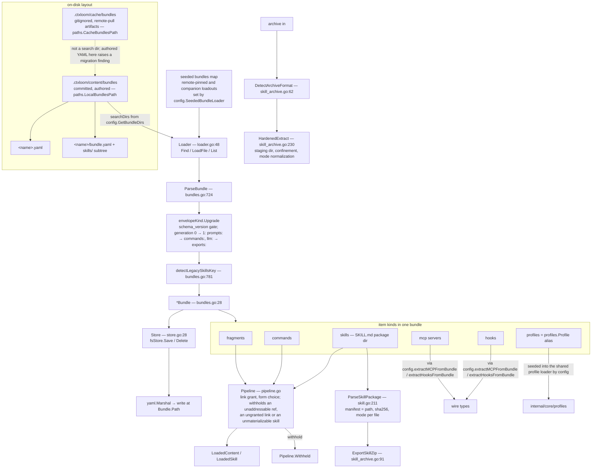

# internal/core/bundles

`internal/core/bundles` is the bundle data model and the on-disk resolver for bundle items. A bundle is one YAML document (`<name>.yaml` or `<name>/bundle.yaml`) carrying named fragments, commands, skills, MCP servers, hooks and profiles; the `Loader` finds bundles across search dirs or an in-memory seed and parses them through the envelope's format-version gate (`schema_version`, migrated in memory), and the delivery `Pipeline` resolves items from it.

## Responsibilities

- The bundle schema and its parse path, including the envelope's format-version gate (`ParseBundle`, `envelopeKind`).
- Bundle discovery and listing across search dirs plus a seeded in-memory map (`Loader.Find`, `LoadFile`, `List`).
- Resolution of fragments, commands and skills to ready-to-assemble values (`LoadedContent`, `LoadedSkill`) through the delivery `Pipeline`, which tallies what it withholds (an unaddressable ref, an ungranted link, a skill that cannot be materialized) in `Pipeline.Withheld`.
- The one content-hash helper (`hashContent`/`HashPayload`), used for distillation staleness.
- Version-addressed resolution — `bundle@<commit>` — through an injected `BundleVersionResolver` plus a per-version cache.
- Agent Skill packages: SKILL.md parse, frontmatter validation, per-file manifest, deterministic zip export, and hardened archive extraction (`skill.go`, `skill_archive.go`).
- The persistence port and its filesystem adapter (`Store`, `fsStore`).
- Bundle name validation as the path-traversal chokepoint (`ValidateBundleName`).
- Once-per-key warning dedup for unresolved and ambiguous refs (`warn.go`).

## Non-responsibilities

- Deciding which repositories are admitted. Registering a remote is the trust act, and nothing in this package withholds a registered repository's content; see [trust-model.md](../../trust-model.md).
- Building loaders, choosing search dirs, seeding remote and companion bundles — `internal/core/config` (`SeededBundleLoader`, `GetBundleDirs`); see `./config.md`.
- Fetching, pinning and caching remote bundles — `internal/adapters/remote`; see `./remote.md`. Version materialization is an injected function.
- Profile resolution and inheritance — `internal/core/profiles`; see `./profiles.md`. `BundleProfile` is a type alias for `profiles.Profile`.
- Turning bundle MCP entries and hooks into wire types for a launched engine — `internal/core/config/config_bundles.go`.
- Agents. There is no `agents:` key in a bundle; agent definitions come from the `agents:` config key alone — see `./config.md`.
- Assembling context and writing per-engine command/skill files — `internal/adapters/operations` and its `managedhooks`.

## Data flow

```mermaid
flowchart TD
    subgraph disk["on-disk layout"]
        CONTENT[".ctxloom/content/bundles<br/>committed, authored — paths.LocalBundlesPath"]
        CACHE[".ctxloom/cache/bundles<br/>gitignored, remote-pull artifacts — paths.CacheBundlesPath"]
        FORM1["&lt;name&gt;.yaml"]
        FORM2["&lt;name&gt;/bundle.yaml + skills/ subtree"]
        CONTENT --> FORM1 & FORM2
    end

    SEED["seeded bundles map<br/>remote-pinned and companion loadouts<br/>set by config.SeededBundleLoader"]

    CONTENT -->|"searchDirs from config.GetBundleDirs"| LOADER
    SEED --> LOADER
    CACHE -.->|"not a search dir; authored YAML here raises a migration finding"| CONTENT

    LOADER["Loader — loader.go:48<br/>Find / LoadFile / List"] --> PARSE["ParseBundle — bundles.go:724"]
    PARSE --> UPG["envelopeKind.Upgrade<br/>schema_version gate; generation 0 → 1: prompts: → commands:, llm: → exports:"]
    UPG --> LEG["detectLegacySkillsKey — bundles.go:781"]
    LEG --> BUNDLE["*Bundle — bundles.go:28"]

    BUNDLE --> KINDS
    subgraph KINDS["item kinds in one bundle"]
        FR["fragments"]
        CM["commands"]
        SK["skills — SKILL.md package dir"]
        MC["mcp servers"]
        HK["hooks"]
        PR["profiles = profiles.Profile alias"]
    end

    FR & CM & SK --> PIPE["Pipeline — pipeline.go<br/>link grant, form choice; withholds an unaddressable ref,<br/>an ungranted link or an unmaterializable skill"]
    PIPE --> OUT["LoadedContent / LoadedSkill"]
    PIPE -->|withhold| WH["Pipeline.Withheld"]
    MC & HK -->|"via config.extractMCPFromBundle / extractHooksFromBundle"| WIRE["wire types"]

    PR -->|"seeded into the shared profile loader by config"| PROF["internal/core/profiles"]

    BUNDLE --> STORE["Store — store.go:28<br/>fsStore.Save / Delete"]
    STORE --> WRITE["yaml.Marshal → write at Bundle.Path"]

    SK --> SKPKG["ParseSkillPackage — skill.go:211<br/>manifest = path, sha256, mode per file"]
    SKPKG --> ZIP["ExportSkillZip — skill_archive.go:91"]
    ARCH["archive in"] --> DET["DetectArchiveFormat — skill_archive.go:62"] --> HE["HardenedExtract — skill_archive.go:230<br/>staging dir, confinement, mode normalization"]
```

## Symbols

`go doc -all ./internal/core/bundles` is the symbol reference; this page does not keep a
second, hand-maintained copy of it.

## Invariants

1. **Authored bundles live in `.ctxloom/content/bundles`; the cache is not read.** `paths.LocalBundlesPath` (`internal/core/paths/paths.go:463`) is the committed, authored tree and is what `config.GetBundleDirs` (`internal/core/config/config.go:1632`) passes as the `Loader`'s `searchDirs`. `paths.CacheBundlesPath` (`internal/core/paths/paths.go:447`) is gitignored, holds remote-pull artifacts (identified by a `_source.sha` marker) and is never a search dir; authored YAML found there raises a fatal `KindMigration` finding rather than being silently skipped (`config.go:1659`).
2. **The loader reads two on-disk forms and one in-memory seed.** `Find` (`loader.go:289`) accepts `<dir>/<name>.yaml` and `<dir>/<name>/bundle.yaml`; seeded bundles (remote-pinned and companion loadouts, installed by `config.SeededBundleLoader`) are addressed by a synthetic path prefix (`seededPath`/`seededNameFromPath`, `loader.go:234`/`:238`) and short-circuit the filesystem entirely.
3. **The store writes wherever `Bundle.Path` points.** `fsStore.Save` (`store.go:57`) refuses an empty path and creates parent dirs; it does not confine the write to the search dirs. The authored write path is `operations`' store built over `cfg.GetBundleDirs()` (`operations/bundles.go:348`), so authored writes land under `content/bundles`.
4. **Bundle version means two different things.** `Bundle.Version` (`bundles.go:30`) is the authored schema/metadata string. A *resolvable* version is a commit: a ref `bundle@<commit>` is split by `splitBundleVersion` (`loader_version.go:87`) and materialized by the injected `BundleVersionResolver` (`loader.go:82`, wired at `config.go:1742`), cached per resolved key in `versionCache`. A remote bundle's identity for pinning purposes is its canonical ref plus SHA, stamped into the synthetic `Path` by the seeder (`config.go:1969`).
5. **Every load runs the envelope's format-version gate.** `ParseBundle` applies `envelopeKind.Upgrade` to the raw YAML before the strict decode: an envelope with no `schema_version` is generation 0 and gets the retired-key renames in memory; a newer one is refused. The file changes only through a writer (`TreeEnvelope` stamps the current generation) or `--write-upgrades` on a project tree (`persistEnvelopeUpgrade`). Readers that unmarshal bundle YAML without `ParseBundle` skip this.
6. **Skills are directories, addressed relative to their bundle.** `skillContent` derives the package dir as `filepath.Dir(bundle.Path)` and resolves the entry through `ResolveSkillDir` (`skill.go:299`), which confines to `entry.Path` or `skills/<name>` via `safeSkillRelJoin` (`skill.go:314`).
7. **Skill install is: detect format, extract to a staging dir, then swap.** `ImportSkillArchive` (`skill_archive.go`) `RemoveAll`s the destination and then `Rename` staging into place. Extraction rejects absolute paths, `..`, symlink and device entries, entries escaping the destination through pre-existing symlinks, and enforces the entry-count and total-byte caps; every written mode is normalized to `0755` or `0644` (`skill_archive.go:547`).
8. **`LoadFile` returns shared, mutable `*Bundle` pointers.** The parse cache is mutex-protected but its values are not copied, and seeded bundles are the very pointers `config`'s per-`Config` seed cache holds, so every loader built from one `Config` aliases the same bundles.
9. **`ValidateBundleName` (`bundles.go:862`) is the traversal chokepoint** applied by `Find` before any path is constructed.

## Boundaries

**Called in by:** `internal/core/config` — builds every `Loader` (`SeededBundleLoader`, `GetProfileLoader`), seeds remote and companion bundles, and extracts MCP servers and hooks into `wire` types via `config_bundles.go`; see `./config.md`. `internal/adapters/operations` — bundle and item CRUD through `Store`, skill create/sync/import/export; see `./operations.md`. `internal/adapters/operations/managedhooks` — assembles the managed hook set from `LoadedContent`/`LoadedSkill`. `internal/adapters/cli` — listing and edit surfaces. `internal/core/agent` — skill export shaping.

**Calls out to:** `internal/core/profiles` (the `BundleProfile` alias) — see `./profiles.md`; `internal/shared/upgrade` (the `Pipeline`/`Upgrader` contract and `yaml.Node` helpers); `internal/clidiag` (warnings); `afero`, `gopkg.in/yaml.v3`, `archive/zip`, `archive/tar`, `compress/gzip`, `crypto/sha256`, `encoding/json`. It does not import `internal/core/config`, `internal/adapters/remote` or `internal/adapters/operations`.

## Where documented and real behavior diverge

- `Loader.LoadFile` documents itself as safe for concurrent use (`loader.go:322`); only the cache map is mutex-protected, and the returned `*Bundle` is shared and mutated by callers (`operations/bundles.go:1113`, `operations/skills.go:352`) and by `WithSeededBundles` (`loader.go:119`).
- `hookEventOrder`'s comment asserts it is the shared canonical order for `Entries()` and every consumer (`bundles.go`); `config.extractHooksFromBundle` (`internal/core/config/config_bundles.go:693`) does not call `Entries()` — it hand-writes the six event calls in that order.
- `LoadedContent.IsDistilled` is recomputed as `preferDistilled && Distilled != ""` (`loader_content.go:278`, `:396`), omitting the `!NoDistill` term the exposed bytes were selected with, so an item with `no_distill: true` and a stale `distilled:` value is served raw and reported distilled.
- `skillContent` takes `filepath.Dir(bundle.Path)` unconditionally (`loader_skills.go:98`), but `Path` is `""` for companion-seeded bundles and a synthetic `<remote>:<ref>@<sha>` / `<remote-version>:…` string for seeded remote bundles (`internal/core/config/config.go:1969`, `loader_version.go:74`).
- `WithWarnWriter` is documented as redirecting this loader's user-facing diagnostics (`loader.go:148`); the unresolved-bundle and ambiguous-fragment warnings go to the package-global `unresolvedBundleWarner`, hard-wired to `os.Stderr` (`warn.go:54`).
- `Store` embeds `Source` (`store.go:19`), but no declaration anywhere in the repo uses `bundles.Source`, and `LoadFile` is never called through either interface — only on the concrete `*Loader`.
