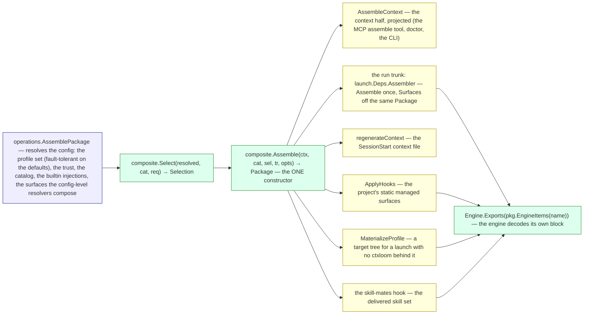
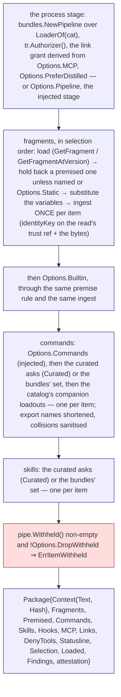

# internal/core/composite — the gate holder and the one composer

`internal/core/composite` is where a config generation's trust decides and
where a profile set becomes ONE package. It holds the `Trust` (the gate and
its cascade, per generation), resolves what a profile set asks for
(`composite.Select`), and assembles the one `composite.Package` every
consumer reads (`composite.Assemble`, the one constructor). It never knows
which engine, where files land, or the session: it imports `bundles`,
`profiles`, `trust`, `wire` and `engine`, none of which import it.

The plan this lands is `docs/architecture/audit-2026-09-18/30-decided-architecture.md`
Part 1.3 (the package half; the trust half landed in slice 5); Part 2.3 is the
item's flow. What diverges from Part 1.3 is listed at the end.

## Who asks, who reads

## Select: the assembly order

`Select` takes the profiles already loaded and inheritance-merged, in the
order asked, and the caller's explicit arm (`SelectRequest`: named
fragments, tag asks, the pinned-version resolver). Per profile, in order: the
tag matches, the direct fragment asks (a `@<commit>` pin split into
`FragmentAsk.Version`), then the whole-bundle expansions (each bundle's
fragments by name), each filtered by that profile's exclusions
(`bundles.Exclusions`). After every profile: the caller's named asks,
resolved to their qualified identity and recorded as `Selection.Explicit`,
and the caller's tag matches. One entry per item survives — the highest
priority any ask gave it, an explicit version over the default — in
first-occurrence order, then bookended: highest priority first,
second-highest last, the rest between (`select.go`: `dedupe`, `bookend`).

Everything else the set declares rides the `Selection` as written: the
curated command and skill asks, the bundle set the uncurated exports draw
from, the profiles' directly-declared hooks with each profile's source ref,
the vetoed servers, the merged variables (later profile wins), the deny list
(union, first-seen), the engine label (first non-empty), and `Declared` —
which fragment names each profile pushed, so a surface can say which
profile a withheld item cost.

## Assemble: the one package

The context is the ingested fragments joined by the section separator the
context-file writer splits on; `Context.Hash` is its digest. `Loaded` names
every fragment that loaded, a collapsed duplicate included (its content IS
in the context through the copy that survived). `Findings` are the
content-free facts a surface voices — an ask that did not load, an
undefined variable, a duplicate dropped, a curated ask that did not resolve
— so `Assemble` itself emits nothing. The attestation has one row per
delivered item (ref, decision, digest) and the withheld tally.

**The premise rule lives in one place** (`assembly.holdBack`): a fragment
carrying a premise is held back from unconditional assembly unless the
caller named it (naming it is the selection) or the assembly is static
(nothing behind the surface can pull it later, so holding it back would
lose it). Absence of a premise asserts the fragment applies always, which
is what keeps a corpus authoring no premises assembling the exact bytes it
did before.

**The ingest rule lives in one place** (`ingest.add`): two arriving
fragments are the same content — and the second is dropped — when they name
the SAME item (`identityKey`: `trust.Ref.Key`, source-agnostic, so a
project bundle that shadows a builtin and the builtin's own injection
collapse to one) AND their bytes are identical ignoring surrounding
whitespace. The first occurrence is kept; nothing reorders.

## Per-engine exports are opaque blocks

A command or skill carries `Exports map[string][]byte` — one opaque JSON
block per engine name, as `bundles.EngineBlocks` read it. `Package.EngineItems(name)`
hands an engine ITS block and nothing of another engine's, with each
command's export name, every fragment (a premised one carries its premise),
the hooks, the servers and whether settings are present. The engine decodes
its block against its `Definition.ExportSchema` (`engine.Engine.Exports`),
published per engine by `gen-schemas` as `engine-exports-<name>`. Nothing in
core reads inside a block; the one frozen exception is the exec preimage
contract in `core/bundles` (see `docs/adr/0020-operations-llm-boundary.md`,
the amendment).

## IndexOf

`IndexOf(cat)` enumerates the CATALOG — every fragment, command and skill
it holds, by bundle then by name, with its kind, description and premise —
not the selection, so the runner's `search_library` and the `ctxloom://`
resources can be served with no config owner.

## What diverges from Part 1.3, and why

- **`Selection` carries more than the plan's sketch:** `Explicit`, `Tags` /
  `MissingTags`, `Bundles`, `Hooks` (per profile, with its source ref),
  `Variables`, `DenyTools`, `LLM`, `Declared`, and `FragmentAsk` (name,
  version, priority) in place of bare refs. Each is something the adapter
  used to recompute for a consumer; carrying it once is what makes one
  assembly serve every consumer. `Preference` is set by the caller: it is
  the agent binding's, not a profile's.
- **`Package` carries `Selection`, `Loaded` and `Findings`.** The consumers
  report the profile set and the engine label; `Loaded` keeps the
  collapsed-duplicate report honest; `Findings` are how a pure `Assemble`
  hands the adapter what to say (the plan's `Assemble` emitted through the
  process-wide diagnostics; this one emits nothing).
- **`Options` carries the resolved surfaces** (`Hooks`, `MCP`, `DenyTools`,
  `Statusline`), the injected commands, `Static`, the pinned-version
  resolver (`Versions`) and the injected stage (`Pipeline`). The hook and
  MCP resolution is config-bound today (companion probes, builtin folding,
  provenance stamps, config-level hooks): `operations.AssemblePackage`
  resolves them once, from the same profile set it resolved, and `Assemble`
  carries them; the link grant is derived from `Options.MCP`. Folding those
  resolvers into composite waits on the config resolvers becoming values.
- **`composite.Gated(auth)`** wraps a gate built elsewhere: the injected-stage
  seam, for a test holding a process stage over its own authorizer.
- **`Attestation` has no `GateID`** — a generation's identity is the
  Snapshot's (`config.Snapshot.Generation`), not the package's.
- **`Item[T]` carries `Ref string`** rather than `trust.Ref`: the read's
  canonical trust ref, the same string the gate keyed on.
- **`engine.SkillFile` carries `Mode`** — the exec bit on a script is
  load-bearing across export; **`engine.CommandItem`/`SkillItem` carry
  `Curated`** (a profile named it; the engine exports it regardless of its
  block) and the authored `Description` (the engine's block may override).

Encode/Decode/Carrier/Claim/Transport are slice 8's and are not declared.
