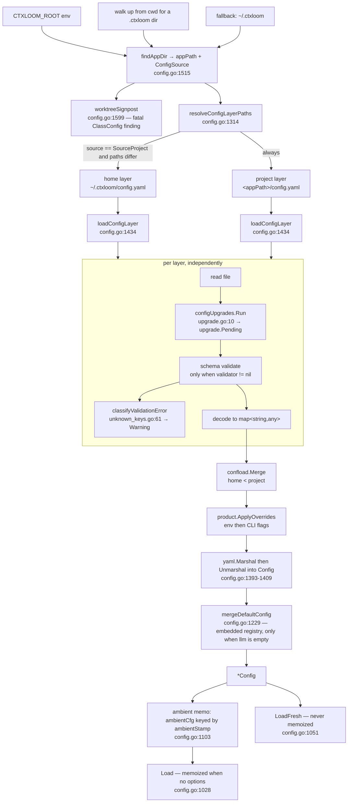
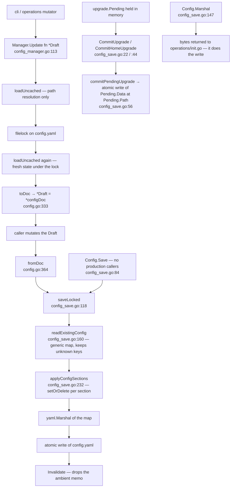

# internal/config

`internal/config` resolves and holds a project's effective configuration: it discovers the `.ctxloom` app directory, reads and layers the project and home `config.yaml` files, runs the schema-version upgrade pipeline, validates against the JSON schema, applies env/CLI overrides, and hands out a `*Config` through copy-on-read accessors. It also owns the persist path — the lock-and-merge transaction that is the only supported way to write `config.yaml` — plus three things that hang off the same receiver: inline-profile inheritance resolution, the content-loader factories (`SeededBundleLoader`, `GetProfileLoader`), and the signing trust root.

The contract it owns: one `*Config` value that every other package reads, whose persisted fields are authored YAML and whose remaining fields are load-time derived state that is never written back.

## Responsibilities

- App-directory discovery and the project-vs-home source decision (`findAppDir`, `ConfigSource`).
- Layered read of `config.yaml`: per-layer upgrade, per-layer schema validation, deep merge, override overlay, embedded-default overlay.
- The persisted data model (`configDoc`, exported as `Draft`) and its YAML round-trip.
- Schema-version migration (`configUpgrades`, `CurrentConfigVersion`) and the pending-upgrade consent flow.
- The write transaction: lock, re-read fresh, apply sections, atomic write (`Manager.Update` → `saveLocked`).
- Copy-on-read projection of every unexported field (`accessors.go`).
- Inline-profile inheritance resolution (`ResolveProfile`) for profiles defined under the `profiles.definitions` config key.
- Reading the one local agent-definition source, the `agents:` config key, and signposting a retired `.ctxloom/agents` directory.
- Companion-binary discovery, version probing and loadout probing (`companions.go`) — the only subprocess spawns in the package.
- Trust-root assembly from the embedded signer list plus on-disk `allowed_signers` / `distrusted_signers` (`trustroot.go`).
- Turning jsonschema validation failures into actionable unknown-key diagnostics (`unknown_keys.go`, `warnings.go`).
- Building the seeded bundle loader and the profile loader from the resolved workspace (`config.go` factory tier).

## Non-responsibilities

- Bundle parsing, item resolution and the trust gate mechanism — `internal/bundles`, see `./bundles.md`. This package builds the `Loader` and supplies the seed maps; it does not resolve items.
- Profile *loading* from disk, the `profiles.Loader`, and the resolved-profile type used by bundle-shipped profiles — `internal/profiles`, see `./profiles.md`. Only inline (`profiles.definitions`) inheritance is resolved here.
- Remote registries, lockfiles and clone caches — `internal/remote`, see `./remote.md`. This package reads the lockfile only to seed pinned bundles.
- Signature verification, trust decisions and grant records — `internal/signing` and `internal/trust`, see `./trust.md`. This package assembles the trust root and calls `signing.VerifyPublisher`; it does not decide.
- Printing warnings and arming the strict gate — `internal/cli` (`printConfigWarnings`, `failOnFindings`) and `internal/shared/strictness`.
- Applying resolved config to a launched engine (settings files, hooks, MCP wiring) — `internal/lm/backends` and `internal/operations`, see `./operations.md`.
- Path construction — `internal/paths` owns every `.ctxloom` subpath except `HomeConfigDir` (`home.go:17`).

## Data flow

Discovery, layering and load:

Write path, and what the writers touch:

## Key types

| Type | file:line | What it carries |
|---|---|---|
| `Config` | `internal/config/config.go:71` | ~28 unexported fields in four disjoint groups: the 21 persisted document fields; the resolved-workspace handle (`appPaths`, `appRoot`, `appDir`, `source`, `fs`, `injectedFS`); load diagnostics (`warnings`, `pendingUpgrade`, `homePendingUpgrade`); loader factories and memos (`execGate`, `companionSeed`, `companionProbe`, `lmDefaultOverlay`) |
| `configDoc` | `internal/config/config.go:308` | Exported-field mirror of the 21 persisted fields with `yaml:"…,omitempty"` tags; what yaml.v3 actually reads and writes |
| `Draft` (alias of `configDoc`) | `internal/config/config_manager.go:63` | The public mutation shape passed to `Manager.Update` |
| `Snapshot` (alias of `Config`) | `internal/config/config_manager.go:20` | Declared name with no use anywhere in the tree |
| `ConfigSource` | `internal/config/config.go:43` | `SourceProject` (the zero value) vs `SourceHome`; decides whether a home layer participates |
| `LoadOption` / `loadOptions` | `internal/config/config.go:427` / `:429` | `fs afero.Fs`, `appDir string`, `overrides *confload.Overrides` |
| `Manager` | `internal/config/config_manager.go:72` | The `[]LoadOption` a write transaction re-loads with; no other state |
| `Fixture` | `internal/config/fixture.go:18` | Exported mirror of all 28 `Config` fields; the only construction path that bypasses `Load` |
| `LMConfig` / `LLMConfig` / `RoleDefaults` | `internal/config/config_types.go:40` / `:14` / `:33` | The `llm:` block: label→entry registry, entry `Type`/`Role`/`Permissions` plus an opaque `Body map[string]any` decoded by the backend, and the `primary`/`fast` role map |
| `Profile` | `internal/config/config_types.go:117` | The inline profile authoring shape: identity, `Parents`, content selection (fragments/commands/skills/bundles/variables), wiring (`Hooks`, `MCP`), and subtraction (`ExcludeFragments`, `ExcludeMCP`, `DenyTools` at `:165`) |
| `ProfilesConfig` | `internal/config/config_types.go:172` | One-field wrapper preserving the `profiles.definitions` nesting |
| `SettingsConfig` / `SignConfig` | `internal/config/config_types.go:177` / `:190` | The `config:` bag: `UseDistilled`, `CompactionChunks`, `Statusline`, `Sign{Default,Key}` — each read through a nil-safe defaulting getter |
| `SyncConfig` / `UIConfig` / `EditorConfig` | `internal/config/config_types.go:253` / `config.go:544` / `:538` | `sync.auto_sync` tri-state; `ui.prefix_key` + `ui.surround`; `editor.command` + `editor.args` |
| `FragmentRef` | `internal/config/config_types.go:75` | `Name` + `Priority` (serialized) plus a transient `Version` (`yaml:"-"`); a byte-for-byte duplicate of `profiles.FragmentRef` kept to break an import cycle |
| `profileBuilder` | `internal/config/config_resolve.go:15` | Depth-first inheritance accumulator: seven parallel `(Set, order slice)` pairs, fragment priorities, hook dedup keys, merge targets, exclusion/deny sets |
| `Warning` / `WarningKind` | `internal/config/warnings.go:33` / `:8` | One pre-rendered load diagnostic and its class: `read`, `parse`, `validate`, `unknown-key`, `migration-lossy` |
| `CompanionStatus` | `internal/config/companions.go:55` | One companion probe result: `Bin`, `Path` (empty means not installed), `Version`, `Err` |
| `companionSeedState` | `internal/config/config.go:1809` | Per-`Config` `sync.Once` + cached `map[string]*bundles.Bundle` of companion loadouts |
| `BuiltinFragment` | `internal/config/config_bundles.go:500` | One always-on fragment from a builtin or companion bundle: `Name`, `Content`, `Installation` |
| five `Upgrader` structs | `internal/config/config_migrate.go:63, 127, 294, 373, 451, 525` | One config schema generation each (v1→2 … v5→6) plus the unversioned agent-profile canonicalizer |

## Key functions

### Discovery and load

| Signature | file:line | Contract |
|---|---|---|
| `Load(opts ...LoadOption) (*Config, error)` | `config.go:1028` | Ambient memoized load; the memo is keyed by `ambientStamp()` and bypassed whenever any option is passed (`len(opts) > 0`). ~35 production call sites |
| `LoadFresh(opts ...LoadOption) (*Config, error)` | `config.go:1051` | Straight `loadUncached`; the mutator's entry point, never memoized |
| `ParseConfig(data []byte) (*Config, error)` | `config.go:1210` | Raw YAML to `*Config` with no disk access, no validation, no upgrade, no merge |
| `Invalidate()` | `config.go:1058` | Drops the ambient memo; called by `SetOverrides`, `saveLocked` and `cli/init.go` |
| `loadUncached(opts ...LoadOption) (*Config, error)` | `config.go:1131` | The real loader: options → fs → validator → `findAppDir` → layers → default overlay. A `schema.NewConfigValidator()` failure warns and leaves the validator nil, which skips validation for that load |
| `findAppDir(fs) (string, ConfigSource)` | `config.go:1515` | `CTXLOOM_ROOT`, else walk up from cwd, else `~/.ctxloom`. Runs `worktreeSignpost` per ancestor. Last resort returns the relative `".ctxloom"` |
| `ambientStamp() string` | `config.go:1103` | Memo key: `findAppDir` + a `fileStamp` per layer + the overrides stamp. Runs on every `Load`, memo hits included |
| `resolveConfigLayerPaths(appPath, source) (project, home string)` | `config.go:1314` | Project path always; home path only when `source == SourceProject` and it differs from the project path |
| `loadLayeredConfig(...) error` | `config.go:1355` | Reads N layers, `confload.Merge` (home < project), `ApplyOverrides`, remarshal, decode into `cfg`. Remarshal or decode failure warns and returns nil |
| `loadConfigLayer(...) (map[string]any, *upgrade.Pending, error)` | `config.go:1434` | One layer: read, run `configUpgrades`, validate, classify unknown keys, decode to a map. Never returns a non-nil error |
| `mergeDefaultConfig(cfg)` | `config.go:1229` | Overlays the embedded default LLM registry only when the loaded LM config is empty |

### Overrides

| Signature | file:line | Contract |
|---|---|---|
| `InstallOverridesFromFlags(...)` | `config.go:527` | Builds the validator, reads env plus `--config-set`, installs process-wide overrides. A validator construction error is discarded |
| `SetOverrides(o confload.Overrides)` | `config.go:473` | Installs process-wide overrides and calls `Invalidate()` — the pairing is the point |
| `ctxloomProduct(...) confload.Product` | `config.go:501` | Names the ctxloom env-var and file convention used by `confload` |

### Migration

| Signature | file:line | Contract |
|---|---|---|
| `configUpgrades` (var) | `upgrade.go:10` | The ordered five-stage pipeline; consumed only at `config.go:1461` |
| `CurrentConfigVersion` (const, `= 6`) | `config_migrate.go:52` | The generation a loaded document is upgraded to |
| `migrateLLMv3` | `config_migrate.go:152` | The v2→v3 llm reshape; the only stage that records a lossy-migration warning (`:219`) |
| `migrateDefaultAgentV6` | `config_migrate.go:545` | v5→v6: synthesizes `agents.default` from `profiles.defaults`, then deletes `profiles.defaults` unconditionally (`:556`) |
| `recordMigrationWarning` / `drainMigrationWarnings` | `config_migrate.go:31` / `:39` | Package-global mutable warning buffer, drained per layer at `config.go:1471` into `WarnKindMigrationLossy` |
| `Config.CommitUpgrade` / `CommitHomeUpgrade` | `config_save.go:22` / `:44` | Persist one layer's pending upgraded bytes and clear the pending field. Callers prompt for consent first (`cli/run.go:395`, `:401`) |
| `commitPendingUpgrade(p *upgrade.Pending) error` | `config_save.go:56` | Atomic verbatim write of `p.Data` to `p.Path`; nil is a no-op |

### Persist

| Signature | file:line | Contract |
|---|---|---|
| `Manager.Update(fn func(*Draft) error) error` | `config_manager.go:113` | The lock-then-reload-then-mutate-then-save transaction; the only lost-update-safe write. Runs the whole load pipeline twice per call |
| `DefaultManager() *Manager` / `NewManager(opts...) *Manager` | `config_manager.go:78` / `:88` | Ambient-project manager and option-carrying manager; behaviourally identical with zero options |
| `Config.saveLocked(fs, configPath) error` | `config_save.go:118` | Read existing map, apply sections, marshal, atomic write, `Invalidate` |
| `Config.Save() error` | `config_save.go:84` | Lock plus `saveLocked`; no production callers |
| `Config.Marshal() ([]byte, error)` | `config_save.go:147` | Builds a fresh section map and returns bytes; the caller (`operations/init.go:162`) writes them |
| `readExistingConfig(fs, path) (map[string]any, error)` | `config_save.go:160` | Generic-map read that preserves keys `applyConfigSections` does not know. A parse failure warns and returns an empty map |
| `Config.applyConfigSections(existing map[string]any)` | `config_save.go:232` | The entire persist mapping: one `setOrDelete` per persisted section |
| `setOrDelete(m, key, present, value)` | `config_save.go:221` | Sets the key when present, prunes it when not; 19 call sites |
| `Config.toDoc` / `fromDoc` | `config.go:333` / `:364` | The two hand-written 21-field copies between `Config` and `configDoc`; map and slice fields are copied by reference |
| `Config.ToFixture` / `NewFixture` | `fixture.go:60` / `:110` | 28-field copy out and in; maps and slices are aliased, not cloned |

### Value readers and accessors

| Signature | file:line | Contract |
|---|---|---|
| 31 `(*Config).Get*` methods | `accessors.go:274-405` | The only cross-package reads of the unexported fields; every returned map/slice is copied one level deep with nested containers cloned by the 22 `clone*` helpers (`accessors.go:59-268`) |
| `GetPendingUpgrade` / `GetHomePendingUpgrade` | `accessors.go:331` / `:335` | Return the `*upgrade.Pending` pointer itself, not a copy |
| `PrimaryLabel` / `FastLabel` / `ResolveLLM` | `config.go:676` / `:690` / `:701` | `defaults.primary`, else the sole label, else empty; fast falls back to primary; an unknown label degrades to `DefaultLLM` |
| `GetDefaultLLM` / `GetCompactionLLM` / `GetCompactionModel` / `GetCompactionChunkSize` | `config.go:714` / `:727` / `:734` / `:741` | Role-named readers over `ResolveLLM`; chunk size defaults to 8000 |
| `ShouldUseDistilled` / `ShouldSignByDefault` / `SignKey` | `config.go:750` / `:757` / `:765` | Pass-throughs to the nil-safe `SettingsConfig` getters (`config_types.go:213-240`) |
| `UIPrefixKey` / `UISurroundEnabled` / `IsolationImageFor` / `IsolationBaseContainerfilePath` / `IsolationDevcontainerBaseEnabled` | `config.go:560` / `:569` / `:581` / `:591` / `:605` | Defaulting readers; the `*bool` tri-states default to true; the containerfile path resolves relative to `appRoot` |
| `GetEditorCommand` / `EditorFromEnv` | `config.go:609` / `:621` | config `editor.command`, else `VISUAL`, else `EDITOR`, else `nano`; split on whitespace with no shell quoting |
| `GetConfigFilePath() (string, error)` | `config.go:2010` | First app path plus `config.yaml`; errors actionably when no `.ctxloom` exists |
| `GetBundleDirs() []string` | `config.go:1632` | Existing authored bundle dirs (`paths.LocalBundlesPath`, i.e. `.ctxloom/content/bundles`) per app path; runs `legacyCacheBundlesSignpost` per call |
| `FS()` / `getFS()` | `config.go:927` / `:2018` | `FS` returns `c.fs` and may be nil; `getFS` substitutes `afero.NewOsFs()` |
| `SetFS` / `DisableCompanionProbe` / `ResetOverrides` | `config.go:2029` / `:1802` / `:489` | Exported mutators used only by tests; they mutate the instance `Load()` may be sharing |

### Agents

| Signature | file:line | Contract |
|---|---|---|
| `(*Config).LoadAgents() []agents.Agent` | `config.LoadAgents` | Returns the `agents:` config-key entries, cloned, sorted by name. Fires `retiredAgentsDirSignpost` first |
| `(*Config).Agent(name) (agents.Agent, bool)` | `config.Agent` | The by-name lookup; re-runs `LoadAgents` on every call |
| `(*Config).retiredAgentsDirSignpost()` | `config.retiredAgentsDirSignpost` | Records a fatal `ClassMigration` finding (`FailOnce`) when `.ctxloom/agents` still holds YAML definitions, which nothing reads |
| `(*Config).DefaultAgentProfiles() []string` | `config.go:661` | The default agent's composed profiles; nil when the named agent is undefined |

### Inline profile resolution

| Signature | file:line | Contract |
|---|---|---|
| `ResolveProfile(defs, name) (*Profile, error)` | `config_resolve.go:285` | Public entry point for `profiles.definitions` inheritance |
| `resolveProfileRecursive` / `guardProfileResolution` / `resolveProfileParents` | `config_resolve.go:294` / `:310` / `:335` | Depth-first parent walk with a cycle guard and `maxProfileDepth = 64`; a missing parent calls `strictness.Fail` and is skipped; `visited` is cloned per parent with no memoization |
| `mergeProfileValues` / `profileBuilder.toProfile` | `config_resolve.go:355` / `:235` | Folds one profile into the accumulator; emits the resolved `*Profile`. Fragment priorities take the max; hooks dedup on `hookKey` (`:144`); `ExcludeFragments`/`ExcludeMCP`/`DenyTools` come out in map iteration order |
| `NewExclusionSet` / `IsExcludedFragment` | `config_resolve.go:211` / `:224` | Canonicalizing exclusion set and its qualified-or-bare match rule, also used by `operations/context.go` |

### Bundle and content resolution

| Signature | file:line | Contract |
|---|---|---|
| `(*Config).SeededBundleLoader(...) *bundles.Loader` | `config.go:1722` | Builds the loader with `GetBundleDirs`, the remote seed, the companion seed and the version resolver; each input degrades to absent independently |
| `(*Config).GetProfileLoader(...) *profiles.Loader` | `config.go:772` | Profile loader with fs, both remote resolvers and the bundle-profile seed |
| `(*Config).loadRemoteBundleSeed(...)` | `config.go:1896` | Materializes every lockfile-pinned remote bundle from the clone cache, verifies its publisher signature, keys it by canonical ref and stamps `Path` as `<remote>:<ref>@<sha>` (`:1969`) |
| `(*Config).loadBundleProfileSeed(...)` | `config.go:821` | Walks every visible bundle, clones and canonicalizes its profiles, keys them `<bundle>#profiles/<name>` |
| `(*Config).bundleVersionResolver()` | `config.go:1841` | The closure that fetches a bundle at an explicit commit from local git or the remote clone cache |
| `verifyBundlePublisher(...)` | `config.go:1983` | Reads the detached `.sig` and verifies it against the trust root; any read error yields "unsigned" |
| `(*Config).ResolveBundleMCPServers` / `ResolveBundleHooks` / `ResolveBundleCommands` / `ResolveBundleSkills` | `config_bundles.go:108` / `:254` / `:334` / `:380` | The four executable-surface resolvers: builtin bundles, companion bundles, then the profile-scoped bundles; each runs items through the `bundles.ContentGate` before returning. An unresolvable profile is skipped |
| `(*Config).ResolveBuiltinBundleFragments` | `config_bundles.go:526` | Always-on fragments from builtin and companion bundles as `[]BuiltinFragment` |
| `Config.SetExecutableTrustGate` / `ExecutableTrustGate` | `config_bundles.go:29` / `:35` | The seam through which `operations` and `agentcoord` install the exec trust gate before a launch |

### Companions

| Signature | file:line | Contract |
|---|---|---|
| `DiscoverCompanions() []string` | `companions.go:211` | First-party list (`ltk`, `taskloom`, `reprise`) union every `ctxloom-companion-*` on `$PATH`, sorted |
| `ProbeCompanions() []CompanionStatus` | `companions.go:132` | Concurrently resolves and version-probes every companion via `<bin> version --format json`; failures land in `CompanionStatus.Err` |
| `ProbeCompanionLoadouts(ctx) (bundles.CompanionProbe, error)` | `companions.go` | One pass: concurrently execs `<bin> loadout --format json` for every ADMITTED companion and returns the envelopes, plus a `CompanionCandidate` for each discovered companion that produced none (absent / unconsented / probe-failed) |
| `(*Config).companionBundleSeed()` | `config.go:1762` | Per-`Config` `sync.Once` memo of the loadout probe; honours `CompanionsDisabled()` and the test override, disable winning |
| `SetCompanionsDisabled` / `CompanionsDisabled` | `companions.go:308` / `:315` | The mutex-guarded process-wide companion switch |

### Trust root and diagnostics

| Signature | file:line | Contract |
|---|---|---|
| `(*Config).TrustRoot() signing.TrustRoot` | `trustroot.go:63` | Unions (embedded signers minus locally distrusted principals) with the user and project `allowed_signers` stores. Never returns an error |
| `EmbeddedSigners() *allowedsigners.Store` | `trustroot.go:46` | Freshly parsed copy of the compiled-in `embedded_signers.allowed_signers` blob |
| `(*Config).SuppressedEmbeddedPrincipals()` | `trustroot.go:128` | Principals listed in the user and project `distrusted_signers` files |
| `filterSuppressedPrincipals` | `trustroot.go:100` | Drops an allowed-signers entry when any of its principals is suppressed |
| `(*Config).parseAllowedSigners(path)` | `trustroot.go:206` | Parses one `allowed_signers` file, warning per malformed line; an open failure yields nil |
| `classifyValidationError(err) []Warning` | `unknown_keys.go:61` | Flattens the jsonschema cause tree to leaves, extracts unknown key names, and renders one actionable line per key (dotted path, retired-key replacement or did-you-mean, known keys). Always returns at least one warning |
| `knownKeysAt(keywordLocation) []string` | `unknown_keys.go:191` | Walks a second raw `map[string]any` parse of the config schema by JSON pointer to list a level's property names; array segments (`anyOf/0`) abort the walk |

## Invariants

1. **`config.yaml` has exactly two writer families.** The section-merge writer is `Config.saveLocked` (`config_save.go:118`), reachable only from `Manager.Update` (`config_manager.go:113`) and `Config.Save` (`config_save.go:84`, no production callers). The verbatim writer is `commitPendingUpgrade` (`config_save.go:56`), reachable only from `CommitUpgrade`/`CommitHomeUpgrade`. `Config.Marshal` (`config_save.go:147`) produces bytes but performs no write; `operations/init.go:162` writes them.
2. **Layer precedence, lowest to highest:** embedded default LLM registry (`mergeDefaultConfig`, applies only when the LM config is empty) < `~/.ctxloom/config.yaml` < `<project>/.ctxloom/config.yaml` < environment overrides < CLI flag overrides (`loadLayeredConfig`, `config.go:1355`; `confload.Merge` then `product.ApplyOverrides`). Lists replace rather than concatenate; an explicit zero beats inheritance.
3. **A home layer exists only when a real project dir was resolved.** `resolveConfigLayerPaths` (`config.go:1314`) returns a home path only when `source == SourceProject` and the home `config.yaml` path differs from the project one; otherwise the project file is the single source.
4. **Each layer is upgraded, validated and diagnosed independently, before merging** (`loadConfigLayer`, `config.go:1434`) — never the merged result — so every warning names its own file.
5. **Schema validation is conditional.** `loadConfigLayer` validates only when the validator is non-nil, and `loadUncached` (`config.go:1158`) sets it nil when `schema.NewConfigValidator()` fails; the unknown-key mechanism is off for such a load.
6. **Unknown keys are ignored at the data level and fatal at the gate level.** An unrecognized key is dropped from the decoded values with a `WarnKindUnknownKey` warning saying it is IGNORED (`unknown_keys.go:128`); `cli/startup_helpers.go:61` turns each warning into a `strictness` finding that aborts `ctxloom run` and `ctxloom mcp` unless `--degraded`.
7. **`Save` preserves unknown keys, drops comments and key order.** `readExistingConfig` (`config_save.go:160`) reads the file into a generic map so keys `applyConfigSections` never mentions survive the round-trip; the map is re-marshalled by yaml.v3 (`config_save.go:126`), which sorts keys and carries no comments. A persisted field with no `setOrDelete` line in `applyConfigSections` is dropped from disk even though it round-trips in memory.
8. **A parse failure of the existing file does not stop the write.** `readExistingConfig` warns and returns an empty map, after which `saveLocked` atomically replaces the file with only the sections `applyConfigSections` emits.
9. **Migration is triggered on load and written only on consent.** Every layer read runs `configUpgrades` (`upgrade.go:10`) against its document; a document below `CurrentConfigVersion = 6` (`config_migrate.go:52`) is upgraded in memory and the rewritten bytes are held as an `upgrade.Pending` on `Config.pendingUpgrade` / `homePendingUpgrade`. Nothing reaches disk until `CommitUpgrade`/`CommitHomeUpgrade`, which the CLI calls only after prompting.
10. **Migrations rewrite `yaml.Node` documents, so comments and key order survive an upgrade** (`config_migrate.go:61`) — the opposite of the persist path (invariant 7).
11. **Authored vs derived.** Authored (persisted, mirrored in `Config`, `configDoc`, `Fixture`, and `applyConfigSections`): `version`, `llm`, `editor`, `config`, `sync`, `hooks`, `mcp`, `profiles`, `agents`, `default_agent`, `workspace`, `dirty_tree_handler`, `dirty_tree_commit_ack`, `runtime`, `delegation`, the five `isolation_*` keys, `ui`. Derived (never written back): `appPaths`, `appRoot`, `appDir`, `source`, `fs`, `injectedFS`, `warnings`, `pendingUpgrade`, `homePendingUpgrade`, `execGate`, `companionSeed`, `companionProbe`, `lmDefaultOverlay`.
12. **Every persisted field must be declared in four hand-maintained places** — `Config` (`config.go:71`), `configDoc` (`config.go:308`), `Fixture` (`fixture.go:19`) and `applyConfigSections` (`config_save.go:233`) — plus `toDoc`/`fromDoc`/`ToFixture`/`NewFixture`. Only the `configDoc`↔JSON-schema pair is test-gated (`internal/config/arch_test.go:66`), and only at the top level.
13. **`Load()` is memoized; the memo is keyed by `ambientStamp()`** (`config.go:1103`) — resolved app dir, per-layer stat, and the overrides stamp — and is bypassed whenever any `LoadOption` is passed. `LoadFresh` never consults it; `Invalidate()` drops it.
14. **Accessors are copy-on-read.** Every exported `Get*` (`accessors.go:274-405`) returns a value or a deep copy so no caller can mutate the shared `*Config`. The two documented exceptions in the code are `GetPendingUpgrade`/`GetHomePendingUpgrade`, which return the `*upgrade.Pending` pointer.
15. **Agents come only from the `agents:` config key.** There is no directory source; a `.ctxloom/agents` directory still holding definitions is never read and raises a fatal `ClassMigration` finding (`config.retiredAgentsDirSignpost`).
16. **The trust root is embedded-minus-distrusted, unioned with user and project `allowed_signers`** (`trustroot.go:63`); suppression is applied to the embedded store only, and a suppressed principal removes its whole entry (`trustroot.go:100`).
17. **Authored bundles are read from `.ctxloom/content/bundles`.** `GetBundleDirs` (`config.go:1632`) returns `paths.LocalBundlesPath` per app path when it exists; `.ctxloom/cache/bundles` is never a search dir, and authored YAML found there raises a fatal `ClassMigration` finding (`legacyCacheBundlesSignpost`, `config.go:1659`).
18. **The companion loadout probe runs at most once per `*Config`** (`companionSeedState.once`, `config.go:1809`) and `CompanionsDisabled()` beats the test override (`config.go:1762`).

## Boundaries

**Called in by:** `cmd/ctxloom` (override install, companion switch), `internal/cli` (~35 `Load` sites, `Manager.Update` writes, doctor, startup reporting), `internal/operations` (agent management, context assembly, profiles, trust, init), `internal/lm/backends` (the four `ResolveBundle*` resolvers, `ExecutableTrustGate`, statusline settings), `internal/agentcoord/coord` (trust gate injection before spawning children, `GetDelegationConcurrency`/`GetDelegationDepth`), `tests/integration/testenv`.

**Calls out to:** `internal/paths` (every `.ctxloom` subpath), `internal/schema` (`ConfigValidator`), `internal/shared/confload` (overrides, merge), `internal/shared/upgrade` (the pipeline and `yaml.Node` helpers), `internal/shared/strictness` (fatal findings), `internal/shared/wire` (MCP and hooks types), `internal/shared/collections`, `internal/bundles` (`Loader`, `ParseBundle`, `ContentGate`) — see `./bundles.md`, `internal/profiles` (`Loader`, `Profile`) — see `./profiles.md`, `internal/remote` (registry, lockfile, clone cache) — see `./remote.md`, `internal/signing` (`VerifyPublisher`, loadout envelopes) and `internal/allowedsigners` — see `./trust.md`, `internal/agents`, `internal/projectroot`, `internal/clidiag`, `resources` (embedded default config, schema, builtin bundles), plus `$PATH` subprocess execs of companion binaries.

## Where documented and real behavior diverge

- `SetCompanionsDisabled`'s contract says no companion binary is executed (`companions.go:309`), but `ProbeCompanions` (`companions.go:132`) never consults `CompanionsDisabled()`, so `ctxloom run` and `ctxloom mcp` still exec `<bin> version` for every companion via `cli/startup_helpers.go:166`.
- `accessors.go`'s 46-line header (`accessors.go:3-48`) describes an in-progress migration with exported fields and future `Manager.Update` write sites; the fields are already unexported (`config.go:72-287`) and `Manager`/`Draft`/`Update` already exist (`config_manager.go:72`, `:63`, `:113`).
- The same header commits to copy-on-read, but `cloneProfile` (`accessors.go:213`) does not clone `Profile.DenyTools` (`config_types.go:165`), so that slice is shared with the loaded `Config`.
- `Draft` is documented as the write API for every persisted field, but `applyConfigSections` (`config_save.go:232`) has no `ui` entry, so a `Manager.Update` that sets `d.UI` reports success and writes nothing.
- `Fixture`'s doc states a Fixture-built `Config` never aliases a `Load` result; `ToFixture`/`NewFixture` (`fixture.go:60`, `:110`) copy structs and share every map and slice.
- `Profile.DenyTools` (`config_types.go:165`) is parsed and honoured by the resolver, but `deny_tools` is absent from `resources/schema/input/config-schema.json`, whose profile object is `additionalProperties:false` — so using it produces an unknown-key warning saying the key is ignored, and a fatal finding in strict mode.
- `unknown_keys.go:17` states the schema uses `additionalProperties:false` at every level; `$defs/hook` in `resources/schema/input/config-schema.json:605` sets it to `true`, so unknown keys inside a hook definition are accepted without a warning.
- `warnings.go:5` says all four warning kinds are fatal-class in strict mode; there are five kinds (`warnings.go:13-28`), and `ctxloom acp server` (`cli/acp_cmd.go:120`) calls neither `printConfigWarnings` nor `failOnFindings`, so no config warning aborts that path.
- `GetEditorCommand`'s doc comment is attached to `IsolationImageFor` (`config.go:573-586`); `GetEditorCommand` itself (`config.go:609`) has none.
