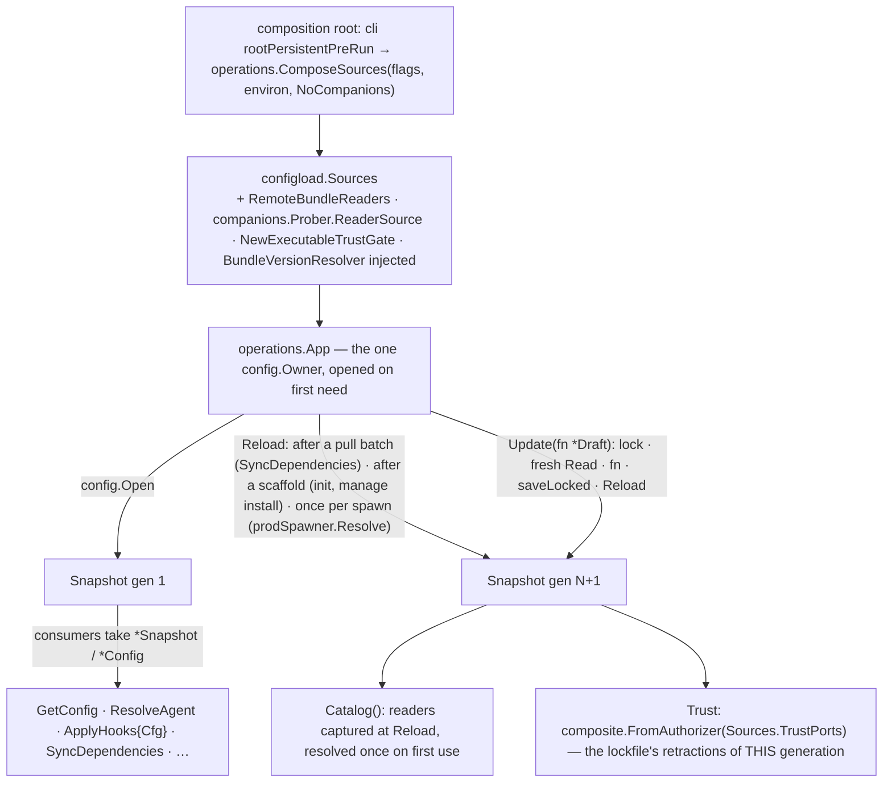

# internal/core/config

`internal/core/config` holds a project's effective configuration as an immutable VALUE and owns its LIFECYCLE in a process: one `Owner`, opened once at the composition root, publishing immutable generations (`Snapshot`) that every consumer takes as a parameter. It reads nothing itself — the reading half is `internal/adapters/configload`, behind the `Sources` port this package declares — and it probes nothing: companion discovery is `internal/adapters/companions`, whose loadouts reach a generation as a bundle reader.

The contract it owns: one published generation per process at a time, produced by exactly three re-reads (after a pull, after a scaffold, once per spawn) and by every write (`Owner.Update` publishes generation N+1); nothing a consumer holds is ever mutated under it.

## Responsibilities

- The immutable `Config` value, its persisted data model (`configDoc`, exported as `Draft`) and YAML round-trip, and the copy-on-read accessors (`accessors.go`).
- The lifecycle: `Open`, `Owner.Current`, `Owner.Reload`, `Owner.Update` (`lifecycle.go`). A `Snapshot` carries the `Config`, the generation's bundle `Catalog()` (resolved once, on first use), the `composite.Trust` built from `Sources.TrustPorts`, the generation number and the reader's warnings.
- The `Sources` port the reader implements: `Read` (an ABSENT layer is the shipped default; a PRESENT unparsable one is refused by name), `ReadTarget` (the target file alone, no lower layer and no override: what a write transaction drafts from), `Readers` (the bundle sources a generation resolves), `TrustPorts` (the executable gate).
- The reader's hand-off into the value: `Builder` (`reading.go`) — `NewBuilder`, `Warn`, `Decode`, `OverlayDefaultRegistry`, `BindVersionResolver`, `Build`. Each layer's format generation (`schema_version`) is gated by `internal/shared/schemaver` in the reader (`configload`'s `configKind`) before any of this; a migrated layer is persisted only under `--write-upgrades`, by the reader, never through `Config`.
- The write transaction: `Owner.Update` takes the cross-process file lock (`withUpdateLock`), re-reads the target file fresh (`Sources.ReadTarget`), hands `fn` a `Draft`, writes through `saveLocked` (atomic, section-merging, unknown keys preserved) and reloads. An injected filesystem (`Config.injectedFS`) skips the lock: nothing else reads it.
- The trust root (`TrustRoot`: embedded signers minus distrusted, plus user and project `allowed_signers`), agent bindings from the `agents:` key, inline-profile inheritance (`ResolveProfile`), and the bundle-content resolvers for MCP servers and hooks (commands and skills are assembled by `composite.Assemble`) that read the generation's catalog through `Config.Catalog()` / `Config.BundleLoader()`.

## Non-responsibilities

- Directory discovery, the home < project layering, per-layer schema validation and the env/`--config-set` override chain — `internal/adapters/configload` (`configload.New(flags, environ, ...)`, `Sources.Read`). The reader is built ONCE at the composition root from the process's flags and environment; there is no process-global override funnel.
- Companion registration lookup and loadout probing — `internal/adapters/companions` (`Prober`, `Prober.ReaderSource`, which reads the registered names from `Config.GetCompanions`). The companion-side `loadout` command a companion binary embeds is `companions/loadout`, a leaf the lean binaries link without the bundle model.
- The lockfile's pinned remote trees and the version resolver — `internal/adapters/operations` (`RemoteBundleReaders`, `BundleVersionResolver`), injected into the reader by `operations.ComposeSources`.
- Bundle parsing, catalog resolution and the trust gate mechanism — `internal/core/bundles` (`bundles.Resolve`, `bundles.Loader` as a resolved-once view over a `Catalog`).
- Composition — `operations.App` holds the one `Owner` (opened on first need) and the per-invocation switches; the CLI root installs it per invocation (`rootPersistentPreRun`), and `init` pins it to its target directory before its first read (`pinAppDir`).

## Data flow

```mermaid
flowchart TD
    ROOT["composition root: cli rootPersistentPreRun → operations.ComposeSources(flags, environ, NoCompanions)"] --> SRC["configload.Sources<br/>+ RemoteBundleReaders · companions.Prober.ReaderSource · NewExecutableTrustGate · BundleVersionResolver injected"]
    SRC --> APP["operations.App — the one config.Owner, opened on first need"]
    APP -->|"config.Open"| GEN1["Snapshot gen 1"]
    GEN1 -->|"consumers take *Snapshot / *Config"| USE["GetConfig · ResolveAgent · ApplyHooks{Cfg} · SyncDependencies · …"]
    APP -->|"Reload: after a pull batch (SyncDependencies) · after a scaffold (init, manage install) · once per spawn (prodSpawner.Resolve)"| GENN["Snapshot gen N+1"]
    APP -->|"Update(fn *Draft): lock · fresh Read · fn · saveLocked · Reload"| GENN
    GENN --> CAT["Catalog(): readers captured at Reload, resolved once on first use"]
    GENN --> TR["Trust: composite.FromAuthorizer(Sources.TrustPorts) — the lockfile's retractions of THIS generation"]
```

A retired generation is never rewritten: a consumer that captured `gen 1` keeps seeing `gen 1`'s `Config`, catalog and gate for the whole operation it threads them through.

## Key types

| Type | What it carries |
|---|---|
| `Config` | The persisted document fields (unexported; read through `Get*` accessors, written through `Draft`), the resolved workspace (`appPaths`, `appDir`, `appRoot`, `source`, `fs`, `injectedFS`), the reader's diagnostics (`warnings`), and the generation's bundle view bound by the Owner (`catalog`, `execGate`) or attached by the reader (`versionResolver`, `lmDefaultOverlay`) |
| `Snapshot` | `Config`, `Trust`, `Generation`, `LoadedAt`, `Warnings`, and `Catalog()` |
| `Owner` | `Sources` + the published `*Snapshot`; `Open`, `Current`, `Reload`, `Update` |
| `Sources` | The reader port: `Read`, `ReadTarget`, `Readers`, `TrustPorts` |
| `Builder` | The reader's hand-off into a `Config` before publication |
| `Draft` (= `configDoc`) | The mutable view `Owner.Update` hands `fn`: every persisted field, exported |
| `Fixture` | Exported mirror of `Config` for tests; a fixture no Owner published resolves its own project and builtin readers on every `Catalog()` call — it has no generation to pin |
| `Warning` / `WarningKind` | One load diagnostic and its class; every kind is fatal-class under the strict startup gate |

## Invariants

1. **One owner per process.** `config.Open` is called by `operations.App` (until `cmd/*` composes the process); `tests/arch`'s one-mint-one-owner rule pins it, and pins `configload.Load` — the tests' one read — to test files.
2. **Exactly three re-reads, plus writes.** `Owner.Reload` is called after a pull batch (`operations.SyncDependencies`), after a scaffold (`cli.writeInitialConfig`, `manage install`) and once per spawn (`coord.prodSpawner.Resolve` — `TestProdSpawner_Resolve_OneSnapshotPerSpawn`); `Owner.Update` publishes the next generation itself.
3. **Absent layer = shipped default; present unparsable = refusal by name** (`configload.ErrUnparsableLayer`; `TestSources_Read_AbsentLayers_YieldShippedDefaultWithoutError`, `TestSources_Read_PresentUnparsableLayer_RefusesNamingTheFile`). `ctxloom init` on a machine with no config starts.
4. **Trust follows the lockfile of its generation.** After a pull, the next generation's `Trust` withholds the retracted item (`TestPullThenSpawn_NextGenerationHoldsThePulledBundleAndItsRetraction`); an earlier generation's gate is untouched.
5. **A generation resolves its readers once, on first use.** Reading a config value never executes a companion probe (`TestOwner_Reload_CatalogResolvesOnFirstUseOnly`); a command that merely looks must never run a foreign binary.
6. **`config.yaml` has two writer families.** The section-merge writer `saveLocked`, reachable only from `Owner.Update`; and `schemaver.WriteBack` from the reader (`configload`'s `persistUpgrade`), reachable only under `--write-upgrades`.
7. **The write is lost-update safe** (`TestOwnerUpdate_SerializesConcurrentWritersInProcess`, `TestOwnerUpdate_HoldsFileLockAcrossReadModifyWrite`): the lock sidecar lives under the project's `state/locks` tree; a lock that cannot be acquired fails closed; an abandoned `fn` writes nothing and publishes nothing.
8. **Layer precedence, lowest to highest:** the shipped default LLM registry (`Builder.OverlayDefaultRegistry`, only when the user configured no LLMs) < `~/.ctxloom/config.yaml` < `<project>/.ctxloom/config.yaml` < env < `--config-set`. Each file layer is upgraded, validated and diagnosed independently before merging, so every warning names its own file.
9. **Accessors are copy-on-read** (`TestOwnerCurrent_AccessorsCopy`): no holder can mutate the published generation through a returned container.
10. **Save preserves unknown keys and strips what the user never authored:** the default-registry overlay is a runtime fallback (`userAuthoredLM`), and a save never persists a value another layer contributed, because `Owner.Update` drafts from `Sources.ReadTarget` (`TestOwnerUpdate_PersistsOnlyTheTargetFilesOwnLayer`). There is ONE serializer (`configDoc.MarshalYAML`, keys sorted at every depth) rendering two views of the same document: saves and `init` write the authored view (`Config.persistedDoc` / `Config.Authored`: everything the layer holds, never the shipped registry), while `config show` (whole or by section) prints the effective view (`Config.effectiveDoc`: the shipped registry included), and its `--raw` flag prints the authored view.

## Boundaries

**Called in by:** `internal/adapters/operations` (`App`, `ComposeSources`, every service taking a `*Config`), `internal/adapters/cli` (`GetConfig`, `App().Update`, `pinAppDir`), `internal/core/coord` (the spawner's per-spawn `Reload`), `internal/adapters/mcp` (the generation the host relay serves), `internal/adapters/operations/managedhooks` (the `ResolveBundle*` resolvers).

**Calls out to:** `internal/core/bundles` (`Resolve`, `Catalog`, `Loader`), `internal/core/composite` (`Trust`), `internal/core/paths`, `internal/core/profiles`, `internal/core/trust`, `internal/core/agents` (the `agents.Agent` value type), `internal/adapters/remote` and `signing/allowedsigners` (the trust root — leave with slice 5's trust ports), `shared/clidiag`, `shared/strictness`.

**Implements:** `config.Sources` — `internal/adapters/configload.Sources`.
