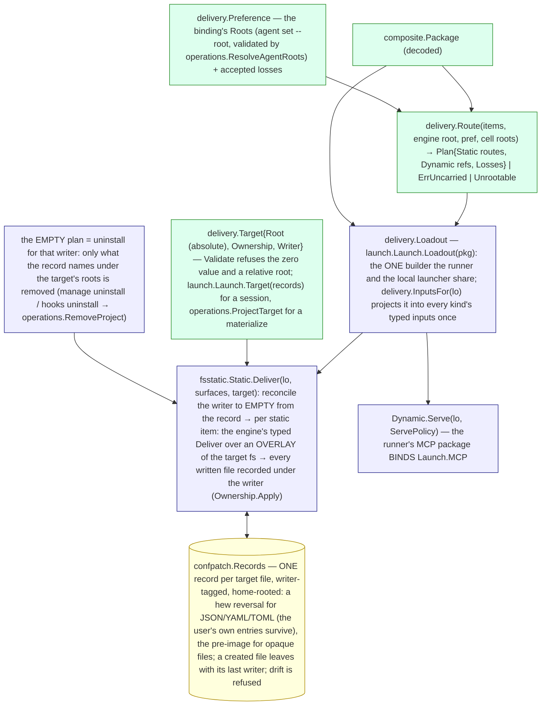

# core/delivery — the delivery layer

`internal/core/delivery` decides which package items go STATIC and which
DYNAMIC for an engine (`Route` → `Plan`), and declares the two delivery
ports and the ONE ownership record. It knows no engine argv, transport or
config. The static port is implemented by `internal/adapters/fsstatic`,
the record by `internal/adapters/confpatch` (`Records`), the dynamic port by
the runner's MCP package.

## The graph

## The root order: the session home first, the project only by selection

Every static approach of every engine declares `present.RootSessionHome`
FIRST in its `Traits().Roots` — the root `Route` takes when the binding
selects none — and offers `present.RootProjectRoot` second (ruled
2026-09-21; pinned per engine by each engine package's
`TestBuild_EverySurfaceDefaultsToTheSessionHome` and
`TestRoute_DefaultBindingPlansOnlySessionHomeRoots`). A session delivers
only into its session home. The project root is reached only by the
binding's `roots:` selection (`delivery.Preference.Root`), and that
selection IS the unsafe option: the config reference names it so, `run
--dry-run` marks the route unsafe in its delivery section, and the launch
banner names it before the engine spawns. The user's real home is never
written — an approach that lands beneath the engine home refuses a run that
advised none (`agent.ErrUnrootedEngineHome`). The explicit project-side
door is `manage hooks install`.

On the host arm the plugin run-start selects legacy forms by name;
`operations.PreferPlanRoots` projects the plan's project routes onto that
selection so `roots:` governs it too, and the mock's legacy default form is
its session form (`backends.MockSessionFile`). The engine home is the
session's by default (`engine_home: session`; `agents.ParseHomeMode`,
`launch.parseHomeMode`), so claude on that arm advises its session home
for context and MCP; only the binding's explicit `engine_home: host` — the
unsafe selection, named beside the project routes in the plan and the
banner (`cli.unsafeLabels`) — leaves `SurfaceSelection.keepOrReroot` to
select the project file there.

Who holds the credential is decided by the launch's depth
(`launch.Resolve`: `sessions.Identity.Depth`). The ORCHESTRATOR — the root
session, the coordinator's own engine — holds it WHOLE in its session home,
two-way with the host file through `isolation.replicationProvisioner`, and
is the only ctxloom-side refresher. Every AGENT (a delegated child, on the
host or in a container) names its orchestrator (`launch.Source.Orchestrator`,
stamped from `coord.ownerHarp` on `SpawnStart`) and holds a read-only
PROJECTION of the orchestrator's copy — never of the host file — with the
engine's declared bytes withheld (`engine.SeedFile.Project`; claude withholds
`claudeAiOauth.refreshToken`, its own session-seeding precedent),
re-projected whenever the orchestrator's copy changes; an agent write
reaches nothing (a projected `Material` is read-only by construction). A
container agent mounts that projected file read-only from its session home
(`isolation.MountEngineHome`, `projectedCredentialMounts`); the real host
file is never a mount source once the home relocates. On macOS the store is
the Keychain: the orchestrator's item is two-way with the default item, an
agent's item projects the orchestrator's (`isolation.keychainService`), and
items are deleted by the creating run's teardown and by the reaper for every
reaped harp (`operations.sessionTriage`), listed by doctor when neither
reached them (`operations.doctorCheckKeychainOrphans`). A host with nothing
seedable is refused (`strictness.ClassIsolation`, FailAlways) naming the
engine's env tokens and the unsafe `engine_home: host`.

## Who delivers, and under which writer

| Caller | Target | Writer | Symbol |
| --- | --- | --- | --- |
| a delegated run (the runner tail) | the cell's advised roots: the session home, and the project root where the binding selected it | `delivery.SessionWriter(harp)` | `runner.Execute` → `Static.Deliver(l.Loadout(pkg), kind.Root().Surfaces(), l.Target(records))` |
| `profile materialize` | the `--target` directory (absolute) | `delivery.ProjectWriter` | `operations.MaterializeProfile` → `operations.DeliverProject` |
| `manage hooks install` (explicit), the MCP server's startup apply, the post-sync and trust-change refreshes | the project root | `delivery.ProjectWriter` | `operations.ApplyHooks` → `applyHooksToBackend` → `operations.DeliverProject` (`manage install` and `init` no longer call it) |
| `manage uninstall` / `manage hooks uninstall` | the project root | `delivery.ProjectWriter` | `operations.RemoveHooks` → `operations.RemoveProject` (the empty plan) |

Two writers meet on one project-root file (a session whose binding selected
the shared root, and a materialize): each keeps its own entries in the one
record and each reconcile-to-empty leaves the other's in place —
`TestStatic_TwoWritersOneTarget_ReconcileRemovesOnlyOwnEntries` and
`TestRecords_TwoWritersOneStructuredFile_EachRemovesOnlyItsOwnEntries`.

## The at-rest plan

`operations.ProjectPlan` selects the project root for every kind the
engine's approach offers there; a kind the engine does not carry is an
accepted loss the report names (`MaterializeProfileResult.NotCarried`); a
carried kind offering no root the project target has is `Unrootable`,
refused with the remedy, never rerouted. Whether the CONTEXT is a file at
the project root or rides the engine's session-start injection hook is
derived from the declaration alone (`operations.contextRidesTheHook`): an
engine whose context approach is told on argv and which exports a
`session_start` event takes it live; an engine that opens a context file
reads the file. `profile materialize` always writes the file (a
materialized tree must be readable with ctxloom out of the loop).

## Hooks are a delivered surface the engine fires

The mock kind delivers its hook file and its turn READS it back: a
`pre_tool` hook delivered as a static item fires when the turn runs a tool,
with the mock's payload on the hook's stdin, decoded by `Engine.Hooks()` —
`TestMock_ADeliveredPreToolHookFires_WhenTheTurnRunsATool`. Claude's half
is the registration/decode round trip
(`TestHooks_ADeliveredPreToolHook_RoundTripsThroughTheCodec`); that claude
itself runs the registered command is claude's contract, not provable
without a launch.

## What the record replaced

The ledger sidecar (`.ctxloom-managed` beside every managed directory) and
the marker section inside a context file were two in-place ownership
mechanisms. Under the record, a context file is APPENDED after the user's
bytes (`iox.AppendSection`) and the record keeps the pre-image; a
structured file keeps a hew reversal. An old sidecar is not read: the
legacy writers that still consult one (the host plugin arm's `Setup`, until
slice 13 moves that arm onto the runner) keep writing it, and the new
static writer records whatever an approach wrote — a sidecar an approach
still writes is owned by the record like any other file and leaves with the
empty plan.
