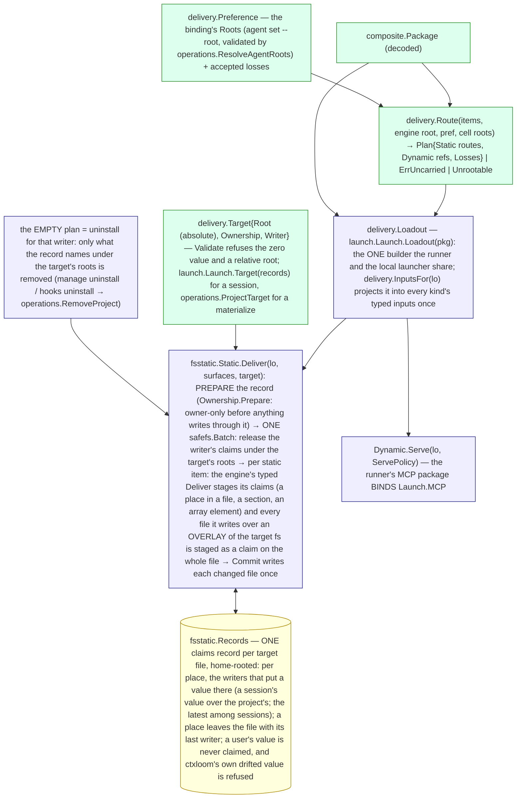

# core/delivery — the delivery layer

`internal/core/delivery` decides which package items go STATIC and which
DYNAMIC for an engine (`Route` → `Plan`), and declares the two delivery
ports and the ONE ownership record. It knows no engine argv, transport or
config. The static port is implemented by `internal/adapters/fsstatic`,
the record by `fsstatic.Records`, the dynamic port by
the runner's MCP package.

## The graph

## The root order: the session home first, the project only by selection

Every static approach of every engine declares `present.RootSessionHome`
FIRST in its `Traits().Roots` — the root `Route` takes when the binding
selects none — and offers `present.RootProjectRoot` second (ruled
2026-09-21; pinned per engine by each engine package's
`TestBuild_EverySurfaceDefaultsToTheSessionHome` and
`TestRoute_DefaultBindingPlansOnlySessionHomeRoots`). A session delivers
only into its session home. The project root is reached only by the
binding's `roots:` selection (`delivery.Preference.Root`), and that
selection IS the unsafe option: the config reference names it so, `run
--dry-run` marks the route unsafe in its delivery section, and the launch
banner names it before the engine spawns. The user's real home is never
written — an approach that lands beneath the engine home refuses a run that
advised none (`agent.ErrUnrootedEngineHome`). The explicit project-side
door is `manage hooks install`.

On the host arm the plugin run-start selects legacy forms by name;
`operations.PreferPlanRoots` projects the plan's project routes onto that
selection so `roots:` governs it too, and the mock's legacy default form is
its session form (`mock.MockSessionFile`). The engine home is the
session's by default (`engine_home: session`; `agents.ParseHomeMode`,
`launch.parseHomeMode`), so claude on that arm advises its session home
for context and MCP; only the binding's explicit `engine_home: host` — the
unsafe selection, named beside the project routes in the plan and the
banner (`cli.unsafeLabels`) — leaves `SurfaceSelection.keepOrReroot` to
select the project file there.

No credential is delivered into a home. A launch authenticates from what
its agent's `auth:` mode resolves to (`engine.Auth.Credentials`), which the
environment makes true where the engine runs; the session home holds none. A mode whose credential the
launching environment does not export is refused with the engine's remedy;
ctxloom never mints or stores one. See
[isolation](../engines/isolation.md#credential-delivery).

## Who delivers, and under which writer

| Caller | Target | Writer | Symbol |
| --- | --- | --- | --- |
| a delegated run (the runner tail) | the cell's advised roots: the session home, and the project root where the binding selected it | `delivery.SessionWriter(harp)` | `runner.Execute` → `Static.Deliver(l.Loadout(pkg), kind.Root().Surfaces(), l.Target(records))` |
| `profile materialize` | the `--target` directory (absolute) | `delivery.ProjectWriter` | `operations.MaterializeProfile` → `operations.DeliverProject` |
| `manage hooks install` (explicit), the MCP server's startup apply, the post-sync and trust-change refreshes | the project root | `delivery.ProjectWriter` | `operations.ApplyHooks` → `applyHooksToBackend` → `operations.DeliverProject` (`manage install` and `init` no longer call it) |
| `manage uninstall` / `manage hooks uninstall` | the project root | `delivery.ProjectWriter` | `operations.RemoveHooks` → `operations.RemoveProject` (the empty plan) |

The record store is owner-only before any delivery writes through it, and
that is a security invariant: a claims record keeps every value ctxloom put
into the file it describes. `Static.Deliver` calls
`delivery.Ownership.Prepare` first, on the real filesystem, before anything
is staged; Prepare is the one place the protection is applied. `fsstatic.Records.Prepare` makes the
store's directory owner-only with `confpatch.EnsureRecordDir` on the real
filesystem, which goes through the per-OS `owneronly` seam (a mode on unix,
an owner-only DACL on Windows). It does not depend on
when, or whether, a caller opened the store
(`TestDeliver_PreparesTheRecordDirItself`,
`TestStatic_PreparesTheRecordOnceBeforeAnyWrite`).

Two writers meet on one project-root file (a session whose binding selected
the shared root, and a materialize): each keeps its own claims in the one
record and each release leaves what the other still claims —
`TestStatic_TwoWritersOneTarget_ReconcileRemovesOnlyOwnEntries`,
`TestClaimsASharedEntrySurvivesEitherWritersRelease` and
`TestClaimsAnAtRestApplyMidRunKeepsTheRunsEntry`.

## The at-rest plan

`operations.ProjectPlan` selects the project root for every kind the
engine's approach offers there; a kind the engine does not carry is an
accepted loss the report names (`MaterializeProfileResult.NotCarried`); a
carried kind offering no root the project target has is `Unrootable`,
refused with the remedy, never rerouted. Whether the CONTEXT is a file at
the project root or rides the engine's session-start injection hook is
derived from the declaration alone (`operations.contextRidesTheHook`): an
engine whose context approach is told on argv and which exports a
`session_start` event takes it live; an engine that opens a context file
reads the file. `profile materialize` always writes the file (a
materialized tree must be readable with ctxloom out of the loop).

## Hooks are a delivered surface the engine fires

The mock kind delivers its hook file and its turn READS it back: a
`pre_tool` hook delivered as a static item fires when the turn runs a tool,
with the mock's payload on the hook's stdin, decoded by `Engine.Hooks()` —
`TestMock_ADeliveredPreToolHookFires_WhenTheTurnRunsATool`. Claude's half
is the registration/decode round trip
(`TestHooks_ADeliveredPreToolHook_RoundTripsThroughTheCodec`); that claude
itself runs the registered command is claude's contract, not provable
without a launch.

## What the record replaced

The ledger sidecar (`.ctxloom-managed` beside every managed directory) and
the marker section inside a context file were two in-place ownership
mechanisms. Under the record, a context file's section is claimed after the
user's text (`present.AppendedSection`) and a structured file's entries are
claimed place by place. An old sidecar is not read: the writers that still
consult one keep writing it, and the static writer claims whatever an
approach wrote whole — a sidecar an approach still writes is claimed like
any other file and leaves with the empty plan.
