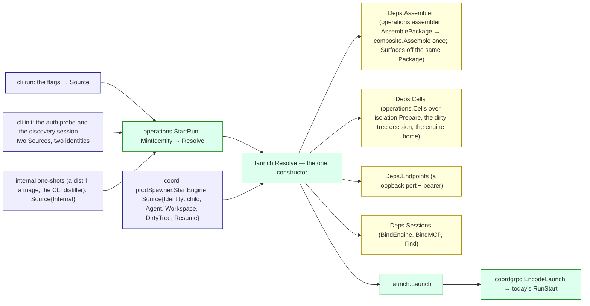

# internal/core/launch — the resolved launch

`internal/core/launch` is where every way of asking for a launch becomes ONE
value through ONE constructor. A caller says what it KNOWS as a
`launch.Source` — the agent binding or profile set, a label override, the
mode, the prompt, the project root, its workspace axis, the permission flag,
a resume — and `launch.Resolve(ctx, deps, src)` returns a `launch.Launch`
carrying everything a runner needs, typed: the identity the caller minted,
the engine and label, the permission floored once, both isolation axes, the
prepared cell with its advised roots, the package, the delivery plan, the
session's MCP endpoint minted once per harp, the prompt and the resume ref.
`Launch.Session()` is the only constructor of the engine-facing projection
(`engine.Session`).

The plan this lands is `docs/architecture/audit-2026-09-18/30-decided-architecture.md`
Part 1.5; the design-by-test body is Part 4.2 C, verbatim in
`launch_test.go` over the fixture package `launchtest`.

## Who asks, who consumes

## Resolve's order

Select → Assemble → the engine and its mode → the axes → the permission
floored ONCE → the managed surfaces → `Cells.Prepare` (the roots) →
`delivery.Route` over those roots → the endpoint once per harp (reused on a
resume, moved only by `Resume.RebindEndpoint`; bound on the session record
with the engine, `Store.BindMCP` / `Store.BindEngine`) → the Launch.
`Discard` tears the cell down.

The refusals are typed: `ErrNoIdentity` (the caller mints; a zero identity
is refused), `ErrNoAgent` (an unknown binding, by name), `ErrNoEngine` (a
label that names neither a configured entry nor a composed engine),
`ErrModeUnsupported` (a mode the Definition lacks), `ErrPermissionUnhonoured`
(a posture that does not parse; a delegated child that would block on a
prompt), `ErrContextEmpty` (named profiles that assembled to nothing),
`ErrOwnershipMismatch` / `ErrRuntimeUnavailable` (the cells adapter's
refusals, passed through), and `delivery.ErrUncarried` / `delivery.Unrootable`
from the router.

**The floor.** `Source.Permission`'s zero value is `PermissionNotRequested`
— "the flag was not given" — and the chain reads the first DECLARED rung:
the flag, the binding, the label, the project default, else the engine's
declared host default; plan collapses to default on an engine with no
read-only tier. A Structured run that would block on a prompt has no human
at the engine: the originator's own run (depth 0) is widened to bypass —
the human invoked it and owns the terminal — while a delegated child
(depth > 0) is REFUSED rather than widened; `Source.Degraded` narrows
either case to `engine.PermissionFloor`. Nothing downstream re-decides it.

## What diverges from Part 1.5, and why

- **`Deps.Assembler` is still a port; `Package` is still opaque on the
  wire.** `composite.Assemble` is the one assembly behind it (slice 6:
  `operations.assembler.Assemble` calls `AssemblePackage` once and
  `Surfaces` projects the engine's managed surfaces off that same
  `composite.Package` through `Engine.Exports`), but `Encode` and the two
  carrier transports are slice 8's, so what rides the Launch is still
  `Package{Context, Managed, Profiles, Fragments}` where `Managed` is a
  `launch.Surfaces` — the managed-surface payload as today's wire carries
  it, read here only through its engine-facing projection (`Items()`),
  asserted back to its type by the codec. `Launch.Exports` is declared and
  zero until the runner reads it (11b).
- **`Preference.Root` is the binding's; `AcceptLoss` is total until a binding
  can record a loss.** Resolve reads the binding's root selection
  (`agents.Agent.Roots`, validated when written by
  `operations.ResolveAgentRoots`) into `delivery.Preference.Root`; a label
  that no longer parses is refused by name (`ErrBindingRoots`). No binding
  records a loss acceptance yet, so every kind the Definition does not
  carry is accepted and listed in `Plan.Losses` — a run that delivers the
  rest is better than none until a binding can say otherwise.
- **The engine is recorded by Resolve, not by the mint.** Part 1.6's
  `Seed.Engine` assumes the mint knows the engine, but resolution decides it;
  `Store.BindEngine` records it once decided. The coordinator's mint records
  the SELECTED engine (the binding's declared label) so the roster can name
  it before the launch resolves; Resolve confirms it.
- **`CellRequest.HomeMode` and `Cell.Handle`.** The binding's engine-home
  policy rides the request until `Engine.Home()` is the engine's own
  declaration (11b); the cell carries an opaque transport handle
  (`operations.PreparedCell`, read back by `operations.TransportOf`) until
  the runner is the one process every cell starts (13).
- **`Source.Internal`, `Source.Model`, `Source.Fragments/Tags`, `Source.Env`.**
  No shipped binding names a distill or a triage, so an internal one-shot is
  an explicit arm (no binding, no profiles; the label names the engine); a
  binding for each retires it. The model override, the explicit-assembly
  arm's fragments and tags, and the caller's engine passthrough are the
  Source's because the callers had them.
- **The host facts derive from `paths`' one reader**, not from `cmd/*`.

## The internal one-shots

`operations.OneShot` (`StartOneShot`, `Turn`, `TurnWithModel`, `End`) is a
resolved internal one-shot session: ONE minted harp and ONE Launch, driven a
turn at a time (each turn is the Launch encoded with that turn's prompt over
the cell's transport, its answer recorded on the session's own transcript).
`LazyOneShot` starts the session on the first turn, so a compaction served
from its cache mints nothing. The distiller (`session distill`, the MCP
compactor, `bundle distill`), the trigger triage and init's auth probe are
one-shots; they receive the managed surfaces the generation composes for
their label (the default profiles' MCP servers, hooks, commands and skills,
gated by the generation's executable trust gate) — the surfaces a
`LaunchFormMinimal` run used to declare away.
