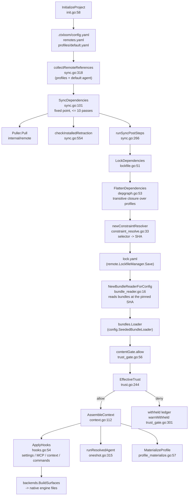
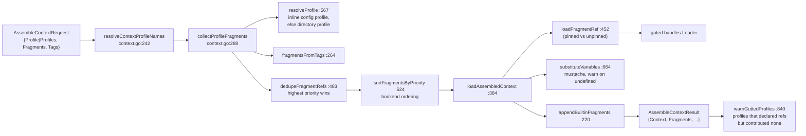

# internal/operations

`internal/operations` is the frontend-neutral orchestration layer: every CLI command, MCP
tool and ACP call routes through a function here rather than touching `internal/bundles`,
`internal/config`, `internal/remote`, `internal/profiles` or `internal/lm` directly. Its
contract is the package ABI — `f(ctx, cfg|mgr, XxxRequest) (*XxxResult, error)` with
JSON-tagged DTOs — which is what lets one implementation back three frontends. It owns no
storage; it owns *sequencing*: bootstrap, sync, lock, trust, assemble, apply, launch.

The package is a flat namespace of ~90 files with no single responsibility. This page is
organized by subsystem, not by file, and names the file for every function so a future
session can grep straight to it.

## Responsibilities

- Project bootstrap (`init.go`) and one-shot legacy migrations (`legacy_cleanup.go`).
- Remote registry CRUD, clone warming, browse/search, pull (`remotes.go`, `pull.go`, `helpers.go`, `shortname.go`).
- Dependency sync to a fixed point, lockfile generation, pins and upgrade
  (`sync.go`, `lockfile.go`, `lockfile_hold.go`, `depgraph.go`, `upgrade.go`, `constraint_resolve.go`).
- Bundle and item authoring, publishing, transfer, distillation
  (`bundles.go`, `items.go`, `bundle_*.go`, `skills.go`, `commands.go`, `fragments.go`).
- Context assembly from profiles/fragments/tags (`context.go`).
- The trust decision, gates, review enumeration and the two review mutations
  (`trust.go`, `trust_gate.go`, `countersign_records.go`, `review.go`, `review_snapshots.go`) —
  documented in [trust.md](./trust.md).
- Publisher signing and trust-root management (`sign.go`, `signer.go`).
- Profile and agent CRUD, materialization onto native surfaces
  (`profiles.go`, `profile_transfer.go`, `profile_materialize.go`, `agents.go`).
- Managed-harness apply: settings, MCP, context, commands, across backends
  (`hooks.go`, `manage.go`, `mcp_servers.go`, `tooling.go`).
- Session index, feeds, resume, engine sessions, delegation, and one-shot launches
  (`sessions.go`, `sessionfeed.go`, `resume.go`, `engine_session.go`, `engine_types.go`,
  `delegate.go`, `oneshot.go`).
- Vendor transcript import (`vendorreader*.go`) and Deferred-task trigger triage (`task_triggers*.go`).
- The hand-maintained JSON-Schema target registry (`schematargets.go`).

## Non-responsibilities

- Rendering and output formatting — `internal/cli` (the ABI's stated rule; `engine_types.go`
  and `buildSessionInitSummary` are the exceptions).
- Storage: bundle files (`internal/bundles`), config (`internal/config`), lockfile and clones
  (`internal/remote`), profiles (`internal/profiles`), countersignatures (`internal/signing/countersign`).
- Path vocabulary — `internal/paths`; see [paths.md](./paths.md).
- Engine process management — `internal/lm/*`.

## The content pipeline through this package

## Bootstrap — `init.go`, `legacy_cleanup.go`

| Function | file:line | Contract |
|---|---|---|
| `InitializeProject` | `init.go:58` | Creates `.ctxloom/`, writes `config.yaml` and `remotes.yaml`, scaffolds the seed profile. Callers: `cli/init.go`, `cli/manage.go`, `cli/config.go`. |
| `scaffoldSeedProfile` | `init.go:102` | Write-if-absent seed profile at `.ctxloom/profiles/default.yaml` (`:104-105`). |
| `BuildInitialConfig` | `init.go:130` | Renders a fresh project's `config.yaml` with the chosen engine's LLM registry and default agent. Also used by `config/fixture.go`. |
| `engineRegistry` / `fallbackRegistry` / `roleLabel` | `init.go:170,196,205` | Selects the engine's primary/fast registry entries, else a single self-contained `{type: engine}` entry. |
| `PurgeExtractedBundles` | `legacy_cleanup.go:29` | One-shot removal of pre-PR1 extracted bundle YAML, then prunes empty dirs. Callers: `config/config.go`, `cli/mcp_server.go`. |

**Preservation semantics inside `InitializeProject` are not uniform**: `config.yaml` (`init.go:76`)
and `remotes.yaml` (`init.go:84`) are written unconditionally with a direct `afero.WriteFile` and
no merge — re-running `ctxloom init` overwrites both — while the seed profile at `init.go:104-105`
is write-if-absent.

## Remote plumbing — `remotes.go`, `pull.go`, `helpers.go`, `shortname.go`

| Function | file:line | Contract |
|---|---|---|
| `getBaseDir` / `getRegistry` / `getFS` | `remotes.go:22,30`, `helpers.go:25` | Package-wide defaults: first app path else `".ctxloom"`; `remote.NewRegistry(paths.RemotesPath(baseDir))`; afero nil-default. ~24, ~18 and ~40 in-package call sites. |
| `ListRemotes` / `AddRemote` / `RemoveRemote` | `remotes.go:59,118,229` | Registry CRUD. `AddRemote` validates, registers, resolves the forge, verifies, then eagerly clones; it rolls the registry entry back on failure and downgrades a clone failure to a warning. |
| `SetDefaultRemote` / `GetDefaultRemote` | `remotes.go:280,271` | Default-remote get/set; the getter is test-only. |
| `DiscoverRemotes` | `remotes.go:424` | GitHub repo search with a star filter. |
| `BrowseRemote` / `browseDir` / `browseEntry` | `remotes.go:515,632,611` | Remote directory browse through the clone cache; recursive, `.yaml`-filtered. |
| `EnsureRemoteClones` / `ensureClone` | `remotes.go:681,713` | Clone every registered remote at init; per-remote failures are recorded and warned. |
| `SearchRemotes` / `prewarmRemoteClones` / `fanOutRemoteSearch` / `searchSingleRemote` | `remotes.go:775,823,834,890` | Cross-remote bundle search: serial clone warm (to avoid a clone race), then a concurrent (remote x type) fan-out; manifest first, directory listing as fallback. |
| `newRepoCache` / `newCachedFetcherFactory` / `getCachedFetcher` | `helpers.go:37,54,62` | The clone-cache constructors every remote read goes through. Exported twins `NewRepoCache`/`NewCachedFetcherFactory`/`GetCachedFetcher` (`helpers.go:71,78,84`) exist for `cli/remote_update.go`. |
| `CanonicalizeRemoteRef` | `pull.go:34` | Canonicalizes a short ref; returns the input unchanged when the registry cannot be loaded. |
| `PullItem` | `pull.go:77` | Registry → puller → canonicalize → `Pull`. No production callers. |
| `registryAliasToURL` / `aliasToURLResolver` / `canonicalizeBundleRefs` / `canonicalizeProfileRefs` / `canonicalizeBundleArg` | `shortname.go:15,32,44,55,83` | The short-ref canonicalization layer: alias→URL closure plus the ref-list mappers used by profile and bundle authoring. |

## Sync, lockfile and dependency closure

### `sync.go` — drive references to a fixed point

| Function | file:line | Contract |
|---|---|---|
| `SyncDependencies` | `sync.go:101` | Collect refs → pull → re-collect, up to `maxSyncPasses` (10), then optional lock + hook post-steps. Status is one of `installed`/`updated`/`skipped`/`retracted`/`failed` per item, `empty` for a no-ref project. |
| `collectRemoteReferences` / `collectProfileReferences` / `collectProfileReferencesRecursive` | `sync.go:318,371,394` | Walk every profile (plus the default agent) for remote bundle bases, following local parents depth-first. |
| `addRemoteBundleBase` | `sync.go:438` | Strips the item selector, rejects retired and unparseable refs, warns once. |
| `syncRefs` / `syncItem` | `sync.go:236,467` | Per-ref: validate, skip-if-installed (with a retraction re-check), else pull. |
| `checkInstalledRetraction` | `sync.go:554` | Re-checks an installed ref against the publisher manifest and persists the verdict into `lock.yaml` via `RetractionChecker.RecordRetraction`. This is where step 2 of the trust cascade gets its data. |
| `isInstalled` | `sync.go:732` | Lockfile + content probe through a `remote.BundleByteSource`; every read error collapses to "not installed". |
| `CheckMissingDependencies` | `sync.go:610` | The probe `SyncOnStartup` short-circuits on. |
| `SyncOnStartup` | `sync.go:775` | Refresh referenced clones → probe → sync with `Lock: true, ApplyHooks: true` hard-coded. |
| `refreshRepoCaches` | `lockfile.go:464` | `git fetch` each unique clone before any SHA resolution; shared by `sync.go`, `upgrade.go`, `lockfile.go`. |

### `lockfile.go`, `lockfile_hold.go` — the pin record

| Function | file:line | Contract |
|---|---|---|
| `LockDependencies` | `lockfile.go:51` | Sync → flatten the closure → carry `Pinned`/`Retracted` forward from the previous lockfile → write `lock.yaml`. An empty closure returns `"empty"` **without saving**, so the previous lockfile survives. |
| `dropConflicted` | `lockfile.go:160` | Filters conflicted pins out in place. |
| `SetItemPin` | `lockfile_hold.go:24` | Flips the `Pinned` hold on a canonicalized bundle entry; idempotent; persists. Callers: `cli/bundle_hold_cli.go:42,64`. |
| `LoadActiveLockfile` | `lockfile_hold.go:12` | `NewLockfileManager(baseDir).Load()`. |
| `InstallDependencies` / `CheckOutdated` / `findOutdatedEntries` / `latestWithinConstraintSHA` | `lockfile.go:196,310,397,484` | Lockfile-driven install and the outdated report. Neither entry point has a production caller. |
| `UpgradeDependencies` | `upgrade.go:24` | Re-resolves the whole closure to the newest commits allowed by each constraint and rewrites `lock.yaml` wholesale. Caller: `cli/remote_upgrade.go:39`. |

### `depgraph.go` — the transitive closure

| Function | file:line | Contract |
|---|---|---|
| `FlattenDependencies` | `depgraph.go:53` | Picks the root set (inline profile definitions + directory profiles + the config-defaults root) and walks it. Caller: `lockfile.go:66`. |
| `closureRoots` / `namedRoots` / `configDefaultsRoot` | `depgraph.go:95,67,115` | Root selection; inline definitions win over directory profiles. |
| `FlattenProfileRoots` / `flattenRootsWith` | `depgraph.go:133,148` | Builds the fetcher/auth/resolver trio and walks each root. |
| `depWalker.walkProfile` / `.record` / `.recurseParent` | `depgraph.go:212,231,264` | Copy-then-resolve short refs, record each bundle as a `PinnedRef` (first-seen pin wins), recurse into local parents and remote bundle-profile parents. |
| `depWalker.markUnexpanded` | `depgraph.go:192` | Records a parent that could not be expanded, and warns. Covers three of roughly seven failure paths; the others return silently. |
| `depWalker.result` / `ConflictError` | `depgraph.go:326,357` | Sorts pins, derives `DependencyConflict`s (one item seen at two hashes), renders them as one actionable error. |
| `PinnedRef` | `depgraph.go:18` | `{Identity, Hash, URL, Type, Constraint, Version, Kind}` — mapped 1:1 onto `remote.LockEntry` at `lockfile.go:114` and `upgrade.go:56`. |

### `constraint_resolve.go` — selector → SHA

`newConstraintResolver` (`constraint_resolve.go:33`) returns a memoizing closure implementing a
four-step precedence ladder over `remote.ResolveConstraint` and the existing lockfile, caching
both hits and failures per URL. Consumers: `upgrade.go`, `depgraph.go`.

## Bundles, items and skills

| Function | file:line | Contract |
|---|---|---|
| `CreateBundle` / `UpdateBundle` / `DeleteBundle` | `bundles.go:141,245,517` | Authoring CRUD over `bundles.Store`, each behind `requireSafeBundlePath`. `UpdateBundle` returns `no_changes` when nothing differs. |
| `loadBundleForUpdate` | `bundles.go:293` | The shared precondition gate: name validation, cfg check, `store.Load`, symlink guard. Used by `items.go`, `skills.go`, `sign.go`. |
| `requireSafeBundlePath` / `bundlePathUnderDir` / `checkNoSymlinkTraversal` | `bundles.go:926,942,960` | The path-confinement guard: absolute, under one of the configured dirs, no symlink component. Fail-closed default ("not under any dir" is refused). |
| `distillFragments` / `distillPrompts` | `bundles.go:1093,1120` | Call the injected `Distiller` per name and write `Distilled`, `DistilledBy`, `ContentHash`. Warn-and-continue per item. |
| `PushBundle` / `runPush` / `validatePushRequest` | `bundles.go:622,727,691` | Publish: validate → read → parse → **refuse a stale carried signature** → resolve registry and target path → dry-run or publish. Signing is either "sign now" (`Signer`) or "carry this detached sig" (`Signature`). |
| `ResolveBundleRemote` / `resolveRemoteForPath` | `bundles.go:777,800` | Five-step inference ladder mapping a bundle path to the remote it belongs to; ambiguity produces a candidate list plus remediation. |
| `ReadBundle` | `bundle_read.go:31` | Loads a bundle by name plus its raw YAML. |
| `ExportBundle` / `ImportBundle` | `bundle_transfer.go:51,200` | Verbatim copy out of / into the committed content tree, carrying the detached `.sig`; export pre-verifies the pair and refuses a stale signature before any write. |
| `readSignature` / `writeSignature` / `staleSignatureError` | `bundle_transfer.go:143,160,129` | The `.sig` sidecar helpers; `writeSignature(nil)` is a documented no-op. |
| `MoveBundle` | `bundle_move.go:91` | Publish-or-copy to the destination, then remove the source — destination-before-delete ordering is the contract. |
| `DistillBundleFile` | `bundle_distill.go:73` | File-oriented distill of one bundle; reports per-item `distilled`/`skipped`/`distill_failed` and which prior approvals it invalidated. |
| `invalidatedByDistill` | `bundle_distill.go:145` | Items whose distilled bytes changed *and* had a prior approve countersignature — the loud path after a re-distill. |
| `RemoveLocalItems` / `localItemPath` | `bundle_refs.go:163,117` | `remote update --cleanup`: delete stale local copies and prune the lockfile. |
| `GetItemContent` / `AddItem` / `DeleteItem` / `SetItemContent` / `DistillItem` | `items.go:60,104,159,212,305` | Per-item CRUD for fragments and commands; `SetItemContent` preserves tags/notes/installation/`no_distill` and regenerates the distilled form. |
| `GetBundleMCP` / `SetBundleMCP` | `items.go:376,410` | Bundle-scoped MCP server entries. |
| `ListSkills` / `GetSkill` / `CreateSkill` / `SyncSkill` / `ExportSkill` / `ImportSkill` | `skills.go:57,132,218,317,413,538` | Agent Skill package CRUD and interchange. `CreateSkill` validates before registering and rolls back with `RemoveAll` on all three failure paths. `SyncSkill` recomputes the per-file manifest (path/sha/mode) in `bundle.yaml` — that manifest is the skill's trust preimage. |
| `ListFragments` / `GetFragment` | `fragments.go:46,112` | Fragment listing and reading; `GetFragment` goes through the **trust-gated** exposure loader and can return `ErrFragmentWithheld`. |
| `ListCommands` / `GetCommand` | `commands.go:47,111` | Command listing and reading; `GetCommand` strips the leading heading and resolves an optional `@<commit>` pin through a different loader method (`getPromptVersioned`, `commands.go:166`). |
| `ListBundles` / `listBundleInfos` | `bundles.go:319`, `bundle_list_remote.go:31` | Merges present bundles with markers for bundles removed upstream. |
| `bundleLoader` / `bundleStore` | `fragments.go:41`, `bundles.go:344` | The two package-wide seams. `bundleLoader` is **ungated** — authoring paths use it deliberately; exposure paths must use `exposureLoader` instead (see [trust.md](./trust.md)). |

## Context assembly — `context.go`

`AssembleContext` (`context.go:112`) is the single composition entry point; 20+ production call
sites across `cli/`, `lm/`, `codex/`, `shared/agent/` and `acpagent/`.

| Function | file:line | Contract |
|---|---|---|
| `AssembleContext` | `context.go:112` | The pipeline above. Profile-resolution and tag-listing errors propagate; an empty assembled context is not an error. |
| `resolveContextProfileNames` | `context.go:242` | Four-way arbitration between `Profile`, `Profiles`, config defaults and the empty case. Shared with `hooks.go`. |
| `collectProfileFragments` | `context.go:288` | Resolves each profile, merges variables/LLM/fragments, records per-profile attribution. An explicitly asked-for profile that fails is a hard error; a default that fails is a `strictness.Fail` plus skip. |
| `dedupeFragmentRefs` / `sortFragmentsByPriority` | `context.go:483,524` | Highest-priority-wins dedup with version arbitration and a stable order; bookend (negative/positive priority) ordering. |
| `loadAssembledContext` / `loadFragmentRef` / `warnFragmentLoadFailure` | `context.go:384,452,466` | Loads each ref through the gated loader, substitutes per fragment, joins. A withheld fragment is exempt from the failure warning (trust withholding is not a load error). |
| `substituteVariables` / `checkTags` / `undefinedPlainVariableLiterals` | `context.go:664,769,722` | Mustache rendering; undefined plain variables are warned and re-seeded as verbatim literals so they survive rather than vanish; section names are excluded from that rule. |
| `appendBuiltinFragments` | `context.go:220` | Appends always-on builtin fragments with the shared separator. |
| `guttedProfiles` / `warnGuttedProfiles` | `context.go:794,840` | Detects profiles that declared refs but contributed nothing — the anti-silent-empty guard for assembly. |

## Managed-harness apply — `hooks.go`, `manage.go`, `mcp_servers.go`, `tooling.go`

`ApplyHooks` (`hooks.go:54`) is the only writer of the managed harness across all backends
(settings, MCP registration, context file, command exports).

| Function | file:line | Contract |
|---|---|---|
| `ApplyHooks` | `hooks.go:54` | Reloads config, runs the $HOME-collision scope guard, optionally regenerates context, builds the executable trust gate, then writes every requested backend's surfaces. Callers: `cli/manage.go:109,257`, `cli/trust.go:223`, `cli/mcp_server.go:270`, `cli/init.go:1035`. |
| `checkHookTargetScope` (+ claude/codex/kiro variants) | `hooks.go:234,271,300,326` | Refuses to apply when the resolved workDir would write onto an engine's *global* settings file. |
| `maybeRegenerateContext` / `regenerateContext` | `hooks.go:358,487` | Collects, dedupes, sorts and loads fragments and writes the SessionStart context cache. |
| `applyHooksToBackends` / `applyHooksToBackend` | `hooks.go:397,435` | Per-backend loop; each failure is recorded via `strictness.Fail` and collected, and the loop aborts on ctx cancel. |
| `hookBackendNames` | `hooks.go:372` | `"all"` → every settings backend, else the single named backend. |
| `RemoveHooks` / `removeBackendHarness` | `manage.go:36,70` | Strips ctxloom wiring from each backend: `RemoveSettings` plus an empty-input command delivery that clears manifest-tracked files. |
| `HarnessStatus` | `manage.go:116` | Per-backend wiring report plus MCP/statusline/root-fallback status. |
| `SetStatusline` | `manage.go:165` | One `Manager.Update` transaction. |
| `ListMCPServers` / `GetMCPServer` / `AddMCPServer` / `RemoveMCPServer` / `SetMCPAutoRegister` | `mcp_servers.go:43,159,208,305,406` | MCP registry CRUD over `config.Manager`. Add and Remove are check-and-write inside one `Manager.Update` transaction; removing nothing is a loud error. |
| `CollectTooling` | `tooling.go:47` | Collects the `tooling` command text from every **trust-gated** bundle for container image assembly. |
| `ScaffoldContainerBase` | `tooling.go:105` | Materializes the embedded base Containerfile and wires the config key. |

## Profiles and agents

| Function | file:line | Contract |
|---|---|---|
| `ListProfiles` / `GetProfile` / `CreateProfile` / `UpdateProfile` / `DeleteProfile` | `profiles.go:101,199,257,343,482` | Profile CRUD over the `profiles.Store` port. `CreateProfile` canonicalizes refs before validating parents before saving — that ordering is the contract. `UpdateProfile` refuses seeded (bundle-shipped) profiles and saves only on an actual change. |
| `applyListEdits` | `profiles.go:433` | Dedup-add then remove-first-match, recording what changed. Shared with `bundles.go:258`. |
| `requireProfilesExist` | `profiles.go:455` | First unresolvable **local** parent is an error; remote refs are skipped (they may not be pulled yet). |
| `profileLoader` | `profiles.go:508` | Builds the operations-side profile loader with remote resolvers and bundle seeds. Eight production call sites. |
| `ExportProfile` / `ImportProfile` / `GetProfileContent` / `SetProfileContent` | `profile_transfer.go:63,104,151,182` | Local-only profile file flow; all four route through `loadLocalProfile` (`:33`), which distinguishes "remote, pull it first" from "absent". |
| `MaterializeProfile` | `profile_materialize.go:57` | Assembles a profile's context and delivers it onto a backend's native surface set under `--target`. `Backend` is validated against `backends.Exists` (`:71`). |
| `ListAgents` / `GetAgent` / `SetAgent` / `RemoveAgent` | `agents.go:48,68,133,226` | Agent-binding CRUD under the `agents:` config key, inside one `Manager.Update`. `SetAgent` is a whole-record replace. |
| `ResolveAgent` / `resolveAgentBinding` | `agents.go:357,383` | The single place engine-override precedence lives: compose profiles into context, resolve label/backend/model, resolve runtime and effective permissions. Callers: `cli/run.go`, `cli/doctor_cmd.go`, `coord/spawner.go`, `engine_session.go`. |
| `resolveMember` | `agents.go:458` | Agent-name-or-bare-profile sugar for ensembles. |

## Launch: one-shot, ensemble, delegation, engine sessions

| Function | file:line | Contract |
|---|---|---|
| `RunOneshot` | `oneshot.go:59` | Assembles a profile's context, resolves label/backend/model/axes/gate, delegates to the launch tail. |
| `runResolvedAgent` | `oneshot.go:315` | **The single choke point** for delegated child turns and `acp client` (mirrored by `run --one-shot`): prepare isolation, gate it, assemble the per-member managed config, floor the headless posture, run the plugin once, capture stdout, record the one-shot transcript. |
| `resolvedRunRequest` | `oneshot.go:122` | The already-resolved run; `Factory == nil` selects the isolating path. |
| `ResolveBackend` / `resolveOneshotLabel` | `oneshot.go:490,502` | Label → (backend, model); three-level precedence: override → profile LLM → primary role. |
| `IsolationImageConfig` / `CellKindForPolicy` / `MCPCommandOverrideForPolicy` / `RuntimeForPolicy` / `ContainerPersistDirForPolicy` | `oneshot.go:178,199,228,247,257` | Capability probes over `isolation.Policy`, declared here so `internal/lm/isolation` need not import `agent`. |
| `isolationGateErr` | `oneshot.go:286` | Turns `ClassIsolation` strictness findings into a member-fatal error unless degraded — the fail-loud isolation gate. |
| `PrepareAgentChat` | `delegate.go:167` | Resolves the workspace axis, handles a dirty parent tree (commit / copy-snapshot / fail), prepares isolation, and picks the chat vs one-shot path. Callers: `coord/spawner.go:410,458`. |
| `handleDirtyParentTree` / `commitDirtyTree` / `applyCopySnapshot` | `delegate.go:494,581,652` | The dirty-tree policy: a detached HEAD or a missing acknowledgement refuses to auto-commit; `copySnapshot` captures patch + untracked list once so there is no drift window. |
| `PreparedAgentChat.Start` / `.StartEngine` / `.startOneshot` / `.Abort` | `delegate.go:831,734,965,689` | The three launch protocols and idempotent teardown. |
| `leadContextIn` | `delegate.go:928` | Prepends the composed context to a delegated child's first turn. |
| `OpenEngineSession` | `engine_session.go:78` | The single frontend-neutral ACP session opener: config load, agent/profile bind, engine/model resolution, harp mint or resume, both isolation axes, MCP trust gate, modes/LLMs/commands, at-connect init summary. Caller: `cli/acp_cmd.go:135`. |
| `buildSessionModes` / `sessionModesFrom` / `buildSessionLLMs` / `buildSessionCommands` | `engine_session.go:546,566,521,469` | The advertisement set an ACP editor sees; `agentModeID` (`:538`) namespaces agent modes as `agent:<name>` so they cannot collide with profile modes. |
| `buildSessionInitSummary` | `engine_session.go:922` | The at-connect summary block. |
| `EngineChat` and the session DTOs | `engine_types.go:22,105,128,143,149,174,225,241` | The wire-neutral vocabulary handed to any ACP-shaped frontend. |

## Sessions, feeds and transcripts

| Function | file:line | Contract |
|---|---|---|
| `ListSessions` / `ListSessionsForProject` / `ListAllSessions` / `GetSession` / `RenameSession` / `ForgetSession` / `AssignSession` / `MarkSessionEnded` / `BindSession` | `sessions.go:53,65,83,167,176,186,197,208,254` | The ADR-0019 facade over `internal/sessions.Store`; the three list entry points reconcile the index first. |
| `ResolvePreviousSession` / `selectPreviousEntry` | `sessions.go:118,133` | Previous-session selection for memory recall, skipping the active harp and non-materializable entries. |
| `SessionIndexUpgrade` | `sessions.go:239` | Returns the pending schema upgrade plus its commit closure. |
| `WatchSessionFeed` / `watchLiveFeed` / `watchStoreFeed` / `adaptConsumerFeed` | `sessionfeed.go:96,133,460,264` | Unified observation feed: prefer a live coordinator over gRPC, fall back to the recorded store. `adaptConsumerFeed` folds live item-lifecycle deltas back into whole `agent.SessionEntry` values with seq-based gap detection. |
| `feedScrollback` | `sessionfeed.go:422` | Reads the harp's recorded transcript once as the live feed's prefix. |
| `RecordedSessionEntries` / `RenderResumedTranscript` / `JoinLeadBlocks` | `resume.go:16,41,82` | Transcript replay for resume; the rendered block is tail-truncated to 32 KiB. `JoinLeadBlocks` joins non-empty lead blocks with a blank line and has six production call sites across three packages. |
| `ConvertVendorTranscript` / `BackfillVendorTranscripts` | `vendorreader.go:122`, `vendorreader_backfill.go:37` | Converts a vendor-native transcript into the canonical JSONL via a per-engine registry (`claude`, `codex`, `antigravity`, `kiro`); backfill never stops early and records per-harp failures. |
| `locateKiroConversation` / `candidateKiroDBPaths` / `locateKiroConversationInDB` | `vendorreader_kiro.go:38,67,88` | Kiro's sqlite locator: per-harp isolated DBs first, then the host DB. |

## Review, search and schema targets

| Function | file:line | Contract |
|---|---|---|
| `PendingReview` / `reviewEnumerator.pendingItems` / `.classify` | `review.go:111,178,289` | Walks fragments → commands → mcp → hooks → skills, classifies each through `EffectiveTrust`, and returns only items whose state is pending, each with its diff base. |
| `setReviewForms` | `review.go:269` | Fills the shown and alternate form content so a reviewer sees both raw and distilled. |
| `renderMCPSurface` / `renderHookSurface` / `renderSkillSurface` | `review.go:380,405,430` | Deterministic renderings of executable surfaces for human review (env keys sorted; skills rendered as a per-file path/sha/mode listing). |
| `SearchContent` and the `search*` family | `search.go:56,139,174,195,230,309` | Local content search over fragments, commands, skills, profiles and MCP servers, with relevance ranking (`name` 2, `tag` 1, else 0). |
| `SchemaTargets` | `schematargets.go:14` | Hand-maintained list of ~62 `reflect.Type`s published as JSON Schema; consumed only by `cmd/gen-schemas/main.go:27` under the `schemagen` build tag. See [schema.md](./schema.md). |
| `EvaluateTriggers` | `task_triggers.go:141` | Two-round cached LLM triage of Deferred tasks' revive triggers, with a whitelisted deterministic query executor (`task_triggers_query.go`) for round two. Path arguments are confined by `safeRepoPath` (`task_triggers_query.go:94`). |
| `ResolveSignTarget` / `SignBundleFile` / `ListLocalBundleNames` | `sign.go:48,128,171` | Publisher-side signing: resolve a ref to the local bundle file, sign its exact on-disk bytes, write `<path>.sig`. |
| `AddSigner` / `ListSigners` / `ShowSigner` / `RemoveSigner` | `signer.go:151,266,313,367` | `allowed_signers` trust-root management across three stores (embedded, user, project); removing an embedded principal records a local suppression in `distrusted_signers` instead of deleting a line. |

## Invariants

1. **The package ABI is `f(ctx, cfg|mgr, XxxRequest) (*XxxResult, error)`** with JSON-tagged DTOs and
   `json:"-"` injection seams. That uniformity is what lets one CLI command, one MCP tool and one
   ACP call share an implementation (`doc.go`).
2. **`lock.yaml` is authoritative for three things and nothing else**: the commit SHA each bundle
   ref resolves to, the operator's `Pinned` hold, and the recorded `Retracted` verdict. It is not a
   content store and not a trust record — trust lives in countersignatures.
3. **`LockDependencies` and `UpgradeDependencies` are the only whole-file writers of `lock.yaml`**
   in this package (`lockfile.go:51`, `upgrade.go:24`); `SetItemPin` (`lockfile_hold.go:24`) and
   `RemoveLocalItems` (`bundle_refs.go:163`) perform entry-level edits, and
   `checkInstalledRetraction` (`sync.go:554`) writes the retraction flag through
   `RetractionChecker.RecordRetraction`. All of them go through `remote.LockfileManager.Save`,
   which since `fd0d87d6` **reads the current file back and can refuse**: empty-over-populated
   and any write over a corrupt lockfile. A caller that empties the lock deliberately passes
   `remote.AllowEmpty()`; there is no override for the corrupt case.
4. **`InitializeProject` (`init.go:58`) is the only writer of a project's initial `config.yaml`
   and `remotes.yaml`.** All later config writes go through `config.Manager.Update` →
   `Config.saveLocked`; see [config.md](./config.md).
5. **`.ctxloom/content/` is committed and authored; `.ctxloom/cache/` is derived and gitignored.**
   Authoring operations (`CreateBundle`, `ImportBundle`, `MoveBundle`, `SignBundleFile`) write only
   under `content/bundles`; pulled remote copies, clone caches, trust snapshots and the context cache
   live under `cache/`. `RemoveLocalItems` (`bundle_refs.go:163`) deletes only under `cache/`.
6. **Sync converges by re-collection, not by recursion**: `SyncDependencies` re-collects references
   after each pull pass because a newly pulled bundle may name further remotes, bounded at 10 passes.
7. **Exposure goes through `exposureLoader`, management goes through `bundleLoader`.** Any new read
   path that hands bytes to an engine must use the gated loader.
8. **Every `Manager.Update` body is one transaction**: existence check and write happen inside it
   (`AddMCPServer`, `RemoveMCPServer`, `SetAgent`, `RemoveAgent`, `SetDefaultLLM`,
   `SetStatusline`, `SetMCPAutoRegister`).
9. **`runResolvedAgent` (`oneshot.go:315`) is the single non-interactive launch tail.** Delegated
   child turns and `acp client` funnel through it directly; `run --one-shot` mirrors the same tail.
10. **Path confinement for authored bundles is `requireSafeBundlePath`** (`bundles.go:926`):
    absolute, under a configured dir, and no symlink in any component.
11. **`AssembleContext` (`context.go:112`) is the single composition entry point.** `hooks.go`'s
    `regenerateContext` (`hooks.go:487`) is a second, independent implementation of the same job for
    the SessionStart cache.

## Boundaries

- **Called by:** `internal/cli` (all porcelain), the MCP server, `internal/acpagent`,
  `internal/cli/tui`, and `internal/agentcoord/coord` (`AssignSession`, `MarkSessionEnded`,
  `WatchSessionFeed`, `ResolveAgent`, `PrepareAgentChat`).
- **Calls:** `internal/bundles`, `internal/config`, `internal/remote`, `internal/profiles`,
  `internal/trust`, `internal/signing`, `internal/agents`, `internal/sessions`, `internal/lm/*`,
  `internal/git`, `internal/paths`, `internal/projectroot`, `internal/shared/*`.
- **Injected downward:** the content gate into `internal/bundles`, the executable gate into
  `internal/config` — so neither domain package imports the trust decision.
- **One inward consumer:** `internal/agentcoord/coord` imports `operations`, so `sessionfeed.go`
  cannot import `coord` back and speaks its gRPC service over a bare client with two duplicated
  constants (`sessionfeed.go:158`).

## Where documented and real behavior diverge

- `ctxloom init` **overwrites** `.ctxloom/config.yaml` and `remotes.yaml`: `init.go:76` and
  `init.go:84` are direct `afero.WriteFile` calls with no merge and no existence check, while the
  seed profile at `init.go:104-105` is write-if-absent. Preservation semantics are therefore not
  uniform within one function.
- `doc.go` states that operations return JSON-serializable structs and do no output formatting;
  `EngineChat` (`engine_types.go:22`) and `AgentChatLaunch` (`delegate.go:124`) carry live channels
  and closures, and `buildSessionInitSummary` (`engine_session.go:922`) is ~70 lines of formatted prose.
- `EffectiveTrust`'s `error` return is never non-nil, so `review.go:306`'s
  `err != nil || res == nil` guard is unreachable.
- `AcceptReviewItems` (`review.go:464`) documents itself as backing review's "accept all"; the
  porcelain loops `SetItemTrust` directly at `cli/review.go:301,336-352`.
- `distillFragments`' doc comment (`bundles.go:1090-92`) describes the create path only; on the
  `UpdateBundle` path the described precondition does not hold.
- `BrowseRemoteRequest.ItemType` and `SearchRemotesRequest.ItemType` advertise three values;
  `browseTypeList` (`remotes.go:575`) and `searchTypeList` (`remotes.go:814`) ignore the argument
  and return `[]ItemType{Bundle}`.
- `AutoSyncConfig` (`sync.go:745`) documents auto-sync configuration; nothing reads it, and
  `SyncOnStartup` hard-codes `Lock: true, ApplyHooks: true`.
- `TrustStamper` documents "no per-item file I/O" (`trust.go:1091`) but its default retraction
  source reloads `lock.yaml` per item (`trust.go:286`).
- `EvaluateTriggersResult`'s doc states that degraded/fallback verdicts are never cached and that
  `Degraded` is set whenever any chunk failed; round-two chunk failures do not set `Degraded`
  (`task_triggers.go:640` vs `:258`) and fallback verdicts do reach the cache.
