# internal/paths

`internal/paths` is the single declarative source of truth for ctxloom's on-disk layout: 36
constants naming every directory and file, 39 pure functions joining them under two
roots — the **home root** (`~/.ctxloom/...`, keyed by harp) and a **project app dir**
(`<appPath>/...`, supplied by the caller) — and the layout classification itself
(`Tier`, `Entry`, `Layout`). It declares no other types, performs no writes, and
(with one exception) does no I/O. Its contract is vocabulary: if a path segment appears as a
string literal anywhere else in the repo, that is a duplication of this package.

The user-facing account of the same layout — what a clone gets, what you may delete, and
what it costs — is [docs/layout.md](../../layout.md). This page is about the package.

## Responsibilities

- The layout constants: directory and file names for sessions, config, remotes, lockfile,
  profiles, agents, content, cache, local state, per-session engine-home instances, trust
  and signing artifacts.
- Path composition functions over those constants.
- The tier classification (`Tier`, `Entry`, `Layout`) that doctor walks.
- One resolution with I/O: `ResolveHarpCanonicalTranscriptPath` (current name, else legacy name).

## Non-responsibilities

- Deciding *which* project directory is the root — `internal/projectroot`; see
  [projectroot.md](./projectroot.md).
- Creating, reading or writing anything at these paths — every caller.
- Validating that an `appPath` is real: this package accepts and blesses empty input
  (see invariant 6). A **harp** is the deliberate exception — `HarpDir`,
  `SessionStatePath` and `SessionHomePath` validate it, because it becomes a single
  path component and is user-renameable.

## The two roots

```mermaid
flowchart TD
    HOME["os.UserHomeDir()"] --> HSD["HomeSessionsDir<br/>~/.ctxloom/sessions"]
    HOME --> HLD["HomeLogsDir → HomeLogFilePath<br/>~/.ctxloom/logs/ctxloom.log"]
    HOME --> TCD["TriggerCacheDir<br/>~/.ctxloom/cache/triggers"]
    HOME --> HAP["HomeApprovalsPath<br/>~/.ctxloom/approvals"]
    HOME --> HCCP["HomeCompanionConsentPath"]
    HOME --> HASP["HomeAllowedSignersPath"]
    HOME --> HDSP["HomeDistrustedSignersPath"]

    HSD --> SIP["SessionIndexPath<br/>index.yaml"]
    HSD --> HD["HarpDir(harp)"]
    HD --> HEP["HarpEssencePath<br/>essence.md"]
    HD --> HED["HarpEphemeralDir<br/>ephemeral/"]
    HD --> HPD["HarpPersistDir<br/>persist/"]
    HPD --> HTSD["HarpTranscriptStoreDir<br/>persist/transcripts/"]
    HPD --> HCTP["HarpCanonicalTranscriptPath<br/>persist/transcript.jsonl"]
    HCTP --> RES["ResolveHarpCanonicalTranscriptPath<br/>(the only I/O: 2x os.Stat)"]

    AP["appPath (caller-supplied)"] --> CP["ConfigPath config.yaml"]
    AP --> RP["RemotesPath remotes.yaml"]
    AP --> LKP["LockPath lock.yaml"]
    AP --> PP["ProfilesPath profiles/"]
    AP --> AGP["AgentsPath agents/ (retired, signposted only)"]
    AP --> APP["ApprovalsPath approvals/"]
    AP --> ASP["AllowedSignersPath"]
    AP --> DSP["DistrustedSignersPath"]

    AP --> LP["LocalPath<br/>content/"]
    LP --> LBP["LocalBundlesPath<br/>content/bundles"]

    AP --> GCD["CachePath<br/>cache/"]
    GCD --> CBP["CacheBundlesPath<br/>cache/bundles"]
    GCD --> RCP["ReposCachePath<br/>cache/repos"]
    GCD --> RAP["RefusedAdvancesPath<br/>cache/refused_advances.yaml"]
    GCD --> CTX["cache/context (ContextCacheDir)<br/>agent.WriteContextFile"]
    GCD --> LTOP["LegacyTrustObjectsPath<br/>cache/trust/objects (migration source only)"]

    AP --> PID[".ctxloom/project-id<br/>(ProjectIDFileName)"]

    AP --> SP["StatePath<br/>state/"]
    SP --> TOP["TrustObjectsPath<br/>state/trust/objects"]
    SP --> LKD["LocksPath<br/>state/locks/"]
    SP --> DTA["DirtyTreeCommitAckPath<br/>state/dirty_tree_commit_ack.yaml"]
    SP --> SSP["SessionStatePath(harp)<br/>state/&lt;harp&gt;"]
    SSP --> SHP["SessionHomePath(harp)<br/>state/&lt;harp&gt;/home"]

    subgraph committed["COMMITTED · authored"]
      LP
      LBP
      CP
      RP
      LKP
      PP
      AGP
      APP
      ASP
      DSP
    end
    subgraph derived["DERIVED · gitignored (except lock.yaml)"]
      GCD
      CBP
      RCP
      RAP
      CTX
    end
    subgraph localstate["LOCAL · gitignored, nothing rebuilds it"]
      SP
      TOP
      LKD
      DTA
      PID
      PSD
    end
    subgraph instance["PER-SESSION INSTANCE · disposable, no Layout row"]
      SSP
      SHP
    end
```

## Constant groups

Three vocabularies share one file; `AppDirName` and `CacheDir` cross groups.

| Group | Constants |
|---|---|
| Home / session layout | `SessionsDir`, `IndexFileName`, `EssenceFileName`, `PlanFileExt`, `EphemeralDirName`, `PersistDirName`, `TranscriptStoreDirName`, `CanonicalTranscriptFileName`, `legacyCanonicalTranscriptFileName`, `LogsDir`, `LogFileName`, `TriggersDir`, `CompanionConsentFileName`, `CoordDirName`, `CoordEndpointFileName` |
| Project app-dir layout | `AppDirName`, `ConfigFileName`, `RemotesFileName`, `LockFileName`, `ProfilesDir`, `AgentsDir`, `ContentDir`, `CacheDir`, `RepoContentPrefix`, `BundlesDir`, `ReposCacheDir`, `ContextCacheDir`, `RefusedAdvancesFileName`, `ProjectIDFileName` |
| Local state tier | `StateDir`, `LocksDir`, `HomeLocksDirName`, `DirtyTreeCommitAckFileName`, `SessionHomeDirName` |
| Trust / signing | `TrustFileName`, `TrustObjectsDir`, `AllowedSignersFileName`, `DistrustedSignersFileName`, `ApprovalsDirName` |

## Key functions

Grouped by root; every function is a pure `filepath.Join` composition except where noted.
Caller counts are production-only (`_test.go` excluded) and count call sites outside
this package.

### Home root (returns `(string, error)` — the error is `os.UserHomeDir`'s, wrapped)

| Function | Path | Prod callers |
|---|---|---|
| `HomeSessionsDir` | `~/.ctxloom/sessions` | 6 |
| `HomeLogsDir` | `~/.ctxloom/logs` | 0 (feeds `HomeLogFilePath`) |
| `HomeLogFilePath` | `~/.ctxloom/logs/ctxloom.log` | 1 |
| `SessionIndexPath` | `+ index.yaml` | 1 |
| `HarpDir` | `+ <harp>` — **validates the harp** | 9 |
| `HarpEssencePath` | `<harp>/essence.md` | 4 |
| `HarpEphemeralDir` | `<harp>/ephemeral` — regenerable state, incl. per-agent worktree scratch | 4 |
| `HarpPersistDir` | `<harp>/persist` — must survive teardown | 2 |
| `HarpTranscriptStoreDir` | `persist/transcripts` — container bind target | 2 |
| `HarpCanonicalTranscriptPath` | `persist/transcript.jsonl` — the canonical write target | 6 |
| `ResolveHarpCanonicalTranscriptPath` | Stats the current name, falls back to `persist/transcript.acp.jsonl`, else returns the current name. **The only function here that touches the filesystem.** | 5 |
| `HomeApprovalsPath` | `~/.ctxloom/approvals` — the user countersignature store | 2 |
| `HomeCompanionConsentPath` | `~/.ctxloom/companion_consent.yaml` — personal-only, no project twin | 1 |
| `HomeAllowedSignersPath` | `~/.ctxloom/allowed_signers` | 4 |
| `HomeDistrustedSignersPath` | `~/.ctxloom/distrusted_signers` | 1 |
| `TriggerCacheDir` | `~/.ctxloom/cache/triggers` | 1 |
| `HomeCoordDir` | `~/.ctxloom/coord` — root of one project-keyed subdirectory per live/recent coordinator | 1 |
| `CoordProjectStateDir` | `~/.ctxloom/coord/<project-key>` — one project's coordinator state dir (`internal/agentcoord/coord`'s owner lock + journals) | 1 |

### Project app dir (pure, no error return unless noted)

| Function | Path | Prod callers |
|---|---|---|
| `ConfigPath` | `<appPath>/config.yaml` | 11 |
| `RemotesPath` | `<appPath>/remotes.yaml` | 6 |
| `LockPath` | `<appPath>/lock.yaml` | 3 |
| `ProfilesPath` | `<appPath>/profiles` | 4 |
| `AgentsPath` | `<appPath>/agents` — retired agent-definition directory; named only by `config.retiredAgentsDirSignpost`, never read | 1 |
| `ApprovalsPath` | `<appPath>/approvals` — the project countersignature store | 2 |
| `AllowedSignersPath` | `<appPath>/allowed_signers` | 3 |
| `DistrustedSignersPath` | `<appPath>/distrusted_signers` | 1 |
| `LocalPath` | `<appPath>/content` — committed content root | 2 |
| `LocalBundlesPath` | `<appPath>/content/bundles` — authored bundles | 12 |
| `CachePath` | `<appPath>/cache` | 0 outside the package (6 in-package) |
| `CacheBundlesPath` | `<appPath>/cache/bundles` — pulled remote copies | 5 |
| `ReposCachePath` | `<appPath>/cache/repos` — git clone cache | 3 |
| `RefusedAdvancesPath` | `<appPath>/cache/refused_advances.yaml` — what the last `deps upgrade` declined | 1 |
| `StatePath` | `<appPath>/state` — the third tier | 2 |
| `TrustObjectsPath` | `<appPath>/state/trust/objects` — review snapshots | 1 |
| `LegacyTrustObjectsPath` | `<appPath>/cache/trust/objects` — the retired location, read only by the one-time migration | 1 |
| `LocksPath` | `<appPath>/state/locks` — advisory lock sidecars; the protected-path→lock-name mapping is `ProjectPathFor` (lockpath.go) | 1 |
| `DirtyTreeCommitAckPath` | `<appPath>/state/dirty_tree_commit_ack.yaml` | 2 |
| `SessionStatePath` | `<appPath>/state/<harp>` — **validates the harp**, returns an error | 1 |
| `SessionHomePath` | `<appPath>/state/<harp>/home` — the per-session engine config-home instance; returns an error | 4 |
| `DefaultRemotesPath` | `RemotesPath(AppDirName)` | 1 |

### Classification

`Tier` (`TierCommitted` / `TierDerived` / `TierLocal`), `Root` (`RootProject` /
`RootHome`), `Presence` (`PresenceMustExist` / `PresenceIfUsed`), `Entry` and
`Layout()` classify every path this tree's own writers produce, each appearing
exactly once per root — a `RootProject` row and a `RootHome` row may share
`Rel` text (`.ctxloom/sessions` names both the project's distilled-history row
and the home sessions store; they are two different physical paths, told apart
by `Root`). `Root` decides which of the two roots `Entry.Rel` joins onto
(`Entry.ResolveRoot`); `Presence` decides whether a `TierLocal` row's absence
is worth a doctor warning at all, an axis that happens to correlate with
`Tier` for every `RootProject` row (each is created by project setup, so a
missing one is a genuine loss) but not for `RootHome` rows, which are shared
across every project on the machine and created lazily by exercising a
specific feature — a fresh install, or one that never touched that feature,
legitimately has none of them yet.

`Layout` is read by doctor's local-tier check (`cli.doctorCheckLocalTierState`),
which resolves each row against the root `Entry.Root` names and reports any
absent `PresenceMustExist` `TierLocal` row using that entry's `Lost` text;
a `PresenceIfUsed` row is reported only when PRESENT, never when absent. The
eight `RootHome` rows (sessions, approvals, allowed/distrusted signers,
trigger cache, coord, companion consent, locks) and their per-row reasoning
are documented in full in [layout.md](../../layout.md)'s "The home tree"
table — this page states the mechanism, that page states the list. The
`locks` row (`HomeLocksDirName`) has its own dedicated resolvers: `HomeLocksDir`
(the directory) and `HomePathFor` (`lockpath.go`, the per-protected-file lock
path within it) both live in this package now — the deleted `internal/shared/
filelock` package used to carry its own internal copy of the `"locks"` leaf
name to dodge the path-authority gate (a Join call outside this package
mixing a literal `paths.X` selector with a bare local segment); moving the
whole derivation here removed the need for that copy entirely.

## Invariants

1. **Three tiers, told apart by what a fresh clone gets.** `content/` (`LocalPath`,
   `LocalBundlesPath`) is committed and authored, alongside `config.yaml`, `remotes.yaml`,
   `lock.yaml`, `profiles/`, `approvals/` and the signer files. `cache/`
   (`CachePath` and everything under it) is derived: deleting it must lose nothing that a
   named command cannot rebuild. `state/` (`StatePath`) is local-only and gitignored, and
   **nothing rebuilds it** — that, not gitignore status, is what earns a path a place there
   rather than in `cache/` (`Tier`'s doc).
2. **`TierDerived` is about rebuildability, not about git.** `lock.yaml` is derived
   (`ctxloom remote lock`) *and* committed, deliberately: a lockfile the next clone does not
   receive pins nothing.
3. **`CacheBundlesPath` is never a bundle *search* dir.** Authored bundles are read only from
   `content/bundles` (`config.Config.GetBundleDirs`); authored YAML found under
   `cache/bundles` raises a fatal migration finding. `CacheBundlesPath`'s doc comment is a
   deliberate warning against exactly that confusion.
4. **`ephemeral/` vs `persist/` is the container teardown boundary.** `HarpEphemeralDir` holds state
   that may vanish when a cell is torn down (including the worktree axis's per-agent config
   homes); `HarpPersistDir` holds state that must not, including the canonical transcript.
5. **The countersignature stores are a user/project pair**: `HomeApprovalsPath` and
   `ApprovalsPath`. `internal/operations`' countersign-record builder reads their union.
6. **Every function accepts an empty `appPath` and returns a plausible, wrong path.**
   `ConfigPath("")` is the cwd-relative `"config.yaml"`; `CachePath("")` is `"cache"`. The
   harp-keyed functions are the exception: `HarpDir`, `SessionStatePath` and
   `SessionHomePath` reject an empty or traversing harp rather than falling back to a
   shared path.
7. **A per-session instance gets no `Layout` row.** `Layout` enumerates paths whose ABSENCE
   doctor reports, and `state/<harp>` is created at session start and removed at session
   end, so its absence is the normal case. `TestArch_LayoutHasNoHarpKeyedRows` (and its
   in-package twin `TestLayout_HasNoHarpKeyedRows`) keep that true.
8. **No writes.** Nothing in this package creates a directory or a file.

## Boundaries

- **Imports:** one shared leaf only — `internal/shared/harp` (harp validation). Nothing here
  degrades or guesses, so nothing here reports: every resolver either composes a path from what it
  was given or returns an error.
- **Imported by:** 23 internal packages plus `cmd/validate` — `config` and `operations` for
  project artifacts; `sessions`, `memory`, `transcript`, `lm/isolation`, `lm/grpc`,
  `agentcoord/coord` and `cli` for per-harp session state; `claude`, `codex` and `kiro` for
  the per-session engine-home instance.

## Where documented and real behavior diverge

- The layout vocabulary is **not exclusive**. `internal/shared/tasks/paths` aliases
  `AppDirName` onto this package but declares its own `IndexFileName` — which is NOT a
  duplication to collapse, since the two name different files (`sessions/index.yaml` versus
  `projects/index.yaml`) that independently took the conventional name for an index. It
  also owns the `project-id` marker leaf (`tasks/paths.ProjectMarkerPath`) while this
  package declares `ProjectIDFileName` for `Layout`'s benefit — two declarations of one
  name, kept in step by `TestPathSegments_ComeFromNamedConstants`.
- Every function still accepts an empty `appPath` and composes a cwd-relative path from it (see
  invariant 6). No production caller can currently reach that: `config.findAppDir` and
  `cli.resolveAppDir` cannot return an empty string, and the three callers that accept one
  substitute `AppDirName` themselves (`operations.getBaseDir`, `remote.NewLockfileManager`,
  `cli.projectConfigPath`) — a default duplicated at each site and owned by none of them.
- **`CoordProjectStateDir` still gets no `Layout` row**, unlike its parent
  `HomeCoordDir` (which does, as of C13's `Root: RootHome` rows — see
  "Classification" above). The reason is the same one every harp-keyed path
  is excluded (invariant 7): `CoordProjectStateDir(projectKey)` is a
  per-project INSTANCE under the coord store, not the store root itself, so
  it names no fixed path a row could describe — the same shape as `HarpDir`
  under `HomeSessionsDir`.
- **`project-id` is the one classified path still at the `.ctxloom` root** rather than under
  `state/`, where its tier says it belongs. A move to `state/project-id` (with a read
  fallback and a one-time migration) is decided but unimplemented; `Layout` and
  `gitignore.PrivateStatePatterns` both name the root path, which is what the code resolves
  today.
