# internal/paths

`internal/paths` is the single declarative source of truth for ctxloom's on-disk layout: 26
constants naming every directory and file, and ~37 pure functions joining them under two
roots — the **home root** (`~/.ctxloom/...`, keyed by harp) and a **project app dir**
(`<appPath>/...`, supplied by the caller). It declares no types, performs no writes, and
(with one exception) does no I/O. Its contract is vocabulary: if a path segment appears as a
string literal anywhere else in the repo, that is a duplication of this package.

## Responsibilities

- The layout constants: directory and file names for sessions, config, remotes, lockfile,
  profiles, agents, content, cache, trust and signing artifacts.
- Path composition functions over those constants.
- One resolution with I/O: `ResolveHarpCanonicalTranscriptPath` (current name, else legacy name).

## Non-responsibilities

- Deciding *which* project directory is the root — `internal/projectroot`; see
  [projectroot.md](./projectroot.md).
- Creating, reading or writing anything at these paths — every caller.
- Validating that a harp or an `appPath` is real: this package accepts and blesses empty input
  (see invariant 5).

## The two roots

```mermaid
flowchart TD
    HOME["os.UserHomeDir()"] --> HSD["HomeSessionsDir<br/>~/.ctxloom/sessions<br/>paths.go:162"]
    HOME --> TCD["TriggerCacheDir<br/>~/.ctxloom/cache/triggers<br/>paths.go:333"]
    HOME --> HAP["HomeApprovalsPath<br/>~/.ctxloom/approvals<br/>paths.go:369"]
    HOME --> HASP["HomeAllowedSignersPath :389"]
    HOME --> HDSP["HomeDistrustedSignersPath :414"]

    HSD --> SIP["SessionIndexPath<br/>index.yaml :172"]
    HSD --> HD["HarpDir(harp) :182"]
    HD --> HEP["HarpEssencePath<br/>essence.md :192"]
    HD --> HED["HarpEphemeralDir<br/>ephemeral/ :202"]
    HD --> HPD["HarpPersistDir<br/>persist/ :212"]
    HPD --> HTSD["HarpTranscriptStoreDir<br/>persist/transcripts/ :223"]
    HPD --> HCTP["HarpCanonicalTranscriptPath<br/>persist/transcript.jsonl :244"]
    HCTP --> RES["ResolveHarpCanonicalTranscriptPath :280<br/>(the only I/O: 2x os.Stat)"]

    AP["appPath (caller-supplied)"] --> CP["ConfigPath config.yaml :348"]
    AP --> RP["RemotesPath remotes.yaml :353"]
    AP --> LKP["LockPath lock.yaml :423"]
    AP --> PP["ProfilesPath profiles/ :428"]
    AP --> AGP["AgentsPath agents/ :434"]
    AP --> APP["ApprovalsPath approvals/ :362"]
    AP --> ASP["AllowedSignersPath :382"]
    AP --> DSP["DistrustedSignersPath :407"]

    AP --> LP["LocalPath<br/>content/ :454"]
    LP --> LBP["LocalBundlesPath<br/>content/bundles :463"]

    AP --> GCD["GetCacheDir<br/>cache/ :343"]
    GCD --> CBP["CacheBundlesPath<br/>cache/bundles :447"]
    GCD --> RCP["ReposCachePath<br/>cache/repos :483"]
    GCD --> TOP["TrustObjectsPath<br/>cache/trust/objects :492"]

    subgraph committed["COMMITTED · authored"]
      LP
      LBP
      CP
      RP
      LKP
      PP
      AGP
    end
    subgraph derived["DERIVED · gitignored"]
      GCD
      CBP
      RCP
      TOP
    end
```

## Constant groups

Three disjoint vocabularies share one file; only `AppDirName` and `CacheDir` cross groups.

| Group | Constants |
|---|---|
| Home / session layout | `SessionsDir`, `IndexFileName`, `EssenceFileName`, `PlanFileExt`, `EphemeralDirName`, `PersistDirName`, `TranscriptStoreDirName`, `CanonicalTranscriptFileName`, `legacyCanonicalTranscriptFileName` |
| Project app-dir layout | `AppDirName`, `ConfigFileName`, `RemotesFileName`, `LockFileName`, `ProfilesDir`, `AgentsDir`, `ContentDir`, `CacheDir`, `RepoContentPrefix` |
| Trust / signing | `TrustFileName`, `AllowedSignersFileName`, `DistrustedSignersFileName`, `ApprovalsDirName` |

## Key functions

Grouped by root; every function is a pure `filepath.Join` composition except where noted.
Call-site counts are production-only.

### Home root (returns `(string, error)` — the error is `os.UserHomeDir`'s, unwrapped)

| Function | file:line | Path | Prod callers |
|---|---|---|---|
| `HomeSessionsDir` | `paths.go:162` | `~/.ctxloom/sessions` | 1 |
| `SessionIndexPath` | `paths.go:172` | `+ index.yaml` | 1 |
| `HarpDir` | `paths.go:182` | `+ <harp>` | 7 |
| `HarpEssencePath` | `paths.go:192` | `<harp>/essence.md` | 3 |
| `HarpEphemeralDir` | `paths.go:202` | `<harp>/ephemeral` — regenerable state | 3 |
| `HarpPersistDir` | `paths.go:212` | `<harp>/persist` — must survive teardown | 2 |
| `HarpTranscriptStoreDir` | `paths.go:223` | `persist/transcripts` — container bind target | 2 |
| `HarpCanonicalTranscriptPath` | `paths.go:244` | `persist/transcript.jsonl` — the canonical write target | 4 |
| `ResolveHarpCanonicalTranscriptPath` | `paths.go:280` | Stats the current name, falls back to `persist/transcript.acp.jsonl`, else returns the current name. **The only function here that touches the filesystem.** | 3 |
| `HomeApprovalsPath` | `paths.go:369` | `~/.ctxloom/approvals` — the user countersignature store | 2 |
| `HomeAllowedSignersPath` | `paths.go:389` | `~/.ctxloom/allowed_signers` | 3 |
| `HomeDistrustedSignersPath` | `paths.go:414` | `~/.ctxloom/distrusted_signers` | 2 |
| `TriggerCacheDir` | `paths.go:333` | `~/.ctxloom/cache/triggers` | 1 |

### Project app dir (pure, no error return)

| Function | file:line | Path | Prod callers |
|---|---|---|---|
| `ConfigPath` | `paths.go:348` | `<appPath>/config.yaml` | 8 |
| `RemotesPath` | `paths.go:353` | `<appPath>/remotes.yaml` | 10 |
| `LockPath` | `paths.go:423` | `<appPath>/lock.yaml` | 0 (re-implemented in `internal/remote/lockfile.go:20,62`) |
| `ProfilesPath` | `paths.go:428` | `<appPath>/profiles` | 5 |
| `AgentsPath` | `paths.go:434` | `<appPath>/agents` — local-only agent definitions | 1 |
| `ApprovalsPath` | `paths.go:362` | `<appPath>/approvals` — the project countersignature store | 2 |
| `AllowedSignersPath` | `paths.go:382` | `<appPath>/allowed_signers` | 3 |
| `DistrustedSignersPath` | `paths.go:407` | `<appPath>/distrusted_signers` | 2 |
| `LocalPath` | `paths.go:454` | `<appPath>/content` — committed content root | 2 |
| `LocalBundlesPath` | `paths.go:463` | `<appPath>/content/bundles` — authored bundles | 11 |
| `GetCacheDir` | `paths.go:343` | `<appPath>/cache` | 6 in-package |
| `CacheBundlesPath` | `paths.go:447` | `<appPath>/cache/bundles` — pulled remote copies | 3 |
| `ReposCachePath` | `paths.go:483` | `<appPath>/cache/repos` — git clone cache | 3 |
| `TrustObjectsPath` | `paths.go:492` | `<appPath>/cache/trust/objects` — review snapshots | 2 |
| `ProjectSessionsDir` | `paths.go:303` | `<appDir>/sessions`, else cwd-derived, else a bare relative path | 6 |
| `DefaultRemotesPath` | `paths.go:502` | `RemotesPath(AppDirName)` | 1 (`internal/remote/registry.go:43`) |

Dead in production: `HarpPlanPath` (`:317`), `VendorPath` (`:468`), `ContextPath` (`:473`),
`MemoryPath` (`:478`), `DefaultAppDir` (`:497`), `DefaultLockPath` (`:507`),
`DefaultVendorPath` (`:512`).

## Invariants

1. **`content/` is committed and authored; `cache/` is derived and gitignored.** `LocalPath` and
   `LocalBundlesPath` (`:454,:463`) name the tree a project commits — authored bundles, and
   alongside them `config.yaml`, `remotes.yaml`, `lock.yaml`, `profiles/`, `agents/`.
   `GetCacheDir` and everything under it (`:343,:447,:483,:492`) names regenerable state: pulled
   remote bundle copies, git clones, trust snapshots. Deleting `cache/` must lose nothing that is
   not recoverable by `ctxloom deps pull` / `sync`.
2. **`CacheBundlesPath` is never a bundle *search* dir.** Authored bundles are read only from
   `content/bundles` (`config.GetBundleDirs`, `internal/config/config.go:1632`); authored YAML found
   under `cache/bundles` raises a fatal migration finding. The doc comment on `CacheBundlesPath`
   (`:447`) is a deliberate warning against exactly that confusion.
3. **`ephemeral/` vs `persist/` is the container teardown boundary.** `HarpEphemeralDir` holds state
   that may vanish when a cell is torn down; `HarpPersistDir` holds state that must not, including
   the canonical transcript.
4. **The countersignature stores are a user/project pair**: `HomeApprovalsPath` (`:369`) and
   `ApprovalsPath` (`:362`). `internal/operations.buildCountersignRecords` reads their union.
5. **Every function accepts empty input and returns a plausible, wrong path.** `HarpDir("")` is the
   sessions root itself; `ConfigPath("")` is the cwd-relative `"config.yaml"`; `GetCacheDir("")` is
   `"cache"`. No function validates a harp or an `appPath` — that invariant is enforced (unevenly)
   at roughly 17 downstream call sites instead.
6. **No writes.** Nothing in this package creates a directory or a file.

## Boundaries

- **Imports:** nothing internal. This is a leaf package.
- **Imported by:** 15 internal packages — `config` and `operations` for project artifacts;
  `sessions`, `memory`, `transcript`, `lm/isolation`, `lm/grpc`, `agentcoord/coord` and `cli` for
  per-harp session state.

## Where documented and real behavior diverge

- The layout vocabulary is **not exclusive**. Four places re-derive paths this package owns:
  `internal/shared/tasks/paths` aliases `AppDirName` onto this package but declares its own
  `IndexFileName` — which is NOT a duplication to collapse, since the two name different files
  (`sessions/index.yaml` versus `projects/index.yaml`) that independently took the conventional
  name for an index;
  `internal/shared/plans` re-declares the sessions dir and `.plan.md`;
  `internal/remote/lockfile.go:20,62` re-implements `LockPath`; and
  `internal/shared/agent/contextfile.go:21` hardcodes `".ctxloom/cache/context"` rather than calling
  `ContextPath`. `internal/remote/reference.go:501` re-derives `CacheBundlesPath` by hand.
- `ProjectSessionsDir` still returns a **relative** path when `os.Getwd()` fails — degrading is
  correct, since an unanchorable sessions dir must not block startup — but the fallback is no
  longer silent: it warns that the path it returned is resolved by the caller's working directory
  rather than anchored.
- Every function still accepts an empty `appPath` and composes a cwd-relative path from it (see
  invariant 5). No production caller can currently reach that: `config.findAppDir` and
  `cli.resolveAppDir` cannot return an empty string, and the three callers that accept one
  substitute `AppDirName` themselves (`operations.getBaseDir`, `remote.NewLockfileManager`,
  `cli.projectConfigPath`) — a default duplicated at each site and owned by none of them.
