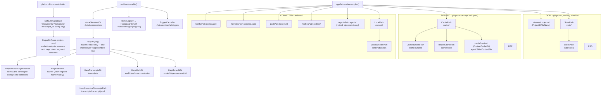

# internal/core/paths

`internal/core/paths` is the single declarative source of truth for ctxloom's on-disk layout:
constants naming every directory and file, pure functions joining them under two
roots — the **home root** (`~/.ctxloom/...`, keyed by harp) and a **project app dir**
(`<appPath>/...`, supplied by the caller) — and the layout classification itself
(`Tier`, `Entry`, `Layout`). It declares no other types, performs no writes, and
(with one exception) does no I/O. Its contract is vocabulary: if a path segment appears as a
string literal anywhere else in the repo, that is a duplication of this package.

The user-facing account of the same layout — what a clone gets, what you may delete, and
what it costs — is [docs/layout.md](../../layout.md). This page is about the package.

## Responsibilities

- The layout constants: directory and file names for sessions, config, remotes, lockfile,
  profiles, agents, content, cache, local state and per-session engine homes.
- Path composition functions over those constants.
- The tier classification (`Tier`, `Entry`, `Layout`) that doctor walks.

## Non-responsibilities

- Deciding *which* project directory is the root — `internal/adapters/projectroot`; see
  [projectroot.md](./projectroot.md).
- Creating, reading or writing anything at these paths — every caller.
- Validating that an `appPath` is real: this package accepts and blesses empty input
  (see invariant 6). A **harp** is the deliberate exception — `HarpDir` and every
  helper riding it (`HarpSessionEngineHomes` among them) validate it, because it becomes a
  single path component and is user-renameable.

## The two roots

```mermaid
flowchart TD
    HOME["os.UserHomeDir()"] --> HSD["HomeSessionsDir<br/>~/.ctxloom/sessions"]
    HOME --> HLD["HomeLogsDir → HomeLogFilePath<br/>~/.ctxloom/logs/&lt;prog&gt;.log"]
    HOME --> TCD["TriggerCacheDir<br/>~/.ctxloom/cache/triggers"]

    HSD --> HD["HarpDir(harp)<br/>machine state only — one member per HarpMembers row"]
    HD --> HSH["HarpSessionEngineHomes<br/>home/ (the per-engine config-home container)"]
    HD --> HND["HarpNativeDir<br/>native/ (each engine's native history)"]
    HD --> HTD["HarpTranscriptsDir<br/>transcripts/"]
    HTD --> HCTP["HarpCanonicalTranscriptPath<br/>transcripts/transcript.jsonl"]
    HD --> HWD["HarpWorkDir<br/>work/ (worktree checkouts)"]
    HD --> HSC["HarpScratchDir<br/>scratch/ (per-run scratch)"]

    DOC["platform Documents folder"] --> DOB["DefaultOutputBase<br/>&lt;Documents&gt;/ctxloom (or the output_dir config key)"]
    DOB --> OD["OutputDir(base, project, harp)<br/>readable outputs: essence, next step, plans, segment essences"]

    AP["appPath (caller-supplied)"] --> CP["ConfigPath config.yaml"]
    AP --> RP["RemotesPath remotes.yaml"]
    AP --> LKP["LockPath lock.yaml"]
    AP --> PP["ProfilesPath profiles/"]
    AP --> AGP["AgentsPath agents/ (retired, signposted only)"]

    AP --> LP["LocalPath<br/>content/"]
    LP --> LBP["LocalBundlesPath<br/>content/bundles"]

    AP --> GCD["CachePath<br/>cache/"]
    GCD --> CBP["CacheBundlesPath<br/>cache/bundles"]
    GCD --> RCP["ReposCachePath<br/>cache/repos"]
    GCD --> CTX["cache/context (ContextCacheDir)<br/>agent.WriteContextFile"]

    AP --> PID[".ctxloom/project-id<br/>(ProjectIDFileName)"]

    AP --> SP["StatePath<br/>state/"]
    SP --> LKD["LocksPath<br/>state/locks/"]

    subgraph committed["COMMITTED · authored"]
      LP
      LBP
      CP
      RP
      LKP
      PP
      AGP
    end
    subgraph derived["DERIVED · gitignored (except lock.yaml)"]
      GCD
      CBP
      RCP
      RAP
      CTX
    end
    subgraph localstate["LOCAL · gitignored, nothing rebuilds it"]
      SP
      LKD
      PID
      PSD
    end
```

## Constant groups

Three vocabularies share one file; `AppDirName` and `CacheDir` cross groups.

| Group | Constants |
|---|---|
| Home / session layout | `SessionsDir`, the session-dir member names `paths.HarpMembers` rows are built from, the output-dir leaves (`OutputDirName`, `EssenceFileName`, `NextStepFileName`, `PlanFileExt`), `LogsDir`, `TriggersDir`, `CoordDirName`, `CoordEndpointFileName` |
| Project app-dir layout | `AppDirName`, `ConfigFileName`, `RemotesFileName`, `LockFileName`, `ProfilesDir`, `AgentsDir`, `ContentDir`, `CacheDir`, `RepoContentPrefix`, `BundlesDir`, `ReposCacheDir`, `ContextCacheDir`, `ProjectIDFileName` |
| Local state tier | `StateDir`, `LocksDir`, `HomeLocksDirName`, `SessionEngineHomesDirName` |

## Key functions

Grouped by root; every function is a pure `filepath.Join` composition except where noted.
Caller counts are production-only (`_test.go` excluded) and count call sites outside
this package.

### Home root (returns `(string, error)` — the error is `os.UserHomeDir`'s, wrapped)

| Function | Path | Prod callers |
|---|---|---|
| `HomeSessionsDir` | `~/.ctxloom/sessions` | 6 |
| `HomeLogsDir` | `~/.ctxloom/logs` | 0 (feeds `HomeLogFilePath`) |
| `HomeLogFilePath` | `~/.ctxloom/logs/<prog>.log` | 1 |
| `HarpDir` | `+ <harp>` — **validates the harp** | 9 |
| `HarpSessionEngineHomes` | `<harp>/home` — the per-session container each engine's own config-home instance lands under; **validates the harp**, returns an error | 2 |
| `HarpScratchDir`, `HarpWorkDir`, `HarpNativeDir`, `HarpTranscriptsDir`, … | `<harp>/<member>` — one accessor per `paths.HarpMembers` row a caller resolves, all through `HarpDir`'s validation | — |
| `HarpCanonicalTranscriptPath` | `<harp>/transcripts/transcript.jsonl` — the canonical write target | — |
| `DefaultOutputBase`, `OutputDir` | `<Documents>/ctxloom/<project>/<harp>` — a session's output dir; resolved once at mint and recorded in `session.yaml` (`sessions.Entry.OutputDir`) | — |
| `TriggerCacheDir` | `~/.ctxloom/cache/triggers` | 1 |
| `HomeCoordDir` | `~/.ctxloom/coord` — root of one project-keyed subdirectory per project, holding that project's coordinator roots | 1 |
| `CoordRootStateDir` | `~/.ctxloom/coord/<project-key>/<root-harp>` — one coordinator root's state dir (`internal/core/coord`'s owner lock + journals); **validates the root harp** | 1 |

### Project app dir (pure, no error return unless noted)

| Function | Path | Prod callers |
|---|---|---|
| `ConfigPath` | `<appPath>/config.yaml` | 11 |
| `RemotesPath` | `<appPath>/remotes.yaml` | 6 |
| `LockPath` | `<appPath>/lock.yaml` | 3 |
| `ProfilesPath` | `<appPath>/profiles` | 4 |
| `AgentsPath` | `<appPath>/agents` — retired agent-definition directory; named only by `config.retiredAgentsDirSignpost`, never read | 1 |
| `LocalPath` | `<appPath>/content` — committed content root | 2 |
| `LocalBundlesPath` | `<appPath>/content/bundles` — authored bundles | 12 |
| `CachePath` | `<appPath>/cache` | 0 outside the package (6 in-package) |
| `CacheBundlesPath` | `<appPath>/cache/bundles` — pulled remote copies | 5 |
| `ReposCachePath` | `<appPath>/cache/repos` — git clone cache | 3 |
| `StatePath` | `<appPath>/state` — the third tier | 2 |
| `LocksPath` | `<appPath>/state/locks` — advisory lock sidecars; the protected-path→lock-name mapping is `ProjectPathFor` (lockpath.go) | 1 |
| `DefaultRemotesPath` | `RemotesPath(AppDirName)` | 1 |

### Classification

`Tier` (`TierCommitted` / `TierDerived` / `TierLocal`), `Root` (`RootProject` /
`RootHome`), `Presence` (`PresenceMustExist` / `PresenceIfUsed`), `Entry` and
`Layout()` classify every path this tree's own writers produce, each appearing
exactly once per root — a `RootProject` row and a `RootHome` row may share
`Rel` text (`.ctxloom/sessions` names both the project's compacted-history row
and the home sessions store; they are two different physical paths, told apart
by `Root`). `Root` decides which of the two roots `Entry.Rel` joins onto
(`Entry.ResolveRoot`); `Presence` decides whether a `TierLocal` row's absence
is worth a doctor warning at all, an axis that happens to correlate with
`Tier` for every `RootProject` row (each is created by project setup, so a
missing one is a genuine loss) but not for `RootHome` rows, which are shared
across every project on the machine and created lazily by exercising a
specific feature — a fresh install, or one that never touched that feature,
legitimately has none of them yet.

`Layout` is read by doctor's local-tier check (`operations.doctorCheckLocalTierState`),
which resolves each row against the root `Entry.Root` names and reports any
absent `PresenceMustExist` `TierLocal` row using that entry's `Lost` text;
a `PresenceIfUsed` row is reported only when PRESENT, never when absent. The
`RootHome` rows and their per-row reasoning
are documented in full in [layout.md](../../layout.md)'s "The home tree"
table — this page states the mechanism, that page states the list. The
`locks` row (`HomeLocksDirName`) has its own dedicated resolvers: `HomeLocksDir`
(the directory) and `HomePathFor` (`lockpath.go`, the per-protected-file lock
path within it) both live in this package, so no other package names the
`"locks"` leaf.

## Invariants

1. **Three tiers, told apart by what a fresh clone gets.** `content/` (`LocalPath`,
   `LocalBundlesPath`) is committed and authored, alongside `config.yaml`, `remotes.yaml`,
   `lock.yaml` and `profiles/`. `cache/`
   (`CachePath` and everything under it) is derived: deleting it must lose nothing that a
   named command cannot rebuild. `state/` (`StatePath`) is local-only and gitignored, and
   **nothing rebuilds it** — that, not gitignore status, is what earns a path a place there
   rather than in `cache/` (`Tier`'s doc).
2. **`TierDerived` is about rebuildability, not about git.** `lock.yaml` is derived
   (`ctxloom remote lock`) *and* committed, deliberately: a lockfile the next clone does not
   receive pins nothing.
3. **`CacheBundlesPath` is never a bundle *search* dir.** Authored bundles are read only from
   `content/bundles` (`config.Config.GetBundleDirs`); authored YAML found under
   `cache/bundles` raises a fatal migration finding. `CacheBundlesPath`'s doc comment is a
   deliberate warning against exactly that confusion.
4. **`HarpMember.Lifetime` is the teardown boundary, and the session dir holds machine state
   only.** `Ephemeral` rows (`home/`, `work/`, `scratch/`) may vanish when a run or session is
   torn down — `work/` only after triage; `Persist` rows must not, including the canonical
   transcript and native history. What a human reads lives in the output dir, which no reaper
   touches.
5. **Every function accepts an empty `appPath` and returns a plausible, wrong path.**
   `ConfigPath("")` is the cwd-relative `"config.yaml"`; `CachePath("")` is `"cache"`. The
   harp-keyed functions are the exception: `HarpDir` and everything riding it reject an
   empty or traversing harp rather than falling back to a shared path.
6. **A per-session path gets no `Layout` row.** `Layout` enumerates paths whose ABSENCE
   doctor reports; a session's members are created at session start and reaped with the
   session, so their absence is the normal case, and the home-rooted sessions store row
   covers the tree. `TestArch_LayoutHasNoHarpKeyedRows` (and its in-package twin
   `TestLayout_HasNoHarpKeyedRows`) keep that true. **The members themselves are a
   table**: `HarpMembers` classifies every member of a session dir (tier, location,
   lifetime, and whether a container must reach it); `ClassifyMember` is the one
   predicate over it, `IdentityMember` the row that makes a directory a session, and
   `MountedMembers` what the isolation adapter mounts. `sessions.Layout` derives every
   session-dir path from it, and the ONE reaper (`sessions.Reap`) removes members by the
   table's `Lifetime` axis alone — `sessions.ReapPolicy.Members` is the Ephemeral rows,
   plus the top-level machine rows of a compacted session under a human's `--include-persist` — judging age by the one
   clock (`sessions.ActivityTime`: the newest mtime under the session dir, the dir's own
   mtime and every symlink's excluded). `TestArch_ReaperMemberNamesAreTableRows` keeps
   every member constant the reap, purge and clean code names a row of the table.
7. **No writes.** Nothing in this package creates a directory or a file.

## Layout slices L4, L5 and L6

The layout model landed as `content/` + `cache/` + `state/`. Three slices from
that plan were not built, and each is ruled still wanted. None of them left a
design in the tree, so what follows is what their names, the retired ignore
entries and the current code support, and no more.

- **L4, the partial-clone pieces fetcher: wanted.** A pinned remote bundle is
  already checked out narrowly, as a sparse worktree of its own subpath
  (`remote.RepoCache.EnsureSparseWorktree`), but the clone behind it is still
  full-depth, with every object (`remote.RepoCache.clone`). L4 is for fetching
  only what pinned bundles need instead of the whole repository. Nothing writes
  a `pieces/` directory today, and `gitignore.PrivateStatePatterns` no longer
  lists one.
- **L5, the container-crossing manifest: satisfied.** What crosses into a
  container now crosses under other names: the launch package is carried
  inline or, above `composite.DefaultInlineMax`, by claim check in the content-addressed
  `fsstore.PackageStore` under the session's `package/` member, and a
  container runner reaches it through the session-state bind mounts
  (`Container.sessionStateMounts`, derived from `paths.MountedMembers`) that
  also carry its spool, transcripts and task log. Credentials and config overlays are prepared by the container
  workspace. Nothing is left for a separate manifest to describe.
- **L6, the cache split: wanted, so library caches can be shared across
  implementors.** Fetched library content is cached per project today: the
  repo clones and bundle worktrees sit under the project's own `cache/`
  (`paths.ReposCachePath`, and the `cache/` rows of `paths.Layout`), so every
  project re-fetches and re-stores the same remotes. `paths.Tier` separates
  rebuildable `cache/` from `state/`, but not project-scoped cache from
  shareable cache. L6 splits `cache/` so that fetched library content —
  remote repositories and bundle trees, addressed by repository and commit —
  lives in a shared, home-scoped cache that every project and implementor
  (agents, engines, tools) can read, while cache that is genuinely about one
  project stays in that project. Pins stay per project, because the lockfile decides what is read and the shared
  store only spares the re-fetch.

## Boundaries

- **Imports:** one shared leaf only — `internal/shared/harp` (harp validation). Nothing here
  degrades or guesses, so nothing here reports: every resolver either composes a path from what it
  was given or returns an error.
- **Imported by:** every package that locates an artifact on disk — for example `config` and `operations` for
  project artifacts; `sessions`, `memory`, `transcript`,
  `agentcoord/coord` and `cli` for per-harp session state; `claude` for the
  per-session engine-home instance.

## Where documented and real behavior diverge

- The layout vocabulary is **not exclusive**. `internal/shared/tasks/paths` aliases
  `AppDirName` onto this package but declares its own `IndexFileName` — which is NOT a
  duplication to collapse, since the two name different files (`sessions/index.yaml` versus
  `projects/index.yaml`) that independently took the conventional name for an index. It
  also owns the `project-id` marker leaf (`tasks/paths.ProjectMarkerPath`) while this
  package declares `ProjectIDFileName` for `Layout`'s benefit — two declarations of one
  name, kept in step by `TestPathSegments_ComeFromNamedConstants`.
- Every function still accepts an empty `appPath` and composes a cwd-relative path from it (see
  invariant 6). No production caller can currently reach that: `config.findAppDir` and
  `cli.resolveAppDir` cannot return an empty string, and the three callers that accept one
  substitute `AppDirName` themselves (`operations.getBaseDir`, `remote.NewLockfileManager`,
  `cli.projectConfigPath`) — a default duplicated at each site and owned by none of them.
- **`CoordRootStateDir` still gets no `Layout` row**, unlike its parent
  `HomeCoordDir` (which does, as of C13's `Root: RootHome` rows — see
  "Classification" above). The reason is the same one every harp-keyed path
  is excluded (invariant 7): `CoordRootStateDir(projectKey, rootHarp)` is a
  per-root INSTANCE under the coord store, not the store root itself, so it
  names no fixed path a row could describe — the same shape as `HarpDir`
  under `HomeSessionsDir`.
- **`project-id` is the one classified path still at the `.ctxloom` root** rather than under
  `state/`, where its tier says it belongs. A move to `state/project-id` (with a read
  fallback and a one-time migration) is decided but unimplemented; `Layout` and
  `gitignore.PrivateStatePatterns` both name the root path, which is what the code resolves
  today.
