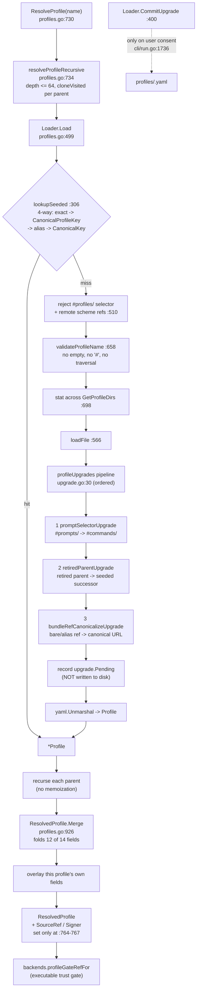

# internal/profiles

`internal/profiles` owns the **directory-profile** half of ctxloom's context-composition
mechanism: it reads `.ctxloom/profiles/<name>.yaml` (plus bundle-shipped profiles seeded in
memory), migrates their on-disk schema forward on every load, and resolves a named profile
plus its parent graph into one flattened `ResolvedProfile` listing the bundles, fragments,
commands, skills, hooks, MCP servers, tags, variables and exclusions a session should get.

It is the **fallback leg of a two-source resolver**. `operations.resolveProfile`
(`internal/operations/context.go:567`) and `lm/backends.assembleManaged*` first try
`config.ResolveProfile` over the inline `profiles:` map in `config.yaml`, and only fall
through to `Loader.ResolveProfile` when the name is not inline. Every semantic here therefore
has a twin in `internal/config/config_resolve.go`, kept in lockstep by hand.

## Responsibilities

- Profile document schema and YAML shape (`Profile`, `FragmentRef`).
- Filesystem CRUD over the profile directories, behind the `Source`/`Store` ports (ADR 0026).
- The three-stage schema-upgrade pipeline run on every load, plus the pending-upgrade ledger.
- Seeded (bundle-shipped) profile registry and its reference-canonicalization grammar.
- Parent-graph resolution: depth/cycle guard, per-branch visited set, merge semantics.

## Non-responsibilities

- Inline `profiles:` in `config.yaml` — `internal/config` (`ResolveProfile`); see [config.md](./config.md).
- Profile CRUD *operations* and import/export — `internal/operations`
  (`profiles.go`, `profile_transfer.go`); see [operations.md](./operations.md).
- Turning a resolved profile into delivered text — `operations.AssembleContext`.
- The reference grammar itself — `internal/remote`; see [remote.md](./remote.md).

## Data flow

## Key types

| Type | file:line | What it carries |
|---|---|---|
| `Profile` | `internal/profiles/profiles.go:144` | The on-disk document: `Bundles`, `BundleItems`, `Fragments`, `Commands`, `Skills`, `SelectTags`, `Hooks`, `MCP`, `Description`, `Tags`, `LLM`, `Variables`, `ExcludeFragments`, `ExcludeMCP`, `DenyTools`, `Parents`, plus three `yaml:"-"` derived fields (`Name`, `Path`, `Signer`) the loader stamps. |
| `FragmentRef` | `internal/profiles/profiles.go:33` | `{Name, Priority}`; accepts a bare string or a `{name, priority}` map. Mirror of `config.FragmentRef` (this package cannot import `config`, which imports it). |
| `Loader` | `internal/profiles/profiles.go:231` | `dirs`, `fs`, `remoteResolver`, `remoteURLResolver`, `pending`/`pendingPaths` (the upgrade ledger), `seeded` (bundle-shipped profiles). |
| `LoaderOption` | `internal/profiles/profiles.go:258` | Functional option: `WithFS` `:261`, `WithRemoteResolver` `:271`, `WithRemoteURLResolver` `:281`, `WithSeededProfiles` `:292`. |
| `ResolvedProfile` | `internal/profiles/profiles.go:876` | The flattened answer: 14 fields, of which `Merge` folds 12. `SourceRef` and `Signer` are provenance and are deliberately **not** merged. |
| `Source` / `Store` (interfaces) | `internal/profiles/store.go:12,22` | The read port (`List`, `Load`, `Exists`) and the read+write port (`+ Save`, `Delete`). Used as field types in five `operations` request structs. |
| `MemStore` | `internal/profiles/memstore.go:12` | In-memory `Store` proving the operations layer is storage-agnostic (ADR 0026). Referenced only from two `_test.go` files. |
| `promptSelectorUpgrade` / `retiredParentUpgrade` / `bundleRefCanonicalizeUpgrade` | `internal/profiles/upgrade.go:47,87,162` | The three ordered schema migrations. |

## Key functions

### Load and resolve

| Signature | file:line | Contract |
|---|---|---|
| `Loader.ResolveProfile(name)` | `profiles.go:730` | Public entry; seeds depth 0. ~161 `ResolveProfile`/`Load` references repo-wide. |
| `Loader.resolveProfileRecursive` | `profiles.go:734` | Depth guard (64) and cycle guard, per-parent cloned visited set, `strictness`-classified parent failures, then self-overlay. Returns a wrapped `errs.ErrCircularInheritance` on a cycle. |
| `Loader.Load(name)` | `profiles.go:499` | Seed lookup → reject `#profiles/` selectors and remote-scheme refs → `validateProfileName` → stat across dirs. Both miss paths wrap `errs.ErrProfileNotFound`; the bundle-profile miss carries a fix-it hint. |
| `Loader.loadFile` | `profiles.go:566` | Read → resolve the owning repo URL → run the upgrade pipeline → record a `Pending` → unmarshal. |
| `Loader.List` | `profiles.go:429` | Seeded profiles plus a recursive walk of every profile dir, name-sorted. A per-file load failure is warned and skipped. |
| `Loader.Exists` | `profiles.go:552` | `Load(name) == nil`. |
| `GetProfileDirs(fs, appPaths)` | `profiles.go:698` | Filters `paths.ProfilesPath(p)` down to the dirs that exist. Six external production call sites. |
| `Loader.lookupSeeded` / `.aliasSeededKey` / `.canonicalProfileName` | `profiles.go:306,368,345` | The four-way seed lookup and the version-less identity used for the visited set. |

### Persist

| Signature | file:line | Contract |
|---|---|---|
| `Loader.Save(p)` | `profiles.go:612` | Validates the name, **refuses seeded profiles** (`IsSeededPath`), `MkdirAll`, marshal, write. |
| `Loader.Delete(name)` | `profiles.go:679` | Load, refuse seeded, `fs.Remove`. |
| `validateProfileName` | `profiles.go:658` | Rejects empty, any `#`, and traversal after `filepath.Clean`. Called by `Load` and `Save`. |
| `IsSeededPath(path)` | `profiles.go:69` | `strings.HasPrefix(path, "<remote>:")` — the sentinel that marks a bundle-shipped profile. Three production sites. |

### Merge

| Signature | file:line | Contract |
|---|---|---|
| `ResolvedProfile.Merge(parent)` | `profiles.go:926` | Folds a parent's 12 mergeable fields in. **Must not touch `SourceRef`/`Signer`.** |
| `appendUnique` / `appendUniqueFragments` | `profiles.go:951,970` | Order-preserving string union; fragment union by name where priority is raised, never lowered. |
| `Profile.ResolveShortRefs(src)` | `profiles.go:90` | Rewrites `Bundles`, `Parents`, `Commands`, `Skills`, `Fragments`, `BundleItems` to canonical form against a source repo. Caller: `config/config.go:854`. |

### Upgrade pipeline

| Signature | file:line | Contract |
|---|---|---|
| `profileUpgrades(seeded, ownURL, aliasToURL)` | `upgrade.go:30` | Builds the ordered three-stage pipeline; **the order is the payload**. |
| `promptSelectorUpgrade.Apply` | `upgrade.go:53` | Rewrites `#prompts/` → `#commands/` in `bundles` and `bundle_items`. |
| `retiredParentUpgrade.Apply` / `.rewrite` | `upgrade.go:97,106` | Maps a retired parent ref onto its seeded successor; an empty seed set is a guarded no-op. |
| `bundleRefCanonicalizeUpgrade.Apply` / `.canonicalize` / `renormalizeStoredRef` | `upgrade.go:177,233,211` | Canonicalizes `bundles`; only *re-normalizes* `parents`. An unparseable result keeps the authored form. |
| `FindBundleProfileKey` | `upgrade.go:125` | Unique `<bundle>#profiles/<n>` key from one repo; ambiguity returns false. Caller: `config/config.go:889`. |
| `Loader.PendingUpgrades` / `.CommitUpgrade` | `profiles.go:392,400` | The ledger accessor and the consented write. Caller: `cli/run.go:1736`. |

## Invariants

1. **Two profile sources, config first.** A name defined inline in `config.yaml`'s `profiles:` map
   wins; this package is consulted only on a miss (`operations/context.go:567`).
2. **Upgrades are applied in memory on every load and written only on consent.** `loadFile`
   (`profiles.go:566`) always runs the pipeline and records an `upgrade.Pending`; nothing reaches
   disk until `CommitUpgrade` (`profiles.go:400`), which the CLI calls after prompting.
3. **The three upgrade stages are order-dependent** (`upgrade.go:30-35`): stage 1 emits selectors
   that stage 3 normalizes, and stage 2 emits refs that stage 3 re-normalizes. Nothing asserts the order.
4. **`Loader.Save` and `Loader.Delete` are the only writers of `.ctxloom/profiles/*.yaml`**
   (`profiles.go:612,679`) — plus `CommitUpgrade` for the consented migration rewrite. Both refuse
   seeded profiles.
5. **Seeded profiles are identified by a sentinel in `Path`**, not by a flag: `Path` begins
   `"<remote>:"` and `IsSeededPath` (`profiles.go:69`) is the test. Three call sites must remember it.
6. **Resolution is depth-bounded at 64 with a per-branch visited set.** `cloneVisited`
   (`profiles.go:869`) is copied per parent, so a diamond is resolved twice rather than being
   mistaken for a cycle; a true cycle returns `errs.ErrCircularInheritance`.
7. **`Merge` folds 12 of 14 fields.** `SourceRef` and `Signer` are written only by
   `resolveProfileRecursive` (`profiles.go:764-767`) and read only by
   `lm/backends/managed.go`'s `profileGateRefFor`. A parent's `SourceRef` must never leak onto a
   child's directly-declared executables — that is the executable trust gate's provenance.
8. **A local parent that cannot be resolved is a `strictness` finding, not an error.**
   `resolveProfileRecursive` records the finding and continues, returning `nil`; whether the run
   aborts depends on the caller having opened a strictness window.
9. **This package cannot import `internal/config`** (the dependency runs the other way), which is
   why `FragmentRef` and the resolution semantics are duplicated in `config_resolve.go`.

## Boundaries

- **Called by:** `internal/config` (`GetProfileLoader`, `loadBundleProfileSeed`),
  `internal/operations` (`profileLoader`, `profileLoaderFS`, the CRUD operations),
  `internal/cli` (`profile.go`, `run.go`'s upgrade-consent prompt), `internal/bundles`,
  `internal/lm/backends` (`assembleManagedMCP`, `assembleManagedHooks`, `assembleManagedDenyTools`).
- **Calls:** `internal/remote` (7 symbols: `CanonicalKey`, `CanonicalProfileKey`,
  `SplitBundleProfileRef`, …), `internal/shared/upgrade`, `internal/shared/strictness`,
  `internal/errs`, `internal/paths`, `clidiag`.

## Where documented and real behavior diverge

- `ParseProfile` (`profiles.go:76`) is exported and documented but has zero references repo-wide.
- `MemStore.Load`/`.Delete` (`memstore.go:45,75`) return a bare `fmt.Errorf` rather than wrapping
  `errs.ErrProfileNotFound`, and `MemStore.Save` (`:64`) does not call `validateProfileName` — so
  the two `Store` implementations do not behave identically through the port.
- `Loader.Exists` (`profiles.go:552`) reports `false` for a profile whose YAML is corrupt or
  unreadable, not only for one that is absent.
- Resolution of a zero-byte, `{}`-only or fully commented-out profile returns `err == nil` with all
  fourteen fields empty and **zero strictness findings**; `Save(&Profile{Name: "hollow"})` writes
  the three bytes `"{}\n"`.
- `isRemoteProfileRef` (`profiles.go:544`) is a verbatim duplicate of `remote.IsCanonicalRef`.
- `WithFS` exists as the filesystem seam but only two of the four production loader factories pass it.
