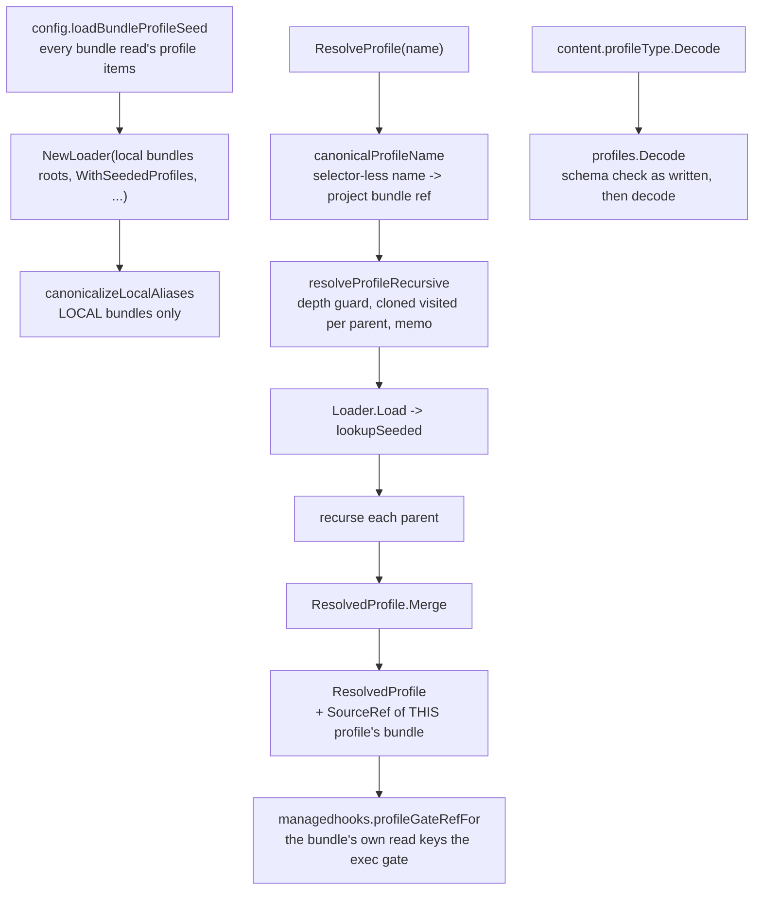

# internal/core/profiles

`internal/core/profiles` owns ctxloom's profile half of context composition: the profile
document and its one decoder, the `Loader` that resolves a profile name to a bundle's profile
item, and the parent-graph resolution that flattens a named profile into one `ResolvedProfile`
listing the bundles, fragments, commands, skills, hooks, tags, variables and exclusions a
session should get.

Every profile is a bundle's profile item (`<bundle>/profiles/<name>.yaml`). A project's own
profiles are the items of its **project bundle** — the local bundle named
`paths.ProjectBundleName` — and a selector-less profile name is that bundle's profile of that
name. Home uses the same rule under its own app directory.

## Responsibilities

- The profile document schema and YAML shape (`Profile`, `FragmentRef`), and `Decode`: the one
  decoder every profile item goes through, whichever bundle it is read from.
- Name resolution: a selector-less name maps to the project bundle (`profileRef`); every
  `<bundle>#profiles/<name>` spelling — local, remote, short, aliased or version-pinned —
  resolves through the seed under its canonical key (`lookupSeeded`, `canonicalProfileName`).
- Writes of a LOCAL bundle's profile items (`Loader.Save`, `Loader.Delete`).
- The profile-ref format step a bundle envelope carries (`CanonicalRefs`) and the in-memory alias
  canonicalization of a local bundle's profiles.
- Parent-graph resolution: depth and cycle guards, per-branch visited set, merge semantics.

## Non-responsibilities

- Reading bundles. Profiles reach the loader only through `WithSeededProfiles`;
  `config.loadBundleProfileSeed` builds that seed from the bundle reads — a local bundle's
  profiles with their real file path and their refs as authored, a remote bundle's with the
  read-only `SeededProfilePathPrefix` sentinel path and their short refs resolved against the
  bundle's source.
- Creating the project bundle and profile CRUD *operations* —
  `internal/adapters/operations` (`CreateProfile`, `ImportProfile`, `prepareLocalBundleWrite`);
  see [operations.md](./operations.md).
- Turning a resolved profile into delivered text — `operations.AssembleContext`.
- The reference grammar itself — `internal/adapters/remote`; see [remote.md](./remote.md).

## Data flow

```mermaid
flowchart TD
    SEED["config.loadBundleProfileSeed<br/>every bundle read's profile items"] --> NEW["NewLoader(local bundles roots, WithSeededProfiles, ...)"]
    NEW --> ALIAS["canonicalizeLocalAliases<br/>LOCAL bundles only"]
    CALL["ResolveProfile(name)"] --> CAN["canonicalProfileName<br/>selector-less name -> project bundle ref"]
    CAN --> REC["resolveProfileRecursive<br/>depth guard, cloned visited per parent, memo"]
    REC --> LOAD["Loader.Load -> lookupSeeded"]
    LOAD --> PAR["recurse each parent"]
    PAR --> MERGE["ResolvedProfile.Merge"]
    MERGE --> OUT["ResolvedProfile<br/>+ SourceRef of THIS profile's bundle"]
    OUT --> GATE["managedhooks.profileGateRefFor<br/>the bundle's own read keys the exec gate"]

    ITEM["content.profileType.Decode"] --> DEC["profiles.Decode<br/>schema check as written, then decode"]
```

## Key types

| Type | What it carries |
|---|---|
| `Profile` | The document: `Bundles`, `BundleItems`, `Fragments`, `Commands`, `Skills`, `SelectTags`, `Hooks`, `Description`, `Tags`, `LLM`, `Variables`, `ExcludeFragments`, `ExcludeMCP`, `DenyTools`, `Parents`, plus the `yaml:"-"` derived fields (`Name`, `Path`, `SourceURL`) the seed stamps. |
| `FragmentRef` | `{Name, Priority}`; a bare string or a `{name, priority}` map. |
| `Loader` | `dirs` (the local bundles roots a new item is written under), `fs`, the alias resolver and local-bundle oracle, `seeded` (every profile it resolves). |
| `ResolvedProfile` | The flattened answer. `SourceRef` is this profile's own provenance and is deliberately not merged from parents. |

## Key functions

| Signature | Contract |
|---|---|
| `Decode(data)` | Schema validation of the document as written (a violation is an error naming each cause), then the decode. It does not re-spell refs: that is `CanonicalRefs`, run by the bundle envelope's generation. |
| `Loader.Load(name)` / `Loader.Exists(name)` / `Loader.List()` | Seed lookups. A miss on a selector-less name or an explicitly local ref is a plain `errs.ErrProfileNotFound`; any other bundle-profile miss carries the `deps pull` hint. A hollow LOCAL profile loads and reports a fail-loudly finding. |
| `Loader.ResolveProfile(name)` | Public entry for parent-graph resolution. |
| `Loader.Save(p)` | Writes a LOCAL bundle's profile item: back to its own file, or as a new item of the local bundle its name addresses (`newItemPath`). Refuses a remote profile, a nested name, a missing local bundle (`errs.ErrBundleNotFound`), and a path where a file is present but did not load (`os.ErrExist`). Joins the seed, so the same loader resolves what it saved. |
| `Loader.Delete(name)` | Removes a local profile item's file and drops it from the seed; refuses a remote profile. |
| `CanonicalRefs` / `Profile.CanonicalizeRefs` | The profile-document step (and its struct form) that re-spells stored bundle and parent refs canonically (`remote.CanonicalSpelling`). Carried by the bundle envelope kind. |
| `ResolvedProfile.Merge(parent)` | Folds a parent in. Must not touch `SourceRef`. |
| `Profile.CheckOwnRepo()` | Refuses, with `ErrCrossRepoReference` naming the profile and the ref, a profile with a `SourceURL` that names content outside that repository through any bundle-bearing field. Enforced by `Loader.Load` and by the lock walk (`operations` `depWalker.walkProfile`). |

## Invariants

1. **One source.** The loader reads only its seed; nothing in this package reads profile files.
2. **A selector-less name is the project bundle's profile.** Adding a remote can never change
   what a bare name means.
3. **One decoder.** `content.profileType.Decode` decodes every profile item through `Decode`, so
   a profile carrying a key the schema does not declare stops its bundle loading.
4. **Writes stay local.** `Save`/`Delete` write only a local bundle's items; a remote bundle's
   profile is edited at its source.
5. **A profile is a single path segment**, like every bundle item name.
6. **Resolution is depth-bounded with a per-branch visited set**; a true cycle returns
   `errs.ErrCircularInheritance`, and an unresolvable parent is a strictness finding.
7. **The exec gate keys a profile's own hooks by its own bundle.** `SourceRef` is the bundle the
   profile is an item of; a profile with none has an unclaimed read, which withholds.
8. **This package cannot import `internal/core/config`** (the dependency runs the other way).
9. **A remote profile names only its own repository.** `SourceURL` is set for a profile shipped
   in a repository; `Load` refuses it if it reaches elsewhere, so every reader sees one refusal.
   Only a local profile (`SourceURL` "") composes several repositories.

## Boundaries

- **Called by:** `internal/core/config` (`GetProfileLoader`, `loadBundleProfileSeed`),
  `internal/adapters/content` (`profileType.Decode`), `internal/core/bundles` (the envelope's
  profile-ref step), `internal/adapters/operations` (profile CRUD, the closure walk),
  `internal/adapters/operations/managedhooks`.
- **Calls:** `internal/adapters/remote` (the reference grammar), `internal/shared/upgrade`,
  `internal/shared/report`, `internal/shared/errs`, `internal/core/paths`.
