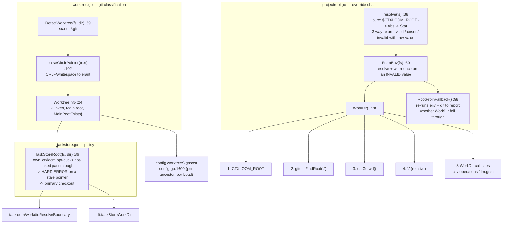

# internal/projectroot

`internal/projectroot` answers "which directory is this project rooted at?" — resolving the
`CTXLOOM_ROOT` override above git-root detection above cwd, classifying whether a directory
is a **linked git worktree**, and applying the one deliberate exception where a linked
worktree redirects to its primary checkout (the task store). It writes nothing; it returns
a root that every downstream writer then writes to, which is why a wrong answer here does not
fail — it silently writes the right data to the wrong project.

Seven functions, three files, 15 production call sites across `internal/cli`,
`internal/config`, `internal/operations`, `internal/lm/grpc` and `internal/taskloom/workdir`.

## Responsibilities

- The root override chain (`projectroot.go`).
- Git-worktree classification from filesystem metadata, without shelling out to git (`worktree.go`).
- The tasks-are-not-context policy: a linked worktree's task store lives in the primary checkout
  (`taskstore.go`).

## Non-responsibilities

- What lives at a root — `internal/paths`; see [paths.md](./paths.md).
- Finding the `.ctxloom` directory itself — `internal/config` (`findAppDir`), which calls
  `DetectWorktree` per ancestor; see [config.md](./config.md).
- Git operations — `internal/git` / `gitutil`.

## Resolution chain

## Key types and functions

| Symbol | file:line | Contract |
|---|---|---|
| `EnvVar` (const) | `projectroot.go` | The `CTXLOOM_ROOT` variable name; referenced by 10+ tests via `t.Setenv`. |
| `WorktreeInfo` | `worktree.go:24` | `{Linked bool, MainRoot string, MainRootExists bool}`. The pair `MainRoot != "" && !MainRootExists` is the *diagnosable* stale-pointer state, and both consumers use exactly that pair to build a remediation message. |
| `resolve(fs)` | `projectroot.go:38` | Pure: reads `$CTXLOOM_ROOT`, `filepath.Abs` + `Clean`, stats it on `fs`. The three-way return is what lets `FromEnv` warn on *invalid* without warning on *unset*. Split out as a testing seam so tests avoid the process-global `warnOnce`. |
| `FromEnv(fs)` | `projectroot.go:60` | `resolve` plus a warn-once naming the variable, the bad value and the fallback. Callers: `config/config.go:1520`, `cli/hook_inject_context.go:344`, and the two below. |
| `WorkDir()` | `projectroot.go:78` | The canonical chain: `CTXLOOM_ROOT` → `gitutil.FindRoot(".")` → `os.Getwd()` → `"."`. Eight production call sites. |
| `RootFromFallback()` | `projectroot.go:98` | Re-runs the env and git rungs to report whether `WorkDir` landed on the bare-cwd fallback; `ctxloom run` warns on it. Callers: `operations/manage.go:128`, `operations/hooks.go:100`, `cli/run.go:681`. |
| `DetectWorktree(fs, dir)` | `worktree.go:59` | Stats `dir/.git`: a directory means not linked; a file is read, `gitdir:` parsed, a `worktrees` path segment required, `MainRoot` derived and stat'd. Callers: `config/config.go:1600`, `taskstore.go:42`. |
| `parseGitdirPointer(text)` | `worktree.go:102` | Scans for a `gitdir:` line, trimming `\r` and surrounding whitespace. |
| `TaskStoreRoot(fs, dir)` | `taskstore.go:36` | Own-`.ctxloom` opt-out → not-linked passthrough → **hard error** on a stale pointer (three named remediations, no fallback) → the primary checkout. Callers: `taskloom/workdir/workdir.go:66`, `cli/taskstore_identity.go:31`. |

## Invariants

1. **Precedence is `CTXLOOM_ROOT` > git root > cwd.** Every rung's failure silently falls through to
   the next — the documented fault-tolerance posture.
2. **An invalid `CTXLOOM_ROOT` warns exactly once per process** (`warnOnce sync.Once`) and does not
   abort; an unset one is silent.
3. **A linked worktree is detected from filesystem metadata only** — `.git` as a *file* containing a
   `gitdir:` pointer whose path contains a `worktrees` segment. That segment requirement is how a
   worktree is told from a submodule (`worktreesDirName`, `worktree.go:86`).
4. **Tasks are not context**: a linked worktree's task store keys off the *primary* checkout, unless
   the worktree has its own `.ctxloom` (the explicit opt-out at `taskstore.go:38`).
5. **A stale worktree pointer is a hard error, never a fallback** (`taskstore.go:49-54`) — writing a
   task store nobody will read is treated as worse than failing.
6. **The package writes nothing.** Its output is a root string; correctness is enforced entirely by
   its callers' subsequent writes.

## Boundaries

- **Imports:** `gitutil` (go-git `PlainOpen`), `afero`.
- **Imported by:** `internal/config` (`findAppDir`, `worktreeSignpost` — called per ancestor on every
  `config.Load`), `internal/cli`, `internal/operations` (`manage.go`, `hooks.go`),
  `internal/lm/grpc`, `internal/taskloom/workdir`.

## Where documented and real behavior diverge

- The package doc (`projectroot.go:1-9`) describes only the `CTXLOOM_ROOT` override chain. It does
  not mention `worktree.go`'s git classification or `taskstore.go`'s task-store policy, so a reader
  looking for "where do tasks go?" has no reason to open this package.
- `WorkDir()`'s final rung returns `"."` — a **relative** path — where the other three return
  absolute paths (`projectroot.go:78`).
- `DetectWorktree` returns the zero `WorktreeInfo` (i.e. "not a linked worktree") from four
  different causes: no `.git`, a main worktree, a malformed `.git` file, and a submodule. A stat
  permission error is absorbed into the same answer.
- For a bare/separate git dir, `DetectWorktree` derives a `MainRoot` one level above the bare repo —
  a directory that passes every existence check.
- `TaskStoreRoot(fs, "")` stats the cwd-relative `.ctxloom` and, on a hit, returns `""` as the root.
- `RootFromFallback` recomputes what `WorkDir` already knew, including a second full go-git repo open.
- `internal/taskloom/workdir` carries a third independent copy of the env/git/cwd chain.
