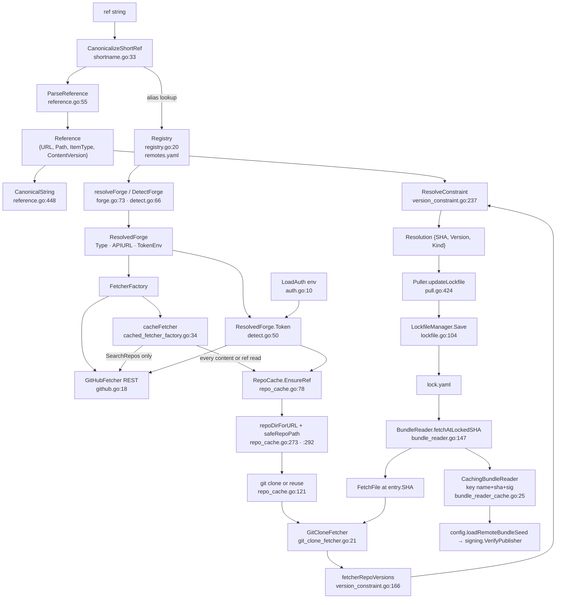

# internal/remote

`internal/remote` is the addressing, acquisition and pinning substrate for third-party
content. It owns the reference grammar (how a bundle identity is spelled, parsed and
canonicalized), the registry of known remote addresses, the on-disk git clone cache, the
selector→commit resolution rules, the `lock.yaml` pin record, and the forge adapters that
read bytes and write publications. Its contract is: **every byte of third-party content an
agent ever sees is fetched at a commit SHA that the lockfile pinned**, and every trust
decision upstream keys off a canonical string produced here. It performs no trust
evaluation and no signature verification of its own — it delivers `(bytes, signature)` pairs
and lets `internal/trust` / `internal/config` decide.

## Responsibilities

- Reference grammar: parse, validate and canonicalize content identities
  (`reference.go`, `normalize.go`, `shortname.go`).
- Registry of remote addresses and forge bindings, persisted to `remotes.yaml`
  (`registry.go`).
- Forge classification and adapter selection: URL → `ForgeType` → `Fetcher`
  (`detect.go`, `forge.go`, `fetcher.go`).
- Fetch implementations: GitHub REST (`github.go`), local go-git clone
  (`git_clone_fetcher.go`), clone-cache router (`cached_fetcher_factory.go`), test double
  (`mock_fetcher.go`).
- The clone cache: URL → local clone directory, clone/fetch, token injection
  (`repo_cache.go`).
- Version-constraint resolution: selector expression → concrete commit
  (`version_constraint.go`).
- The lockfile: load, atomic write, entry CRUD (`lockfile.go`, `lockfile_store.go`,
  `types.go`).
- Serving bundle YAML and its detached `.sig` sibling at the pinned SHA
  (`bundle_reader.go`, `bundle_reader_cache.go`, `fetch_ref.go`).
- Pull (record a pin) and publish (push bytes + signature to a forge)
  (`pull.go`, `publish.go`).
- Publisher-manifest retraction lookup (`retract.go`) and manifest search
  (`search.go`).

## Non-responsibilities

- Signature verification and publisher trust — `internal/trust` and
  `internal/config` (`config.verifyBundlePublisher`); see [trust.md](./trust.md).
- Trust-state evaluation and exposure gating (`EffectiveTrust`, retraction withholding),
  lock rebuild/upgrade orchestration, and the `deps pull`/`sync` command flows —
  `internal/operations`; see [operations.md](./operations.md).
- Bundle parsing, item loading and skill materialization — `internal/bundles`; see
  [bundles.md](./bundles.md).
- Resolver/profile composition and config seeding — `internal/config`; see
  [config.md](./config.md).
- Materializing pulled content onto disk: a pull records a pin only. Nothing in this
  package writes content files (`pull.go:393` is a string formatter, not a writer).

## Data flow

## Key types

| Type | file:line | What it carries |
|---|---|---|
| `Reference` | `internal/remote/types.go:110` | Parsed content identity: `URL`, `Path`, `ItemType`, `ContentVersion`, `IsLocal`, `IsCompanion`. Declared here; all methods live in `reference.go`. |
| `ItemType` | `internal/remote/types.go:31` | Item-kind enum with exactly one member, `ItemTypeBundle`. `DirName()` (`types.go:40`) is the single home of the on-disk `bundles/` convention. |
| `LockEntry` | `internal/remote/types.go:148` | One pin: `SHA`, `URL`, `RequestedVersion`, `Version`, `Kind`, `FetchedAt`, `Pinned`, `Retracted`, `RetractedReason`. |
| `Lockfile` | `internal/remote/types.go:202` | `Version`, `LockedAt`, `Bundles map[string]LockEntry` — bundles only. |
| `Manifest` / `RetractEntry` | `internal/remote/types.go:218,227` | Publisher-side manifest; only `Retracted` and `Bundles` are read. |
| `Remote` | `internal/remote/types.go:9` | A configured remote: `Name`, `URL`, `Forge`. Carries a load-bearing comment (`types.go:13-23`) that a trust flag must never return to this struct. |
| `AuthConfig` | `internal/remote/types.go:259` | Forge tokens (GitHub only). |
| `Registry` | `internal/remote/registry.go:20` | Persisted remotes + forge bindings + default remote, behind `sync.RWMutex`, over `afero.Fs`. |
| `ForgeConfig` / `ResolvedForge` | `internal/remote/forge.go:15,57` | Labelled forge config (`Type` + free-form `Body`) and its resolution to `{Type, BaseURL, APIURL, TokenEnv}`. |
| `Fetcher` (interface) | `internal/remote/fetcher.go:9` | Forge port: `Forge`, `FetchFile`, `ListDir`, `ResolveRef`, `SearchRepos`, `ValidateRepo`, `GetDefaultBranch`. Optional capabilities are probed by type assertion: `tagLister`, `fetcherTagResolver` (`version_constraint.go:152,160`), `Versioned` (`vcs.go:60`), `itemHistorySource` (`vcs.go:166`). |
| `cacheFetcher` | `internal/remote/cached_fetcher_factory.go:34` | The production `Fetcher`: routes all content/ref reads to a local clone; uses the forge API only for `SearchRepos`. |
| `GitCloneFetcher` | `internal/remote/git_clone_fetcher.go:21` | `Fetcher` over an already-cloned go-git repository; zero network. |
| `GitHubFetcher` / `GitHubPublisher` | `internal/remote/github.go:18,436` | REST read adapter (with a 401→unauthenticated retry) and the write adapter. |
| `GitHubClient` | `internal/remote/github_client.go:11` | Narrowed go-github surface (4 service interfaces) so fetcher/publisher are mockable without HTTP. |
| `RepoCache` | `internal/remote/repo_cache.go:37` | `baseDir`, `auth`, forge `resolver`; owns URL→clone-dir mapping, clone/fetch and token injection. |
| `BundleByteSource` / `BundleSignatureSource` (interfaces) | `internal/remote/bundle_reader.go:20,38` | Read ports: `ReadBundleBytes`/`LockEntryFor`/`ListBundleNames`/`HasBundle`, and the optional `ReadBundleSignature`. |
| `BundleReader` | `internal/remote/bundle_reader.go:61` | Serves bundle YAML and `.sig` at the pinned SHA; fields `factory`, `auth`, `lock`. |
| `CachingBundleReader` / `bundleCacheKey` | `internal/remote/bundle_reader_cache.go:25,31` | Read-through memoizing decorator keyed `{name, sha, sig bool}`. |
| `LockfileManager` / `LockfileStore` | `internal/remote/lockfile.go:26`, `lockfile_store.go:8` | Filesystem adapter (afero + atomic replace) and the storage port (ADR 0026) `operations` depends on. |
| `Puller` / `PullOptions` / `PullResult` | `internal/remote/pull.go:90,23,47` | Fetch→check→pin orchestrator and its DTOs. |
| `PublishManager` / `Publisher` / `PublishOptions` | `internal/remote/publish.go:44,18,108` | Forge write orchestrator, the write port, and its request DTO. |
| `SelectorKind` / `Resolution` | `internal/remote/version_constraint.go:22,213` | Selector classification (`sha`, `tag`, `version`, `branch` — persisted in `lock.yaml`, so a wire contract) and the `{SHA, Version, Kind}` outcome. |
| `RepoVersions` (interface) / `fetcherRepoVersions` | `internal/remote/version_constraint.go:127,166` | The version-space seam and its `Fetcher` adapter. |
| `VCS` / `Versioned` (interfaces) | `internal/remote/vcs.go:33,60` | Current-state reads; optional revision capability (`ReadFileAt`, `ResolveRevision`, `ListDeletedItems`). |
| `gitForgeVCS` / `fsVCS` / `localGitVCS` | `internal/remote/vcs.go:103,192,260` | VCS backends over a `Fetcher`, over an afero tree, and over an enclosing git worktree. |
| `Resolver` / `RefFetcher` / `DeletedItemLister` | `internal/remote/resolver.go:65,33,115` | Scheme dispatch over per-scheme fetchers; the deleted-item capability probe. |
| `SearchQuery` / `TagQuery` | `internal/remote/types.go:235,244` | Parsed manifest search filter. |

## Key functions

### Reference & normalize

| Signature | file:line | Contract |
|---|---|---|
| `ParseReference(ref) (*Reference, error)` | `internal/remote/reference.go:55` | Dispatch on source token/scheme: `ctxloom:local@…`, `ctxloom:companion@…`, `http(s)://`, `git@host:`, `file://`. 37 production call sites. |
| `ResolveRef(ref, sourceURL, kind) (*Reference, error)` | `internal/remote/reference.go:103` | Canonical ref passes through; otherwise expand as a short same-repo ref against `sourceURL`. |
| `ResolveRefString(ref, sourceURL, hash, kind) string` | `internal/remote/reference.go:134` | Same, string form; documented fault-tolerant — on any failure returns `ref` unchanged. |
| `parseTypePathVersion(...)` | `internal/remote/reference.go:319` | `type/path[@version]` plus selector handling; rejects empty path and unknown item type. |
| `validateItemPath(p) error` | `internal/remote/reference.go:379` | Traversal guard: rejects absolute paths and `.`/`..` segments. Applied to the **item path only**, not to the repo URL. |
| `(*Reference).CanonicalString() string` | `internal/remote/reference.go:448` | The canonical identity string — the value all upstream trust/dedup/exclusion decisions key on. 18 production call sites. |
| `(*Reference).BuildFilePath(kind) string` | `internal/remote/reference.go:472` | Repo-relative path under `paths.RepoContentPrefix` (`path.Join`). |
| `(*Reference).LocalPath(...) string` | `internal/remote/reference.go:493` | Host-filesystem cache path (`filepath.Join`); no containment check applied. |
| `(*Reference).LocalRemoteName() string` | `internal/remote/reference.go:507` | FS-safe-ish name derived from the URL, via `httpHostPath`/`sshHostPath`/`fileLastTwoComponents` (`:534,:544,:554`). |
| `sanitizePath(s) string` | `internal/remote/reference.go:577` | Replaces `://`, `:` and `@` with `/`. Does not strip `..`. |
| `CanonicalKey(ref) (string, bool)` | `internal/remote/normalize.go:38` | Version-less canonical form, ok-bool. 10 production sites. |
| `CanonicalBundleRef(ref) string` | `internal/remote/normalize.go:59` | Canonical form, falling back to the `ctxloom:local@bundles/` spelling. 17 production sites. |
| `SplitFragmentVersion` / `SplitPromptVersion` | `internal/remote/normalize.go:84,112` | Split a canonical bundle ref from its `@version`, per selector family. |
| `CanonicalProfileKey` / `SplitBundleProfileRef` | `internal/remote/normalize.go:168,184` | Version-less `<bundle>#profiles/<name>` key, and its split. |
| `SplitRetiredProfileRef` | `internal/remote/normalize.go:208` | Recognizes the retired `@profiles/` grammar (migration input only). |
| `IsCanonicalRef(ref) bool` | `internal/remote/normalize.go:227` | Scheme-prefix check; names "canonical". |
| `CanonicalizeShortRef(ref, aliasToURL, localExists) string` | `internal/remote/shortname.go:33` | `<alias>/<path>` → `<url>@bundles/<path>` preserving the selector verbatim; local file wins over a same-spelled alias; unknown alias returns the input unchanged. |
| `CanonicalizeProfileShortRef(ref, aliasToURL) string` | `internal/remote/shortname.go:64` | Guards on `#profiles/` then delegates; selector-less names stay local. |

### Resolve (forge, registry, version)

| Signature | file:line | Contract |
|---|---|---|
| `DetectForge(url) (ForgeType, string, error)` | `internal/remote/detect.go:66` | URL → forge type + base URL. Errors on scp-style SSH input. |
| `ParseRepoURL(url) (owner, repo string, err error)` | `internal/remote/detect.go:93` | URL or `owner/repo` shorthand → owner and repo. |
| `NormalizeURL(url) string` | `internal/remote/detect.go:141` | Canonicalise a repo URL; used by `registry`, `trust` and `operations` for URL identity. |
| `NewFetcher(url, auth) (Fetcher, error)` | `internal/remote/detect.go:12` | `DetectForge` → GitHub adapter, explicit error for the generic adapter. |
| `NewForgeFetcher(rf, auth) (Fetcher, error)` | `internal/remote/detect.go:32` | Build a fetcher against a `ResolvedForge`'s API URL. |
| `ResolvedForge.Token(auth) string` | `internal/remote/detect.go:50` | `token_env` env lookup, else `auth.GitHub`. Reads `os.Getenv` directly. |
| `resolveForge(...)` / `resolvedFromConfig(...)` | `internal/remote/forge.go:73,102` | Four-step forge resolution (explicit label → host match → detect → default) and `ForgeConfig` → `ResolvedForge`. |
| `MergeForges(user) map[string]ForgeConfig` | `internal/remote/forge.go:158` | Overlay user forges on `builtinForges` (`forge.go:48`). |
| `validateForgeConfig(c) error` | `internal/remote/forge.go:168` | Rejects an unknown adapter `type`. Body keys are not validated. |
| `ResolveConstraint(ctx, expr, rv) (Resolution, error)` | `internal/remote/version_constraint.go:237` | The single home of selector→commit policy: classify then dispatch to `resolveBranch` (`:267`), `resolveSemver` (`:315`), `resolveTagSHA` (`:358`) or `resolveNameTagFirst` (`:287`). |
| `LockEntry.SelectorKind() SelectorKind` | `internal/remote/version_constraint.go:79` | Recorded `Kind`, else derived from `RequestedVersion`'s shape, else `branch`. |
| `SelectorKind.IsPin() bool` | `internal/remote/version_constraint.go:39` | `sha` or `tag` — the "never goes outdated" concept. |
| `LooksLikeCommit(s) bool` | `internal/remote/version_constraint.go:97` | Shape test for an already-concrete SHA (skip the network). |
| `Registry.Get/List/Has/Add/Remove` | `internal/remote/registry.go:345,360,381,166,326` | Remote CRUD under `mu`; `Get` returns a defensive copy; mutators roll back the in-memory state when `save()` fails. |
| `Registry.GetOrCreateByURL(...)` | `internal/remote/registry.go:201` | Find-or-auto-register a remote by URL; called on every pull (`pull.go:294`). |
| `Registry.ResolveItemRemote(...)` | `internal/remote/registry.go:304` | Longest-prefix match of a local name to a short remote name. |
| `Registry.SetForge / Forges / GetDefault / SetDefault` | `internal/remote/registry.go:251,428,389,397` | Forge binding and default-remote accessors. |
| `Resolver.ListDeleted(...)` | `internal/remote/resolver.go:123` | Fan out over fetchers implementing `DeletedItemLister`; the one production path through the resolver stack. |
| `readItemAt(ctx, vcs, path, version)` | `internal/remote/vcs.go:83` | Single home of version routing: empty version → `VCS.ReadFile`; non-empty → `Versioned.ReadFileAt`, erroring if the backend has no history rather than serving HEAD. |

### Fetch

| Signature | file:line | Contract |
|---|---|---|
| `NewCachedFetcherFactory(cache) FetcherFactory` | `internal/remote/cached_fetcher_factory.go:16` | Production factory: returns a closure building a `cacheFetcher` for a URL. |
| `cacheFetcher.localFetcher(ctx, ref)` | `internal/remote/cached_fetcher_factory.go:48` | `RepoCache.EnsureRef` then `git.PlainOpen`, wrapped as a `GitCloneFetcher`. |
| `cacheFetcher.FetchFile/ListDir/ResolveRef/ResolveTag/ListTags` | `internal/remote/cached_fetcher_factory.go:58,66,74,101,111` | Delegate to the clone fetcher; no forge API traffic. |
| `cacheFetcher.SearchRepos(...)` | `internal/remote/cached_fetcher_factory.go:123` | The only API-backed method; lazily builds a GitHub fetcher, returns `nil, nil` for non-GitHub forges. |
| `GitCloneFetcher.FetchFile/ListDir` | `internal/remote/git_clone_fetcher.go:50,79` | Read a blob / list a tree at a resolved ref; not-found wraps `errs.ErrRemoteContentNotFound`. |
| `GitCloneFetcher.ResolveRef` | `internal/remote/git_clone_fetcher.go:175` | `refs/remotes/origin/<ref>` → `refs/tags/<ref>` → bare hash. |
| `GitCloneFetcher.ResolveTag` | `internal/remote/git_clone_fetcher.go:196` | Tag namespace only, dereferencing annotated tags — prevents a branch shadowing a same-named tag. |
| `GitCloneFetcher.treeAtRef` | `internal/remote/git_clone_fetcher.go:293` | ref → commit tree; **an empty ref means the default-branch tip**. |
| `GitCloneFetcher.ListDeletedItems` | `internal/remote/git_clone_fetcher.go:112` | History walk minus the HEAD item set; exposed via `Versioned` (`vcs.go:178`). |
| `NewGitHubFetcher(token, opts...)` | `internal/remote/github.go:53` | Builds the REST client with `tokenTransport` (`github.go:132`, keeps the token out of argv) and an unauthenticated fallback client for 401 retry. |
| `GitHubFetcher.FetchFile/ListDir/ResolveRef` | `internal/remote/github.go:176,212,246` | REST reads; ref resolution is commit → branch → tag (`:254`). |
| `GitHubFetcher.ValidateRepo/GetDefaultBranch` | `internal/remote/github.go:404,422` | Does `.ctxloom/content/` exist; repo metadata default branch. |
| `FetchRefBytes(ctx, factory, auth, ref, sha)` | `internal/remote/fetch_ref.go:13` | The low-level pinned read shared by bundle/profile readers and the dependency-graph walker: a hash-pinned canonical ref needs no lockfile and no registry. |
| `CheckRetracted(ctx, fetcher, owner, repo, ref, kind) (bool, string, error)` | `internal/remote/retract.go:12` | Fetch and parse the publisher manifest at the default branch; an entry with an empty `Version` retracts every version, a pinned entry only the exact requested version. |

### Cache

| Signature | file:line | Contract |
|---|---|---|
| `NewRepoCache(baseDir, auth, opts...)` | `internal/remote/repo_cache.go:57` | Construct the clone cache; `WithForgeResolver` (`:50`) supplies per-URL forge resolution for token selection. |
| `RepoCache.EnsureRepo/EnsureRef/EnsureFullRepo` | `internal/remote/repo_cache.go:71,78,85` | All three delegate to `ensureClone` with identical bodies; the clone is always a full clone. |
| `RepoCache.UpdateRepo(ctx, url, forge)` | `internal/remote/repo_cache.go:92` | Lock, clone if absent, else `git fetch --all --tags --prune --force`. |
| `ensureClone` / `ensureCloneLocked` | `internal/remote/repo_cache.go:112,121` | Compute the directory, take the per-directory lock, return early if a `.git` directory exists, else `os.RemoveAll` + clone. |
| `repoDirForURL(url) string` | `internal/remote/repo_cache.go:273` | The cache key: `<baseDir>/<host>/<path>`; parse failure falls back to `sanitizePath`. Host case is preserved. |
| `safeRepoPath(rel) string` | `internal/remote/repo_cache.go:292` | Drops `.`/`..`/empty segments, joins under `baseDir`, re-verifies with `filepath.Rel`; returns `baseDir` when the result is not contained. |
| `normalizeCloneURL(url) string` | `internal/remote/repo_cache.go:313` | Expands `owner/repo` shorthand to a GitHub URL, then trims `.git`. |
| `authEnv(...)` / `cloneToken(...)` | `internal/remote/repo_cache.go:171,193` | Build `GIT_CONFIG_*` extraheader auth for GitHub HTTPS (git ≥ 2.31) and pick the token — via the forge resolver if set, else ambient `AuthConfig`. |
| `runGit(...)` | `internal/remote/repo_cache.go:222` | Execute git non-interactively, capture stderr, classify not-found / context-cancel / git failure. |
| `lockCloneDir(dir) func()` | `internal/remote/repo_cache.go:26` | Per-directory mutex from a process-global `sync.Map`; guards the `RemoveAll`+clone window **within one process only**. |
| `NewCachingBundleReader(inner)` | `internal/remote/bundle_reader_cache.go:43` | Read-through memoizing decorator. |
| `CachingBundleReader.ReadBundleBytes/ReadBundleSignature` | `internal/remote/bundle_reader_cache.go:79,116` | Cache hit under `RLock`, miss → inner → store under `Lock`. Failures are never cached; signatures are read only if `inner` also satisfies `BundleSignatureSource`. |

### Lockfile

| Signature | file:line | Contract |
|---|---|---|
| `NewLockfileManager(baseDir, opts...)` | `internal/remote/lockfile.go:44` | Manager over `<baseDir>/lock.yaml`; `WithLockfileFS` (`:36`) is the afero test seam. |
| `LockfileManager.Load() (*Lockfile, error)` | `internal/remote/lockfile.go:66` | Read + parse + initialise maps + self-heal. A missing or empty file yields an empty lockfile with no error; the self-heal path **writes during a read**. |
| `LockfileManager.Save(*Lockfile, ...SaveOption) error` | `internal/remote/lockfile.go:152` | **Reads back what is on disk and can refuse.** Two refusals: `ErrLockfileWouldErase` (`:107`) when an empty lockfile would replace a populated one, naming how many entries it protected; and `ErrLockfileUnreadable` (`:114`) on **any** write over an unparseable lockfile, naming the recovery. Otherwise stamps `LockedAt = now().UTC()` and calls `write`. Added by `fd0d87d6` (T1); the signature is variadic so no call site churned. |
| `remote.AllowEmpty() SaveOption` | `internal/remote/lockfile.go:126` | The opt-in for a caller that emptied the lockfile **deliberately**. Relaxes only the first refusal. The unreadable refusal has **no** override on purpose: holds and retractions that cannot be read cannot be carried forward, so every write over a corrupt file destroys unaccountable state. |
| `LockfileManager.write(*Lockfile) error` | `internal/remote/lockfile.go:111` | Marshal, `MkdirAll`, `iox.WriteFileAtomicFs` — the only code path that touches `lock.yaml` bytes. |
| `LockfileManager.Path() string` | `internal/remote/lockfile.go:60` | `<baseDir>/lock.yaml`; the filename is fixed. |
| `Lockfile.AddEntry/GetEntry/RemoveEntry` | `internal/remote/lockfile.go:133,140,149` | In-memory entry CRUD, gated on `ItemTypeBundle` — a non-bundle type is a silent no-op. |
| `Lockfile.AllEntries/IsEmpty` | `internal/remote/lockfile.go:156,179` | Enumerate entries (as an anonymous struct) and test emptiness. |
| `NewBundleReader(registry, factory, auth, lock)` | `internal/remote/bundle_reader.go:69` | Bundle byte source bound to one loaded `*Lockfile`. |
| `BundleReader.ListBundleNames/HasBundle/LockEntryFor` | `internal/remote/bundle_reader.go:79,93,104` | Pure `*Lockfile` accessors; `ListBundleNames` returns sorted keys. |
| `BundleReader.ReadBundleBytes/ReadBundleSignature` | `internal/remote/bundle_reader.go:115,138` | `fetchAtLockedSHA(…, "")` and `fetchAtLockedSHA(…, ".sig")`. |
| `BundleReader.fetchAtLockedSHA(...)` | `internal/remote/bundle_reader.go:147` | key → `ParseReference` → repo URL → fetcher → `ParseRepoURL` → `BuildFilePath` → `FetchFile` at `entry.SHA`. |
| `LoadAllBytes(ctx, src)` | `internal/remote/bundle_reader.go:200` | Read every bundle a source knows, partitioning into loaded and per-item failures; a nil source yields empty results and no error. |
| `Puller.updateLockfile(...)` | `internal/remote/pull.go:424` | Build the `LockEntry` (carrying `Pinned` holds forward) and `Save`. |
| `Puller.RecordRetraction(kind, ref, retracted, reason)` | `internal/remote/pull.go:221` | Persist the retraction verdict onto an existing entry; no-op when no entry exists. |

### Pull, publish, retract

| Signature | file:line | Contract |
|---|---|---|
| `NewPuller(registry, auth, opts...)` | `internal/remote/pull.go:124` | Options: `WithLockfileManager` (`:109`), `WithFetcherFactory` (`:116`). |
| `Puller.Pull(ctx, ref, opts) (*PullResult, error)` | `internal/remote/pull.go:165` | Orchestrate `fetchForPull` → `installPulledItem`. Defaults `opts.Stdout` to `os.Stdout`. |
| `Puller.fetchForPull(...)` | `internal/remote/pull.go:247` | resolve target → retraction check → constraint→SHA → `FetchFile`. |
| `Puller.resolveRemoteTarget(...)` | `internal/remote/pull.go:289` | ref → repo URL, registered remote (auto-registering), lockfile key. |
| `Puller.confirmRetraction(...)` | `internal/remote/pull.go:313` | Warn and prompt (default No, `promptConfirmation` `:399`) when the requested version is retracted; `opts.Force` skips the prompt. |
| `resolveContentSHA(...)` | `internal/remote/pull.go:344` | Constraint expression → concrete SHA via `ResolveConstraint`. |
| `Puller.installPulledItem(...)` | `internal/remote/pull.go:357` | Compute the synthetic local path and write the lockfile entry. |
| `Puller.CheckRetraction(...)` | `internal/remote/pull.go:194` | Live retraction re-check with no pin write; used by `operations` sync. |
| `NewPublishManager(registry, auth, opts...)` | `internal/remote/publish.go:85` | Options: `WithPublishFS` (`:57`), `WithPublisherFactory` (`:64`), `WithPublishFetcherFactory` (`:71`). |
| `PublishManager.Publish(ctx, opts) (*PublishResult, error)` | `internal/remote/publish.go:187` | `preparePublish` then dispatch to `publishDirect` (`:330`) or `publishViaPR` (`:348`). |
| `preparePublish(...)` | `internal/remote/publish.go:233` | Resolve publisher, owner/repo, branch, content, signature and commit title. |
| `loadPublishContent(...)` | `internal/remote/publish.go:201` | Read the local file verbatim — the published bytes are the file's bytes. |
| `publishSignatureSibling(...)` | `internal/remote/publish.go:307` | Write `<path>.sig` in its own commit; returns `(false, nil)` only when there is genuinely no signature. |
| `NewPublisher(url, auth) (Publisher, error)` | `internal/remote/publish.go:470` | Forge detection → publisher adapter; explicit error for unsupported forges. |
| `GitHubPublisher.CreateOrUpdateFile/CreateBranch/CreatePullRequest/GetFileSHA` | `internal/remote/github.go:464,502,487,519` | The four forge write operations behind `Publisher`. |

### Search & auth

| Signature | file:line | Contract |
|---|---|---|
| `ParseSearchQuery(q) SearchQuery` | `internal/remote/search.go:18` | Regex-extract `tag:`/`author:`/`version:` clauses; the remainder is free text. Never errors. |
| `MatchesQuery(entry, q) bool` | `internal/remote/search.go:104` | AND of the text, author, version and tag predicates; an empty predicate is skipped. |
| `matchTags(...)` | `internal/remote/search.go:142` | Case-insensitive AND/OR/NOT over an entry's tag set. |
| `LoadAuth(configPath) AuthConfig` | `internal/remote/auth.go:10` | Reads `GITHUB_TOKEN` then `GH_TOKEN`. Environment only. |

## Invariants

1. **The lockfile is authoritative for the pin, not for the content.** `lock.yaml` records
   `{SHA, URL, RequestedVersion, Version, Kind, FetchedAt, Pinned, Retracted,
   RetractedReason}` (`internal/remote/types.go:148`) and nothing else. Bundle bytes are
   never stored in it; they are re-fetched from the clone cache at `entry.SHA` on every
   read (`internal/remote/bundle_reader.go:147`).
2. **Only bundles are locked.** `Lockfile.Bundles` is the sole entry map
   (`internal/remote/types.go:202`) and `AddEntry`/`GetEntry`/`RemoveEntry`
   (`internal/remote/lockfile.go:133,140,149`) silently ignore any `ItemType` other than
   `ItemTypeBundle`. Top-level profile distribution was retired.
3. **`LockfileManager.write` is the only code path that writes `lock.yaml` bytes**,
   always via `iox.WriteFileAtomicFs`. It is reached from `Save` and from the load-time
   self-heal inside `Load` (`:66`) — so a `Load` can write.
   **`Save` is now a guard, not just a writer** (`fd0d87d6`). It reads the current file
   back and refuses an empty-over-populated write and any write over a corrupt one.
   This was the review's highest data-loss finding: `deps upgrade` could erase every
   dependency pin and print "Everything is up to date." with exit 0, because any
   config-load error produced an empty closure and the save was unconditional. It was
   security-relevant, not merely inconvenient — `deps upgrade` clears retraction
   state, so a wipe silently **un-retracted** previously withdrawn content. The guard
   closes the class; the trigger (`deps upgrade` reading through
   `loadConfigOrFallback`) was closed separately. **`deps check` still reads through
   that same fallback** — read-only today, so correct by accident rather than by
   construction. Within this package, `Save` is called by `Puller.updateLockfile`
   (`internal/remote/pull.go:424`, at `:462`) and `Puller.RecordRetraction`
   (`internal/remote/pull.go:221`, at `:242`). Outside it, the writer is
   `internal/operations` (`internal/operations/lockfile.go:147`) through the
   `LockfileStore` port (`internal/remote/lockfile_store.go:8`); no other package writes
   the file.
4. **`Save` owns the `LockedAt` timestamp.** Every save stamps `LockedAt = time.Now().UTC()`
   (`internal/remote/lockfile.go:104`); `write` never modifies it, so the load-time
   self-heal preserves the previous timestamp.
5. **The identity digest is a git commit SHA, not a content hash.** This package computes
   no digest of bundle bytes. `Resolution.SHA` (`internal/remote/version_constraint.go:213`)
   is the commit a selector resolved to; it changes only when the constraint is
   re-resolved (`upgrade`), never on a relock that leaves `RequestedVersion` unchanged
   (`internal/remote/types.go:148`). Content integrity is the detached `.sig` verified by
   `internal/trust`/`internal/config`, not by anything here.
6. **The `.sig` sibling convention.** A bundle's signature is the same repo path with a
   `.sig` suffix, fetched at the same locked SHA
   (`internal/remote/bundle_reader.go:138,147`). An absent signature is reported as
   `errs.ErrRemoteContentNotFound`.
7. **Bundle-byte cache key = `{name, sha, sig bool}`** (`internal/remote/bundle_reader_cache.go:31`).
   Including the SHA means a re-pin invalidates automatically; the `sig` discriminator
   makes it impossible to serve a signature as bundle bytes. Failed reads are never
   cached (`internal/remote/bundle_reader_cache.go:79,116`).
8. **Repo-cache key = `<baseDir>/<host>/<path>` derived from the repo URL**
   (`internal/remote/repo_cache.go:273`), containment-checked by `safeRepoPath`
   (`:292`). The key does not include a ref, a SHA or a forge: **one clone directory per
   repo URL, containing all refs.** Host case is preserved by the key and lowercased by
   the auth-header host (`:258`), and `.`/`..` segments are dropped rather than rejected,
   so distinct URL spellings can map to one directory.
9. **A cache directory is reused iff `<dir>/.git` exists and is a directory**
   (`internal/remote/repo_cache.go:121,251`); otherwise the directory is `os.RemoveAll`'d
   and re-cloned. The `RemoveAll`+clone window is guarded by a process-global `sync.Map`
   of per-directory mutexes (`:26`), which does not serialize across processes.
10. **A version constraint may resolve to: a branch tip, the highest semver tag satisfying
    a range, an exact tag, or a bare commit SHA** — `SelectorBranch`, `SelectorVersion`,
    `SelectorTag`, `SelectorSHA` (`internal/remote/version_constraint.go:22`), dispatched
    at `:237`. The kind strings are persisted in `lock.yaml` and are therefore a wire
    contract. `IsPin()` (`:39`) is true only for `sha` and `tag`: a pin never re-resolves;
    a `version` re-resolves within its range; a `branch` re-resolves to its tip.
11. **Tag resolution is tag-namespace-only.** `ResolveTag`
    (`internal/remote/git_clone_fetcher.go:196`, `github.go:323`), probed through the
    optional `fetcherTagResolver` capability (`version_constraint.go:160,358`), reads
    `refs/tags/*` exclusively so a branch of the same name cannot shadow a tag and turn a
    pin into tracking.
12. **The resolved SHA always satisfies the selector that requested it**
    (`internal/remote/version_constraint.go:235-236`) — a lockfile entry cannot contradict
    the profile that asked for it.
13. **Reads are pinned, but the pin is a parameter, not an enforced precondition.** Every
    content read takes an explicit ref/SHA: `FetchRefBytes(…, sha)`
    (`internal/remote/fetch_ref.go:13`), `Fetcher.FetchFile(…, ref)`, and
    `readItemAt` (`internal/remote/vcs.go:83`). An **empty** ref/SHA is not rejected: it
    means "default-branch tip" on the clone path (`git_clone_fetcher.go:293`) and
    "current state" via `VCS.ReadFile` (`vcs.go:83`). Neither `fetchAtLockedSHA`
    (`bundle_reader.go:147`) nor `FetchRefBytes` (`fetch_ref.go:13`) validates that the SHA
    is non-empty, so an entry with an empty `SHA` reads the tip rather than failing.
14. **A pull records a pin and nothing else.** `Puller` writes no content file; the
    "local path" in `PullResult` is a synthetic string (`internal/remote/pull.go:393`).
    For bundles the lockfile is the only on-disk record of the pull.
15. **Retraction is learned only from the remote manifest, never derived locally**
    (`internal/remote/retract.go:12`, `types.go:186-193`), and the verdict is carried
    forward across relocks alongside `Pinned`. `CheckRetracted`'s `error` return is always
    `nil`: a missing default branch, a failed manifest fetch and an unparseable manifest
    all return `(false, "", nil)`, indistinguishable from "not retracted".
16. **Publish sends the file's exact bytes.** `loadPublishContent`
    (`internal/remote/publish.go:201`) reads the local path verbatim and the signature is
    computed over those bytes; content and `.sig` are two separate commits
    (`publishDirect` `:330`, `publishSignatureSibling` `:307`), so a partial publish is
    possible and is named in the returned error.
17. **`validateItemPath` (`internal/remote/reference.go:379`) guards the item path only.**
    The repo-URL portion of a reference is not traversal-validated at parse time, and
    `Reference.LocalPath` (`:493`) joins the URL-derived name under the app directory
    without the containment check that `RepoCache.safeRepoPath`
    (`internal/remote/repo_cache.go:292`) applies to clone paths.
18. **The registry file is not written atomically.** `Registry.save`
    (`internal/remote/registry.go:105`) is a read-modify-write preserving unknown keys,
    finishing with a plain `afero.WriteFile` — unlike `LockfileManager.write`. Every
    registry mutator rolls back its in-memory change when `save` fails
    (`registry.go:166,201,251,326,397`).
19. **`Registry.load` (`internal/remote/registry.go:75`) takes no lock**; it is safe only
    because `NewRegistry` (`:41`) calls it before the value escapes.
20. **All production content and ref reads go through the local clone, not the forge API.**
    `cacheFetcher` (`internal/remote/cached_fetcher_factory.go:34`) routes
    `FetchFile`/`ListDir`/`ResolveRef`/`ResolveTag`/`ListTags`/`ValidateRepo`/
    `GetDefaultBranch` to a `GitCloneFetcher` over the clone cache; the GitHub REST
    adapter is reached only for `SearchRepos` (`:123`) and for publishing.
21. **Tokens never appear in argv.** The REST path uses an `Authorization: Bearer` round
    tripper (`internal/remote/github.go:132`) and the git path passes credentials via
    `GIT_CONFIG_*` extraheader environment variables (`internal/remote/repo_cache.go:171`).

## Boundaries

**Callers (inbound).** Seven internal packages import `remote`:

- `internal/config` — `loadRemoteBundleSeed` calls `LoadAllBytes` over a
  `CachingBundleReader` and hands each `(bytes, signature)` pair to
  `signing.VerifyPublisher`; also wires `LocalRefFetcher`/`LocalGitVCSFactory` for pinned
  local reads.
- `internal/operations` — owns pull/sync/lock/upgrade/publish command flows, constructs
  `Puller`, `PublishManager`, `RepoCache`, `Resolver` and `LockfileStore`, and is the only
  other writer of `lock.yaml`.
- `internal/trust` — consumes `NormalizeURL` and canonical reference strings for publisher
  identity.
- `internal/bundles`, `internal/profiles`, `internal/lm/backends`, `internal/cli` —
  consume the reference grammar (`CanonicalBundleRef`, `CanonicalizeShortRef`,
  `ParseReference`) and registry/lockfile reads.

**Dependencies (outbound).** Only leaf/shared packages: `internal/errs` (sentinels
`ErrRemoteContentNotFound`, `ErrRemoteNotFound`, `ErrRemoteNotMaterialized`),
`internal/paths` (`RepoContentPrefix`, `CacheDir`, `BundlesDir`, `LockFileName`),
`internal/shared/clidiag`, `internal/shared/collections`, `internal/shared/iox`
(`WriteFileAtomicFs`). External: `go-git`, `go-github` v60, `afero`, `yaml.v3`, and the
system `git` binary (git ≥ 2.31 for `GIT_CONFIG_*`). No inner-imports-outer violation
exists in the package.

## Where documented and real behavior diverge

- `PullOptions.LocalDir` is documented as overriding the `.ctxloom` directory path; it is
  set by three `operations` call sites and read nowhere in this package
  (`internal/remote/pull.go:27`).
- `PullResult.Overwritten` is documented and hard-coded as always `false`, so a re-pull is
  never reported as an update (`internal/remote/pull.go:66,393`).
- `PublishOptions.Force` is documented as overwriting existing content without
  confirmation; it is never read — publish has no confirmation step
  (`internal/remote/publish.go:124`).
- `RepoCache.EnsureRef` accepts a `ref` argument that it never uses; the clone is always a
  full clone (`internal/remote/repo_cache.go:78`).
- `RepoCache`'s doc promises that a missing *or corrupt* clone is removed and re-cloned;
  the actual test is `.git` exists and is a directory
  (`internal/remote/repo_cache.go:107,251`).
- `configFile.Auth` is parsed from `remotes.yaml` and never used; `LoadAuth` ignores its
  `configPath` argument and reads environment variables only
  (`internal/remote/registry.go:71`, `internal/remote/auth.go:10`).
- `CheckRetracted`'s signature returns an `error` that is always `nil`
  (`internal/remote/retract.go:12`).
- `GitHubFetcher.token`'s comment says it is "stored token for retry logic"; no retry path
  reads it (`internal/remote/github.go:18`).
- `Reference.EffectiveContentVersion` is documented as falling back when no version is
  specified; it returns the field unchanged (`internal/remote/reference.go:657`).
- `Resolver`'s own doc states the read/list seam "does not yet replace any existing read
  path"; only `Resolver.ListDeleted` has a production caller
  (`internal/remote/resolver.go:62-64,123`).
- `TagQuery` carries one `Negated` flag for a whole tag list, so it cannot represent the
  per-term negation its grammar doc advertises (`internal/remote/types.go:244`,
  `internal/remote/search.go:72`).
- `SkillSelector` (`internal/remote/normalize.go:135`) is documented as the shared
  `#skills/` grammar constant; the three call sites use the string literal instead.
