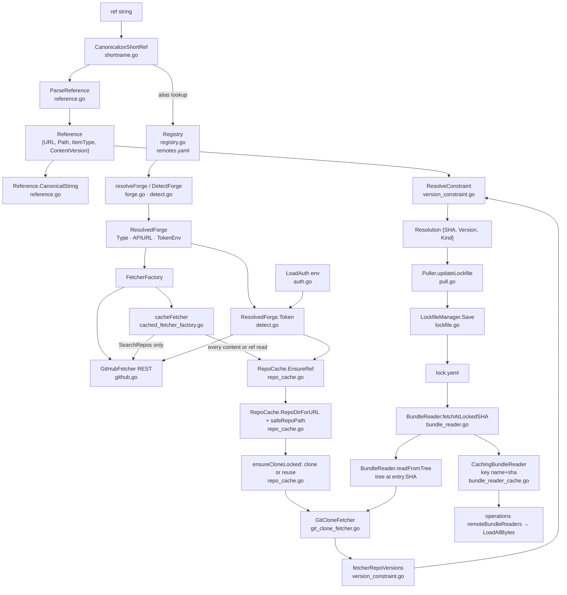

# internal/adapters/remote

`internal/adapters/remote` is the addressing, acquisition and pinning substrate for third-party
content. It owns the reference grammar (how a bundle identity is spelled, parsed and
canonicalized), the registry of known remote addresses, the on-disk git clone cache, the
selector→commit resolution rules, the `lock.yaml` pin record, and the forge adapters that
read bytes and write publications. Its contract is: **every byte of third-party content an
agent ever sees is fetched at a commit SHA that the lockfile pinned**, and every trust
decision upstream keys off a canonical string produced here. It performs no trust
evaluation of its own: tree verification and admission are injected seams
(`WithTreeVerifier`, `WithTreeFetcher`, `WithManifestVerifier`) that callers wire in.

## Responsibilities

- Reference grammar: parse, validate and canonicalize content identities
  (`reference.go`, `normalize.go`, `shortname.go`).
- Registry of remote addresses and forge bindings, persisted to `remotes.yaml`
  (`registry.go`).
- Forge classification and adapter selection: URL → `ForgeType` → `Fetcher`
  (`detect.go`, `forge.go`, `fetcher.go`).
- Fetch implementations: GitHub REST (`github.go`), local go-git clone
  (`git_clone_fetcher.go`), clone-cache router (`cached_fetcher_factory.go`), test double
  (`mock_fetcher.go`).
- The clone cache: URL → local clone directory, clone/fetch, sparse worktrees, token
  injection (`repo_cache.go`, `worktree.go`).
- Version-constraint resolution: selector expression → concrete commit
  (`version_constraint.go`).
- The lockfile: load, atomic write, entry CRUD (`lockfile.go`, `lockfile_store.go`,
  `types.go`).
- Serving a bundle's manifest out of its tree at the pinned SHA
  (`bundle_reader.go`, `bundle_reader_cache.go`, `fetch_ref.go`).
- Pull (record a pin) and publish (push a bundle tree to a forge as one commit)
  (`pull.go`, `publish.go`, `git_publisher.go`).
- Publisher-manifest retraction lookup (`retract.go`) and manifest search
  (`search.go`).

## Non-responsibilities

- Signature verification and publisher trust — `internal/core/trust` and
  `internal/adapters/signing`; see [trust.md](./trust.md).
- Trust-state evaluation and exposure gating (`EffectiveTrust`, retraction withholding),
  tree verification of every pinned bundle, lock rebuild/upgrade orchestration, and the
  `deps pull`/`sync` command flows — `internal/adapters/operations`; see
  [operations.md](./operations.md).
- Bundle parsing, item loading and skill materialization — `internal/core/bundles`; see
  [bundles.md](./bundles.md).
- Materializing pulled content onto disk: a pull records a pin only.

## Data flow

```mermaid
flowchart TD
    REF["ref string"] --> CSR["CanonicalizeShortRef<br/>shortname.go"]
    CSR --> PR["ParseReference<br/>reference.go"]
    PR --> REFV["Reference<br/>{URL, Path, ItemType, ContentVersion}"]
    REFV --> CS["Reference.CanonicalString<br/>reference.go"]

    CSR -->|alias lookup| REG["Registry<br/>registry.go<br/>remotes.yaml"]
    REG --> FORGE["resolveForge / DetectForge<br/>forge.go · detect.go"]
    FORGE --> RFG["ResolvedForge<br/>Type · APIURL · TokenEnv"]
    RFG --> TOK["ResolvedForge.Token<br/>detect.go"]
    AUTH["LoadAuth env<br/>auth.go"] --> TOK

    RFG --> FF["FetcherFactory"]
    FF --> CFAC["cacheFetcher<br/>cached_fetcher_factory.go"]
    FF --> GHF["GitHubFetcher REST<br/>github.go"]
    CFAC -->|"every content or ref read"| RCACHE["RepoCache.EnsureRef<br/>repo_cache.go"]
    CFAC -->|"SearchRepos only"| GHF
    TOK --> RCACHE
    TOK --> GHF

    RCACHE --> DIR["RepoCache.RepoDirForURL + safeRepoPath<br/>repo_cache.go"]
    DIR --> CLONE["ensureCloneLocked: clone or reuse<br/>repo_cache.go"]
    CLONE --> GCF["GitCloneFetcher<br/>git_clone_fetcher.go"]

    REFV --> RC["ResolveConstraint<br/>version_constraint.go"]
    GCF --> FRV["fetcherRepoVersions<br/>version_constraint.go"]
    FRV --> RC
    RC --> RES["Resolution {SHA, Version, Kind}"]

    RES --> UL["Puller.updateLockfile<br/>pull.go"]
    UL --> LM["LockfileManager.Save<br/>lockfile.go"]
    LM --> LOCK["lock.yaml"]

    LOCK --> BR["BundleReader.fetchAtLockedSHA<br/>bundle_reader.go"]
    BR --> FRT["BundleReader.readFromTree<br/>tree at entry.SHA"]
    FRT --> GCF
    BR --> CBR["CachingBundleReader<br/>key name+sha<br/>bundle_reader_cache.go"]
    CBR --> CONS["operations remoteBundleReaders → LoadAllBytes"]
```

## Key types

| Type | File | What it carries |
|---|---|---|
| `Reference` | `internal/adapters/remote/types.go` | Parsed content identity: `URL`, `Path`, `ItemType`, `ContentVersion`, `IsLocal`, `IsCompanion`. Methods live in `reference.go`. |
| `ItemType` | `internal/adapters/remote/types.go` | Item-kind enum; `ItemType.DirName` is the single home of the on-disk `bundles/` convention. |
| `LockEntry` | `internal/adapters/remote/types.go` | One pin: `SHA`, `URL`, `RequestedVersion`, `Version`, `Kind`, `FetchedAt`, `Pinned`, and the recorded retraction verdict. |
| `Lockfile` | `internal/adapters/remote/types.go` | `Version`, `LockedAt`, `Bundles map[...]LockEntry` — bundles only. |
| `Manifest` / `ManifestEntry` | `internal/adapters/remote/types.go` | Publisher-side manifest. |
| `Remote` | `internal/adapters/remote/types.go` | A configured remote: `Name`, `URL`, `Forge`. Carries a load-bearing comment that a trust flag must never return to this struct. |
| `AuthConfig` | `internal/adapters/remote/types.go` | Forge tokens (GitHub only). |
| `Registry` | `internal/adapters/remote/registry.go` | Persisted remotes + forge bindings + default remote, behind `sync.RWMutex`, over `afero.Fs`. |
| `ForgeConfig` / `ResolvedForge` | `internal/adapters/remote/forge.go` | Labelled forge config (`Type` + free-form `Body`) and its resolution to `{Type, BaseURL, APIURL, TokenEnv}`. |
| `Fetcher` (interface) | `internal/adapters/remote/fetcher.go` | Forge port: `Forge`, `FetchFile`, `ListDir`, `ResolveRef`, `SearchRepos`, `ValidateRepo`, `GetDefaultBranch`. Optional capabilities are probed by type assertion: `tagLister`, `fetcherTagResolver`. |
| `cacheFetcher` | `internal/adapters/remote/cached_fetcher_factory.go` | The production `Fetcher`: routes all content/ref reads to a local clone; uses the forge API only for `SearchRepos`. |
| `GitCloneFetcher` | `internal/adapters/remote/git_clone_fetcher.go` | `Fetcher` over an already-cloned go-git repository; zero network. |
| `GitHubFetcher` / `GitHubPublisher` | `internal/adapters/remote/github.go` | REST read adapter (with a 401→unauthenticated retry) and the REST write adapter. |
| `GitPublisher` | `internal/adapters/remote/git_publisher.go` | Write adapter over a plain git clone and push, for forges with no REST publisher. |
| `GitHubClient` | `internal/adapters/remote/github_client.go` | Narrowed go-github surface so fetcher/publisher are mockable without HTTP. |
| `RepoCache` | `internal/adapters/remote/repo_cache.go` | Owns URL→clone-dir mapping, clone/fetch, sparse worktrees and token injection. |
| `BundleByteSource` (interface) | `internal/adapters/remote/bundle_reader.go` | Read port: `ReadBundleBytes`/`LockEntryFor`/`ListBundleNames`/`HasBundle`. |
| `BundleReader` | `internal/adapters/remote/bundle_reader.go` | Serves a bundle's manifest out of its tree at the pinned SHA, through an injected `TreeFetchFunc`. |
| `CachingBundleReader` / `bundleCacheKey` | `internal/adapters/remote/bundle_reader_cache.go` | Read-through memoizing decorator keyed `{name, sha}`. |
| `LockfileManager` / `LockfileStore` | `internal/adapters/remote/lockfile.go`, `lockfile_store.go` | Filesystem adapter (afero + atomic replace) and the storage port `operations` depends on. |
| `Puller` / `PullOptions` / `PullResult` | `internal/adapters/remote/pull.go` | Fetch→check→pin orchestrator and its DTOs. |
| `PublishManager` / `Publisher` / `PublishOptions` | `internal/adapters/remote/publish.go` | Forge write orchestrator, the write port, and its request DTO. |
| `SelectorKind` / `Resolution` | `internal/adapters/remote/version_constraint.go` | Selector classification (`sha`, `tag`, `version`, `branch` — persisted in `lock.yaml`, so a wire contract) and the `{SHA, Version, Kind}` outcome. |
| `RepoVersions` (interface) / `fetcherRepoVersions` | `internal/adapters/remote/version_constraint.go` | The version-space seam and its `Fetcher` adapter. |
| `SearchQuery` / `TagQuery` | `internal/adapters/remote/types.go` | Parsed manifest search filter. |

## Key functions

### Reference & normalize

| Signature | File | Contract |
|---|---|---|
| `ParseReference(ref) (*Reference, error)` | `internal/adapters/remote/reference.go` | Dispatch on source token/scheme: `ctxloom:local@…`, `ctxloom:companion@…`, `http(s)://`, `git@host:`, `file://`. |
| `ResolveRef(ref, sourceURL, kind) (*Reference, error)` | `internal/adapters/remote/reference.go` | Canonical ref passes through; otherwise expand as a short same-repo ref against `sourceURL`. |
| `ResolveRefString(ref, sourceURL, hash, kind) string` | `internal/adapters/remote/reference.go` | Same, string form; documented fault-tolerant — on any failure returns `ref` unchanged. |
| `parseTypePathVersion(...)` | `internal/adapters/remote/reference.go` | `type/path[@version]` plus selector handling; rejects empty path and unknown item type. |
| `validateItemPath(p) error` | `internal/adapters/remote/reference.go` | Traversal guard: rejects absolute paths and `.`/`..` segments. Applied to the **item path only**, not to the repo URL. |
| `(*Reference).CanonicalString() string` | `internal/adapters/remote/reference.go` | The canonical identity string — the value all upstream trust/dedup/exclusion decisions key on. |
| `(*Reference).BuildFilePath(kind) string` | `internal/adapters/remote/reference.go` | Repo-relative path under `paths.RepoContentPrefix` (`path.Join`). |
| `(*Reference).LocalTreePath` / `LocalWorktreePath` | `internal/adapters/remote/reference.go` | Host-filesystem paths for a materialized tree and its sparse worktree. |
| `(*Reference).LocalRemoteName() string` | `internal/adapters/remote/reference.go` | FS-safe name derived from the URL. |
| `sanitizePath(s) string` | `internal/adapters/remote/reference.go` | Replaces `://`, `:` and `@` with `/`. Does not strip `..`. |
| `CanonicalKey(ref) (string, bool)` | `internal/adapters/remote/normalize.go` | Version-less canonical form, ok-bool. |
| `CanonicalBundleRef(name) (string, error)` | `internal/adapters/remote/normalize.go` | Canonical form of a bundle name. |
| `SplitFragmentVersion` / `SplitPromptVersion` | `internal/adapters/remote/normalize.go` | Split a canonical bundle ref from its `@version`, per selector family. |
| `CanonicalProfileKey` / `SplitBundleProfileRef` | `internal/adapters/remote/normalize.go` | Version-less `<bundle>#profiles/<name>` key, and its split. |
| `SplitRetiredProfileRef` | `internal/adapters/remote/normalize.go` | Recognizes the retired `@profiles/` grammar so it can be refused with a remedy. |
| `IsFetchAddressRef(ref) bool` | `internal/adapters/remote/normalize.go` | Fetch-address check (http(s), file, scp-like); false for the canonical `ctxloom+` spelling. |
| `CanonicalizeShortRef(ref, aliasToURL, localExists) string` | `internal/adapters/remote/shortname.go` | `<alias>/<path>` → `<url>@bundles/<path>` preserving the selector verbatim; local file wins over a same-spelled alias; unknown alias returns the input unchanged. |
| `CanonicalizeProfileShortRef(ref, aliasToURL) string` | `internal/adapters/remote/shortname.go` | Guards on `#profiles/` then delegates; selector-less names stay local. |

### Resolve (forge, registry, version)

| Signature | File | Contract |
|---|---|---|
| `DetectForge(url) (ForgeType, string, error)` | `internal/adapters/remote/detect.go` | URL → forge type + base URL; the server is compared as `refuri.CanonicalAuthority` spells it. Errors on an unparseable URL or a host refuri refuses. |
| `ParseRepoURL(raw) (RepoURL, error)` | `internal/adapters/remote/repourl.go` | `refuri.ParseRepoURL` under this package's name: the repo-URL grammar lives in `internal/shared/refuri`, below both this package and `trust`. |
| `NewFetcher(url, auth) (Fetcher, error)` | `internal/adapters/remote/detect.go` | `DetectForge` → GitHub adapter, explicit error for the generic adapter. |
| `NewForgeFetcher(url, rf, auth) (Fetcher, error)` | `internal/adapters/remote/detect.go` | Build a fetcher against a `ResolvedForge`'s API URL. |
| `ResolvedForge.Token(auth) string` | `internal/adapters/remote/detect.go` | `token_env` env lookup, else `auth.GitHub`. Reads `os.Getenv` directly. |
| `resolveForge(...)` / `resolvedFromConfig(...)` | `internal/adapters/remote/forge.go` | Forge resolution (explicit label → server match on host and port, `forgeByServer` → detect → default) and `ForgeConfig` → `ResolvedForge`. |
| `MergeForges(user) map[string]ForgeConfig` | `internal/adapters/remote/forge.go` | Overlay user forges on `builtinForges`. |
| `validateForgeConfig(c) error` | `internal/adapters/remote/forge.go` | Rejects an unknown adapter `type`. Body keys are not validated. |
| `ResolveConstraint(ctx, expr, rv) (Resolution, error)` | `internal/adapters/remote/version_constraint.go` | The single home of selector→commit policy: classify then dispatch to `resolveBranch`, `resolveSemver`, `resolveTagSHA` or `resolveNameTagFirst`. |
| `LockEntry.SelectorKind() SelectorKind` | `internal/adapters/remote/version_constraint.go` | Recorded `Kind`, else derived from `RequestedVersion`'s shape, else `branch`. |
| `SelectorKind.IsPin() bool` | `internal/adapters/remote/version_constraint.go` | `sha` or `tag` — the "never goes outdated" concept. |
| `LooksLikeCommit(s) bool` | `internal/adapters/remote/version_constraint.go` | Shape test for an already-concrete SHA (skip the network). |
| `Registry.Get/List/Has/Add/Remove/Update` | `internal/adapters/remote/registry.go` | Remote CRUD under `mu`; `Get` returns a defensive copy; mutators roll back the in-memory state when `save()` fails. |
| `Registry.GetOrCreateByURL(url) (*Remote, error)` | `internal/adapters/remote/registry.go` | Find-or-auto-register a remote by URL; called on every pull (`Puller.resolveRemoteTarget`). |
| `Registry.SetForge / Forges / GetDefault / SetDefault / ResolveForgeForURL` | `internal/adapters/remote/registry.go` | Forge binding and default-remote accessors. |

### Fetch

| Signature | File | Contract |
|---|---|---|
| `NewCachedFetcherFactory(cache) FetcherFactory` | `internal/adapters/remote/cached_fetcher_factory.go` | Production factory: returns a closure building a `cacheFetcher` for a URL. |
| `cacheFetcher.localFetcher(ctx, ref)` | `internal/adapters/remote/cached_fetcher_factory.go` | `RepoCache.EnsureRef` then `git.PlainOpen`, wrapped as a `GitCloneFetcher`. |
| `cacheFetcher.FetchFile/ListDir/ResolveRef/ResolveTag/ListTags` | `internal/adapters/remote/cached_fetcher_factory.go` | Delegate to the clone fetcher; no forge API traffic. |
| `cacheFetcher.SearchRepos(...)` | `internal/adapters/remote/cached_fetcher_factory.go` | The only API-backed method; lazily builds a GitHub fetcher, returns `nil, nil` for non-GitHub forges. |
| `GitCloneFetcher.FetchFile/ListDir` | `internal/adapters/remote/git_clone_fetcher.go` | Read a blob / list a tree at a resolved ref; not-found wraps `errs.ErrRemoteContentNotFound`. |
| `GitCloneFetcher.ResolveRef` | `internal/adapters/remote/git_clone_fetcher.go` | `refs/remotes/origin/<ref>` → `refs/tags/<ref>` → bare hash. |
| `GitCloneFetcher.ResolveTag` | `internal/adapters/remote/git_clone_fetcher.go` | Tag namespace only, dereferencing annotated tags — prevents a branch shadowing a same-named tag. |
| `GitCloneFetcher.treeAtRef` | `internal/adapters/remote/git_clone_fetcher.go` | ref → commit tree; **an empty ref means the default-branch tip**. |
| `NewGitHubFetcher(token, opts...)` | `internal/adapters/remote/github.go` | Builds the REST client with `tokenTransport` (keeps the token out of argv) and an unauthenticated fallback client for 401 retry. |
| `GitHubFetcher.FetchFile/ListDir/ResolveRef` | `internal/adapters/remote/github.go` | REST reads; ref resolution is commit → branch → tag (`resolveRefWithClient`). |
| `GitHubFetcher.ValidateRepo/GetDefaultBranch` | `internal/adapters/remote/github.go` | Does `.ctxloom/content/` exist; repo metadata default branch. |
| `FetchRef(ctx, factory, auth, ref, sha, treeFetch) (RefContent, error)` | `internal/adapters/remote/fetch_ref.go` | The low-level pinned read shared by bundle/profile readers and the dependency-graph walker: a hash-pinned canonical ref needs no lockfile and no registry. |
| `CheckRetracted(ctx, fetcher, owner, repo, ref, pinned, verify) (RetractionVerdict, string, error)` | `internal/adapters/remote/retract.go` | Read and verify the publisher manifest; the verdict distinguishes clean, retracted, rollback below the recorded signed version, unpublished and unknown. |

### Cache

| Signature | File | Contract |
|---|---|---|
| `NewRepoCache(baseDir, auth, opts...)` | `internal/adapters/remote/repo_cache.go` | Construct the clone cache; `WithForgeResolver` supplies per-URL forge resolution for token selection. |
| `RepoCache.EnsureRepo/EnsureRef/EnsureFullRepo` | `internal/adapters/remote/repo_cache.go` | All three delegate to `ensureClone`; the clone is always a full clone. |
| `RepoCache.EnsureSparseWorktree(ctx, url, sha, subpath, dir)` | `internal/adapters/remote/repo_cache.go` | A sparse worktree of one subpath at a pinned SHA, off the shared clone. |
| `RepoCache.UpdateRepo(ctx, url, forge)` | `internal/adapters/remote/repo_cache.go` | Lock, clone if absent, else `git fetch --all --tags --prune --force`. |
| `ensureClone` / `ensureCloneLocked` | `internal/adapters/remote/repo_cache.go` | Compute the directory, take the per-directory lock, return early if a `.git` directory exists, else `os.RemoveAll` + clone. |
| `RepoCache.RepoDirForURL(url) (string, error)` | `internal/adapters/remote/repo_cache.go` | The cache key: `<baseDir>/<host>/<path>`. |
| `RepoCache.safeRepoPath(parts...) (string, error)` | `internal/adapters/remote/repo_cache.go` | Joins under `baseDir` and re-verifies containment. |
| `normalizeCloneURL(url) string` | `internal/adapters/remote/repo_cache.go` | Expands `owner/repo` shorthand to a GitHub URL, then trims `.git`. |
| `RepoCache.authEnv` / `RepoCache.cloneToken` | `internal/adapters/remote/repo_cache.go` | Build `GIT_CONFIG_*` extraheader auth for GitHub HTTPS (git ≥ 2.31) and pick the token — via the forge resolver if set, else ambient `AuthConfig`. |
| `runGit(...)` | `internal/adapters/remote/repo_cache.go` | Execute git non-interactively, capture stderr, classify not-found / context-cancel / git failure. |
| `lockCloneDir(dir) func()` | `internal/adapters/remote/repo_cache.go` | Per-directory mutex from a process-global `sync.Map`; guards the `RemoveAll`+clone window **within one process only**. |
| `NewCachingBundleReader(inner)` | `internal/adapters/remote/bundle_reader_cache.go` | Read-through memoizing decorator. |
| `CachingBundleReader.ReadBundleBytes` | `internal/adapters/remote/bundle_reader_cache.go` | Cache hit under `RLock`, miss → inner → store under `Lock` (`readThrough`). Failures are never cached. |

### Lockfile

| Signature | File | Contract |
|---|---|---|
| `NewLockfileManager(baseDir, opts...)` | `internal/adapters/remote/lockfile.go` | Manager over `<baseDir>/lock.yaml`; `WithLockfileFS` is the afero test seam. |
| `LockfileManager.Load() (*Lockfile, error)` | `internal/adapters/remote/lockfile.go` | Read + version gate (`upgradeLockfile`) + parse + initialise maps. A missing file yields an empty lockfile with no error; a present but empty one, a retired form and a newer `schema_version` are refused. **Reading never writes** — an older spelling is migrated in memory and persisted only by the next `Save` or under `--write-upgrades`. |
| `LockfileManager.Save(*Lockfile, ...SaveOption) error` | `internal/adapters/remote/lockfile.go` | **Reads back what is on disk and can refuse** (`guardDestructiveWrite`): `ErrLockfileWouldErase` when an empty lockfile would replace a populated one, and `ErrLockfileUnreadable` on **any** write over an unparseable lockfile, naming the recovery. Otherwise stamps `LockedAt = now().UTC()` and calls `write`. |
| `remote.AllowEmpty() SaveOption` | `internal/adapters/remote/lockfile.go` | The opt-in for a caller that emptied the lockfile **deliberately**. Relaxes only the first refusal. The unreadable refusal has **no** override on purpose: holds and retractions that cannot be read cannot be carried forward, so every write over a corrupt file destroys unaccountable state. |
| `LockfileManager.write(*Lockfile) error` | `internal/adapters/remote/lockfile.go` | Marshal, `MkdirAll`, `safefs.WriteFile` — the only code path that touches `lock.yaml` bytes. |
| `LockfileManager.Path() string` | `internal/adapters/remote/lockfile.go` | `<baseDir>/lock.yaml`; the filename is fixed. |
| `Lockfile.AddEntry/GetEntry/RemoveEntry` | `internal/adapters/remote/lockfile.go` | In-memory entry CRUD, gated on `ItemTypeBundle` — a non-bundle type is a silent no-op. |
| `Lockfile.AllEntries/IsEmpty/Count` | `internal/adapters/remote/lockfile.go` | Enumerate entries and test emptiness. |
| `NewBundleReader(registry, factory, auth, lock, opts...)` | `internal/adapters/remote/bundle_reader.go` | Bundle byte source bound to one loaded `*Lockfile`; `WithReaderTreeFetcher` wires the tree walker. |
| `BundleReader.ListBundleNames/HasBundle/LockEntryFor` | `internal/adapters/remote/bundle_reader.go` | Pure `*Lockfile` accessors; `ListBundleNames` returns sorted keys. |
| `BundleReader.fetchAtLockedSHA(...)` | `internal/adapters/remote/bundle_reader.go` | key → `ParseReference` → repo URL → fetcher → `BuildFilePath` → `readFromTree` at `entry.SHA`. |
| `LoadAllBytes(ctx, src)` | `internal/adapters/remote/bundle_reader.go` | Read every bundle a source knows, partitioning into loaded and per-item failures; a nil source yields empty results and no error. |
| `Puller.updateLockfile(...)` | `internal/adapters/remote/pull.go` | Build the `LockEntry` (carrying `Pinned` holds and the retraction verdict forward) and `Save`; reports whether a pin already existed. |
| `Puller.RecordRetraction(kind, ref, retracted, reason, checkedAt)` | `internal/adapters/remote/pull.go` | Persist the retraction verdict onto an existing entry; no-op when no entry exists. |

### Pull, publish, retract

| Signature | File | Contract |
|---|---|---|
| `NewPuller(registry, auth, opts...)` | `internal/adapters/remote/pull.go` | Options: `WithLockfileManager`, `WithFetcherFactory`, `WithTreeFetcher`, `WithTreeVerifier`, `WithTreeInstaller`, `WithManifestVerifier`. |
| `Puller.Pull(ctx, ref, opts) (*PullResult, error)` | `internal/adapters/remote/pull.go` | Orchestrate `fetchForPull` → `installPulledItem`. |
| `Puller.fetchForPull(...)` | `internal/adapters/remote/pull.go` | resolve target → retraction check → constraint→SHA → fetch and admit the tree. |
| `Puller.resolveRemoteTarget(...)` | `internal/adapters/remote/pull.go` | ref → repo URL, registered remote (auto-registering), lockfile key. |
| `Puller.confirmRetraction(...)` | `internal/adapters/remote/pull.go` | Warn and prompt (default No, `promptConfirmation`) when the requested version is retracted; `opts.Force` skips the prompt. |
| `resolveContentSHA(...)` | `internal/adapters/remote/pull.go` | Constraint expression → concrete SHA via `ResolveConstraint`. |
| `Puller.installPulledItem(...)` | `internal/adapters/remote/pull.go` | Write the lockfile entry — the only on-disk record of the pull. |
| `Puller.CheckRetraction(ctx, ref, kind)` | `internal/adapters/remote/pull.go` | Live retraction re-check with no pin write; used by `operations` sync. |
| `NewPublishManager(registry, auth, opts...)` | `internal/adapters/remote/publish.go` | Options: `WithPublisherFactory`, `WithPublishFetcherFactory`. |
| `PublishManager.PublishTree(ctx, files, remoteName, opts) (*PublishResult, error)` | `internal/adapters/remote/publish.go` | Publish a bundle tree the caller already read, directly or via a pull request (`publishTreeViaPR`). This package does not decide what belongs to a bundle. |
| `Publisher.CreateOrUpdateFiles(...)` | `internal/adapters/remote/publish.go` | Every file of a tree lands as **one** commit, so a partial publish is impossible rather than merely unlikely. |
| `NewPublisher(url, auth) (Publisher, error)` | `internal/adapters/remote/publish.go` | Forge detection → publisher adapter. |

### Search & auth

| Signature | File | Contract |
|---|---|---|
| `ParseSearchQuery(q) SearchQuery` | `internal/adapters/remote/search.go` | Regex-extract `tag:`/`author:`/`version:` clauses; the remainder is free text. Never errors. |
| `MatchesQuery(entry, q) bool` | `internal/adapters/remote/search.go` | AND of the text, author, version and tag predicates; an empty predicate is skipped. |
| `matchTags(...)` | `internal/adapters/remote/search.go` | Case-insensitive AND/OR/NOT over an entry's tag set. |
| `LoadAuth(configPath) AuthConfig` | `internal/adapters/remote/auth.go` | Reads `GITHUB_TOKEN` then `GH_TOKEN`. Environment only. |

## Invariants

1. **The lockfile is authoritative for the pin, not for the content.** A `LockEntry`
   records the pin, its selector and the retraction verdict, and nothing else. Bundle
   bytes are never stored in it; they are re-read from the clone cache at `entry.SHA` on
   every read (`BundleReader.fetchAtLockedSHA`).
2. **Only bundles are locked.** `Lockfile.Bundles` is the sole entry map and
   `Lockfile.AddEntry`/`GetEntry`/`RemoveEntry` silently ignore any `ItemType` other than
   `ItemTypeBundle`.
3. **`LockfileManager.write` is the only code path that writes `lock.yaml` bytes**,
   always via `safefs.WriteFile`, and `Save` is its only caller; `Load` writes only
   through `schemaver.WriteBack`, and only under `--write-upgrades`. `Save` is a guard,
   not just a writer: it reads the current file back and refuses an empty-over-populated
   write, any write over a corrupt one, and any write over a lockfile declaring a newer
   `schema_version`. The guard is security-relevant: `deps upgrade` clears retraction
   state, so a wiped lockfile would silently **un-retract** withdrawn content. Within
   this package, `Save` is called by `Puller.updateLockfile` and
   `Puller.RecordRetraction`; outside it, the writer is `internal/adapters/operations`
   through the `LockfileStore` port.
4. **`Save` owns the `LockedAt` timestamp.** Every save stamps `LockedAt = time.Now().UTC()`;
   `write` never modifies it.
5. **The identity digest is a git commit SHA.** `Resolution.SHA` is the commit a
   selector resolved to; it changes only when the constraint is re-resolved (`upgrade`),
   never on a relock that leaves `RequestedVersion` unchanged. Content integrity is the
   bundle tree's signed checksum manifest, verified by the injected tree verifier, not
   by anything in this package.
6. **Bundle-byte cache key = `{name, sha}`** (`bundleCacheKey`). Including the SHA means
   a re-pin invalidates automatically. Failed reads are never cached
   (`CachingBundleReader.readThrough`).
7. **Repo-cache key = `<baseDir>/<host>/<path>` derived from the repo URL**
   (`RepoCache.RepoDirForURL`), containment-checked by `RepoCache.safeRepoPath`. The key
   does not include a ref, a SHA or a forge: **one clone directory per repo URL,
   containing all refs.**
8. **A cache directory is reused iff `<dir>/.git` exists and is a directory**
   (`ensureCloneLocked`); otherwise the directory is `os.RemoveAll`'d and re-cloned. The
   `RemoveAll`+clone window is guarded by `lockCloneDir`'s process-global map of
   per-directory mutexes, which does not serialize across processes.
9. **A version constraint may resolve to: a branch tip, the highest semver tag satisfying
   a range, an exact tag, or a bare commit SHA** — `SelectorBranch`, `SelectorVersion`,
   `SelectorTag`, `SelectorSHA`, dispatched by `ResolveConstraint`. The kind strings are
   persisted in `lock.yaml` and are therefore a wire contract. `SelectorKind.IsPin` is
   true only for `sha` and `tag`: a pin never re-resolves; a `version` re-resolves
   within its range; a `branch` re-resolves to its tip.
10. **Tag resolution is tag-namespace-only.** `ResolveTag` (on `GitCloneFetcher` and
    `GitHubFetcher`), probed through the optional `fetcherTagResolver` capability, reads
    `refs/tags/*` exclusively so a branch of the same name cannot shadow a tag and turn
    a pin into tracking.
11. **The resolved SHA always satisfies the selector that requested it**
    (`ResolveConstraint`) — a lockfile entry cannot contradict the profile that asked
    for it.
12. **Reads are pinned, but the pin is a parameter, not an enforced precondition.** Every
    content read takes an explicit ref/SHA: `FetchRef(…, sha, …)` and
    `Fetcher.FetchFile(…, ref)`. An **empty** ref means "default-branch tip" on the clone
    path (`GitCloneFetcher.treeAtRef`).
13. **A pull records a pin and nothing else.** For bundles the lockfile is the only
    on-disk record of the pull.
14. **Retraction is learned only from the publisher's signed manifest, never derived
    locally** (`CheckRetracted`), and the verdict is carried forward across relocks
    alongside `Pinned`.
15. **A publish is one commit.** `Publisher.CreateOrUpdateFiles` lands every file of the
    tree together, so a consumer never sees a tree whose checksum manifest covers files
    that never arrived.
16. **`validateItemPath` guards the item path only.** The repo-URL portion of a
    reference is not traversal-validated at parse time.
17. **The registry file is written atomically** (`Registry.save` through
    `safefs.WriteFile`), and every registry mutator rolls back its in-memory change when
    `save` fails.
18. **`Registry.load` takes no lock**; it is safe only because `NewRegistry` calls it
    before the value escapes.
19. **All production content and ref reads go through the local clone, not the forge
    API.** `cacheFetcher` routes `FetchFile`/`ListDir`/`ResolveRef`/`ResolveTag`/
    `ListTags`/`ValidateRepo`/`GetDefaultBranch` to a `GitCloneFetcher` over the clone
    cache; the GitHub REST adapter is reached only for `cacheFetcher.SearchRepos` and for
    publishing.
20. **Tokens never appear in argv.** The REST path uses an `Authorization: Bearer` round
    tripper (`tokenTransport`) and the git path passes credentials via `GIT_CONFIG_*`
    extraheader environment variables (`RepoCache.authEnv`).

## Boundaries

**Callers (inbound).**

- `internal/adapters/operations` — owns pull/sync/lock/upgrade/publish command flows,
  constructs `Puller`, `PublishManager`, `RepoCache` and `LockfileStore`, reads every
  pinned bundle through `remoteBundleReaders` (`LoadAllBytes` over a
  `CachingBundleReader`) and verifies each tree, and is the only other writer of
  `lock.yaml`.
- `internal/adapters/configload`, `internal/adapters/content/remotetree`,
  `internal/core/bundles`, `internal/core/profiles`,
  `internal/adapters/operations/managedhooks`, `internal/adapters/cli` — consume the
  reference grammar (`CanonicalBundleRef`, `CanonicalizeShortRef`, `ParseReference`)
  and registry/lockfile reads.

**Dependencies (outbound).** `internal/shared/*` leaf packages, `internal/core/paths`,
`internal/core/trust` (for the `BundleKey` type), and the `internal/adapters/git`
adapter. External: `go-git`, `go-github`, `afero`, `yaml.v3`, and the system `git`
binary (git ≥ 2.31 for `GIT_CONFIG_*`). `go list -deps` on the package is the authority.

## Where documented and real behavior diverge

- `RepoCache.EnsureRef` accepts a `ref` argument that it never uses; the clone is always a
  full clone.
- `GitHubFetcher.token`'s comment says it is "stored token for retry logic"; the retry
  path (`retryRefWithFallback`) uses the unauthenticated fallback client instead.
- `TagQuery` carries one `Negated` flag for a whole tag list, so it cannot represent
  per-term negation.
