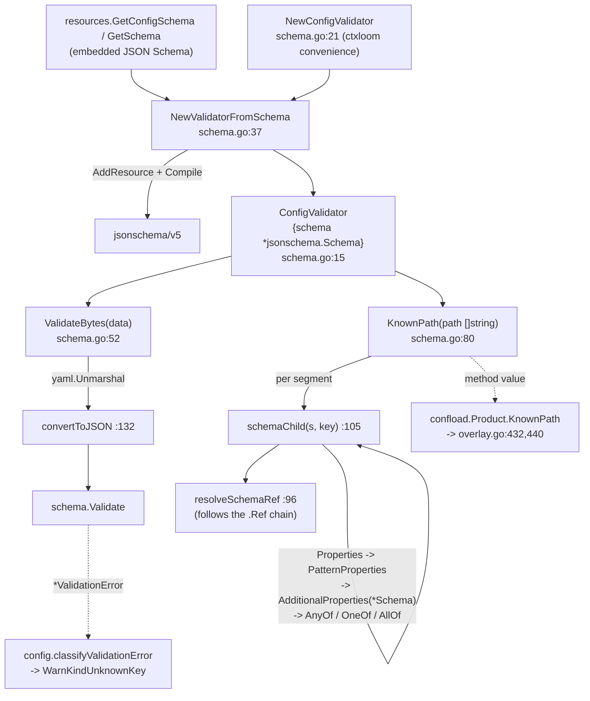

# internal/schema and internal/schemagen

Two packages on opposite ends of the same contract. **`internal/schema`** compiles a JSON
Schema once and exposes two services over it: validate a YAML document (`ValidateBytes`) and
answer whether a dotted path names a location the schema recognizes (`KnownPath`). It is the
shared schema engine for two products — ctxloom's `config.yaml` and taskloom's config.
**`internal/schemagen`** goes the other way: it reflects Go result structs into published
JSON Schema documents, under the `schemagen` build tag so neither it nor its reflection
dependency reaches the production binary.

## internal/schema

### Responsibilities

- Compile an embedded JSON Schema (`NewValidatorFromSchema`).
- Validate a YAML document against it (`ValidateBytes`).
- Answer path existence for override resolution (`KnownPath`).

### Non-responsibilities

- Turning validation errors into user-facing warnings — `internal/config/unknown_keys.go`
  (`classifyValidationError`); see [config.md](./config.md).
- Deciding what to do about an unknown key — `internal/shared/confload` and the strictness layer.
- Authoring the schemas — `resources/schema/input/*.json` (hand-maintained, three files).

### Data flow

### Key symbols

| Symbol | file:line | Contract |
|---|---|---|
| `ConfigValidator` | `internal/schema/schema.go:15` | Owns one compiled `*jsonschema.Schema`; both services hang off it. |
| `NewConfigValidator()` | `internal/schema/schema.go:21` | Loads ctxloom's embedded `schema/input/config-schema.json`. Callers: `cmd/validate/main.go:21`, `config/config.go:528,1158`. |
| `NewValidatorFromSchema(data)` | `internal/schema/schema.go:37` | Product-agnostic entry point. External caller: `internal/taskloom/config/config.go:243`. |
| `ValidateBytes(data)` | `internal/schema/schema.go:52` | YAML → `interface{}` → `convertToJSON` → `schema.Validate`. The YAML parse error is wrapped; the validation error is returned unwrapped so callers can `errors.As` it. Callers: `taskloom/config/config.go:323`, `config/config.go:1485`, `cmd/validate/main.go:35`. |
| `KnownPath(path []string) bool` | `internal/schema/schema.go:80` | True iff every segment resolves. Passed as a method value into `confload.Product` at `config/config.go:507` and `taskloom/config/config.go:230`. Nil receiver or empty path is false by design. |
| `resolveSchemaRef` | `internal/schema/schema.go:96` | Follows the `.Ref` pointer chain to the schema carrying the object keywords. |
| `schemaChild` | `internal/schema/schema.go:105` | The package's real algorithm: resolves one instance key against `Properties`, then `PatternProperties`, then `AdditionalProperties`, then the `AnyOf`/`OneOf`/`AllOf` branches. |

### Invariants

1. **`KnownPath` walks the *compiled* schema, not the raw JSON.** `$ref` is a pointer hop and
   `anyOf`/`oneOf`/`allOf` branches are searched explicitly (`schema.go:121-127`), so a
   branch-typed node resolves. Verified: `KnownPath{"llm","configs","big","model"}` is true,
   traversing `#/$defs/llmConfig`'s seven-branch `anyOf`.
2. **Validation is what makes unknown keys detectable.** The schemas declare
   `additionalProperties: false` at the root, so an unrecognized key surfaces as a
   `*jsonschema.ValidationError` that `config/unknown_keys.go` classifies into a warning.
3. **`KnownPath` is the override oracle**: it is how `confload` distinguishes a
   legitimate-but-unset key (created silently) from an unrecognized one (created with a warning).
4. **One compiled schema per validator, shared by both methods** — splitting the two services
   would force callers to compile twice.

### Where documented and real behavior diverge

- `convertToJSON` (`schema.go:132`) is documented as converting YAML-parsed data to
  JSON-compatible types; it is a no-op deep copy — yaml.v3 already yields
  `map[string]interface{}`, and both switch arms rebuild identical values.
- `internal/config/unknown_keys.go:191 knownKeysAt` re-implements path resolution over the *raw*
  `map[string]any`; an `anyOf` node is a `[]any` there, so the type assertion at
  `unknown_keys.go:211` fails and the walk returns nil. `schemaChild` already solves this.
- `ValidateBytes("")` fails loudly only because both embedded schemas declare a root
  `"type": "object"`. `NewValidatorFromSchema` is a public product-agnostic entry point; given a
  schema without a root type, an empty document validates clean. The package never checks
  `len(data) == 0`.
- `NewValidatorFromSchema`'s error text says "config schema" regardless of which product's schema
  failed to compile.
- `resolveSchemaRef` (`schema.go:96`) discards `$ref` siblings and has no iteration bound.
- `schemaChild`'s keyword coverage is not total: `Items`, `prefixItems`, boolean-valued
  `AdditionalProperties`, `If`/`Then`/`Else`, `DependentSchemas` and `UnevaluatedProperties` are
  not handled.
- Every caller of `NewConfigValidator` in the repo discards its error into a nil validator, and a
  nil validator disables schema validation for that load (`config/config.go:1158`).

## internal/schemagen

### Responsibilities

- Reflect a `reflect.Type` into a JSON Schema document, stamping `$schema`, `$id` and `title`.
- Write one `<name>-schema.json` per target into a directory.

### Key symbols

| Symbol | file:line | Contract |
|---|---|---|
| `Target` | `internal/schemagen/schemagen.go:29` | `{Type reflect.Type, Name string}`. An empty `Name` falls back to `kebab(Type.Name())`. |
| `Of(t, name)` | `internal/schemagen/schemagen.go:35` | Struct-literal constructor. Used only at `internal/cli/schematargets.go:18,19,20`; `internal/operations/schematargets.go:15` uses the literal form. |
| `Generate(dir, targets)` | `internal/schemagen/schemagen.go:43` | `MkdirAll`, sort, then per target: reflect via `jsonschema.ForType`, stamp, `MarshalIndent`, append a newline, `WriteFile 0o644`. Every one of the four failure modes is wrapped with context. Caller: `cmd/gen-schemas/main.go:33`. |
| `name` / `kebab` | `internal/schemagen/schemagen.go:76,85` | The name fallback and the CamelCase→kebab rule that keeps acronym runs intact (`MCPServer` → `mcp-server`). |

### Invariants

1. **Build-tagged `schemagen`** (`schemagen.go:1`); `doc.go` carries the package declaration for
   untagged builds so `go build ./...` still sees a valid package. Untagged dependency scans cannot
   see its three importers (`cmd/gen-schemas/main.go:16`,
   `internal/operations/schematargets.go`, `internal/cli/schematargets.go`).
2. **An unrepresentable type is a hard error, never a dropped field** (`schemagen.go:41-42,52-54`):
   a silently dropped field would be a lying contract.
3. **The target list is hand-maintained.** `operations.SchemaTargets()`
   (`internal/operations/schematargets.go:14`) returns ~62 `reflect.Type`s and
   `cli.SchemaTargets()` adds three; nothing checks completeness against the DTOs that actually
   exist.
4. **Output is generated, not committed.** `resources/schema/gen/` is gitignored
   (`.gitignore:87`) and embedded into the binary via `//go:embed all:schema`
   (`resources/embed.go:10`); only `resources/schema/input/`'s three hand-written files are tracked.
   `just gen-schemas` is a build dependency of `build`, `build-compressed`, `build-all-bins` and
   `release-snapshot`.

### Where documented and real behavior diverge

- `Generate(dir, nil)` creates the directory, iterates zero times and returns nil;
  `cmd/gen-schemas` then prints "wrote 0 schemas" and exits 0. Because the output tree is
  gitignored and nothing diffs it against a prior run, an empty target list produces a green
  build with an empty embedded schema set.
- `Generate` sorts the caller's `targets` slice in place; since it writes one file per target, the
  sort buys no output determinism.
- `name` returns `""` for an unnamed type, which would write `-schema.json`.
