# internal/signing

`internal/signing` is the ctxloom signature envelope: a thin sshsig sign/verify wrapper, the
exact byte framing a countersignature covers, the publisher-verification state machine
(unsigned / verified / tampered), and the JSON envelope a companion binary emits to carry a
bundle plus a detached signature over stdout. It is the bottom of the trust stack — it
answers "does this signature cover exactly these bytes, made by a key authorized for this
namespace", and nothing else. It decides no policy: the policy question is delegated to the
`TrustRoot` interface it declares at the consumer.

## Responsibilities

- sshsig primitive wrapper: `Sign`, `Verify` (`internal/signing/sign.go`).
- The countersignature preimage — the exact framing an approve/reject signature covers
  (`internal/signing/payload.go`).
- Publisher verification as a three-outcome state machine (`internal/signing/publisher.go`).
- Countersignature verification, including namespace separation (`internal/signing/countersign_verify.go`).
- The companion loadout JSON envelope (`internal/signing/loadout.go`).

## Non-responsibilities

- Which principals are authorized — `internal/signing/allowedsigners` (behind the `TrustRoot`
  interface) and `internal/config`'s trust-root union; see [config.md](./config.md).
- Where countersignatures are stored — `internal/signing/countersign` (`Store`).
- What an item's payload bytes *are* — `internal/operations.computeItemPayloadPair`; see
  [trust.md](./trust.md).
- The trust decision itself — `internal/operations.EffectiveTrust`.

## Data flow

```mermaid
flowchart TD
    subgraph frame["payload.go — the signed-bytes definition"]
        CH["CountersignHeader<br/>{Assertion, Kind, Ref, Form}"]
        CP["CountersignPayload(h, bytes)<br/>payload.go:146"]
        CH --> CP
        AP["ApproveCountersignPayload :175"] --> CP
        CR["ContentRejectCountersignPayload :192"] --> CP
        RR["RefRejectCountersignPayload :206"] --> CP
    end

    subgraph prim["sign.go — sshsig wrapper"]
        SIGN["Sign(payload, signer, ns)<br/>sign.go:29"]
        VER["Verify(payload, armored, pub, ns)<br/>sign.go:49"]
    end

    subgraph pub["publisher.go — publisher state machine"]
        TR(["TrustRoot iface<br/>TrustedForNamespace<br/>publisher.go:74"])
        VP["VerifyPublisher :110<br/>→ ('',nil) unsigned<br/>→ (principal,nil) verified<br/>→ ('',ErrSignatureTampered)"]
        CB["CoversBytes :60<br/>trust-free integrity"]
        TR --> VP
    end

    subgraph cs["countersign_verify.go"]
        NFA["namespaceForAssertion :12"]
        VCS["VerifyCountersignature :42<br/>→ (principal, ok)"]
        NFA --> VCS
    end

    CP --> VCS
    VER --> VCS
    VER --> VP
    VER --> CB

    OPS["operations.SignBundleFile<br/>countersign.Store.write"] --> SIGN
    CFG["config.verifyBundlePublisher<br/>bundles.PublisherSkillSignatureVerifier"] --> VP
    STORE["bundles.fsStore.invalidateStaleSignature<br/>operations.PushBundle / ExportBundle"] --> CB
    CSTORE["countersign.Store.Verified"] --> VCS
    COMP["config.ProbeCompanionLoadouts"] --> DEC["DecodeLoadoutEnvelope :97"]
    DEC --> VP
    TR -.impl.-> AS["allowedsigners.Store"]
```

## Key types

| Type | file:line | What it carries |
|---|---|---|
| `Assertion` | `internal/signing/payload.go:59` | `approve` \| `reject`; also selects the signing namespace via `namespaceForAssertion`. |
| `ItemKind` | `internal/signing/payload.go:72` | `fragments`, `skills` (LEGACY = command), `mcp`, `hooks`, `agentskills`. Deliberately duplicates `trust.ItemKind` to avoid importing `trust`. |
| `Form` | `internal/signing/payload.go:101` | `raw` \| `distilled` \| `exec`, or `""` for a ref-reject. Mirrors `bundles.ContentForm` by convention only. |
| `CountersignHeader` | `internal/signing/payload.go:115` | The closed field set bound into a countersignature's preimage: `Assertion`, `Kind`, `Ref`, `Form`. |
| `LoadoutEnvelope` | `internal/signing/loadout.go:23` | Companion `loadout --format json` output: `Contract` (identity-matched), `Bundle` (base64 of the exact YAML), `Signature` (armored, optional), `Signer` (**advisory only, never trusted**). |
| `TrustRoot` (interface) | `internal/signing/publisher.go:74` | One method — `TrustedForNamespace` — returning `allowedsigners.Decision`. Declared at the consumer so the namespace check is a mandatory argument, not a forgettable step. |
| `ErrSignatureTampered` | `internal/signing/publisher.go:41` | The one publisher outcome that is never benign; matched with `errors.Is` at `internal/config/config.go:1953`. |

## Key functions

| Signature | file:line | Contract |
|---|---|---|
| `Sign(payload, signer, ns) ([]byte, error)` | `internal/signing/sign.go:29` | sshsig-signs under a namespace; pins hash algorithm and armor format. Callers: `countersign/store.go:149`, `operations/sign.go:145`, `operations/skills.go:459`, `operations/bundles.go:743`. |
| `Verify(payload, armored, pub, ns) error` | `internal/signing/sign.go:49` | Unarmors, then verifies using the algorithm embedded in the blob (sshsig restricts it to sha256/sha512 at unarmor time). No external production callers — reached only via the three verifiers below. |
| `CountersignPayload(h, bytes) []byte` | `internal/signing/payload.go:146` | **The signed-bytes definition.** Emits a fixed LF-delimited ASCII frame followed by the payload. Not a canonicalization — the framing is the contract. |
| `ApproveCountersignPayload` / `ContentRejectCountersignPayload` / `RefRejectCountersignPayload` | `internal/signing/payload.go:175,192,206` | Trap-proofed wrappers naming which fields belong to which assertion shape. No production callers; `countersign.Store` calls `CountersignPayload` directly. |
| `namespaceForAssertion(a) string` | `internal/signing/countersign_verify.go:12` | Assertion → domain separator; `default: ""` is a deliberate fail-closed guard. |
| `VerifyCountersignature(...) (principal string, ok bool)` | `internal/signing/countersign_verify.go:42` | Empty/nil-root guard → unarmor → namespace → trust → re-derive frame → verify. **Trust is decided before the bytes are verified.** Six distinct failure modes all collapse to `("", false)` with no diagnostics. Caller: `countersign/store.go:223`. |
| `VerifyPublisher(payload, armoredSig, root, ns) (string, error)` | `internal/signing/publisher.go:110` | The three-outcome state machine: key from the blob, trust from the root, bytes checked only against an already-authorized key. Callers: `config/config.go:1993`, `bundles/skill_archive.go:702`, `loadout.go:114`. |
| `CoversBytes(payload, armoredSig, ns) error` | `internal/signing/publisher.go:60` | Trust-free "does this blob cover exactly these bytes". Callers: `bundles/store.go:105`, `operations/bundles.go:648`, `operations/bundle_transfer.go:85` — the stale-signature detectors. |
| `EncodeLoadoutEnvelope(bundleBytes, armoredSig, signer) ([]byte, error)` | `internal/signing/loadout.go:59` | Builds the companion JSON envelope; owns the contract string and the base64 discipline. Caller: `shared/companionloadout/cli.go:82`. |
| `DecodeLoadoutEnvelope(data, root, ns) ([]byte, string, error)` | `internal/signing/loadout.go:97` | Parse → exact contract match → base64 → `VerifyPublisher`. Never degrades a parse failure to "unsigned". Caller: `config/companions.go:344`. |

## Invariants

1. **`CountersignPayload` is the only definition of countersigned bytes.** Changing the frame
   invalidates every existing approval and rejection on disk.
2. **Trust precedes byte verification.** `VerifyCountersignature` resolves the principal against the
   `TrustRoot` *before* checking that the signature covers the payload, so an untrusted key never
   causes a verification attempt to succeed.
3. **The publisher outcome is a closed tri-state**: unsigned `("", nil)`, verified
   `(principal, nil)`, tampered `("", ErrSignatureTampered)` — and the principal always comes from
   the trust root, never from the artifact.
4. **Namespaces are mandatory.** Every `Sign`/`Verify` pair carries a namespace; approve and reject
   sign under different namespaces (`namespaceForAssertion`), so an approve signature can never be
   replayed as a reject or vice versa.
5. **`LoadoutEnvelope.Signer` is advisory.** `DecodeLoadoutEnvelope` never reads it; the verified
   principal returned to the caller comes from `VerifyPublisher`.
6. **`CoversBytes` answers integrity only, `VerifyPublisher` answers integrity plus authorization.**
   The stale-signature detectors deliberately use the former: a bundle whose bytes changed since
   signing must be refused regardless of who signed it.
7. **This package imports exactly one internal package** (`internal/signing/allowedsigners`, and
   only for `Decision` as the `TrustRoot` return type) and one crypto library
   (`github.com/hiddeco/sshsig@v0.2.0`).

## Boundaries

- **Depended on by:** `internal/bundles` (stale-signature invalidation, skill-archive install gate),
  `internal/config` (remote bundle publisher verification, companion loadout probe),
  `internal/operations` (`sign`, `push`, `export`, skill publishing, countersign records),
  `internal/cli`, `internal/shared/companionloadout`, `internal/signing/countersign`.
- **Depends on:** `internal/signing/allowedsigners` (type only), `hiddeco/sshsig`.

## Where documented and real behavior diverge

- `payload.go`'s doc claims every header field is drawn from a closed vocabulary except `Ref`.
  That IS now enforced at the store boundary: `CountersignHeader.Validate` refuses an assertion or
  an attestation form outside the closed set — loudly on the write paths, and as "nothing
  recorded" on the read paths. `operations.Approved` still casts an arbitrary LAYOUT form string
  (`signing.Form(form)`), but it then derives the attestation form from it, and an unrecognized
  layout form has no derivation, so it withholds.
- `Sign`, `EncodeLoadoutEnvelope`, `DecodeLoadoutEnvelope`, `CountersignPayload` and all four
  verifiers operate successfully over zero-byte payloads; the only length floor is in a different
  package (`internal/operations/countersign_records.go:127,142`).
- `VerifyPublisher` with a `nil` root returns `("", nil)` — "unsigned" — for every input including
  an unparseable signature blob (`internal/signing/publisher.go:116-120`).
- `LoadoutEnvelope.Signer`'s doc says it exists for the withhold error message;
  `loadout.go:116` formats only the wrapped error and never reads the field.
- The three named payload wrappers (`ApproveCountersignPayload`, `ContentRejectCountersignPayload`,
  `RefRejectCountersignPayload`) are documented as the intended entry points but have zero
  production callers.
