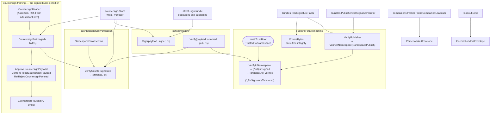

# internal/adapters/signing

`internal/adapters/signing` is the ctxloom signature envelope: a thin sshsig sign/verify wrapper, the
exact byte framing a countersignature covers, the publisher-verification state machine
(unsigned / verified / tampered), and the JSON envelope a companion binary emits to carry a
loadout plus a detached signature over stdout. It is the bottom of the trust stack — it
answers "does this signature cover exactly these bytes, made by a key authorized for this
namespace", and nothing else. It decides no policy: the policy question is delegated to the
`trust.TrustRoot` port every verifier takes as an argument.

## Responsibilities

- sshsig primitive wrapper: `Sign`, `Verify`.
- The assertion namespaces (`NamespacePublish`, `NamespaceApprove`, `NamespaceReject`) and the
  assertion → namespace map (`NamespaceForAssertion`).
- The countersignature preimage — the exact framing an approve/reject signature covers
  (`CountersignPayload`, reached through `CountersignPreimage`) — and the per-kind item framings
  (`FragmentPreimage`, `CommandPreimage`).
- Publisher verification as a three-outcome state machine (`VerifyPublisher`, `VerifyInNamespace`),
  and trust-free integrity (`CoversBytes`).
- Countersignature verification, including namespace separation (`VerifyCountersignature`).
- The companion loadout JSON envelope (`LoadoutEnvelope`, `EncodeLoadoutEnvelope`,
  `ParseLoadoutEnvelope`, `DecodeLoadoutEnvelope`).

## Non-responsibilities

- Which principals are authorized — the `trust.TrustRoot` implementations, such as
  `allowedsigners.Store`; see [config.md](./config.md).
- Where countersignatures are stored — `internal/adapters/signing/countersign` (`Store`, `Records`).
- What an item's payload bytes *are* — `operations.computeItemPayloadPair`; see
  [trust.md](./trust.md).
- The trust decision itself, which consumes these verifiers' answers; see [trust.md](./trust.md).

## Data flow

```mermaid
flowchart TD
    subgraph frame["countersign framing — the signed-bytes definition"]
        CH["CountersignHeader<br/>{Assertion, Ref, Form AttestationForm}"]
        PRE["CountersignPreimage(h, bytes)"]
        W["ApproveCountersignPayload<br/>ContentRejectCountersignPayload<br/>RefRejectCountersignPayload"]
        CP["CountersignPayload(h, bytes)"]
        CH --> PRE --> W --> CP
    end

    subgraph prim["sshsig wrapper"]
        SIGN["Sign(payload, signer, ns)"]
        VER["Verify(payload, armored, pub, ns)"]
    end

    subgraph pub["publisher state machine"]
        TR(["trust.TrustRoot<br/>TrustedForNamespace"])
        VIN["VerifyInNamespace<br/>→ ('',nil) unsigned<br/>→ (principal,nil) verified<br/>→ ('',ErrSignatureTampered)"]
        VP["VerifyPublisher<br/>= VerifyInNamespace(NamespacePublish)"]
        CB["CoversBytes<br/>trust-free integrity"]
        TR --> VIN
        VP --> VIN
    end

    subgraph cs["countersignature verification"]
        NFA["NamespaceForAssertion"]
        VCS["VerifyCountersignature<br/>→ (principal, ok)"]
        NFA --> VCS
    end

    PRE --> VCS
    VER --> VCS
    VER --> VIN

    CSTORE["countersign.Store<br/>write / Verified*"] --> SIGN
    CSTORE --> PRE
    CSTORE --> VCS
    PUBSIGN["attest.SignBundle<br/>operations skill publishing"] --> SIGN
    READ["bundles.readSignatureFacts"] --> CB
    READ --> VP
    SKILL["bundles.PublisherSkillSignatureVerifier"] --> VP
    PROBE["companions.Prober.ProbeCompanionLoadouts"] --> PLE["ParseLoadoutEnvelope"]
    EMIT["loadout.Emit"] --> ENC["EncodeLoadoutEnvelope"]
```

## Key types

| Type | What it carries |
|---|---|
| `Assertion` | `approve` \| `reject`; selects the signing namespace via `NamespaceForAssertion`. |
| `Form` | The LAYOUT form (`raw` \| `distilled`, or `FormNone`). Mirrors `bundles.ContentForm`'s values by convention; deliberately **not** what a countersignature binds. |
| `AttestationForm` | The closed composite vocabulary a countersignature binds — role plus, for distillable kinds, the reviewed materialization. `Valid` is exhaustive over it; `AttestationForms` enumerates the content-bearing members. |
| `CountersignHeader` | The closed field set bound into a countersignature's preimage: `Assertion`, `Ref`, `Form`. No `Kind` field — the role lives in `Form`. `Validate` refuses an out-of-vocabulary assertion or form and a `Ref` carrying control characters. |
| `LoadoutEnvelope` | Companion `loadout --format json` output: `Contract` (must equal `LoadoutContract`), `Loadout` (base64 of the exact loadout document), `Signature` (armored, optional), `Signer` (**advisory only, never trusted**). |
| `trust.TrustRoot` (port, consumed) | The one policy question every verifier takes as a mandatory argument — `TrustedForNamespace`, returning `trust.SignerDecision`. |
| `ErrSignatureTampered` | The one publisher outcome that is never benign: a structurally invalid blob, or a trusted key's signature that does not cover these bytes. Matched with `errors.Is`. |

## Key functions

| Signature | Contract |
|---|---|
| `Sign(payload, signer, ns) ([]byte, error)` | sshsig-signs under a namespace; pins the hash algorithm and armor format. Refuses an empty payload — a signature over zero bytes would verify against every empty payload. |
| `Verify(payload, armored, pub, ns) error` | Unarmors, then verifies using the algorithm embedded in the blob. Reached through the verifiers below. |
| `CountersignPayload(h, bytes) []byte` | **The signed-bytes definition.** Emits a fixed LF-delimited ASCII frame followed by the payload. Not a canonicalization — the framing is the contract, and it is injective only because `Validate` keeps control characters out of `Ref`. |
| `CountersignPreimage(h, bytes) []byte` | The seam header-carrying callers use: dispatches to the assertion-shaped wrapper the header names (`ApproveCountersignPayload`, `ContentRejectCountersignPayload`, `RefRejectCountersignPayload`), byte-identical to `CountersignPayload`. |
| `NamespaceForAssertion(a) string` | Assertion → domain separator; `""` for an out-of-vocabulary assertion, which `Sign` then refuses. Exported so signer and verifier derive the namespace from one place. |
| `VerifyCountersignature(...) (principal string, ok bool)` | Empty/nil-root guard → unarmor → namespace → trust → re-derive frame → verify. **Trust is decided before the bytes are verified.** Every failure collapses to `("", false)`. |
| `VerifyInNamespace(payload, armoredSig, root, ns, now) (string, error)` | The three-outcome state machine with the namespace as a parameter, so the verification order is implemented once. |
| `VerifyPublisher(bundleBytes, armoredSig, root, now) (string, error)` | `VerifyInNamespace` under `NamespacePublish`. |
| `CoversBytes(payload, armoredSig, ns) error` | Trust-free "does this blob cover exactly these bytes". The stale-signature detector. |
| `EncodeLoadoutEnvelope(loadoutBytes, armoredSig, signer) ([]byte, error)` | Builds the companion JSON envelope; owns the contract string and the base64 discipline. Refuses an empty loadout. |
| `ParseLoadoutEnvelope(raw) (loadoutBytes, armoredSig, advisorySigner, err)` | The structural half: JSON → exact contract match → base64 → non-empty, verifying nothing. Companion discovery uses this, because a companion's own stdout has no intermediary to tamper with it. |
| `DecodeLoadoutEnvelope(raw, root, now) ([]byte, string, error)` | The verify-and-withhold composition: `ParseLoadoutEnvelope` then `VerifyPublisher`, withholding on any parse or tamper failure rather than degrading to "unsigned". No production caller — companion discovery parses only — but the emitters' loadout round-trip tests verify their output with it. |

## Invariants

1. **`CountersignPayload` is the only definition of countersigned bytes.** Changing the frame
   invalidates every existing approval and rejection on disk. `CountersignPreimage` and the
   wrappers are re-expressions of it, never a second framing.
2. **Trust precedes byte verification.** `VerifyCountersignature` and `VerifyInNamespace` resolve
   the key against the `TrustRoot` *before* checking that the signature covers the payload, so bytes
   are only ever verified against a key already authorized for that namespace.
3. **The publisher outcome is a closed tri-state**: unsigned `("", nil)`, verified
   `(principal, nil)`, tampered `("", ErrSignatureTampered)` — and the principal always comes from
   the trust root, never from the artifact. An unparseable blob is tampered even with a nil root:
   unarmoring runs before the nil-root check.
4. **Namespaces are mandatory and distinct.** Publish, approve and reject each sign under their
   own namespace, so a signature for one assertion can never be replayed as
   another.
5. **`LoadoutEnvelope.Signer` is advisory.** `ParseLoadoutEnvelope` hands it back for diagnostics
   only; `DecodeLoadoutEnvelope` discards it, and a verified principal comes only from
   `VerifyPublisher`.
6. **`CoversBytes` answers integrity only, `VerifyPublisher` answers integrity plus authorization.**
   The stale-signature detectors deliberately use the former: a bundle whose bytes changed since
   signing must be refused regardless of who signed it.
7. **Empty inputs are refused at the primitive.** `Sign`, `EncodeLoadoutEnvelope` and
   `ParseLoadoutEnvelope` reject zero-byte payloads, so no caller can produce or accept a signature
   or envelope that attests to nothing.
8. **The package's only internal dependency is `internal/core/trust`**, for the `TrustRoot` port.

## Boundaries

- **Depended on by:** the countersign store, bundle reading and skill-archive verification in
  `internal/core/bundles`, publishing and review in `internal/adapters/operations` and
  `internal/adapters/content/attest`, and companion discovery and the `loadout` emitter under
  `internal/adapters/companions`. `git grep` on the import path gives the current set.
- **Depends on:** `internal/core/trust` (the port), `github.com/hiddeco/sshsig`.
