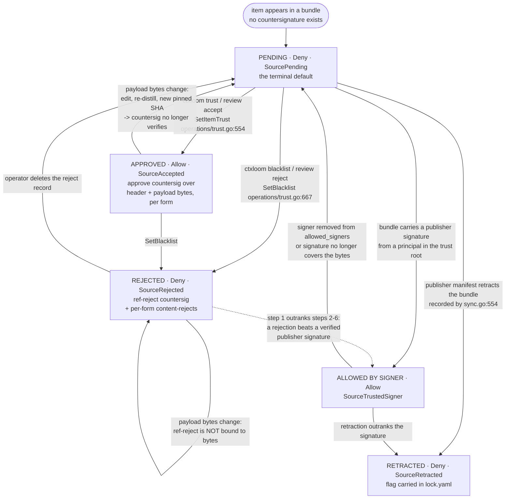
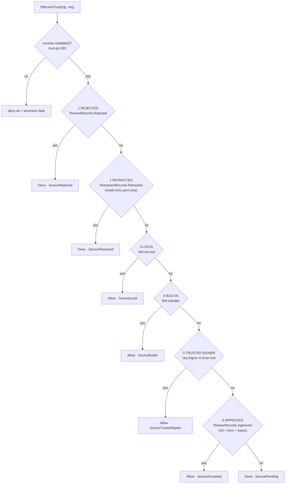

# internal/trust (and the trust gate)

`internal/trust` owns the **vocabulary and the addressing** of the trust model: the closed
enumerations (`Decision`, `Source`, `State`, `ItemKind`), the item address (`Ref`), and the
canonicalization functions that turn an address into the single stable key every approval
and rejection is stored under. It holds no state and makes no decision. The *decision* is
`operations.EffectiveTrust` (`internal/operations/trust.go:244`), a seven-step fail-closed
cascade; the *records* are countersignatures under `internal/signing/countersign`; the
*enforcement points* are the gates in `internal/operations/trust_gate.go`. This page
documents all three together because they are one contract split across packages.

Contract: **no third-party content or executable surface reaches an engine unless
`EffectiveTrust` returns `trust.Allow` for its exact bytes**, and the address it is
evaluated under is `Ref.CanonicalURL() + "|" + Ref.Key()` — nothing else.

## Responsibilities

- Closed vocabularies: `Decision`, `Source`, `State`, `ItemKind` (`internal/trust/trust.go:32,45,91,110`).
- The item address `Ref` and its two halves, `CanonicalURL()` and `Key()` (`internal/trust/trust.go:164,211,204`).
- URL canonicalization, so a rejection cannot be escaped by respelling a URL (`CanonicalRepoURL`, `internal/trust/trust.go:239`).
- The decision cascade and its result vocabulary (`internal/operations/trust.go:244,127`).
- The two review mutations: approve (`SetItemTrust`) and reject (`SetBlacklist`).
- The exposure chokes: content gate, executable gate, listing stamper (`internal/operations/trust_gate.go`).

## Non-responsibilities

- Signature bytes, framing and verification — `internal/signing`; see [signing.md](./signing.md).
- Countersignature persistence — `internal/signing/countersign` (`Store.write`, `Store.Verified`).
- Retraction *discovery* (network/manifest) — `internal/remote` (`retract.go`); the decision
  reads only the local `lock.yaml`. See [remote.md](./remote.md).
- Publisher-signature verification of a whole bundle — `internal/config`
  (`verifyBundlePublisher`) and `internal/bundles`; see [config.md](./config.md), [bundles.md](./bundles.md).
- Deciding *which* items exist — `internal/bundles`.

## The address: what the trust gate keys on

```
store address = Ref.CanonicalURL() + "|" + Ref.Key()
                                          Key() = Bundle + "#" + Kind.Dir() + "/" + Name
```

built by `countersignRef` (`internal/operations/countersign_records.go:184`) — the single
constructor for every approval and rejection address.

| Half | Produced by | Values |
|---|---|---|
| `CanonicalURL()` | `internal/trust/trust.go:211` | `remote.LocalSource` (`ctxloom:local`) when `IsLocal`; `BuiltinSigner` (`builtin:ctxloom`) when `IsBuiltin`; else `CanonicalRepoURL(RepoURL)` |
| `Key()` | `internal/trust/trust.go:204` | `<bundle>#<dir>/<name>`, where `dir` comes from `ItemKind.Dir()` (`trust.go:131`): `fragments`, `prompts`, `mcp`, `hooks`, `skills` |

`CanonicalRepoURL` (`internal/trust/trust.go:239`) passes through `""`, `ctxloom:local` and
`ctxloom:companion`; otherwise it runs `remote.NormalizeURL`, then for `http`/`https` lowercases
the host, trims a trailing `/`, and lowercases the path only for hosts in
`knownCaseFoldForges` (`internal/trust/trust.go:224`).

## Trust state machine

Three axes exist, only the first is a declared `State`:

| Axis | Values | Declared at | Persisted? |
|---|---|---|---|
| `State` | `pending`, `accepted`, `rejected` | `internal/trust/trust.go:91-100` | only accepted/rejected, as countersignatures |
| `Decision` | `allow`, `deny` | `internal/trust/trust.go:32-40` | no — recomputed per exposure |
| `Source` | `rejected`, `retracted`, `local`, `builtin`, `trusted-signer`, `accepted`, `pending` | `internal/trust/trust.go:45-86` | no — recomputed |

There is no persisted current state and no transition table. **Every exposure recomputes the
decision from (bytes, store, trust root, lockfile).** The diagram below is therefore the
state of the *computed result* plus the on-disk records that produce it.



### What changes a content hash (and therefore invalidates an approval)

An approve countersignature covers the exact **payload bytes for one form**, framed by
`signing.CountersignPayload` (`internal/signing/payload.go:146`). It stops verifying when any
of the following changes:

1. The item's authored content (`raw` form) — any edit to `bundle.yaml`'s fragment/command body.
2. The **distilled** content (`distilled` form) — a re-distill writes new `Distilled` bytes and a
   new `ContentHash` (`internal/operations/bundles.go:1093,1120`);
   `invalidatedByDistill` (`internal/operations/bundle_distill.go:145`) reports which items had a
   prior approve that a re-distill just invalidated.
3. The rendered **exec preimage** for an executable surface (`exec` form) — the MCP-server or hook
   surface rendering (`renderMCPSurface`, `renderHookSurface`,
   `internal/operations/review.go:380,405`) or, for a skill, the per-file
   `path/sha/mode` listing (`renderSkillSurface`, `internal/operations/review.go:430`).
4. Upstream: a new pinned SHA in `lock.yaml` delivers different bytes for the same ref.

The address does **not** change with any of those — only the bytes do. That asymmetry is the
design: a rejection stays attached to the ref, an approval detaches when the bytes move.

## The decision cascade — `EffectiveTrust`

`internal/operations/trust.go:244`, CCN 12, first match wins. Inputs are an
`EffectiveTrustRequest` (`trust.go:30`): `Ref`, `Payload` (**bytes, deliberately not a hash**),
`Form`, `Signer`, plus three optional seams (`Records`, `Retraction`, `FS`).



Step semantics that matter:

- **Step 1 is supreme.** A ref-reject outranks a verified publisher signature. It is scoped to
  the ref only (not to bytes or form), so it survives every content change.
- **Step 2 reads `lock.yaml`, never the network.** `buildLockfileRetraction`
  (`internal/operations/trust.go:484`) loads the lockfile and wraps it as `RetractionRecords`;
  the key is `lockfileKeyForRef` = `RepoURL + "@bundles/" + Bundle` (`trust.go:523`). Retraction is
  *recorded* at sync time by `checkInstalledRetraction` (`internal/operations/sync.go:554`).
- **Step 2 fails CLOSED on an unreadable lockfile** (`9492dd16`). An unparseable `lock.yaml`
  denies via `trust.Deny` + `trust.SourcePending`, recorded as `strictness.FailOnce(ClassTrust)`.
  **Scoped to remote refs only** — the lockfile records nothing but remote bundle entries, so an
  unreadable one conceals nothing about a local or builtin ref, and withholding those would be
  denying on evidence that does not exist. One predicate, `retractable(ref)` (`trust.go:527`), is
  shared by the gate and by `lockfileRetraction.Retracted` so the two cannot drift. The gate sits
  **below** the rejection step, keeping rejection supreme.
  **Absent is not corrupt:** `LockfileManager.Load` maps `os.IsNotExist` to an empty lockfile with
  a nil error, so the failure branch never sees absence and a project with no pins is untouched.
  > This degraded to "nothing is retracted" until `9492dd16`, so content a publisher had
  > deliberately **withdrawn** was silently served again. Retraction is the one control that
  > exists for "this turned out to be harmful", so failing open inverted it. T1's write guard
  > does not reach this — no write is involved.
- **Step 6 is scoped to `(ref, form, bytes)`.** `Approved` (`countersign_records.go:129`) requires a
  countersignature that verifies over the supplied payload for the supplied form; an empty payload
  or empty form returns false.
- The function **never returns a non-nil error** in any branch — the `error` return is vestigial;
  callers that check it are checking an impossible condition.

### Records adapter

`countersignRecords` (`internal/operations/countersign_records.go:31`) implements `ReviewRecords`
over the union of two stores:

| Store | Path | Built by |
|---|---|---|
| user | `~/.ctxloom/approvals` (`paths.HomeApprovalsPath`) | `buildCountersignRecords`, `countersign_records.go:202` |
| project | `<appPath>/.ctxloom/approvals` (`paths.ApprovalsPath`) | same |

- `Rejected` (`:85`): ref-reject in either store, an unsigned reject in the user store, then
  content-reject across every attestation form the item's KIND can be signed under.
- `Approved` (`:129`): a verified approve in either store, or an unsigned approve in the user store.
- `readable` (`:54`): the fail-closed precondition — both stores are probed and the failing one is named.
- `attestationFormFor`: the single derivation from (`trust.ItemKind`, LAYOUT form) to the
  composite `signing.AttestationForm` the countersign preimage binds. The mapping is deliberately
  not the identity (`KindPrompt + raw → command/raw`, for rename-history reasons), and an
  unmapped kind is an ERROR, not a passthrough — so a kind with no attestation form can be
  neither approved nor exposed. `attestationFormsFor` derives the reject search set from the same
  table, so a rejection can never be looked for under a form the approve path would never write.

## Enforcement points

| Choke | file:line | What it gates |
|---|---|---|
| `contentGate.allow` | `internal/operations/trust_gate.go:56` | The `bundles.ContentGate` closure: every fragment/command/skill body the loader would return. Warns, records into the withheld ledger, and withholds. |
| `buildContentGate` | `internal/operations/trust_gate.go:161` | Shared constructor for both gates. |
| `NewExecutableTrustGate` / `ExecutableTrustGate.Gate` | `internal/operations/trust_gate.go:190,196` | Injected into `config.SetExecutableTrustGate`; consulted by `ResolveBundleMCPServers`, `ResolveBundleHooks`, `LoadCommandExports`. |
| `exposureLoader` / `exposureLoaderGated` | `internal/operations/trust_gate.go:223,237` | The gated `bundles.Loader` every *exposure* path must use (as opposed to management paths, which use the ungated `bundleLoader`). |
| `warnWithheld` / `warnWithheldItems` | `internal/operations/trust_gate.go:301,275` | One advisory line per withheld item; called from `context.go:182`, `hooks.go:527`, `tooling.go:78`. |
| `TrustStamper` | `internal/operations/trust.go:970` | Listing-cost control: build records/loader once, stamp many items, fail-closed, never error. `ForRef` `:1025`, `ForLocalMCP` `:1045`, `ForHook` `:1064`. Documented not safe for concurrent use (`:969`). |

## Mutations

| Function | file:line | Writes |
|---|---|---|
| `SetItemTrust` | `internal/operations/trust.go:554` | Approve countersignatures for the raw and (when present) distilled forms, then `snapshotAcceptedItemContent` for the review diff base. |
| `SetBlacklist` | `internal/operations/trust.go:667` | One ref-reject countersignature plus a content-reject per form. |
| `computeItemPayloadPair` | `internal/operations/trust.go:865` | **The one definition of an item's payload bytes** — a five-arm kind switch returning `(raw, distilled, signer)`. Everything that signs or verifies an item goes through here. |
| `resolveCountersignStore` | `internal/operations/trust.go:444` | Picks user vs project store. |
| `resolveSignerOrUnsigned` | `internal/operations/trust.go:476` | Key discovery: a project store is a hard error without a key; a user store degrades to an unsigned record. |
| `parseTrustItemRef` | `internal/operations/trust.go:750` | `<bundle-ref>#<kind>/<name>` → `trust.Ref`. Six production call sites; every caller treats a parse error as fail-closed. |
| `parseTrustSelector` | `internal/operations/trust.go:815` | `<kind>/<name>` → `trust.ItemKind`. |

### Review snapshots (the diff base)

`internal/operations/review_snapshots.go` keeps a content-addressed copy of what a human
approved, so the next review can show a diff rather than the whole item:

- `writeTrustSnapshot` `:46` — best-effort write; empty content is skipped by design.
- `readTrustSnapshot` `:64` — `("", false)` on a miss.
- `snapshotFilename` `:38` — the hash→filename mapping is `":"` → `"-"`.
- `snapshotAcceptedItemContent` `:93` — called from `SetItemTrust` (`trust.go:612`).
- Storage root: `paths.TrustObjectsPath(appPath)` = `.ctxloom/state/trust/objects` (local, gitignored, nothing rebuilds it). A legacy store under `cache/trust/objects` is moved there once, by `migrateLegacyTrustObjects`.

## Invariants

1. **The store address is `CanonicalURL() + "|" + Key()` and nothing else.** `countersignRef`
   (`internal/operations/countersign_records.go:184`) is the only constructor; six production call
   sites use it. A canonicalization that is not total is a rejection that is not sticky.
2. **A rejection is ref-scoped; an approval is (ref, form, bytes)-scoped.** This is why editing an
   item clears its approval but never clears its rejection.
3. **Trust is recomputed at every exposure.** No decision is cached to disk, so there is no stale
   state to desynchronize; the cost control is `TrustStamper`, not a cache.
4. **`Deny` is the default.** Every terminal branch that is not an explicit allow returns
   `trust.Deny`; `EffectiveTrust` never returns a nil result.
5. **The unreadable-store gate fires before the cascade.** `readable()`
   (`internal/operations/trust.go:263`) denies everything and raises a `strictness` fatal when a
   countersignature store exists but cannot be read.
6. **Payload bytes, not hashes, cross the `ReviewRecords` boundary** (`trust.go:74`), so
   implementations verify signatures rather than compare digests.
7. **Only `computeItemPayloadPair` defines an item's signable bytes** (`trust.go:865`); the review
   renderers (`renderMCPSurface`, `renderHookSurface`, `renderSkillSurface`) produce *display*
   text, and a signature never covers a rendering.
8. **`BuiltinSigner` (`builtin:ctxloom`) is excluded at step 5** — built-in content is allowed at
   step 4 by identity, not by signature.
9. **Three kind vocabularies must be kept in sync**: `trust.ItemKind`
   (`internal/trust/trust.go`), the selector strings in `parseTrustSelector`
   (`internal/operations/trust.go`), and the composite `signing.AttestationForm` via
   `attestationFormFor` (`internal/operations/countersign_records.go`). Only the first two are
   held by hand: the third is exhaustiveness-tested against `trust.ItemKinds()`, so a kind added
   without a mapping fails a test rather than surfacing as an item nobody can approve.
10. **The exposure path and the management path use different loaders.** `exposureLoader`
    (`trust_gate.go:223`) is gated; `bundleLoader` (`internal/operations/fragments.go:41`) is not.
    Authoring commands read ungated content on purpose.

## Boundaries

- **Depends on:** `internal/remote` only (for `NormalizeURL`, `LocalSource`, `CompanionSource`).
  `internal/trust` has no I/O, no allocation of consequence, and 275 lines.
- **Depended on by:** `internal/cli`, `internal/operations`. The gates are injected *downward*
  into `internal/bundles` (`bundles.WithTrustGate`) and `internal/config`
  (`config.SetExecutableTrustGate`), so those packages never import the decision.

## Where documented and real behavior diverge

- `docs/trust-model.md:123-126` states that all degradations move toward fewer trusted decisions.
  That holds for steps 4-6 (a lost allow is lost) but not for steps 1-2: a lost *rejection* or
  *retraction* record moves an item toward allow, and for a bundle carrying a verified publisher
  signature it reaches step 5 and is allowed.
- `Ref`'s field comment claims `IsLocal`/`IsBuiltin` are mutually exclusive
  (`internal/trust/trust.go:189`); nothing enforces it, and `CanonicalURL` silently prefers builtin
  when both are set.
- `ItemKind.Dir()` falls through to an unchecked `string(k)` passthrough, so an unknown kind
  produces a well-formed but meaningless selector directory rather than an error. The
  countersign side no longer does: `attestationFormOf`'s successor,
  `attestationFormFor` (`internal/operations/countersign_records.go`), returns an ERROR for a
  kind it does not map, so an unmapped kind can be neither approved nor exposed.
- `EffectiveTrust` is declared as returning `(*EffectiveTrustResult, error)` but never returns a
  non-nil error; `review.go:306`'s `err != nil || res == nil` branch is unreachable.
- `TrustStamper`'s doc claims no per-item file I/O (`internal/operations/trust.go:1091`); the
  default `RetractionRecords` is rebuilt per item by `buildLockfileRetraction` (`trust.go:286`),
  which loads `lock.yaml` on each call.
- `contentGate.withheldTally` (`trust_gate.go:118`) documents itself as retained for existing
  callers; it has none in production.
